# [Tansoftware](https://www.tansoftware.com) - Domain Driven Design [](README.md)

[](LICENSE) [](#) [](#) [](https://www.markdownguide.org/)

## Table des matières

- [Introduction](#introduction)
- [Quand DDD ne vaut pas le coût](#quand-ddd-ne-vaut-pas-le-coût)
- [Glossaire express](#glossaire-express)
- [DDD stratégique vs DDD tactique](#ddd-stratégique-vs-ddd-tactique)
- [Sous-domaines : core, supporting, generic](#sous-domaines--core-supporting-generic)
- [Modélisation du domaine](#modélisation-du-domaine)
- [Langage ubiquitaire](#langage-ubiquitaire)
- [Bounded Contexts](#bounded-contexts)
- [Bounded Context Canvas](#bounded-context-canvas)
- [Context Map : les patterns de relation](#context-map--les-patterns-de-relation)
- [Entités, objets-valeurs et agrégats](#entités-objets-valeurs-et-agrégats)
- [Règles de conception des agrégats (Vernon)](#règles-de-conception-des-agrégats-vernon)
- [Frontières d'agrégats : un choix de conception, pas une vérité](#frontières-dagrégats--un-choix-de-conception-pas-une-vérité)
- [Factories et Modules](#factories-et-modules)
- [Repositories et Domain Services](#repositories-et-domain-services)
- [Application Services et CQRS](#application-services-et-cqrs)
- [CQRS et Event Sourcing : indépendants](#cqrs-et-event-sourcing--indépendants)
- [Événements de domaine et Event Sourcing](#événements-de-domaine-et-event-sourcing)
- [Outbox Pattern : publication fiable des événements](#outbox-pattern--publication-fiable-des-événements)
- [Sagas et Process Managers](#sagas-et-process-managers)
- [Cohérence à terme : compensations et garanties](#cohérence-à-terme--compensations-et-garanties)
- [Domain Events vs Integration Events](#domain-events-vs-integration-events)
- [Anti-Corruption Layer](#anti-corruption-layer)
- [Specification Pattern](#specification-pattern)
- [DDD fonctionnel : modéliser sans objets](#ddd-fonctionnel--modéliser-sans-objets)
- [Exemple intégré : e-commerce multi-contextes](#exemple-intégré--e-commerce-multi-contextes)
- [Pièges classiques](#pièges-classiques)
- [Le côté obscur : DDD comme jeu de vocabulaire](#le-côté-obscur--ddd-comme-jeu-de-vocabulaire)
- [DDD et architectures voisines](#ddd-et-architectures-voisines)
- [Monolithe modulaire vs microservices](#monolithe-modulaire-vs-microservices)
- [Pour aller plus loin](#pour-aller-plus-loin)

---
- [Prochaine étape : Clean Architecture](https://github.com/Tan-Software/clean-architecture-hexagonale)

## Introduction

> **Que veut dire « DDD » ?** DDD est l'abréviation de *Domain-Driven Design*, en français « conception pilotée par le domaine ». Le mot *domaine* désigne le métier que le logiciel sert (la banque, la vente en ligne, la santé...). « Pilotée par le domaine » signifie que l'on construit le logiciel en partant des règles du métier, et non de la technique. Imaginez un architecte qui dessine une maison en partant des besoins de la famille qui va y vivre (combien d'enfants, qui cuisine, qui reçoit), plutôt qu'en partant du catalogue de briques du marchand de matériaux. Le DDD applique cette idée au logiciel : on écoute d'abord le métier, le code vient après.

Le *Domain-Driven Design* (DDD) a été formalisé par Eric Evans dans le livre [*Domain-Driven Design: Tackling Complexity in the Heart of Software*](https://www.amazon.fr/Domain-Driven-Design-Tackling-Complexity/dp/0321125215) (2003). Son idée centrale : placer la **complexité métier** au centre de la conception logicielle. Plutôt que de partir d'une base de données ou d'un cadre logiciel, on modélise les concepts, les règles et les processus du métier ; le code en découle.

> **Que veut dire « CRUD » ?** CRUD est l'acronyme anglais de *Create, Read, Update, Delete* (créer, lire, modifier, supprimer), les quatre opérations de base sur des données. Une application « CRUD pur », c'est une application qui ne fait quasiment que ces quatre choses sur des tables, sans règle compliquée. Comparez un carnet d'adresses (on ajoute, on lit, on change, on efface un contact : c'est du CRUD) à un logiciel de calcul d'impôts (qui applique des centaines de règles : ce n'est plus du CRUD).

> **Que veut dire « base de données » ?** Une base de données est l'endroit où le logiciel range durablement ses informations (les comptes, les commandes...) pour les retrouver plus tard, un peu comme un classeur géant rangé par tiroirs. Un *cadre logiciel* (en anglais *framework*) est une boîte à outils toute prête qui impose une façon de coder pour aller plus vite (Symfony, Django, Spring en sont des exemples).

Cette approche prend tout son intérêt dès qu'un projet dépasse le simple CRUD : règles métier nombreuses, plusieurs équipes, plusieurs sous-domaines. Elle apporte trois bénéfices principaux : un vocabulaire partagé entre métier et technique, une frontière claire entre sous-domaines, et un découplage du domaine vis-à-vis de l'infrastructure (le code métier ne dépend pas des détails techniques de stockage ou de réseau).

### Domaine, sous-domaines, *core domain*

- **Domaine** : le secteur d'activité que le logiciel sert (assurance, e-commerce, santé).
- **Sous-domaine** : une zone fonctionnelle du domaine. Trois natures :
  - *Core domain* (domaine cœur) : l'avantage compétitif, là où l'on doit investir.
  - *Supporting subdomain* (sous-domaine de soutien) : nécessaire mais non différenciant ; on peut le développer simplement.
  - *Generic subdomain* (sous-domaine générique) : résolu par n'importe quel acteur du marché (authentification, facturation standard) ; à acheter ou intégrer.

> **Que veut dire « avantage compétitif » ?** C'est ce qui fait qu'une entreprise gagne face à ses concurrents : la chose qu'elle fait mieux ou différemment des autres. Pour un restaurant, ce peut être une recette secrète. En logiciel, c'est la règle métier qui distingue l'entreprise, par exemple la formule de calcul de prix d'un assureur. On investit le plus d'efforts là.

- **Espace problème vs espace solution** : les sous-domaines décrivent le *problème* à résoudre ; les *bounded contexts* (frontières de modèle, définies plus loin) décrivent la *solution* logicielle. La correspondance entre les deux n'est pas forcément une pour une (un problème peut donner naissance à plusieurs morceaux de solution, et inversement).

[🔝 Retour en haut de page](#table-des-matières)

## Quand DDD ne vaut pas le coût

> **Le critère de complexité d'Evans.** Eric Evans lui-même, dans la préface de la *DDD Reference* (2015), rappelle que *« DDD est destiné aux domaines complexes, pas à toute application »*. La discipline a un **coût d'entrée** non négligeable (langage ubiquitaire à entretenir, ateliers métier, modélisation tactique, isolation de l'infrastructure) ; elle ne se rentabilise que là où la **complexité métier** dépasse la complexité technique.

> **Que veut dire « invariant » ?** Un invariant est une règle qui doit *toujours* rester vraie, quoi qu'il arrive. Exemple : « le solde d'un compte courant ne peut pas descendre sous le découvert autorisé ». Pensez à une règle de jeu de société qu'on ne peut jamais enfreindre : tant qu'elle tient, la partie reste valide.

### Cas où DDD est probablement surdimensionné

- **CRUD pur** : un panneau d'administration où chaque écran modifie directement les champs d'une table. Aucun invariant non trivial, aucun vocabulaire métier subtil. Un *Active Record* ou un générateur d'administration (Filament, Django Admin, Backpack) coûtera dix fois moins.

> **Que veut dire « Active Record » ?** C'est un style de programmation où chaque ligne de table en base de données correspond directement à un objet du code, qui sait se sauvegarder lui-même. Simple et rapide pour du CRUD, mais il mélange données et stockage, ce que le DDD cherche justement à séparer.

- **MVP exploratoire ou code jetable** : tant que le métier n'a pas confirmé qu'il y a un produit viable, figer un modèle riche revient à figer une mauvaise hypothèse. Préférer un prototypage rapide ; reconstruire en DDD une fois le marché validé.

> **Que veut dire « MVP » ?** MVP est l'acronyme de *Minimum Viable Product*, en français « produit minimum viable » : la plus petite version d'un produit qui permet déjà de tester si les clients en veulent. C'est la maquette qui roule, pas la voiture finale.

- **Sous-domaine générique** : authentification, paie standard, envoi de courriels, gestion documentaire générique. Ces zones se résolvent par achat ou intégration de services existants (Auth0, Stripe, stockage de fichiers en nuage) ; investir un modèle riche dessus est un gaspillage.
- **Outils internes à courte durée de vie** : scripts d'import-export de données (ETL), tableaux de bord éphémères, migrations ponctuelles. Le retour sur investissement d'une modélisation soignée n'est jamais atteint.

> **Que veut dire « ETL » ?** ETL est l'acronyme de *Extract, Transform, Load* (extraire, transformer, charger) : un programme qui prend des données d'un endroit, les remet en forme, puis les dépose ailleurs. C'est le tapis roulant qui déplace et nettoie les données d'un système à un autre.

- **Équipe sans expert métier disponible** : sans un connaisseur du métier accessible plusieurs heures par semaine, le langage ubiquitaire devient un vœu pieux. Mieux vaut un code honnêtement technique qu'un DDD de façade.

### Cas où DDD se justifie pleinement

- **Domaine cœur** d'une activité où la règle métier *est* l'avantage compétitif (tarification d'assurance, calcul d'un score de risque, répartition logistique, calcul réglementaire).
- **Vocabulaire métier riche et évolutif** : les experts emploient des dizaines de termes précis et distinguent des nuances que le code doit refléter sans perte.
- **Plusieurs équipes** : plusieurs équipes travaillent en même temps sur des morceaux du système et doivent communiquer sans casser leurs modèles respectifs.
- **Long terme** : application appelée à vivre dix ans ou plus, avec renouvellement des équipes. L'investissement dans un modèle explicite se rembourse en dette technique évitée.

> **Que veut dire « dette technique » ?** C'est l'accumulation de raccourcis et de mauvaises décisions dans le code, qui rendent chaque évolution future plus lente et plus risquée. Comme une dette d'argent : on gagne du temps maintenant, mais on paie des « intérêts » plus tard sous forme de bugs et de lenteur.

### Heuristique de décision

| Signal | Verdict |
|--------|---------|
| Le métier dit *« c'est juste un formulaire avec une liste »* | Pas DDD. CRUD assumé. |
| L'expert métier vous corrige sur 3 termes par réunion | DDD pertinent : langage ubiquitaire à formaliser. |
| Aucun invariant ne vaut plus qu'une validation de champ | Pas DDD tactique. Validation suffit. |
| Plusieurs règles s'entremêlent et changent ensemble | DDD tactique : agrégats, services domaine. |
| Une équipe, un service, un déploiement | Stratégique léger ; tactique au cas par cas. |
| Plusieurs équipes, contrats inter-services à stabiliser | Stratégique critique : contextes, ACL, OHS. |

> **Que veut dire « ACL » et « OHS » ?** Ce sont deux façons de relier des morceaux de système, détaillées plus loin. *ACL* (*Anti-Corruption Layer*, couche anti-corruption) est un traducteur qui empêche le vocabulaire d'un système voisin de polluer le vôtre. *OHS* (*Open Host Service*, service hôte ouvert) est un système qui publie un mode d'emploi stable que plusieurs autres peuvent utiliser.

> **Garde-fou.** L'erreur la plus commune n'est pas de *ne pas faire* de DDD : c'est d'en faire **partout de la même manière**. Distinguer cœur, soutien et générique permet d'investir le bon niveau d'effort au bon endroit, et de **ne pas surconcevoir** ce qui n'a aucune valeur différenciante.

[🔝 Retour en haut de page](#table-des-matières)

## Glossaire express

Voici un référentiel court des termes du vocabulaire DDD. Chaque concept est détaillé et illustré dans les sections suivantes.

| Terme | Définition |
|-------|------------|
| **Domaine** | Le secteur d'activité métier servi par le logiciel. |
| **Sous-domaine** | Une zone fonctionnelle du domaine (core, supporting, generic). |
| **Bounded Context** | Frontière explicite dans laquelle un modèle et un langage sont cohérents. |
| **Langage ubiquitaire** | Vocabulaire unique partagé par métier et technique au sein d'un contexte. |
| **Entité** | Objet défini par une **identité stable** dans le temps, indépendamment de ses attributs. |
| **Objet-valeur** (*Value Object*) | Objet **immuable** défini uniquement par ses attributs, sans identité propre. |
| **Agrégat** | Cluster d'entités et d'objets-valeurs traité comme une **unité de cohérence transactionnelle**. |
| **Racine d'agrégat** (*Aggregate Root*) | Entité unique servant de point d'entrée à l'agrégat, garante de ses invariants. |
| **Repository** | Abstraction de persistance offrant l'illusion d'une collection en mémoire d'agrégats. |
| **Factory** | Composant chargé de la **construction cohérente** d'un agrégat ou d'un objet-valeur complexe. |
| **Domain Service** | Logique métier sans foyer naturel dans une entité ou un objet-valeur ; vit dans la couche domaine. |
| **Application Service** | Orchestrateur de cas d'usage ; ouvre une transaction, appelle le domaine, persiste, publie. **Sans logique métier**. |
| **Module** | Regroupement nommé d'éléments du modèle, équivalent d'un *package* aligné sur le langage ubiquitaire. |
| **Context Map** | Cartographie explicite des relations entre Bounded Contexts. |
| **Anti-Corruption Layer** | Couche de traduction entre deux contextes, protégeant le modèle local. |
| **CQRS** | *Command Query Responsibility Segregation* : modèles distincts pour l'écriture et la lecture. |
| **Event Sourcing** | Persistance d'un agrégat sous forme de la **séquence d'événements** qui l'ont fait advenir. |
| **Eventual Consistency** | Cohérence asynchrone entre agrégats ou contextes ; toléré pour gagner en disponibilité. |
| **Saga / Process Manager** | Coordinateur d'un workflow métier long traversant plusieurs agrégats. |
| **Domain Event** | Fait métier passé, immuable, émis à l'intérieur d'un contexte. |
| **Integration Event** | Événement publié vers d'autres contextes ou services, sous contrat stable. |
| **Projection** | Logique qui consomme des événements pour construire un *read model*. |
| **Read Model** | Vue dénormalisée optimisée pour la lecture (côté queries). |
| **Write Model** | Modèle riche optimisé pour la cohérence et l'application des invariants (côté commands). |

[🔝 Retour en haut de page](#table-des-matières)

## DDD stratégique vs DDD tactique

Eric Evans organise le DDD en deux niveaux complémentaires. La plupart des échecs viennent d'équipes qui sautent directement au tactique sans poser le stratégique.

> **Que veut dire « stratégique » et « tactique » ?** Empruntés au vocabulaire militaire : la *stratégie* concerne les grandes décisions d'ensemble (où placer les armées, quels objectifs viser), la *tactique* concerne l'exécution sur le terrain (comment mener un combat précis). En DDD, le stratégique organise le système dans son ensemble (où passent les frontières, comment les morceaux se parlent), le tactique détaille comment coder à l'intérieur d'un morceau.

### DDD stratégique : découper et relier

Concerne la **structure d'ensemble** du système. Les questions stratégiques :

- Quels sont les sous-domaines ? Lesquels sont *core*, *supporting*, *generic* ?
- Où passent les Bounded Contexts ?
- Comment ces contextes communiquent-ils ?
- Quel langage ubiquitaire dans chacun ?

Outils stratégiques : **sous-domaines**, **Bounded Contexts**, **Context Map**, **langage ubiquitaire**, **distillation du domaine cœur** (le fait d'isoler et de mettre en valeur ce qui compte le plus, comme on distille un alcool pour en garder l'essence).

### DDD tactique : modéliser à l'intérieur d'un contexte

Concerne la **modélisation fine** dans un Bounded Context donné. Les patterns tactiques :

- **Entités**, **objets-valeurs**, **agrégats** ;
- **Repositories**, **Factories**, **Domain Services** ;
- **Application Services**, **Modules** ;
- **Domain Events**.

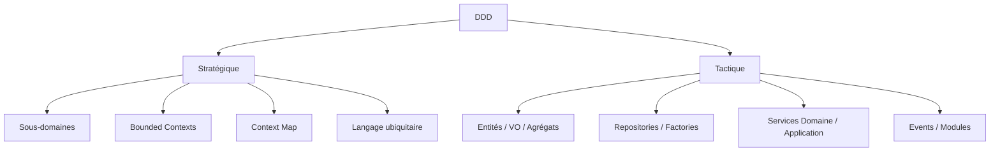

Règle pratique : **commencer toujours par le stratégique**. Un découpage en contextes mauvais ne se rattrape pas avec des patterns tactiques élégants.

[🔝 Retour en haut de page](#table-des-matières)

## Sous-domaines : core, supporting, generic

> **Que veut dire « sous-domaine » ?** C'est une zone fonctionnelle bien identifiée à l'intérieur du métier. Si le domaine est « la vente en ligne », ses sous-domaines sont par exemple « le catalogue », « le paiement », « la livraison ». Comme les rayons d'un supermarché : chacun a sa logique propre, mais tous appartiennent au même magasin. La typologie d'Eric Evans (reprise et systématisée par Vaughn Vernon) distingue trois natures de sous-domaines, qui dictent le **niveau d'investissement** technique attendu.

### Les trois natures, avec critères

| Type | Définition | Indices de reconnaissance | Stratégie d'investissement |
|------|------------|---------------------------|----------------------------|
| **Core domain** | Là où l'organisation se différencie de ses concurrents. C'est *la raison pour laquelle on construit le logiciel sur mesure*. | Le métier en parle longuement et avec des nuances ; les règles changent souvent ; un échec de modélisation a un impact stratégique direct. | Investir massivement : meilleurs développeurs, DDD tactique complet, tests intensifs, refactoring continu. |
| **Supporting subdomain** | Nécessaire au fonctionnement, propre au métier, mais sans avantage compétitif. | Spécifique à l'organisation mais peu d'innovation ; règles métier réelles mais stables. | Modéliser proprement, sans excès ; DDD tactique sélectif (au moins langage ubiquitaire et bounded contexts). |
| **Generic subdomain** | Problème déjà résolu par le marché, identique chez tous les acteurs. | Authentification, gestion de fichiers, facturation comptable standard, envoi d'emails. | **Acheter, intégrer, déléguer**. Si on doit le développer, le faire le plus simplement possible. |

### Critères de classification

Pour trancher la nature d'un sous-domaine, poser ces questions au métier :

1. *« Si un concurrent avait exactement la même chose, perdrions-nous un avantage ? »* Si oui : **cœur**. Sinon : pas cœur.
2. *« Existe-t-il un produit du marché qui le résout sans personnalisation ? »* Si oui : **générique**. Sinon : soutien ou cœur.
3. *« Combien de fois cette règle a-t-elle changé en deux ans ? »* Beaucoup, et c'est sensible : **cœur**. Peu : soutien ou générique.
4. *« Qui sont les meilleurs experts internes ? »* Si la connaissance est concentrée chez un ou deux experts internes : **cœur**.

### Anti-modèle : tout traiter comme du cœur

> **Que veut dire « anti-pattern » (anti-modèle) ?** Un *anti-pattern* est une solution qui paraît bonne mais se révèle mauvaise et qu'on rencontre souvent. C'est la « fausse bonne idée » classique, le piège répété. On les nomme pour apprendre à les repérer et les éviter.

Investir un effort de niveau « domaine cœur » sur un sous-domaine générique (réécrire un système d'authentification, recoder un éditeur de PDF) gaspille les ressources et crée un risque d'exploitation. À l'inverse, traiter le cœur comme du générique (confier à un service externe la règle qui *est* l'avantage compétitif) revient à offrir son modèle économique à un fournisseur. La discipline DDD commence par cette **répartition différenciée de l'effort**.

> **Que veut dire « SaaS » ?** SaaS est l'acronyme de *Software as a Service*, en français « logiciel en tant que service » : un logiciel qu'on loue en ligne au lieu de l'installer chez soi (Gmail, Stripe, Dropbox en sont des exemples). On paie un abonnement et le fournisseur s'occupe de tout.

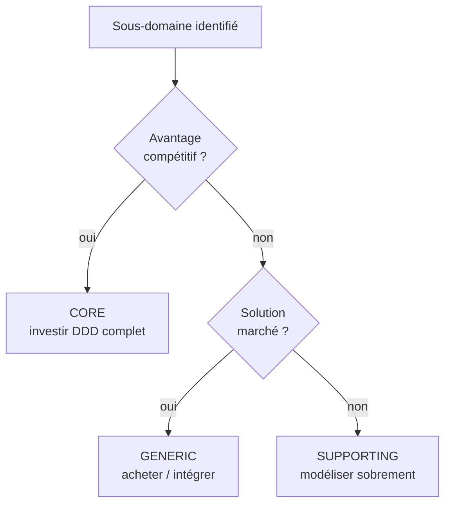

[🔝 Retour en haut de page](#table-des-matières)

## Modélisation du domaine

Modéliser un domaine, c'est extraire les concepts essentiels d'un métier et les organiser en un modèle compréhensible et exécutable. Le modèle n'est pas la réalité : c'est une simplification utile, négociée avec les experts métier. Une carte routière n'est pas le territoire ; elle en garde juste ce qui sert à se déplacer. Un modèle de domaine fait pareil avec le métier.

> **Que veut dire « modéliser » et « modèle » ?** Modéliser, c'est fabriquer une représentation simplifiée d'une chose réelle pour pouvoir raisonner dessus. La maquette en carton d'un bâtiment est un modèle de bâtiment. En logiciel, le modèle est l'ensemble des concepts (Compte, Versement, Client) et des règles qu'on a choisi de représenter dans le code.

> **Attention : modéliser n'est pas dessiner toutes les classes à l'avance.** La tentation classique consiste à dérouler une séquence en cascade : « j'écoute le métier, je dessine un diagramme avec tous les attributs, je choisis une notation, puis je code ». C'est ce qu'on appelle le *Big Design Up Front* (tout concevoir d'avance, dans le détail, avant d'écrire la moindre ligne), et c'est le contraire du **TDD** comme du DDD moderne. Dans la pratique, le modèle **émerge** au fil des tests d'acceptation et des conversations avec le métier ; le diagramme n'est qu'une trace passagère de la conversation, pas un document contractuel à graver dans le marbre.

> **Que veut dire « classe » et « attribut » ?** En programmation orientée objet, une *classe* est un moule qui décrit un type d'objet (la classe « Voiture »), et chaque objet créé à partir d'elle est une *instance* (votre voiture précise). Un *attribut* est une donnée que porte l'objet (la couleur, la vitesse). Un diagramme de classes dessine ces moules et leurs liens.

> **Que veut dire « UML », « TDD » ?** *UML* (*Unified Modeling Language*, langage de modélisation unifié) est un ensemble de notations standard pour dessiner des diagrammes de logiciel. *TDD* (*Test-Driven Development*, développement piloté par les tests) est une méthode où l'on écrit d'abord un test qui décrit le comportement voulu, puis le code qui le fait passer. On définit l'objectif (le test) avant de viser (le code).

### Une démarche itérative et test-driven

DDD et TDD se renforcent : le langage ubiquitaire alimente le nom des tests ; les tests font émerger les invariants du domaine. La démarche réelle ressemble à ceci, en boucle, sur chaque tranche fonctionnelle :

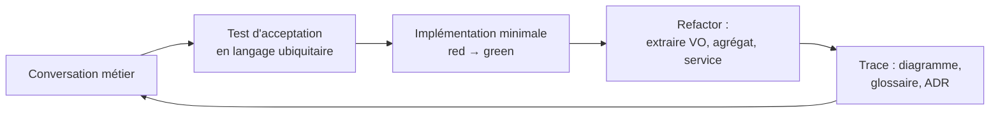

Chaque tour produit un **petit incrément** : un test qui passe, un VO ou une méthode d'agrégat qui apparaît, une note ajoutée au glossaire. **Aucun diagramme n'est posé "définitif" avant le code.** Le diagramme sert à se faire comprendre dans la salle, pas à dicter l'implémentation.

#### Étape 1 : imprégnation du domaine

Avant le premier test, on s'imprègne. Les techniques utiles :

- entretiens individuels avec les experts métier ;
- lecture des spécifications, contrats, manuels existants ;
- observation directe des utilisateurs (*shadowing*) ;
- ateliers d'**Event Storming** (Alberto Brandolini, voir <https://www.eventstorming.com/>) pour cartographier collectivement les événements *passés au sens grammatical* (`Compte ouvert`, `Versement effectué`, `Découvert autorisé`).

> **Que veut dire « Event Storming » ?** Littéralement « tempête d'événements », par analogie au *brainstorming* (remue-méninges). C'est un atelier où métier et techniciens collent sur un mur, à coups de post-it, tous les événements qui surviennent dans le métier (« Commande passée », « Paiement refusé »). On voit ainsi le déroulé réel de l'activité avant d'écrire la moindre ligne de code.

Le rendu d'un Event Storming, ce sont des post-it oranges (les événements) sur un mur, pas un diagramme UML. C'est volontaire : ce format empêche la tentation de figer un schéma de données trop tôt.

#### Étape 2 : premier test d'acceptation

> **Que veut dire « test d'acceptation » ?** C'est un test écrit dans les mots du métier qui vérifie qu'un scénario complet se comporte comme attendu (« un versement crédite bien le compte »). Il sert de contrat : tant qu'il passe, le métier accepte le comportement. On l'oppose au test unitaire, plus technique, qui vérifie un petit rouage isolé.

On choisit **un** scénario simple, formulé en langage ubiquitaire, et on l'écrit sous forme de test **avant** d'avoir tranché les types et les attributs. Exemple :

```php
public function test_un_versement_credite_le_compte_destinataire(): void
{
    // Given
    $compte = Compte::ouvrir(Iban::de('FR76...'));
    // When
    $compte->verser(Money::eur(100));
    // Then
    $this->assertEquals(Money::eur(100), $compte->solde());
}
```

À ce stade, ni `Iban`, ni `Money`, ni `Compte::verser()` n'existent. C'est l'écriture du test qui force leur apparition. Aucune liste exhaustive d'attributs n'a été décidée.

#### Étape 3 : implémentation minimale (rouge puis vert)

> **Que veut dire « rouge puis vert » ?** C'est le rythme du TDD. On écrit un test : il échoue, l'outil l'affiche en *rouge*. On écrit alors juste assez de code pour qu'il réussisse : il passe au *vert*. Comme un feu de circulation : tant que c'est rouge, on n'a pas le droit d'avancer ; le vert autorise la suite.

On code le strict nécessaire pour que le test passe : `Compte` avec une méthode `verser`, `Money` immuable, `Iban` en objet-valeur qui valide son format. Pas plus. Le test est vert.

#### Étape 4 : remaniement sous filet de tests

> **Que veut dire « refactor » (remaniement) ?** C'est améliorer la structure interne du code (le ranger, le clarifier, le réorganiser) sans changer son comportement visible. Les tests servent de filet de sécurité : tant qu'ils restent verts, on sait qu'on n'a rien cassé. Comme réorganiser une cuisine sans changer les plats qu'on y prépare.

On extrait, on renomme, on regroupe. C'est ici que les **patterns tactiques DDD** apparaissent naturellement : « ces deux primitives forment un objet-valeur `IntervaleDeDates` », « `Compte` doit empêcher un solde négatif sans autorisation : c'est l'invariant de la racine d'agrégat, on le défend dans la méthode `verser()` ».

> **Que veut dire « pattern » et « primitive » ?** Un *pattern* (modèle de conception) est une solution éprouvée à un problème courant, comme une recette de cuisine réutilisable. Une *primitive* est un type de donnée de base fourni par le langage (un nombre entier, une chaîne de texte, un booléen vrai/faux), par opposition à un type métier qu'on crée soi-même (`Money`, `Email`).

#### Étape 5 : trace écrite

À la fin du tour, on capture **uniquement ce qui est utile pour la conversation suivante** :

- une ligne ajoutée au **glossaire** du langage ubiquitaire (`Versement : transfert positif vers un compte. Voir aussi : Découvert autorisé`).
- éventuellement un diagramme rapide (Mermaid, post-it photographié) à valider avec le métier.
- un **ADR** si une décision structurante vient d'être prise (« on choisit l'agrégat `Compte` plutôt que `Client` comme racine pour les versements »).

> **Que veut dire « ADR » ?** ADR est l'acronyme de *Architecture Decision Record*, en français « fiche de décision d'architecture ». C'est une note courte qui consigne une décision importante, le contexte qui l'a motivée et les options écartées. Comme le compte rendu d'une réunion : six mois plus tard, on se souvient *pourquoi* on a tranché ainsi, et on peut rediscuter en connaissance de cause.

> **Pourquoi cet ordre est crucial.** Si l'on commençait par dessiner un diagramme de classes complet de `Client`, `Compte` et `Transaction` avec tous leurs attributs (`nom`, `prenom`, `dateNaissance`, `numero`, `solde`, `montant`, `date`...), on figerait une représentation **anémique** : des sacs de données, sans comportement, sans invariants. C'est l'origine du *modèle anémique* listé plus loin dans les pièges. Le modèle riche se construit *par* le test, pas avant.

> **Que veut dire « modèle anémique » ?** Anémique se dit, en médecine, d'un sang pauvre, affaibli. Un *modèle anémique* est un modèle vidé de sa substance : des objets qui ne contiennent que des données, sans aucune règle ni comportement, toute la logique vivant ailleurs. C'est une carcasse sans muscles, l'un des grands pièges du DDD (détaillé plus loin).

### Quand utiliser un diagramme, et lequel

Un diagramme reste utile pour **communiquer**, jamais pour **prescrire** (imposer d'avance comment coder). On choisit l'outil selon le public visé :

| Besoin                                    | Outil approprié                       | Quand l'utiliser                                          |
| ----------------------------------------- | ------------------------------------- | --------------------------------------------------------- |
| Découvrir le domaine avec le métier       | Event Storming, post-it muraux        | Atelier de cadrage, premier contact                       |
| Visualiser un flux d'événements         | Mermaid `sequenceDiagram`             | Discussion sur une saga / process manager               |
| Tracer une décision structurante         | ADR (texte) + petit schéma Mermaid    | Choix de bounded context, choix d'agrégat racine        |
| Communiquer une *photo* du modèle actuel | Diagramme de classes UML (Mermaid)    | Onboarding, revue de code, *jamais* avant de coder       |
| Cartographier les Bounded Contexts       | **Context Map** (DDD Crew template)   | Conception stratégique, discussion entre équipes        |

Outils libres usuels : [PlantUML](https://plantuml.com/), [Mermaid](https://mermaid.js.org/), [draw.io](https://app.diagrams.net/), [Miro](https://miro.com/) pour l'Event Storming distant.

> **Note sur l'UML.** Présent dans le livre d'Evans (2003), il a été supplanté dans la pratique par des notations plus légères. Vaughn Vernon et Eric Evans lui-même recommandent aujourd'hui les diagrammes de séquence (pour montrer un enchaînement dans le temps) plutôt que les diagrammes de classes (qui invitent au modèle anémique). Le diagramme de classes ci-dessous est volontairement minimal et placé **après** la conversation et les tests, pas avant.

> **Que veut dire « diagramme de séquence » et « diagramme de classes » ?** Un *diagramme de séquence* montre qui parle à qui, dans quel ordre, au fil du temps (comme une bande dessinée de messages échangés). Un *diagramme de classes* montre les types d'objets et leurs liens, figés, sans notion de temps (comme un organigramme).

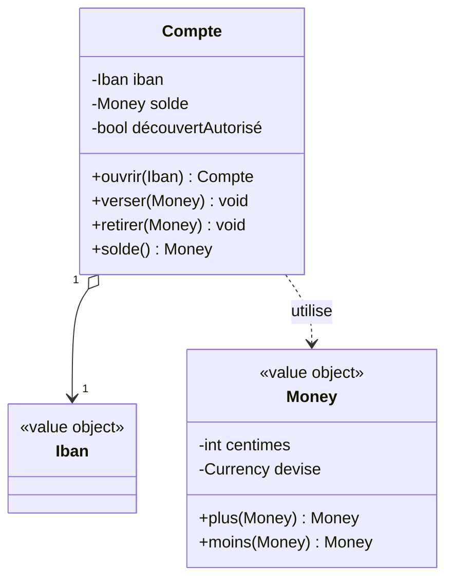

Remarquez : on expose des **comportements** (`verser`, `retirer`), pas des champs publics. C'est la différence entre un *modèle anémique* (un sac de *getters* et *setters*) et un *modèle riche* (qui défend ses invariants).

> **Que veut dire « getter » et « setter » ?** Un *getter* (accesseur) est une méthode qui rend la valeur d'un attribut (« donne-moi le solde »). Un *setter* (mutateur) en change la valeur sans aucune règle (« mets le solde à -500 »). Un objet truffé de setters publics laisse n'importe qui le mettre dans un état invalide ; un modèle riche remplace les setters par des actions métier qui vérifient les règles (`verser`, `retirer`).

### Itérer avec les experts métier

La conception émerge d'aller-retours soutenus avec le métier. Quelques règles non négociables :

- **Ateliers réguliers** plutôt que validations ponctuelles : préférer un atelier d'1 h par semaine à une revue de spec mensuelle.
- **Vocabulaire ubiquitaire** appliqué partout : diagrammes, tests, code. Si le métier dit *« contrat cadre »*, ni le code ni les tests ne doivent jamais utiliser un autre mot (voir la section *Langage ubiquitaire*).
- **Démos plutôt que diagrammes** : montrer un test vert ou une commande exécutable convainc plus vite qu'un schéma en grand format. Le diagramme reste un appui ponctuel.
- **Modéliser ce qui change ensemble** : la frontière d'un agrégat se trouve à la lecture des invariants, pas en dessinant des cardinalités.
- **Refuser le modèle figé** : tout modèle vit. Un modèle qui ne change plus au bout de six mois est probablement déjà mort, ou bien il décrit un sous-domaine générique qui ne valait pas qu'on y mette autant d'effort.

[🔝 Retour en haut de page](#table-des-matières)

## Langage ubiquitaire

> **Que veut dire « ubiquitaire » ?** *Ubiquitaire* vient du latin *ubique*, « partout ». Un langage ubiquitaire est un vocabulaire présent *partout* à la fois : dans les réunions, les documents, les tests et le code. Pas de traduction entre « le mot du métier » et « le mot du code » : c'est le même mot partout, comme une langue commune parlée par tout l'équipage d'un même navire.

Le *langage ubiquitaire* (Eric Evans, 2003) est un vocabulaire **unique** partagé par toute l'équipe : métier, développeurs, testeurs, support. Les mêmes mots désignent les mêmes concepts dans les conversations, les documents, les diagrammes et le code.

### Pourquoi

Une traduction silencieuse entre vocabulaire métier et vocabulaire technique est une source permanente de bugs. Si l'expert dit *« contrat cadre »*, le développeur écrit `MasterAgreement`, et le testeur valide *« accord principal »*, les trois croient parler de la même chose jusqu'au premier malentendu coûteux.

### Mise en pratique

- **Glossaire vivant** : un fichier (wiki, `GLOSSARY.md`) listant les termes et leurs définitions, mis à jour à chaque changement.
- **Discipline du code** : noms de classes, méthodes, événements et tables collés au vocabulaire métier.
- **Pas de jargon technique inutile** : éviter `UserDtoManagerImpl` quand le métier parle de `Adhérent`.
- **Cohérence au sein d'un Bounded Context** : un même mot peut signifier deux choses dans deux contextes ; le langage ubiquitaire est local à un contexte.

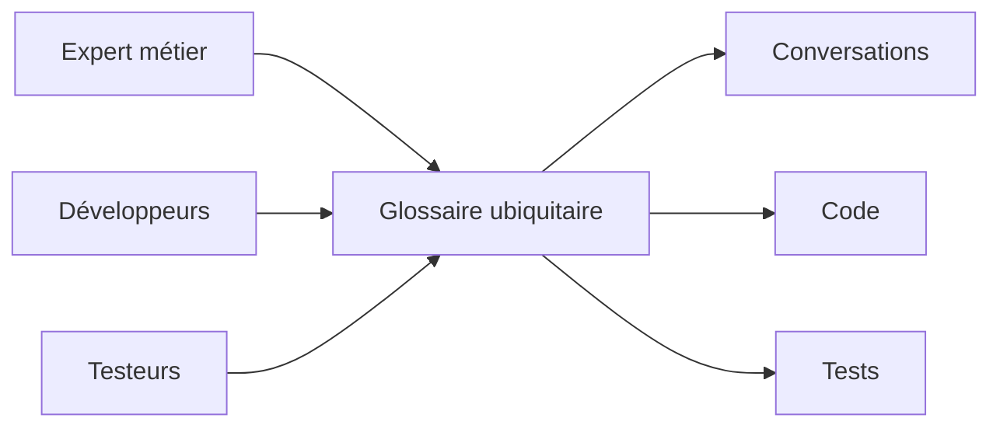

[🔝 Retour en haut de page](#table-des-matières)

## Bounded Contexts

> **Que veut dire « Bounded Context » ?** Traduit par « contexte délimité ». C'est une zone fermée à l'intérieur de laquelle un mot a un sens unique et précis. Le même mot peut signifier autre chose dans une autre zone. Pensez au mot « ticket » : à la SNCF c'est un titre de transport, au cinéma une entrée, au support informatique une demande d'aide. Chaque univers (chaque contexte) lui donne son propre sens, et c'est très bien ainsi tant que les frontières sont claires.

Un *Bounded Context* (contexte délimité) est une **frontière explicite** à l'intérieur de laquelle un modèle et un langage restent cohérents. Au-delà de la frontière, les mêmes mots peuvent désigner des choses différentes : un `Client` du contexte *Vente* (un prospect, un panier) n'est pas le `Client` du contexte *Comptabilité* (un numéro de SIRET, un encours).

> **Que veut dire « SIRET » et « encours » ?** Le *SIRET* est le numéro qui identifie officiellement un établissement d'entreprise en France. Un *encours* est le montant qu'un client doit encore mais n'a pas encore payé. Ces notions n'intéressent que la comptabilité, pas la vente : voilà pourquoi le `Client` n'a pas la même forme dans les deux contextes.

### Pourquoi

Vouloir un seul modèle universel pour tout le système amène inévitablement à des compromis qui ne servent personne. Découper en contextes laisse chaque équipe optimiser le sien sans gêner les autres.

### Identifier les contextes

Indices d'une frontière de contexte :

- changement d'équipe ou de service responsable ;
- vocabulaire qui se met à diverger ;
- règles métier qui s'appliquent ici mais pas là ;
- changement de granularité ou de cycle de vie.

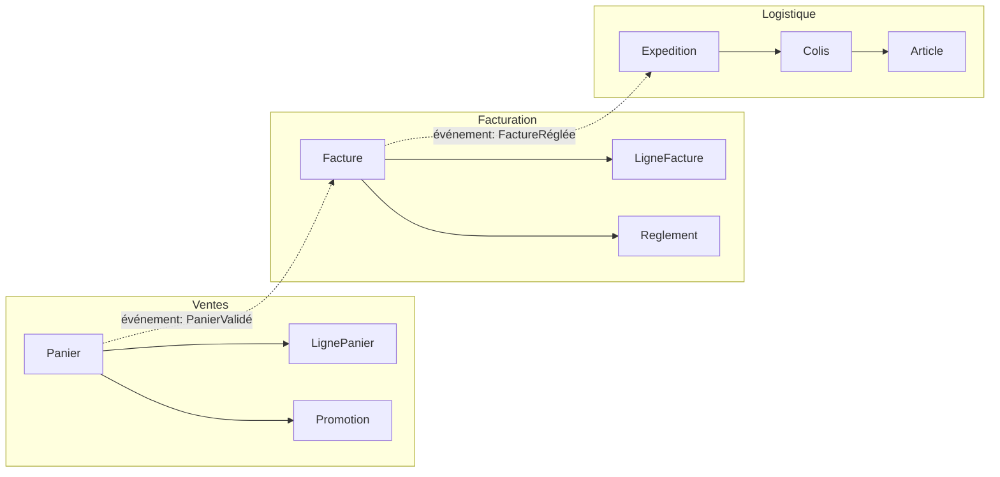

### Cartographier les relations entre contextes

Eric Evans définit plusieurs patterns pour décrire les relations entre contextes : *Shared Kernel*, *Customer/Supplier*, *Conformist*, *Anti-Corruption Layer*, *Open Host Service*, *Published Language*, *Partnership*, *Separate Ways*, *Big Ball of Mud*. Le choix dépend du rapport de pouvoir et de la confiance entre les équipes. Chacun est détaillé dans la section suivante.

[🔝 Retour en haut de page](#table-des-matières)

## Bounded Context Canvas

> **Que veut dire « Canvas » ?** *Canvas* signifie « toile » ou « canevas » : ici une grande feuille à cases qu'on remplit en atelier pour décrire quelque chose sur une seule page. Le *Bounded Context Canvas* est cette feuille appliquée à un contexte délimité. Inspiré du *Business Model Canvas* (la toile en cases utilisée par les entrepreneurs pour résumer un modèle économique). Outil de conception stratégique formalisé par **Nick Tune** et le [DDD Crew](https://github.com/ddd-crew/bounded-context-canvas) (2019). Il sert à **décrire un Bounded Context sur une seule page** lors d'un atelier de cadrage, avant d'en figer le contour ou les dépendances.

### À quoi il répond

Un Context Map montre *les relations entre* contextes ; le Bounded Context Canvas montre *l'identité d'un* contexte. Les deux sont complémentaires : on remplit un Canvas par contexte, puis on les relie sur la Map.

### Les cases du Canvas

| Case | Question à laquelle elle répond |
|------|---------------------------------|
| **Nom** | Comment le métier appelle-t-il ce contexte ? |
| **Description** | En une phrase, que fait-il ? |
| **Classification stratégique** | Core, supporting ou generic ? Pourquoi ? |
| **Domain Roles** | Spécification, exécution, audit, analytique, gateway... |
| **Inbound Communications** | Qui appelle ce contexte, sous quel contrat (synchrone/asynchrone, push/pull) ? |
| **Outbound Communications** | Qui ce contexte appelle-t-il, sous quel contrat ? |
| **Ubiquitous Language** | Liste des termes métier propres à ce contexte. |
| **Business Decisions** | Quelles décisions métier ce contexte prend-il *seul* ? |
| **Assumptions** | Hypothèses fortes (utilisateurs simultanés, volumétrie, niveau de service garanti). |
| **Verification Metrics** | Comment vérifie-t-on que le contexte fait son travail ? |
| **Open Questions** | Sujets non tranchés à reprendre au prochain atelier. |

### Pourquoi cet outil prend de l'importance

- Il **rend explicite** ce qui était implicite dans la documentation classique : rôles, hypothèses, métriques.
- Il accélère l'**onboarding** : un Canvas par contexte donne au nouvel arrivant la boussole macro en une heure.
- Il prépare la conversation **inter-équipes** : montrer son Canvas à l'équipe voisine fait apparaître les contradictions plus vite qu'une review d'API.
- Il s'intègre avec d'autres outils du **DDD Crew** : *Core Domain Chart*, *EventStorming*, *Aggregate Design Canvas*.

> **Que veut dire « onboarding » ?** *Onboarding* (intégration) désigne la prise en main par une personne qui arrive sur le projet : le temps qu'il lui faut pour comprendre comment tout marche et devenir productive. Un bon Canvas raccourcit ce temps.

> **Bonne pratique.** Remplir le Canvas en atelier (45 min à 1 h), à l'oral, en équipe mixte métier et technique. Le Canvas n'est pas un document contractuel : c'est une trace de la conversation, à réviser à chaque évolution importante.

[🔝 Retour en haut de page](#table-des-matières)

## Context Map : les patterns de relation

> **Que veut dire « Context Map » ?** Littéralement « carte des contextes ». C'est le plan qui montre tous les Bounded Contexts du système et la façon dont ils se relient, comme une carte de métro montre les lignes et leurs correspondances. Elle dit qui dépend de qui et selon quel contrat.

La *Context Map* documente honnêtement comment les Bounded Contexts s'articulent : équipes, dépendances, contrats, rapports de force. Sa valeur tient à sa fidélité au réel : une carte qui décrit la situation idéale plutôt que la situation réelle n'est qu'un vœu pieux.

### Patterns de relation entre contextes

> **Que veut dire « amont » (*upstream*) et « aval » (*downstream*) ?** Image de la rivière : ce qui est *en amont* est en haut du courant, ce qui est *en aval* est plus bas et reçoit l'eau. En logiciel, le contexte amont fournit ses données ou ses services ; le contexte aval en dépend et les reçoit. Si l'amont change, l'aval subit, jamais l'inverse.

| Pattern | Ce que c'est | Quand l'utiliser |
|---------|--------------|------------------|
| **Partnership** | Deux équipes liées par un succès ou un échec commun, coordination forte. | Lorsque deux contextes ne peuvent pas livrer indépendamment ; coût relationnel élevé. |
| **Shared Kernel** | Petit modèle partagé entre deux contextes, modifié de manière concertée. | Si la duplication coûterait plus cher que la coordination ; rare et exigeant. |
| **Customer / Supplier** (client / fournisseur) | Le contexte amont sert le contexte aval ; l'aval a un poids de client reconnu. | Équipes alignées, ressources allouées, planification possible côté amont. |
| **Conformist** | L'aval se conforme au modèle de l'amont, sans pouvoir de négociation. | Quand l'amont est imposé (legacy, fournisseur externe, équipe puissante). |
| **Anti-Corruption Layer (ACL)** | L'aval traduit le modèle de l'amont via une couche de protection. | Modèle amont incompatible ou instable ; on protège le modèle local. |
| **Open Host Service (OHS)** | L'amont publie un protocole stable utilisable par plusieurs aval. | Lorsqu'un contexte sert de plateforme à plusieurs consommateurs. |
| **Published Language** | Langage d'échange documenté et versionné (souvent couplé à OHS). | Contrats inter-équipes ou inter-organisations stables. |
| **Separate Ways** | Aucune intégration ; chacun mène sa route. | Quand l'intégration coûte plus que sa valeur. |
| **Big Ball of Mud** (grosse boule de boue) | Zone sans frontière claire, modèle entremêlé. | À reconnaître pour l'isoler ; jamais à choisir volontairement. |

> **Lexique des patterns.** *Partnership* (partenariat) : deux équipes qui réussissent ou échouent ensemble. *Shared Kernel* (noyau partagé) : un petit bout de modèle commun aux deux, modifié d'un commun accord. *Conformist* (conformiste) : l'aval se plie au modèle de l'amont sans pouvoir négocier. *Open Host Service* (service hôte ouvert) : l'amont publie une interface stable pour plusieurs consommateurs. *Published Language* (langage publié) : un format d'échange documenté et versionné. *Separate Ways* (chemins séparés) : aucune intégration, chacun de son côté. *Big Ball of Mud* (grosse boule de boue) : le code spaghetti sans frontières, à éviter.

### Représenter la carte

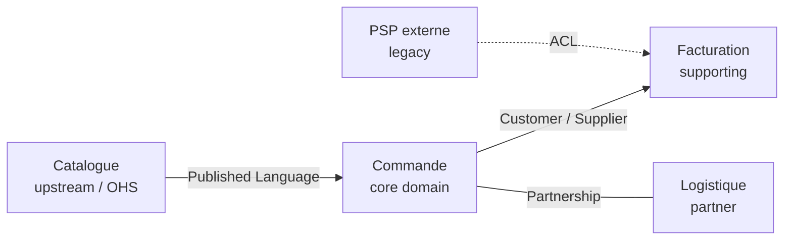

### Choisir un pattern

Le choix dépend de deux axes : **rapport de pouvoir** entre équipes (qui peut imposer un changement à qui ?) et **stabilité du modèle amont**. Une équipe aval avec peu de poids face à un amont instable a tout intérêt à intercaler une *Anti-Corruption Layer*. À l'inverse, deux équipes proches avec des objectifs alignés peuvent vivre en *Partnership*.

[🔝 Retour en haut de page](#table-des-matières)

## Entités, objets-valeurs et agrégats

Voici les trois briques de base de la modélisation tactique du DDD.

### Entité

> **Que veut dire « entité » ?** Une *entité* est un objet qu'on suit dans le temps grâce à son identité propre, même si ses attributs changent. Vous restez la même personne après avoir déménagé ou changé de nom : votre identité ne dépend pas de vos attributs. Deux personnes qui portent le même prénom et le même âge ne sont pas la même personne ; en revanche, deux fiches qui portent le même numéro d'identité, oui.

Une entité a une **identité stable** dans le temps. Deux instances avec les mêmes attributs ne sont pas la même entité ; deux références au même identifiant le sont.

```php
final class Client {
    public function __construct(
        public readonly ClientId $id,   // identité
        public string $nom,             // attributs mutables
        public string $email,
    ) {}
}
```

### Objet-valeur (*Value Object*)

> **Que veut dire « objet-valeur » et « immuable » ?** Un *objet-valeur* n'a pas d'identité : il vaut uniquement par son contenu. Un billet de 10 euros en vaut un autre : peu importe lequel, seule la valeur compte. *Immuable* signifie « qu'on ne peut pas modifier après création » : pour avoir 15 euros, on ne transforme pas le billet de 10, on prend d'autres billets. De même, pour « changer » un objet-valeur, on en crée un nouveau. Deux objets-valeurs sont égaux dès que leurs attributs le sont.

Un objet-valeur est défini **uniquement par ses attributs**. Il est immuable : le modifier revient à en créer un nouveau. Égalité signifie ici égalité des valeurs.

```php
final class Money {
    public function __construct(
        public readonly int $centimes,
        public readonly Devise $devise,
    ) {}

    public function plus(Money $autre): Money {
        if ($autre->devise !== $this->devise) { throw new DomainException('devise'); }
        return new Money($this->centimes + $autre->centimes, $this->devise);
    }
}
```

Bons candidats : `Adresse`, `Money`, `IntervalleDeDates`, `Couleur`. Mauvais candidats : ce qui a un cycle de vie ou une histoire.

### Agrégat

> **Que veut dire « agrégat » et « racine d'agrégat » ?** Un *agrégat* est un groupe d'objets qu'on traite comme un seul bloc cohérent. La *racine d'agrégat* est l'unique objet du groupe par lequel on a le droit d'entrer ; tout le reste se manipule à travers elle. Pensez à une commande de restaurant : la commande (la racine) regroupe ses lignes (un plat, une boisson) ; on n'ajoute pas un plat directement dans la cuisine, on le demande *via* la commande, qui vérifie que tout est cohérent. *Agréger*, c'est rassembler en un tout.

Un agrégat est un **groupe d'entités et d'objets-valeurs traités comme un tout cohérent**, accessible uniquement à travers une *racine d'agrégat* (qui est elle-même une entité). La racine garantit les invariants du groupe et reste la seule à être référencée depuis l'extérieur.

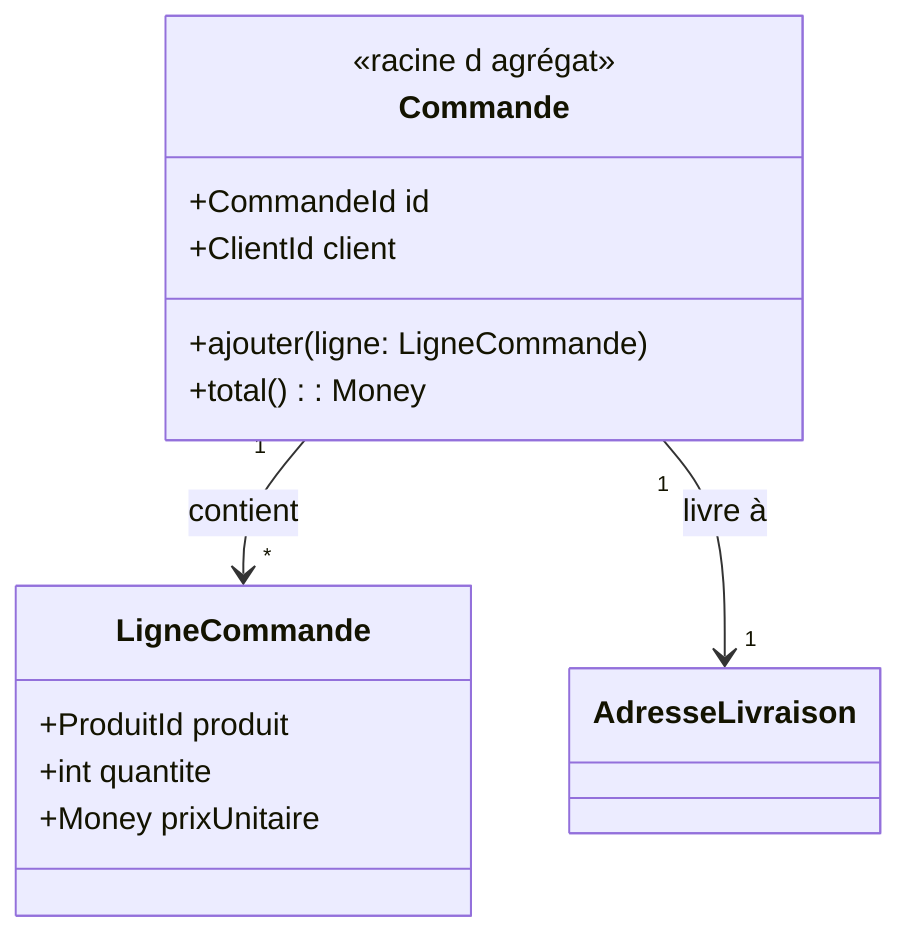

Règles d'agrégat :

- une transaction modifie un seul agrégat (sinon, scinder en deux agrégats) ;
- les références entre agrégats se font par **identifiant**, pas par référence directe d'objet ;
- garder de petits agrégats : plus ils grossissent, plus l'accès simultané et la sauvegarde deviennent pénibles.

> **Que veut dire « transaction », « concurrence », « persistance » ?** Une *transaction* est un ensemble d'opérations « tout ou rien » : soit elles réussissent toutes ensemble, soit aucune n'est appliquée (comme un virement bancaire qui débite et crédite, ou n'arrive pas du tout). La *concurrence* désigne le cas où plusieurs utilisateurs touchent les mêmes données en même temps, ce qui peut créer des conflits. La *persistance* est le fait d'enregistrer durablement les données pour les retrouver plus tard.

[🔝 Retour en haut de page](#table-des-matières)

## Règles de conception des agrégats (Vernon)

Vaughn Vernon, dans *Implementing Domain-Driven Design* (2013), formule **quatre règles** pour éviter les agrégats obèses qui paralysent la sauvegarde et l'accès simultané.

### 1. Modéliser de vraies frontières de cohérence

> **Que veut dire « frontière de cohérence » (*consistency boundary*) ?** C'est le périmètre à l'intérieur duquel les règles doivent rester vraies *immédiatement*, à chaque opération. Tout ce qui doit absolument rester cohérent ensemble vit dans le même agrégat ; le reste est dehors. C'est le tracé du « tout ou rien » : ce qu'on garde toujours d'aplomb d'un seul coup.

Un agrégat existe pour qu'**un ensemble d'invariants** soit toujours vrai après chaque transaction. Ce qui ne participe à aucun invariant n'a rien à faire dans l'agrégat. Question piège à se poser : *« Si cet attribut était sur un autre agrégat, quelle règle métier serait violée ? »* Si la réponse est *« aucune »*, c'est qu'il faut sortir l'attribut.

### 2. Concevoir de petits agrégats

Un agrégat doit être **chargeable et persistable d'un bloc** sans douleur. Les agrégats massifs (une `Commande` qui contient toutes ses lignes, ses paiements, ses retours, ses messages) provoquent :

- des verrous concurrents pénibles ;
- des chargements coûteux (toute la grappe est lue alors qu'on n'en utilise qu'une partie) ;
- des conflits d'écriture sur des champs sans rapport entre eux.

Heuristique : si plusieurs cas d'usage modifient des sous-parties indépendantes de la même grappe, scinder.

### 3. Référencer les autres agrégats par identifiant

Aucune référence d'objet directe entre agrégats. Une `Commande` ne tient pas un `Client` mais un `ClientId`. Cela :

- évite de charger des grappes entières par effet domino ;
- clarifie les frontières transactionnelles ;
- permet de stocker les agrégats dans des bases différentes (utile en microservices) ;
- réduit le couplage entre modules.

```php
final class Commande {
    private ClientId $client;     // pas Client $client
    private CatalogueProduitId $catalogue;
}
```

### 4. Mettre à jour les autres agrégats en cohérence à terme

> **Que veut dire « cohérence à terme » (*eventual consistency*) ?** C'est l'idée que tout sera cohérent *au bout d'un moment*, pas forcément à l'instant précis. Quand vous virez de l'argent un dimanche soir, votre compte est débité tout de suite mais le bénéficiaire n'est crédité que plus tard : le système n'est pas cohérent à la seconde près, il le devient « à terme ». On accepte ce léger décalage pour gagner en souplesse et en disponibilité.

Une transaction ne touche **qu'un seul agrégat**. Les autres agrégats à mettre à jour le sont **par événements**, dans une transaction ultérieure (*eventual consistency*, cohérence à terme).

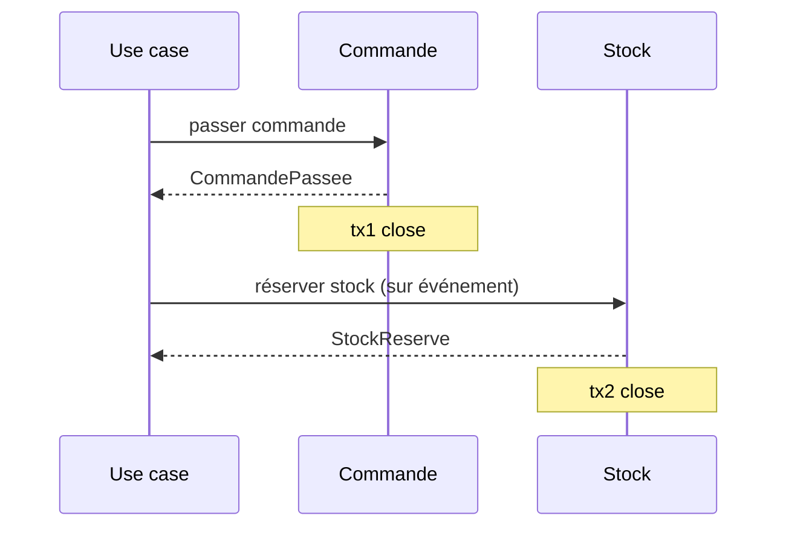

Quand exiger la cohérence forte (deux agrégats dans la même transaction) ? Réponse de Vernon : **presque jamais**. Si on en a vraiment besoin, c'est sans doute que le découpage est faux, ou bien que la règle métier elle-même tolère un décalage dans le temps qu'on n'avait pas vu.

[🔝 Retour en haut de page](#table-des-matières)

## Frontières d'agrégats : un choix de conception, pas une vérité

> **La frontière d'agrégat est un choix.** La frontière d'un agrégat est une **décision de conception** : on choisit où passe la limite du « tout ou rien » transactionnel. Ce n'est *pas* une vérité cachée dans le domaine qu'il suffirait de découvrir. Deux équipes compétentes peuvent légitimement aboutir à des découpages différents, selon l'usage, la volumétrie, la manière dont plusieurs utilisateurs accèdent aux données et les cas prioritaires.

### Pourquoi c'est important de l'admettre

La littérature DDD débutante laisse parfois entendre qu'il existe **un** « bon » agrégat à trouver, comme on chercherait une vérité cachée dans le métier. C'est faux et démobilisant :

- les invariants métier réels ne dictent souvent qu'une **partie** de la frontière ; le reste est un arbitrage technique (verrouillage des données, temps de réponse, finesse du cache, forme des messages) ;
- une nouvelle exigence (un cas d'usage très fréquent, un changement de niveau de service garanti) peut justifier de **revoir** une frontière, sans que le domaine lui-même ait changé ;
- présenter l'agrégat comme « découvrable » entretient le mythe de l'analyste DDD devin et empêche les équipes de **discuter** ouvertement leurs choix.

> **Que veut dire « latence », « cache », « verrouillage » ?** La *latence* est le temps d'attente entre une demande et sa réponse (plus c'est court, mieux c'est). Un *cache* est une réserve de résultats déjà calculés, gardés sous la main pour répondre plus vite (comme une antisèche). Le *verrouillage* empêche deux personnes de modifier la même donnée en même temps, le temps qu'une opération se termine, comme la porte verrouillée d'une cabine d'essayage.

### Trois exemples de découpage légitimement différent

| Scénario | Choix possible A | Choix possible B | Critère qui tranche |
|----------|------------------|------------------|---------------------|
| Commande e-commerce avec lignes | `Commande` agrège ses `LigneCommande` | `Commande` et `LigneCommande` sont deux agrégats reliés par identifiant | Volume de lignes par commande, fréquence d'ajout/retrait après création |
| Bilan comptable | `ExerciceComptable` agrège tous les comptes et écritures | `ExerciceComptable`, `Compte`, `Ecriture` séparés, reliés par ID | Concurrence d'écriture, taille du bilan, audit ligne à ligne ou global |
| Dossier patient | `Patient` agrège son historique médical | `Patient` distinct de `DossierMedical` (un par épisode) | Confidentialité par épisode, durée de conservation, autorisations |

### Critères pour trancher

- **Invariants** : quelle règle métier doit être vraie *immédiatement après* chaque transaction ? Tout ce qu'elle touche est dans le même agrégat.
- **Concurrence** : si deux utilisateurs modifient des sous-parties indépendantes simultanément, doit-on absolument les sérialiser ? Si non, scinder.
- **Cycle de vie** : si deux entités naissent et meurent à des moments différents, c'est probablement deux agrégats.
- **Volumétrie** : un agrégat ne doit pas dépasser ce qu'on charge raisonnablement en mémoire (Vernon parle de « petits agrégats »).
- **Cas d'usage de lecture** : si toutes les lectures portent sur la grappe complète, agréger est tentant ; si la plupart portent sur un sous-ensemble, mieux vaut scinder.

> **Que veut dire « SLA » ?** SLA est l'acronyme de *Service Level Agreement*, en français « accord de niveau de service » : la promesse chiffrée qu'on tient à ses utilisateurs (par exemple « le service répond en moins de 200 millisecondes 99 % du temps »). C'est le contrat de qualité, comme le délai garanti d'un livreur.

> **Honnêteté de conception.** Consigner dans un **ADR** (fiche de décision d'architecture) le choix de frontière et les options écartées, c'est se donner les moyens de **rediscuter** la décision plus tard, sans dogmatisme. Le texte doit dire : *« étant donné ces invariants, ce volume, ce niveau de service, nous choisissons cette frontière ; nous la révisons si X change »*.

[🔝 Retour en haut de page](#table-des-matières)

## Factories et Modules

### Factory

> **Que veut dire « Factory » ?** *Factory* signifie « usine » ou « fabrique ». C'est un composant dont le seul rôle est de fabriquer correctement un objet compliqué, en s'assurant qu'il naît déjà valide. Comme une usine de montage qui livre une voiture prête à rouler plutôt qu'un carton de pièces détachées : on ne risque pas d'oublier une étape. On l'oppose au *constructeur*, la fonction de base qui crée un objet mais reste limitée pour les cas complexes.

Une *Factory* est responsable de la **construction cohérente** d'un agrégat ou d'un objet-valeur lorsque la création n'est pas triviale : invariants à vérifier, choix d'un sous-type, dépendances externes nécessaires. Elle évite d'encombrer le constructeur ou d'éparpiller la logique de création dans les Application Services.

```php
final class FactureFactory {
    public function __construct(
        private NumerotationFactures $numerotation,
        private GrilleTVA $tva,
    ) {}

    public function depuisCommande(Commande $commande, DateTimeImmutable $emiseLe): Facture {
        $numero = $this->numerotation->prochainNumero($emiseLe);
        $taux = $this->tva->tauxApplicable($commande->paysLivraison(), $emiseLe);
        return Facture::nouvelle($numero, $commande, $taux, $emiseLe);
    }
}
```

Quand utiliser une Factory ?

- la création requiert plusieurs étapes ou plusieurs sources ;
- on doit choisir entre plusieurs implémentations selon le contexte ;
- on veut empêcher la création d'un agrégat dans un état invalide.

Quand s'en passer : un constructeur statique nommé sur la racine (`Commande::nouvelle(...)`) suffit pour les cas simples et reste dans le langage ubiquitaire.

### Module

> **Que veut dire « module » (ou « package ») ?** Un *module* est un dossier nommé qui regroupe des éléments de code qui vont ensemble, comme un classeur étiqueté qui range des documents d'un même sujet. *Package* (paquet) est un synonyme courant. En DDD, on nomme les modules d'après le métier (`Commande`, `Facturation`), pas d'après la technique (`Entities`, `Services`).

Un *Module* (ou *Package*) est un regroupement nommé d'éléments du modèle. Le nom du module **fait partie du langage ubiquitaire** : il dit quelque chose du métier, pas de la technique. Préférer `App\Domain\Commande` à `App\Domain\Entities`.

Lignes directrices :

- un module = un concept cohérent du domaine ;
- couplage faible entre modules, fort à l'intérieur ;
- aligner les modules sur les chapitres du langage ubiquitaire, pas sur les couches techniques.

```text
src/
  Catalogue/        # bounded context
    Domain/
      Produit/      # module
      Categorie/
    Application/
    Infrastructure/
  Commande/
    Domain/
      Commande/
      Panier/
    Application/
    Infrastructure/
```

[🔝 Retour en haut de page](#table-des-matières)

## Repositories et Domain Services

### Repository

> **Que veut dire « Repository » ?** *Repository* signifie « dépôt » ou « entrepôt ». C'est un composant qui donne l'illusion que tous les objets d'un type sont rangés dans une grande collection à portée de main, alors qu'en réalité ils sont stockés en base de données. On lui demande « rends-moi la commande numéro 42 » ou « range cette commande », sans savoir où ni comment c'est gardé. Comme un bibliothécaire : vous demandez un livre par son titre, lui sait dans quel rayon le chercher.

> **Que veut dire « interface », « ORM », « API » ?** Une *interface* est un contrat : la liste des actions disponibles, sans dire comment elles sont réalisées (une prise électrique définit la forme, pas la centrale qui produit le courant). Un *ORM* (*Object-Relational Mapping*, correspondance objet-relationnel) est un outil qui traduit automatiquement entre les objets du code et les tables de la base. Une *API* (*Application Programming Interface*, interface de programmation) est la porte d'entrée par laquelle un programme en appelle un autre.

Un *Repository* offre l'illusion d'une collection en mémoire contenant tous les agrégats d'un type. Il cache la persistance (ORM, fichier, API) derrière une interface définie par le domaine.

```php
namespace App\Domain\Commande;

interface CommandeRepository {
    public function find(CommandeId $id): ?Commande;
    public function add(Commande $commande): void;
    public function remove(Commande $commande): void;
}
```

L'implémentation vit dans la couche infrastructure :

```php
namespace App\Infrastructure\Doctrine\Commande;

use App\Domain\Commande\{Commande, CommandeId, CommandeRepository};
use Doctrine\ORM\EntityManagerInterface;

final class DoctrineCommandeRepository implements CommandeRepository {
    public function __construct(private EntityManagerInterface $em) {}

    public function find(CommandeId $id): ?Commande {
        return $this->em->find(Commande::class, $id);
    }

    public function add(Commande $commande): void {
        $this->em->persist($commande);
    }

    public function remove(Commande $commande): void {
        $this->em->remove($commande);
    }
}
```

Notes :

- un Repository **par racine d'agrégat**, pas par table ;
- l'écriture définitive en base (`flush()`) n'est pas la responsabilité du Repository ; elle est pilotée par l'Application Service ou par une couche transactionnelle (*middleware*).

> **Que veut dire « middleware » ?** Un *middleware* (intergiciel) est un morceau de code qui s'intercale automatiquement avant ou après une opération pour y ajouter un comportement transversal (ouvrir et fermer une transaction, écrire un journal, vérifier les droits). Comme le portique de sécurité d'un aéroport : tout le monde y passe, sans que chaque voyageur ait à le demander.

### Domain Service

> **Que veut dire « Domain Service » et « couche » ?** Un *Domain Service* (service de domaine) abrite une règle métier qui n'a sa place dans aucune entité ni aucun objet-valeur précis, le plus souvent parce qu'elle fait intervenir plusieurs agrégats à la fois. Une *couche* est un étage du code aux responsabilités bien définies : la couche *domaine* contient les règles métier pures, la couche *infrastructure* contient les détails techniques (base de données, réseau). Comme les étages d'un immeuble : chacun a sa fonction et on ne mélange pas la chaudière avec le salon.

Un *Domain Service* abrite la logique métier qui n'appartient naturellement à aucune entité ni objet-valeur (souvent parce qu'elle implique plusieurs agrégats). Il vit dans la couche domaine et reste indépendant de l'infrastructure.

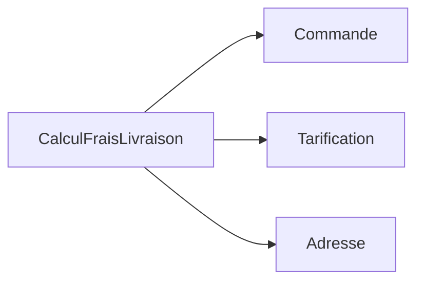

Exemple : un calcul de frais de livraison qui combine la commande, la grille tarifaire du transporteur et l'adresse. Aucune de ces trois données n'a plus de légitimité que les autres à porter le calcul, donc on le place dans un service dédié.

[🔝 Retour en haut de page](#table-des-matières)

## Application Services et CQRS

### Application Services

> **Que veut dire « Application Service » et « orchestrer » ?** Un *Application Service* (service applicatif) est la porte d'entrée vers le domaine pour le monde extérieur (l'interface utilisateur, une API). Son rôle est d'*orchestrer*, c'est-à-dire de coordonner les étapes d'un cas d'usage sans contenir lui-même de règle métier, exactement comme un chef d'orchestre fait jouer les musiciens dans le bon ordre mais ne joue d'aucun instrument. La *couche présentation* est la partie du logiciel qui dialogue avec l'utilisateur (écrans, boutons, réponses d'API).

Les *Application Services* sont la porte d'entrée du domaine pour la couche présentation. Ils orchestrent : ils ouvrent une transaction, chargent les agrégats nécessaires, appellent leurs méthodes métier, sauvegardent, émettent les événements, puis ferment la transaction.

```php
final class PasserCommande {
    public function __construct(
        private CommandeRepository $commandes,
        private CatalogueProduits $catalogue,
        private EventDispatcher $events,
    ) {}

    public function __invoke(PasserCommandeInput $input): CommandeId {
        $commande = Commande::nouvelle($input->client);
        foreach ($input->lignes as $l) {
            $produit = $this->catalogue->trouver($l->produitId)
                ?? throw new ProduitInconnu($l->produitId);
            $commande->ajouter(new LigneCommande($produit->id, $l->quantite, $produit->prix));
        }
        $this->commandes->add($commande);
        $this->events->dispatch(new CommandePassee($commande->id));
        return $commande->id;
    }
}
```

Règle : **un Application Service ne contient pas de logique métier** ; il ne fait qu'orchestrer.

### CQRS

> **Que veut dire « CQRS » ?** CQRS est l'acronyme de *Command Query Responsibility Segregation*, en français « séparation des responsabilités entre commandes et requêtes ». Une *commande* modifie l'état (passer une commande, payer) ; une *requête* lit l'état sans le changer (afficher une liste). L'idée : utiliser un modèle différent pour écrire et pour lire. Dans un restaurant, la cuisine (qui prépare, l'écriture) et la salle (qui sert, la lecture) sont organisées différemment, chacune optimisée pour son rôle.

CQRS (*Command Query Responsibility Segregation*, [Greg Young, 2010](https://martinfowler.com/bliki/CQRS.html)) sépare le modèle d'écriture du modèle de lecture :

| Côté | Rôle | Optimisé pour |
|------|------|---------------|
| **Commands** | Modifient l'état (réservations, paiements). | Cohérence, invariants, agrégats. |
| **Queries** | Lisent l'état (listes, vues, tableaux de bord). | Performance, projections dénormalisées. |

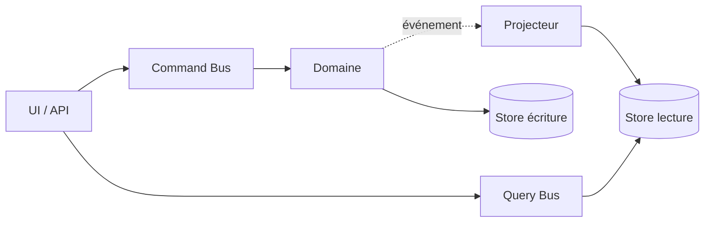

> **Que veut dire « projection » et « dénormalisé » ?** Une *projection* est une vue de lecture construite à partir des données d'écriture, taillée pour être lue vite (comme un résumé préparé d'avance). *Dénormalisé* veut dire qu'on accepte de dupliquer ou de pré-assembler des informations pour éviter des recalculs coûteux à la lecture, à l'inverse d'une base « normalisée » qui range chaque donnée à un seul endroit.

CQRS ne se justifie que là où la lecture et l'écriture ont des modèles ou des charges très différents. Dans le doute, **commencer sans**.

[🔝 Retour en haut de page](#table-des-matières)

## CQRS et Event Sourcing : indépendants

> **CQRS et ES sont indépendants.** *CQRS* (séparation lecture/écriture) et *Event Sourcing* (sauvegarde sous forme d'événements) sont **deux décisions indépendantes**. On les présente parfois comme un duo inséparable, c'est trompeur. On peut adopter l'un sans l'autre, et chaque combinaison a son sens.

> **Que veut dire « ES » et « orthogonal » ?** *ES* est l'abréviation d'*Event Sourcing*, en français « stockage par événements » (détaillé dans la section suivante) : au lieu de garder l'état final, on garde la liste de tout ce qui s'est passé. *Orthogonal* est un mot de géométrie (deux droites à angle droit) utilisé ici au sens figuré : deux choix qui n'ont rien à voir l'un avec l'autre et qu'on décide séparément, comme choisir la couleur d'une voiture n'a rien à voir avec le choix du moteur.

### Les quatre combinaisons possibles

| | **Sans CQRS** | **Avec CQRS** |
|---|---------------|---------------|
| **Sans ES** | Architecture classique : un modèle, une base, lecture et écriture par les mêmes objets. **Cas par défaut**, suffisant pour la majorité des applications. | Modèles de lecture dédiés (vues SQL dénormalisées, projections), persistance d'état classique. **Très utile** quand les requêtes divergent fortement des invariants d'écriture. |
| **Avec ES** | Event Sourcing « pur » : le store est l'historique, l'état courant est reconstruit à la lecture. Possible mais **inhabituel** : on bascule rarement en ES sans CQRS, car les requêtes deviennent rapidement coûteuses. | Combinaison classique présentée par Greg Young : commands → events → projections → reads. **Puissante mais coûteuse**, à réserver aux domaines où la traçabilité est exigée. |

### Quand CQRS sans ES

- on a un **modèle d'écriture riche** (agrégats DDD, invariants), mais les lectures dominantes sont des listes/dashboards/recherches qui n'ont pas besoin de l'objet métier ;
- on veut introduire **plusieurs vues** optimisées (par client, par fournisseur, par exercice) sans tordre les agrégats ;
- on cible la **performance** (cache, projections matérialisées) sans complexité opérationnelle d'un event store.

C'est la combinaison la plus fréquente dans les SI métier à fort volume de lecture.

### Quand ES sans CQRS

- très rare en pratique ; envisageable si la **lecture est intrinsèquement faible** (back-office d'audit où l'on consulte rarement, mais on doit tout reconstituer) ;
- l'effort de projection apparaît néanmoins dès qu'une UI a besoin d'une liste : on bascule de fait vers CQRS.

### Adopter progressivement

Une trajectoire prudente, observée en pratique :

1. **Étape 0** : modèle riche DDD, sauvegarde de l'état, lectures via le même modèle. Cela suffit longtemps.
2. **Étape 1** : quand les lectures deviennent un goulot d'étranglement ou que les vues divergent, introduire **CQRS** (projections de lecture, sans toucher à l'écriture).
3. **Étape 2** : quand un sous-domaine cœur exige un audit, une traçabilité ou la possibilité de rejouer l'histoire (finance, santé, chaîne logistique réglementée), introduire l'**Event Sourcing** sur ce seul sous-domaine.

> **Que veut dire « audit » et « chaîne logistique » ?** Un *audit* est une vérification a posteriori : pouvoir reconstituer exactement qui a fait quoi et quand, comme un relevé de compte qui justifie chaque opération. La *chaîne logistique* (*supply chain*) est tout le parcours d'un produit, du fournisseur jusqu'au client final.

> **Garde-fou.** Ne pas adopter CQRS et ES pour leur réputation. Chaque pattern porte un **coût d'exploitation** (outillage, formation, débogage) qui se paie en temps d'ingénieurs. Le bon ordre est : DDD tactique, puis CQRS si nécessaire, puis ES si vraiment nécessaire, **jamais l'inverse**.

[🔝 Retour en haut de page](#table-des-matières)

## Événements de domaine et Event Sourcing

### Événement de domaine

> **Que veut dire « Domain Event » et « découpler » ?** Un *Domain Event* (événement de domaine) est l'annonce d'un fait métier qui *vient de se produire*, toujours formulé au passé (`CommandePassee`, `PaiementRefuse`). C'est une nouvelle qu'on publie : « ceci a eu lieu ». *Découpler* signifie réduire la dépendance entre deux parties pour qu'elles n'aient pas à se connaître. Comme un journal : celui qui annonce une nouvelle n'a pas besoin de savoir qui la lira ni ce que chacun en fera.

Un *Domain Event* est un fait métier passé, immuable, exprimé au passé : `CommandePassee`, `PaiementRefuse`, `ColisLivre`. Il découple les producteurs des consommateurs : la commande ne sait pas qui s'intéresse à sa validation.

> **Que veut dire « producteur » et « consommateur » ?** Le *producteur* est celui qui émet l'événement (l'agrégat où le fait s'est produit). Le *consommateur* est celui qui le reçoit et réagit (envoyer un courriel, mettre à jour le stock). Comme une boîte aux lettres : le facteur dépose (producteur), le destinataire relève et agit (consommateur), sans que l'un dicte le travail de l'autre.

Caractéristiques :

- **immuable** ; un événement ne se modifie pas, il se compense par un autre événement ;
- **complet** ; il porte l'information dont les abonnés auront besoin (éviter le retour à la base) ;
- **émis par un agrégat** lorsqu'un changement d'état significatif a lieu.

### Event Sourcing

> **Que veut dire « Event Sourcing » ?** Traduisible par « stockage par événements ». Au lieu d'enregistrer seulement la photo de l'état actuel, on enregistre la *suite complète des événements* qui ont mené à cet état, et on reconstitue l'état en les rejouant. Comparez un compte en banque : la banque ne garde pas juste « solde : 320 € », elle garde tous les mouvements (dépôt de 500, retrait de 180...), et le solde se recalcule en additionnant l'historique. C'est exactement l'idée.

L'*Event Sourcing* enregistre un agrégat **sous la forme de la suite des événements qui l'ont fait advenir**, plutôt que sous celle de son état courant. L'état est reconstruit en rejouant les événements.

| Bénéfice | Coût |
|----------|------|
| Historique complet, audit gratuit | Requêtes complexes à projeter |
| Reconstruction d'états passés | Versionnage des événements obligatoire |
| Synergie naturelle avec CQRS | Outillage et expertise spécifiques |
| Détection rétroactive de bugs | Impossibilité de modifier le passé |

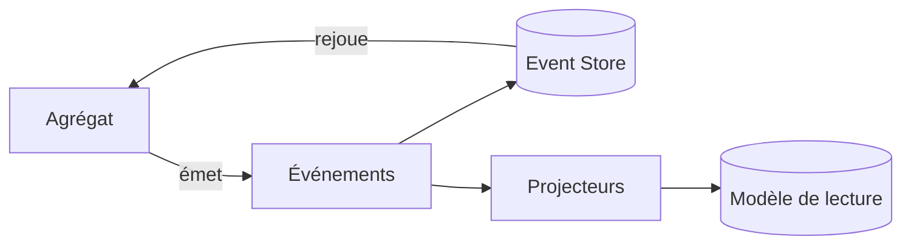

> **Que veut dire « Event Store » ?** L'*Event Store* (magasin d'événements) est la base de données spécialisée qui conserve, dans l'ordre, tous les événements. C'est le grand registre où rien ne s'efface : on ajoute toujours à la fin, jamais on ne modifie le passé.

L'Event Sourcing reste un choix lourd : à n'envisager que sur les domaines où la traçabilité a une valeur métier (finance, santé, audit réglementaire).

### Stratégie de snapshots et de rejeu

> **Que veut dire « snapshot » et « rejeu » ?** Un *snapshot* (instantané) est une photo de l'état d'un agrégat à un moment donné, qu'on garde pour ne pas avoir à tout recalculer depuis le début. Le *rejeu* consiste à reparcourir les événements dans l'ordre pour reconstruire l'état. Comme un film : au lieu de le regarder en entier à chaque fois, on saute à un chapitre enregistré (le snapshot) puis on ne visionne que la suite.

Quand l'historique grandit, rejouer tous les événements à chaque chargement devient coûteux. La parade est le **snapshot** : une photo périodique de l'état d'un agrégat, à partir de laquelle on ne rejoue que les événements survenus ensuite.

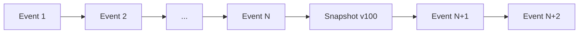

> **Que veut dire « heuristique » ?** Une *heuristique* est une règle pratique « au doigt mouillé », pas une loi exacte : elle marche bien en général et aide à décider vite, sans prétendre être parfaite. « Prendre un parapluie si le ciel est gris » est une heuristique.

Heuristique : faire un snapshot tous les *N* événements (50, 100...), garder l'historique brut pour l'audit, et accepter que le snapshot ne soit qu'une optimisation, jamais une source de vérité.

### Versionnage des événements

> **Que veut dire « versionnage » ?** *Versionner*, c'est marquer chaque variante d'une chose d'un numéro (`v1`, `v2`) pour suivre son évolution dans le temps. Comme les éditions successives d'un livre : on sait laquelle on lit. Ici, un événement enregistré ne peut plus jamais changer ; quand son format évolue, on crée une nouvelle version et il faut savoir gérer les anciennes.

Un événement enregistré ne peut plus changer. Quand le métier évolue (ajout d'un champ, renommage), trois techniques coexistent et se combinent :

- **Upcaster** : fonction pure appliquée à la **lecture** qui transforme un événement de version `v1` vers `v2`. Pattern classique : une chaîne d'upcasters (`v1` vers `v2` vers `v3`) tenue à jour. Avantage : aucune modification du stockage existant. Inconvénient : la chaîne s'allonge, et on traîne le poids de l'histoire à chaque rejeu.

> **Que veut dire « upcaster » et « fonction pure » ?** Un *upcaster* (du verbe anglais *to upcast*, « convertir vers le haut ») est une petite fonction qui met à niveau un vieil événement vers son format récent au moment où on le relit, sans toucher à ce qui est stocké. Une *fonction pure* est une fonction qui, pour une même entrée, rend toujours la même sortie et ne provoque aucun effet de bord (elle ne modifie rien ailleurs, n'écrit rien, n'appelle l'heure ni le hasard). Comme une calculatrice : 2 + 3 donne toujours 5, sans rien changer d'autre.

- **Émissions multiples** (*double-write*, double écriture) : produire pendant une période de transition à la fois `EvtV1` et `EvtV2`, afin que les anciens consommateurs continuent de fonctionner. Coûteux en stockage, simple à exploiter.
- **Copier-remplacer** (*stream rewrite*, réécriture du flux) : créer un **nouveau flux** d'événements `vN+1` à partir de l'ancien, en transformant à la copie. Lourd (interruption ou bascule), mais cela nettoie la dette de format. Réservé aux refontes profondes.

> **Que veut dire « downtime » et « flux » ?** Le *downtime* (temps d'arrêt) est la période pendant laquelle le service est indisponible, par exemple le temps d'une grosse opération de maintenance. Un *flux* (*stream*) est une suite d'événements qui s'écoule dans le temps, comme l'eau d'un cours d'eau ; ici, la longue file ordonnée des événements d'un agrégat.

- **Lecteur tolérant** (*tolerant reader*) : exiger des consommateurs qu'ils ignorent les champs inconnus et acceptent les valeurs par défaut. Indispensable, et complémentaire des trois autres techniques.

### Pièges récurrents (souvent sous-estimés)

- **Évolution du format** (*schema evolution*) : un événement publié il y a trois ans est toujours dans le magasin. Sans politique d'upcasters claire et **testée à l'intégration**, le moindre renommage casse silencieusement les rejeux. Tester chaque upcaster contre des **jeux de données historiques figés** (*fixtures*).

> **Que veut dire « test d'intégration » et « fixture » ?** Un *test d'intégration* vérifie que plusieurs morceaux fonctionnent bien ensemble (par opposition au test unitaire qui isole un seul morceau). Une *fixture* est un jeu de données de test préparé et figé, qui sert de référence stable pour comparer les résultats.

- **Reconstruction des modèles de lecture** : les projections doivent pouvoir être **reconstruites de zéro** à tout moment (changement de modèle de lecture, bug d'un projecteur, ajout d'un index). Cela suppose une mécanique de rejeu *idempotente* et des projections **purement déterministes** (sans appel à l'heure courante ni à un service externe en plein milieu).

> **Que veut dire « idempotent » et « déterministe » ?** *Idempotent* qualifie une opération qu'on peut répéter sans changer le résultat au-delà de la première fois : appuyer dix fois sur le bouton « éteindre » d'un appareil déjà éteint ne fait rien de plus. *Déterministe* qualifie un calcul qui donne toujours le même résultat pour les mêmes entrées, sans part de hasard. Ces deux propriétés rendent le rejeu sûr et reproductible.

- **Volumétrie du magasin d'événements** : sur un domaine très actif, le magasin grossit sans plafond. Anticiper l'archivage à froid (mettre de côté les vieux événements), le découpage par flux, le coût de stockage à long terme.
- **Débogage en production** : aucune requête SQL classique ne répond directement à *« quel est l'état actuel d'un agrégat ? »* ; il faut systématiquement rejouer. Investir dans un **visualiseur** de magasin d'événements et des outils de rejeu ciblé n'est pas négociable.

> **Que veut dire « SQL » ?** SQL (*Structured Query Language*, langage de requêtes structuré) est le langage standard pour interroger une base de données classique (« donne-moi tous les clients de Lyon »). En Event Sourcing, l'état n'est pas stocké tel quel, donc une simple requête SQL ne suffit plus à le lire.

- **Effets de bord interdits dans les agrégats** : la méthode qui applique un événement (`apply(Event)`) doit être **strictement déterministe**. Tout appel à un service, à l'heure courante, au hasard ou à un compteur externe pendant la reconstruction casse le rejeu.

> **Que veut dire « effet de bord » ?** Un *effet de bord* est tout ce qu'une fonction modifie en dehors de son simple calcul : écrire dans un fichier, envoyer un message, lire l'heure, tirer un nombre au hasard. Pendant un rejeu, ces effets fausseraient la reconstruction, car ils ne donneraient pas le même résultat qu'à l'origine.

- **Évolution des invariants** : si une règle métier change, d'anciens événements peuvent ne plus être *valides* au regard de la règle d'aujourd'hui. Il faut choisir : soit on respecte le passé tel qu'il a été (préférable pour l'audit), soit on refuse les rejeux qui violent la règle (et il faut alors prévoir une compensation).
- **Intégration longue des nouveaux** : un développeur expérimenté met plusieurs semaines à devenir productif sur un système Event Sourcing non trivial. Compter ce coût dans la décision d'adoption.

### Inconvénients à connaître

- complexité d'exploitation (magasin d'événements dédié, projections à reconstruire) ;
- requêtes ponctuelles impossibles sans projection préalable ;
- débogage moins direct (l'état actuel est recalculé, pas stocké) ;
- intégration plus longue des nouveaux membres de l'équipe.

[🔝 Retour en haut de page](#table-des-matières)

## Outbox Pattern : publication fiable des événements

> **Que veut dire « Outbox » ?** *Outbox* signifie « boîte d'envoi » (comme dans une messagerie). Le principe : au lieu d'essayer d'envoyer un message tout de suite (au risque de le perdre si l'envoi échoue), on l'écrit d'abord dans une boîte d'envoi en base de données, *en même temps* que le changement métier, puis un facteur passe plus tard vider la boîte et envoyer pour de bon. Pattern popularisé par Chris Richardson, largement documenté chez Microsoft et Confluent. Indispensable dès qu'on a une base de données d'un côté et un système de messagerie de l'autre.

### Le problème : la double écriture

> **Que veut dire « bus », « broker », « asynchrone » ?** Un *bus* (ou *broker*, courtier de messages) est le système qui transporte les messages d'un service à un autre (Kafka, RabbitMQ, SQS en sont des exemples), comme un service postal entre applications. *Asynchrone* veut dire « en différé » : on ne reste pas à attendre la réponse, le traitement se fait plus tard, à son rythme, par opposition à *synchrone* (« sur le moment, on attend »).

Sans Outbox, un Application Service classique fait deux écritures sur deux systèmes :

1. un `INSERT` ou un `UPDATE` dans la base de données (via le Repository).
2. un `publish()` sur le bus de messages (Kafka, RabbitMQ, SQS).

> **Que veut dire « INSERT », « UPDATE », « publish » ?** `INSERT` et `UPDATE` sont des commandes SQL : la première ajoute une ligne en base, la seconde en modifie une existante. `publish()` (« publier ») envoie un message sur le bus à destination des autres services.

Les deux ne sont pas dans la même transaction. Trois pannes sont alors possibles :

| Scénario | Conséquence |
|----------|-------------|
| Base écrite, bus indisponible | État changé, événement perdu : incohérence entre services. |
| Base en échec, bus écrit | État non changé, événement publié à tort : les consommateurs travaillent sur une fausse information. |
| Panne entre les deux | Résultat indéterminé ; selon l'ordre, l'un des deux cas précédents. |

### Le pattern : une seule transaction locale

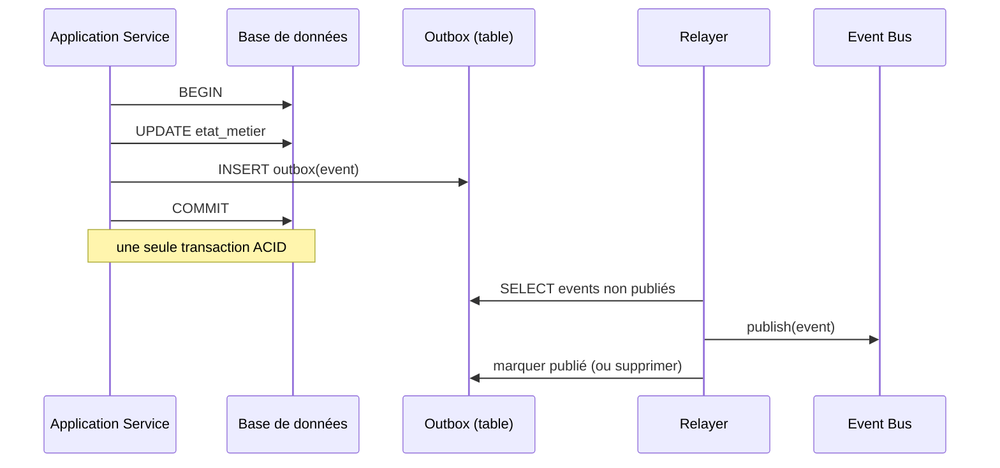

L'agrégat et la ligne d'outbox sont écrits **de façon atomique** (« tout ou rien » dans la même transaction). Le *relayer* (le relais qui vide la boîte) garantit la publication *au moins une fois* ; charge aux consommateurs d'être idempotents.

> **Que veut dire « atomique » et « ACID » ?** *Atomique* (du grec *atomos*, « insécable ») se dit d'une opération qu'on ne peut pas couper en deux : elle se fait entièrement ou pas du tout. *ACID* est un acronyme qui résume les garanties d'une bonne transaction : *Atomicity* (atomicité), *Consistency* (cohérence), *Isolation* (isolation entre transactions simultanées), *Durability* (durabilité, ce qui est validé survit aux pannes). C'est le label de fiabilité des bases de données classiques.

### Variantes

- **Outbox par sondage** (*polling*) : le relayer interroge la table `outbox` à intervalle régulier. Simple, sans configuration particulière ; le délai dépend de la fréquence d'interrogation.
- **Lecture du journal de transactions** (*CDC*, *Change Data Capture*, capture des changements de données) : on lit le journal interne de la base (par exemple via Debezium pour PostgreSQL ou MySQL). Délai très court, mais plus exigeant à exploiter.
- **Listen/notify** (PostgreSQL) : la base prévient elle-même quand un nouvel événement arrive ; bon délai, simple à mettre en œuvre.

> **Que veut dire « polling » et « CDC » ?** Le *polling* (sondage) consiste à reposer la même question à intervalles réguliers (« du nouveau ? du nouveau ? »), comme on regarde sa montre toutes les minutes. Le *CDC* (capture des changements de données) fait l'inverse : on s'abonne au journal interne de la base, qui signale chaque modification dès qu'elle a lieu, sans avoir à redemander.

### Pourquoi c'est incontournable en système distribué

> **Que veut dire « système distribué » ?** C'est un système composé de plusieurs programmes qui tournent sur des machines différentes et coopèrent par le réseau (par opposition à un seul programme sur une seule machine). Le réseau pouvant tomber ou ralentir, on doit prévoir les pannes partielles : c'est tout l'enjeu de l'Outbox.

Sans Outbox, la cohérence à terme repose sur la chance. Avec Outbox, on obtient une **garantie de publication au moins une fois** dès que la transaction métier réussit. C'est la fondation pratique de toute architecture événementielle sérieuse.

[🔝 Retour en haut de page](#table-des-matières)

## Sagas et Process Managers

### Pourquoi un coordinateur ?

> **Que veut dire « saga », « process manager », « workflow » ?** Un *workflow* (flux de travail) est l'enchaînement des étapes d'un processus métier (passer commande, réserver le stock, encaisser, expédier). Une *saga* et un *process manager* sont deux façons de piloter un tel enchaînement qui s'étale dans le temps et traverse plusieurs agrégats. Image de l'organisation d'un mariage : le *process manager* est le wedding planner qui appelle chaque prestataire dans l'ordre (orchestration centralisée) ; la *saga* est le cas où chaque prestataire prévient le suivant dès qu'il a fini, sans chef (chorégraphie).

Quand un cas d'usage métier traverse **plusieurs agrégats** (et parfois plusieurs Bounded Contexts), aucun agrégat n'est légitime pour porter la transaction. Une *saga* ou un *process manager* coordonne le workflow, gère les états intermédiaires, et déclenche des **compensations** quand une étape échoue.

> **Que veut dire « compensation » ?** Une *compensation* est une action métier qui annule l'effet d'une étape déjà validée, en faisant le geste inverse : rembourser après un paiement, libérer un stock après l'avoir réservé. On ne peut pas « revenir en arrière » comme par magie dans un système réparti, alors on défait proprement, par une action de sens contraire.

> **Saga vs Process Manager** : la littérature les confond souvent. Convention courante : la *saga* est chorégraphiée (les événements eux-mêmes déclenchent la suite, sans chef d'orchestre) ; le *process manager* est orchestré (un composant central pilote les étapes). En pratique, on choisit selon le niveau de couplage acceptable.

> **Que veut dire « orchestration » et « chorégraphie » ?** En *orchestration*, un chef central dit à chacun quoi faire et quand (comme un chef d'orchestre). En *chorégraphie*, il n'y a pas de chef : chaque participant connaît son rôle et réagit aux autres (comme des danseurs qui s'enchaînent au signal du précédent). L'orchestration est plus lisible mais plus couplée ; la chorégraphie est plus découplée mais plus difficile à suivre.

### Exemple : passage d'une commande

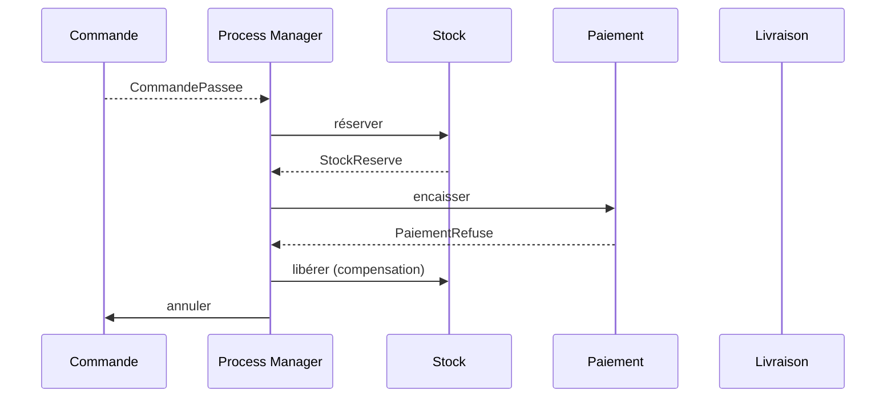

### Compensations, pas annulations techniques

> **Que veut dire « rollback » et « transaction distribuée à deux phases » ?** Un *rollback* (retour arrière) est l'annulation automatique d'une transaction par la base de données, qui remet tout comme avant. Une *transaction distribuée à deux phases* (*two-phase commit*) tente d'étendre ce « tout ou rien » à plusieurs systèmes à la fois ; c'est lent, fragile et mal adapté aux systèmes répartis modernes. D'où le choix des compensations : on ne revient pas en arrière techniquement, on défait par une action métier.

Aucune transaction distribuée à deux phases : chaque étape est locale et atomique. Si une étape échoue, les étapes déjà validées sont compensées par des actions métier de sens contraire (rembourser, libérer le stock, annuler la commande). La compensation appartient au métier et porte un nom issu du langage ubiquitaire.

### Squelette d'un Process Manager

```php
final class PassageCommandeProcessManager {
    public function quand(CommandePassee $e): void {
        $this->commandes->reserverStock($e->commandeId);
    }
    public function quand(StockReserve $e): void {
        $this->paiements->encaisser($e->commandeId);
    }
    public function quand(PaiementRefuse $e): void {
        $this->stock->liberer($e->commandeId);
        $this->commandes->annuler($e->commandeId, motif: 'paiement refusé');
    }
}
```

### Saga vs Process Manager : terminologie ambiguë

> **Avertissement.** La littérature **n'est pas unanime** sur la frontière saga / process manager. Trois acceptions coexistent et il faut choisir explicitement la sienne dans l'équipe.

| Auteur / source | Position |
|-----------------|----------|
| **Hector Garcia-Molina & Kenneth Salem (1987)** | *Saga* désigne historiquement une transaction de longue durée découpée en transactions locales avec compensations. Aucune mention d'orchestration ou de chorégraphie. |
| **Vaughn Vernon (*IDDD*, 2013)** | Préfère *Process Manager* pour l'orchestration centralisée (un objet avec un état, qui consomme des événements et émet des commandes). Réserve *Saga* aux chorégraphies décentralisées. |
| **Microsoft Patterns & Practices (CQRS Journey, 2012)** | Utilise *Saga* comme synonyme de *Process Manager*, sans distinction, pour l'orchestration. |
| **Chris Richardson (*Microservices Patterns*, 2018)** | Utilise *Saga* comme terme générique, et distingue *orchestration-based saga* (saga orchestrée) et *choreography-based saga* (saga chorégraphiée). |
| **Greg Young** | Tend à parler simplement de *Process Manager* pour l'objet de coordination, et d'*événements* pour la chorégraphie. |

### Convention pratique

Pour éviter les malentendus en équipe, formuler la convention en début de projet et l'inscrire dans le glossaire ubiquitaire :

- soit on adopte **Vernon** : *Saga* = chorégraphie pure (pas de coordinateur), *Process Manager* = orchestrateur à état ;
- soit on adopte **Richardson** : *Saga* = terme générique, suffixé `-orchestrated` (orchestrée) ou `-choreographed` (chorégraphiée) selon le cas ;
- soit on adopte **Microsoft** : les deux mots désignent indifféremment un coordinateur de workflow long.

> **Que veut dire « stateful » (à état) ?** Un composant *stateful* garde en mémoire où il en est entre deux appels (« j'ai déjà réservé le stock, j'attends le paiement »). Son contraire, *stateless* (sans état), oublie tout d'un appel à l'autre. Le process manager est stateful : il suit l'avancement du workflow.

Aucun choix n'est plus juste qu'un autre ; le pire est de les **mélanger** dans le code sans s'en rendre compte. Ici, on retient la convention Vernon : *Saga* chorégraphiée, *Process Manager* orchestré.

[🔝 Retour en haut de page](#table-des-matières)

## Cohérence à terme : compensations et garanties

> **Rappel : la cohérence à terme.** C'est le modèle où plusieurs agrégats finissent par s'accorder sur un état cohérent **après un délai** (de quelques millisecondes à quelques minutes), au lieu d'être tous mis à jour dans une transaction unique. Vernon en fait la norme entre agrégats. Mais elle se paie : sans compensations soignées et garanties d'exploitation, on construit un **chaos asynchrone**.

### Les trois familles de garanties à choisir explicitement

> **Que veut dire « garantie de livraison » ?** Quand un message voyage sur le réseau, il peut se perdre ou arriver en double. Une *garantie de livraison* précise ce que le système promet : ne jamais dupliquer ? ne jamais perdre ? les deux ? Chaque promesse a un prix. Comme un envoi postal : lettre simple (peut se perdre), recommandé (sûr d'arriver), avec accusé de réception (on sait qu'il est arrivé).

| Garantie | Signification | Coût |
|----------|---------------|------|
| **At-most-once** (au plus une fois) | Le message est livré 0 ou 1 fois ; jamais dupliqué, mais il peut se perdre. | Risque métier : ordres oubliés, événements perdus. À éviter sauf cas extrêmes. |
| **At-least-once** (au moins une fois) | Le message est livré 1 fois ou plus ; jamais perdu, mais il peut arriver en double. | Oblige les consommateurs à être **idempotents**. Standard de fait avec Outbox. |
| **Exactly-once** (exactement une fois) | Promesse commerciale courante, **rarement vraie de bout en bout** sans verrous distribués. | Très coûteuse ; remplaçable par « au moins une fois » plus idempotence (résultat équivalent, plus robuste). |

### Idempotence : non négociable côté consommateur

Tout consommateur d'Integration Event doit être **idempotent** : recevoir deux fois le même événement ne doit pas produire deux effets. Techniques :

- **Identifiant de message stable** (`messageId` UUID) stocké dans une table `processed_messages` ; on ignore tout `messageId` déjà vu.
- **Opérations naturellement idempotentes** : `setStatut(Confirmé)` plutôt qu'`incrémenter compteur`.
- **Versionnage optimiste** : chaque agrégat porte un numéro de version ; toute commande référence la version attendue.

### Compensations : les écrire avant d'en avoir besoin

Une compensation est une **action métier** de sens contraire à une action déjà validée, et non une annulation technique. Règles :

- **nommée dans le langage ubiquitaire** : `rembourserClient`, `libérerStock`, `annulerRéservation` (jamais `undoSomething`) ;
- **idempotente** : si on rembourse deux fois la même demande, on ne rembourse qu'une seule fois ;
- **traçable** : chaque compensation laisse une trace (un événement `RemboursementEffectue`) pour l'audit ;
- **prévue dès la conception** : pour chaque étape d'une saga, on écrit explicitement la compensation associée *avant* la mise en production.

### Pannes typiques et stratégies

| Panne | Stratégie de récupération |
|-------|---------------------------|
| Étape qui échoue de façon passagère (délai dépassé côté bus) | *Retry* (réessai) avec *backoff* exponentiel ; idempotence requise. |
| Étape qui échoue durablement (paiement refusé) | Compensation des étapes précédentes ; notification au métier. |
| Compensation qui échoue à son tour | *Dead letter queue* plus intervention humaine ; alerter, ne pas masquer. |
| Message reçu dans le désordre (commande après confirmation) | Versionnage optimiste sur l'agrégat ; rejet ou remise en ordre. |
| Boucle infinie de compensations mutuelles | Plafonner le nombre de tentatives ; *circuit breaker* ; bascule manuelle. |

### Visibilité en exploitation

> **Que veut dire « retry », « backoff », « dead letter queue », « circuit breaker », « optimiste » ?** Un *retry* est un nouvel essai après un échec. Le *backoff exponentiel* espace ces essais de plus en plus (1 s, 2 s, 4 s, 8 s...) pour ne pas marteler un service en difficulté. Une *dead letter queue* (file des lettres mortes) est la corbeille où atterrissent les messages impossibles à traiter, pour examen humain. Un *circuit breaker* (disjoncteur) coupe automatiquement les appels vers un service en panne pour éviter l'effet domino, comme un fusible électrique. Le *verrouillage optimiste* parie qu'il n'y aura pas de conflit et le vérifie au dernier moment grâce à un numéro de version, plutôt que de bloquer la donnée d'avance.

> **Que veut dire « observabilité » et « traçage distribué » ?** L'*observabilité* est la capacité à comprendre ce qui se passe à l'intérieur d'un système rien qu'en regardant ce qu'il émet (journaux, mesures, traces). Le *traçage distribué* suit une même demande à travers tous les services qu'elle traverse, grâce à un identifiant unique (`traceId`), comme le numéro de suivi d'un colis qui permet de le pister d'entrepôt en entrepôt.

Une architecture en cohérence à terme **sans observabilité** est ingérable en production. Investir dans :

- **traçage distribué** (OpenTelemetry) : un même `traceId` traverse tous les services et tous les événements ;
- **tableaux de bord par saga** : combien sont en cours, combien ont compensé, combien sont en *dead letter* ;
- **alertes sur l'écart de cohérence** : si plus de N minutes s'écoulent entre `CommandePassee` et `FactureEmise`, alerter.

> **Garde-fou.** La cohérence à terme n'est pas un *« on s'en occupera plus tard »*. C'est un **engagement métier** : on a accepté qu'à un instant donné, deux contextes voient l'état différemment. Cela doit être **validé explicitement** avec le métier (par exemple : *« le client peut voir une commande passée avant que la facture soit émise, c'est acceptable »*). Si le métier refuse, c'est qu'il faut soit fusionner les agrégats, soit accepter une transaction distribuée. Pas de réponse évasive.

[🔝 Retour en haut de page](#table-des-matières)

## Domain Events vs Integration Events

Voici une distinction essentielle, souvent mal comprise.

> **Que veut dire « Integration Event » ?** Un *Integration Event* (événement d'intégration) est un événement destiné à *sortir* du contexte pour informer d'autres services ou contextes. Il a un format stable et documenté, conçu pour durer. Le *Domain Event*, lui, reste *à l'intérieur* du contexte et colle au modèle interne. Image de l'entreprise : la note de service interne (Domain Event, dans le jargon maison) et le communiqué de presse officiel (Integration Event, soigné et stable pour l'extérieur).

| Aspect | Domain Event | Integration Event |
|--------|--------------|-------------------|
| Portée | Interne au Bounded Context. | Inter-contextes ou inter-services. |
| Couplage | Couplé au modèle local. | Découplé, stable, versionné. |
| Émetteur | Un agrégat. | Un *publisher* dédié, après la transaction. |
| Forme | Structure riche, alignée sur le langage ubiquitaire interne. | Contrat documenté (souvent décrit en JSON Schema, Avro ou Protobuf). |
| Cohérence | Synchrone à la transaction émettrice. | Asynchrone, *eventual consistency*. |
| Exemple | `LignePanierAjoutee` (interne au Panier). | `CommandePassee` publiée vers Facturation et Livraison. |

### Anti-modèle : exposer ses Domain Events

> **Que veut dire « JSON Schema, Avro, Protobuf » ?** Ce sont trois formats pour décrire de façon stricte la structure d'un message échangé entre services (quels champs, quels types). Ils servent de contrat : l'émetteur et le récepteur s'accordent dessus. *JSON Schema* décrit du JSON (texte lisible), *Avro* et *Protobuf* (de Google) sont des formats compacts et performants pour de gros volumes.

Publier directement ses Domain Events sur le bus entre services lie tous les consommateurs au modèle interne du producteur : tout renommage de champ devient une migration répartie sur l'ensemble des services. **Toujours traduire** un Domain Event en Integration Event au moment de la publication externe. C'est encore une forme d'Anti-Corruption Layer, mais dans le sens sortant.

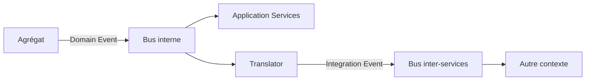

[🔝 Retour en haut de page](#table-des-matières)

## Anti-Corruption Layer

> **Que veut dire « Anti-Corruption Layer » ?** Traduit par « couche anti-corruption ». C'est un traducteur placé entre votre système et un système voisin (un vieux logiciel, un service externe), pour empêcher le vocabulaire et les défauts de l'autre de contaminer votre modèle propre. Comme un interprète diplomatique : il traduit dans les deux sens et filtre les maladresses, pour que chaque partie garde sa langue et ses usages intacts.

Une *Anti-Corruption Layer* (ACL) est une couche de traduction placée entre deux Bounded Contexts pour empêcher les concepts de l'un de polluer l'autre. Elle convertit les modèles dans les deux sens et absorbe les dialectes étrangers.

### Pourquoi

Quand un système doit s'intégrer à un *legacy* (un ancien logiciel encore en service), à un service loué en ligne ou à un contexte voisin doté d'un modèle différent, importer ses concepts tels quels contamine le modèle local. Une ACL préserve l'intégrité du modèle, au prix d'une traduction explicite.

> **Que veut dire « legacy » et « mapping » ?** Un système *legacy* (« hérité ») est un vieux logiciel toujours utilisé, souvent difficile à modifier, dont on a hérité du passé. Le *mapping* (correspondance) est la mise en relation, champ par champ, entre deux représentations : on dit que tel champ de l'un correspond à tel champ de l'autre, comme un dictionnaire de traduction.

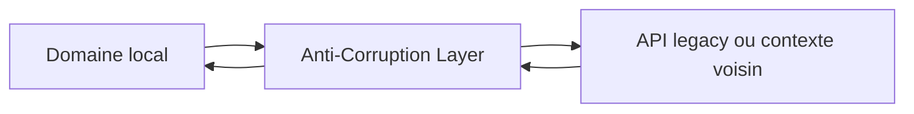

L'ACL se compose généralement d'adaptateurs (côté infrastructure) et de traducteurs (qui convertissent les DTOs en objets de domaine).

> **Que veut dire « adaptateur » et « DTO » ?** Un *adaptateur* est un morceau de code qui fait dialoguer deux choses incompatibles, comme un adaptateur de prise électrique entre deux pays. Un *DTO* (*Data Transfer Object*, objet de transfert de données) est un simple paquet de données sans comportement, servant à transporter de l'information d'un endroit à un autre (par exemple, la réponse brute d'une API avant qu'on la traduise en objet métier).

[🔝 Retour en haut de page](#table-des-matières)

## Specification Pattern

> **Que veut dire « Specification Pattern » et « booléen » ?** *Specification* signifie « spécification », ici au sens de critère. Ce pattern emballe une règle qui répond par oui ou par non dans un petit objet réutilisable. Un *booléen* est une valeur qui ne peut être que vraie ou fausse (du nom du mathématicien George Boole). Image : un tampon de contrôle qualité qui répond « conforme » ou « non conforme », et qu'on peut combiner avec d'autres tampons.

Le *Specification Pattern* ([Eric Evans & Martin Fowler, 2002](https://www.martinfowler.com/apsupp/spec.pdf)) emballe une règle métier booléenne dans un objet réutilisable, qu'on peut combiner avec des opérateurs logiques (`et`, `ou`, `non`).

### Exemple

```php
interface Specification {
    public function isSatisfiedBy(object $candidat): bool;
}

final class CommandeAuDessusDe implements Specification {
    public function __construct(private Money $seuil) {}
    public function isSatisfiedBy(object $c): bool {
        return $c instanceof Commande && $c->total()->ge($this->seuil);
    }
}

final class ClientPremium implements Specification {
    public function isSatisfiedBy(object $c): bool {
        return $c instanceof Commande && $c->client()->estPremium();
    }
}

// Composition
$eligibleLivraisonGratuite =
    (new CommandeAuDessusDe(new Money(5000, Devise::EUR)))
    ->ou(new ClientPremium());
```

### Bénéfices

- règle métier nommée, testable isolément ;
- réutilisable à la fois pour la validation *et* pour le filtrage dans un Repository ;
- combinable sans toucher au code existant (respect du principe OCP).

> **Que veut dire « OCP » ?** OCP est l'acronyme de *Open/Closed Principle*, le « principe ouvert/fermé » : un des cinq principes SOLID. Il dit qu'un module doit être *ouvert à l'extension* (on peut ajouter du comportement) mais *fermé à la modification* (sans réécrire l'existant). Comme une multiprise : on branche un nouvel appareil sans recâbler le mur. Le Specification Pattern l'illustre, car on crée de nouvelles règles en les combinant, sans modifier les anciennes.

> **Que veut dire « SOLID » ?** SOLID est un moyen mnémotechnique regroupant cinq principes de conception orientée objet popularisés par Robert C. Martin : *Single Responsibility* (responsabilité unique : une classe ne fait qu'une chose), *Open/Closed* (ouvert/fermé, voir ci-dessus), *Liskov Substitution* (un sous-type doit pouvoir remplacer son type parent sans surprise), *Interface Segregation* (des interfaces petites et ciblées plutôt qu'une grosse fourre-tout), *Dependency Inversion* (dépendre d'abstractions, pas de détails concrets). Ce sont cinq règles d'hygiène pour un code souple et durable.

> **Que veut dire « inversion de dépendance » ?** C'est le D de SOLID. Normalement, le code métier appellerait directement le code technique (la base de données), donc en dépendrait. On *inverse* cette dépendance : le métier définit une interface (un contrat, par exemple `CommandeRepository`), et c'est le code technique qui s'y plie. Résultat : le métier ne dépend plus de la technique, c'est l'inverse. Comme un patron qui décrit le poste (l'interface) et laisse l'employé (l'implémentation) s'y conformer, sans connaître son nom à l'avance.

Le schéma ci-dessous montre ce renversement : la flèche « dépend de » pointe du code technique vers l'interface du domaine, jamais l'inverse.

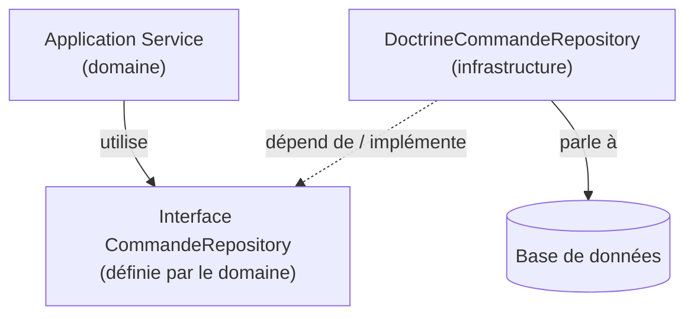

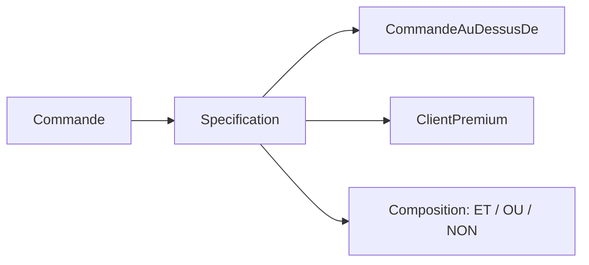

[🔝 Retour en haut de page](#table-des-matières)

## DDD fonctionnel : modéliser sans objets

> **Que veut dire « programmation fonctionnelle » ?** C'est un style de programmation qui construit le logiciel à partir de *fonctions* (des transformations qui prennent une entrée et rendent une sortie) plutôt qu'à partir d'objets qui changent d'état. On y privilégie les données immuables et les fonctions pures (sans effet de bord). C'est l'esprit d'une recette de cuisine : à partir des mêmes ingrédients, on obtient toujours le même plat, sans modifier le garde-manger. F#, OCaml, Haskell, Elixir, Scala et Clojure sont des langages de ce style.

> **Le DDD ne dépend pas d'un style de programmation.** Le DDD est un ensemble de **principes de modélisation**, pas un style de code. Ses concepts (langage ubiquitaire, bounded contexts, agrégats comme frontières de cohérence, événements de domaine) se transposent **naturellement en programmation fonctionnelle**. Scott Wlaschin formalise cette approche dans *Domain Modeling Made Functional* (Pragmatic Bookshelf, 2018).

### Pourquoi ça marche aussi bien (et parfois mieux)

- **Immutabilité native** : un objet-valeur est un *record* (enregistrement) immuable par défaut. Inutile d'imposer la discipline en relecture, le langage la garantit.
- **Types-sommes** (*sum types* ou *discriminated unions*, unions discriminées) : un `StatutCommande` qui peut valoir `Brouillon | Passée | Annulée(motif)` se déclare en une ligne, et le compilateur oblige à traiter chaque cas. En programmation orientée objet (OO), cela demande une hiérarchie de classes ou une énumération sans état.

> **Que veut dire « type-somme » et « compilateur » ?** Un *type-somme* est un type qui peut prendre l'une parmi plusieurs formes possibles, et une seule à la fois (un feu est rouge *ou* orange *ou* vert). Le *compilateur* est le programme qui traduit votre code en instructions exécutables ; chemin faisant, il vérifie sa cohérence et signale les erreurs avant l'exécution, comme un correcteur qui relit avant l'impression.

- **Validation par le type** : `Email`, `Iban`, `Money` sont des types *parsés* selon le principe *« parse, don't validate »* (« analyser, plutôt que valider », Alexis King) ; un `Email` non valide ne **peut pas** exister dans le programme. Aucune vérification défensive répétée n'est nécessaire.

> **Que veut dire « parser » (analyser) ?** *Parser*, c'est lire une donnée brute (un texte) et la transformer en une valeur structurée et garantie correcte, ou bien refuser. « Analyser plutôt que valider » signifie : au lieu de vérifier partout qu'un texte ressemble à un courriel, on le convertit une seule fois en un type `Email` ; ensuite, partout où ce type apparaît, on a la certitude qu'il est valide. Comme le contrôle à l'entrée d'une zone sécurisée : une fois passé, plus besoin de re-vérifier le badge à chaque porte.

- **Workflow comme fonction** : un cas d'usage est une fonction `(input) -> Result<output, error>` ; les Application Services deviennent des assemblages de fonctions, sans état caché.
- **Événements comme sortie** : un agrégat fonctionnel renvoie un couple `(nouvel état, événements)` au lieu de se modifier sur place. Plus simple à tester, à auditer et à stocker par événements.

### Exemple en F# (esquisse)

```fsharp
// Objets-valeurs : types parsés
type ClientId = ClientId of System.Guid
type Money = { Centimes: int; Devise: Devise }
type StatutCommande =
    | Brouillon
    | Passee
    | Annulee of motif: string

// Agrégat : record immuable
type Commande = {
    Id: CommandeId
    Client: ClientId
    Lignes: LigneCommande list
    Statut: StatutCommande
}

// Cas d'usage : fonction pure
type PasserCommande = Commande -> Result<Commande * CommandePasseeEvent, ErreurMetier>

let passer (cmd: Commande) : Result<Commande * CommandePasseeEvent, ErreurMetier> =
    match cmd.Statut, cmd.Lignes with
    | Brouillon, [] -> Error CommandeVide
    | Brouillon, _  -> Ok ({ cmd with Statut = Passee }, CommandePasseeEvent cmd.Id)
    | _ -> Error CommandeDejaPassee
```

### Tableau de correspondance OO et fonctionnel

| Concept DDD | OO classique | Fonctionnel |
|-------------|--------------|-------------|
| Entité | Classe avec identité, attributs modifiables | *Record* immuable, transformé par `evolve : State -> Cmd -> State * Event list` |
| Objet-valeur | Classe finale immuable | *Record* ou alias de type avec constructeur intelligent (*smart constructor*) |
| Agrégat | Classe racine + entités internes encapsulées | Fonction `decide : State -> Cmd -> Result<Event list, Error>` |
| Domain Service | Classe sans état | Fonction de plusieurs paramètres |
| Repository | Interface définie par le domaine | *Type abstrait* `Save : State -> Async<Unit>` |
| Application Service | Classe orchestratrice | Composition de fonctions ; effets isolés en bordure |
| Event Sourcing | Liste mutable d'événements appliqués | `fold (apply: State -> Event -> State) initial events` |

### Quand ça vaut le détour

- équipe à l'aise avec un langage fonctionnel ou prête à investir pour l'apprendre ;
- domaine **riche en états et en transitions** (workflows, machines à états, calculs financiers) ;
- exigence forte de **vérification par le compilateur** (sécurité, finance, santé) ;
- intérêt pour l'**Event Sourcing** : le mariage du fonctionnel et de l'ES est particulièrement naturel.

> **Que veut dire « machine à états » ?** Une *machine à états* est un objet qui ne peut se trouver que dans un nombre fini d'états et passe de l'un à l'autre selon des règles précises. Un feu tricolore en est l'exemple parfait : rouge, orange, vert, avec des transitions autorisées seulement dans un certain ordre. Beaucoup de processus métier (une commande qui passe de brouillon à passée puis expédiée) sont des machines à états.

> **Note.** Ne pas confondre *langage fonctionnel* et *style fonctionnel dans un langage objet*. Kotlin, TypeScript et Python permettent largement le style « enregistrement immuable, type-somme, fonction pure » ; Java aussi (depuis sa version 21, avec les *records* et les *sealed types*). Les principes du DDD fonctionnel s'appliquent dès qu'on dispose de ces briques, quel que soit le langage choisi.

[🔝 Retour en haut de page](#table-des-matières)

## Exemple intégré : e-commerce multi-contextes

Voici une mise en situation complète d'un commerce en ligne, simplifiée mais cohérente. Trois Bounded Contexts collaborent par événements : **Catalogue**, **Commande**, **Facturation**.

### Vue d'ensemble

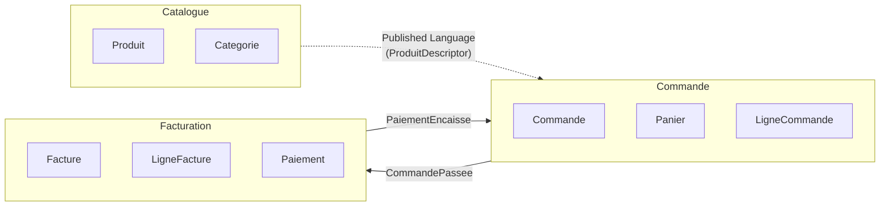

### Bounded Context *Commande*

#### Objet-valeur

```php
namespace App\Commande\Domain;

final class Money {
    public function __construct(
        public readonly int $centimes,
        public readonly Devise $devise,
    ) {
        if ($centimes < 0) { throw new DomainException('Montant négatif interdit'); }
    }
    public function plus(Money $autre): Money {
        $this->memeDevise($autre);
        return new Money($this->centimes + $autre->centimes, $this->devise);
    }
    public function fois(int $quantite): Money {
        return new Money($this->centimes * $quantite, $this->devise);
    }
    private function memeDevise(Money $autre): void {
        if ($autre->devise !== $this->devise) {
            throw new DomainException('Devises différentes');
        }
    }
}
```

#### Entité interne à l'agrégat

```php
final class LigneCommande {
    public function __construct(
        public readonly ProduitId $produit,
        public readonly int $quantite,
        public readonly Money $prixUnitaire,
    ) {
        if ($quantite <= 0) { throw new DomainException('Quantité invalide'); }
    }
    public function sousTotal(): Money {
        return $this->prixUnitaire->fois($this->quantite);
    }
}
```

#### Racine d'agrégat

```php
final class Commande {
    /** @var list<LigneCommande> */
    private array $lignes = [];
    private StatutCommande $statut;
    /** @var list<object> */
    private array $eventsEnAttente = [];

    private function __construct(
        public readonly CommandeId $id,
        public readonly ClientId $client,
    ) {
        $this->statut = StatutCommande::Brouillon;
    }

    public static function nouvelle(ClientId $client): self {
        return new self(CommandeId::generer(), $client);
    }

    public function ajouter(ProduitId $produit, int $quantite, Money $prix): void {
        if ($this->statut !== StatutCommande::Brouillon) {
            throw new DomainException('Commande déjà passée');
        }
        $this->lignes[] = new LigneCommande($produit, $quantite, $prix);
    }

    public function passer(): void {
        if ($this->lignes === []) {
            throw new DomainException('Commande vide');
        }
        $this->statut = StatutCommande::Passee;
        $this->eventsEnAttente[] = new CommandePassee($this->id, $this->client, $this->total());
    }

    public function total(): Money {
        return array_reduce(
            $this->lignes,
            fn (Money $acc, LigneCommande $l) => $acc->plus($l->sousTotal()),
            new Money(0, Devise::EUR),
        );
    }

    /** @return list<object> */
    public function purgerEvents(): array {
        $e = $this->eventsEnAttente; $this->eventsEnAttente = []; return $e;
    }
}
```

#### Repository

```php
interface CommandeRepository {
    public function find(CommandeId $id): ?Commande;
    public function add(Commande $commande): void;
}
```

#### Application Service

```php
final class PasserCommande {
    public function __construct(
        private CommandeRepository $commandes,
        private CatalogueProduits $catalogue,   // ACL vers Catalogue
        private EventDispatcher $events,
        private UnitOfWork $uow,
    ) {}

    public function __invoke(PasserCommandeInput $in): CommandeId {
        return $this->uow->run(function () use ($in) {
            $commande = Commande::nouvelle($in->client);
            foreach ($in->lignes as $l) {
                $produit = $this->catalogue->descripteur($l->produitId)
                    ?? throw new ProduitInconnu($l->produitId);
                $commande->ajouter($produit->id, $l->quantite, $produit->prix);
            }
            $commande->passer();
            $this->commandes->add($commande);
            foreach ($commande->purgerEvents() as $e) {
                $this->events->dispatch($e);
            }
            return $commande->id;
        });
    }
}
```

#### Domain Service (ici sortie : ACL Catalogue)

`CatalogueProduits` est une interface du domaine *Commande* qui décrit ce dont la commande a besoin du Catalogue (un descripteur de produit immuable). L'implémentation côté infrastructure traduit la réponse HTTP du Catalogue en `ProduitDescripteur` du contexte Commande : c'est l'**Anti-Corruption Layer**.

> **Que veut dire « HTTP » ?** HTTP (*HyperText Transfer Protocol*, protocole de transfert hypertexte) est la langue commune que parlent les navigateurs et les serveurs sur le web. Quand un service en appelle un autre par le réseau, il envoie le plus souvent une requête HTTP et reçoit une réponse HTTP, comme un échange standardisé de courriers entre deux administrations.

```php
namespace App\Commande\Domain;

interface CatalogueProduits {
    public function descripteur(ProduitId $id): ?ProduitDescripteur;
}

final class ProduitDescripteur {
    public function __construct(
        public readonly ProduitId $id,
        public readonly string $libelle,
        public readonly Money $prix,
    ) {}
}
```

```php
namespace App\Commande\Infrastructure\Catalogue;

final class HttpCatalogueProduits implements CatalogueProduits {
    public function __construct(private HttpClient $http) {}

    public function descripteur(ProduitId $id): ?ProduitDescripteur {
        $payload = $this->http->get("/api/products/{$id}");
        if ($payload === null) { return null; }
        // Traduction explicite : on n'accepte aucun champ inconnu en aval
        return new ProduitDescripteur(
            id: new ProduitId($payload['sku']),
            libelle: $payload['name'],
            prix: new Money((int) ($payload['price_cents']), Devise::from($payload['currency'])),
        );
    }
}
```

### Communication inter-contextes

Quand `Commande::passer()` est appelé, l'agrégat émet un Domain Event `CommandePassee`. Après la transaction, un *publisher* dédié (un composant chargé de publier) traduit cet événement en Integration Event `commerce.commande.passee.v1`, publié sur le bus, que **Facturation** consomme pour créer une `Facture`.

```mermaid
sequenceDiagram
    participant U as UI
    participant AS as PasserCommande
    participant Cmd as Commande
    participant Bus as Event Bus
    participant Fact as Facturation

    U->>AS: passerCommande(...)
    AS->>Cmd: nouvelle / ajouter / passer
    Cmd-->>AS: CommandePassee (domain)
    AS->>Bus: commerce.commande.passee.v1 (integration)
    Bus->>Fact: consume
    Fact-->>Bus: commerce.facture.emise.v1
```

[🔝 Retour en haut de page](#table-des-matières)

## Pièges classiques

Voici les erreurs les plus fréquentes en projet DDD, rencontrées maintes fois.

### Modèle anémique (*Anemic Domain Model*)

Symptôme : des entités réduites à des sacs de *getters* et *setters*, toute la logique vivant dans des « services ». L'objet métier ne *fait* rien. Conséquence : les invariants sont éparpillés, dupliqués, oubliés. Remède : pousser le comportement dans les agrégats, jusqu'à ne plus exposer de setters.

### Obsession des primitifs (*Primitive Obsession*)

Tout est `string` (chaîne de texte), `int` (nombre entier) ou `array` (tableau). Aucun type métier, aucune validation au plus tôt. Remède : créer des objets-valeurs (`ClientId`, `Email`, `Money`, `Numero`) et les imposer dans les signatures de fonctions.

> **Que veut dire « signature » d'une fonction ?** La *signature* est la carte d'identité d'une fonction : son nom, les types de ses paramètres d'entrée et le type de ce qu'elle renvoie. Imposer un type `Email` plutôt qu'une `string` dans la signature, c'est rendre impossible de lui passer n'importe quel texte par erreur.

### Agrégats poreux (*Leaky Aggregates*)

L'agrégat expose ses entités internes, qui se font alors modifier de l'extérieur. Les invariants ne sont plus garantis. Remède : renvoyer des vues en lecture seule (collections immuables), placer les méthodes métier sur la racine, ne pas donner d'accès direct aux éléments internes.

### Repositories qui retournent des DTOs

Un Repository qui ne renvoie pas un agrégat mais un objet plat est un *Query* déguisé. Cela mélange écriture et lecture, mine l'utilité du modèle riche. Remède : Repository pour les agrégats (côté write), *Query Service* pour les vues (côté read).

### Application Services qui font de la métier

Symptôme : l'orchestration calcule, décide, applique des règles. Le domaine est vidé de son sens. Remède : déplacer la logique dans les agrégats ou dans un Domain Service ; l'Application Service redevient un orchestrateur fin.

### Un Bounded Context = un microservice (forcément)

Faux. Un microservice est un choix de déploiement ; un Bounded Context est un choix de modélisation. On peut avoir plusieurs contextes dans un même service au début, et les extraire seulement quand le besoin émerge.

### Modèle universel partagé entre contextes

Vouloir une classe `Client` qui sert tout le système. Cela aboutit à un objet ingérable que personne ne contrôle. Remède : un `Client` par contexte, traduits aux frontières.

### CQRS / Event Sourcing par défaut

Adoptés pour leur réputation, sans besoin métier ni équipe formée. Coût d'exploitation élevé pour un bénéfice nul. Remède : commencer simple, n'introduire CQRS qu'en cas de divergence avérée entre écriture et lecture, n'introduire l'Event Sourcing que si l'historique a une valeur métier (audit, traçabilité réglementaire).

[🔝 Retour en haut de page](#table-des-matières)

## Le côté obscur : DDD comme jeu de vocabulaire

> **Avertissement.** Le risque le plus subtil avec le DDD n'est pas l'erreur technique : c'est le **mimétisme superficiel** où l'on renomme tout en *« domain »* sans rien changer à la pensée. Cette dérive est fréquente après une formation rapide ou la lecture distraite d'un livre.

### Les symptômes du DDD-théâtre

- `OrderService` est rebaptisé `OrderApplicationService`, mais le code reste un *transaction script* anémique. Aucun gain.

> **Que veut dire « transaction script » ?** C'est un style où chaque cas d'usage est une suite d'instructions linéaires (« fais ceci, puis cela ») écrite d'un bloc, sans véritable modèle métier. Comme une longue recette à plat, sans ingrédients réutilisables. C'est efficace pour le simple, mais cela vide les objets de leur logique : renommer un tel script en « Application Service » ne le transforme pas en DDD.
- Tout dossier porte un suffixe `Domain`, `Infrastructure`, `Application`, mais les classes circulent allègrement entre eux. La séparation est cosmétique.
- Le glossaire métier compte 200 termes, copiés depuis Wikipédia. Aucun expert métier ne le relit, aucun nouveau terme n'y entre.
- Les entités sont décorées en `@Entity` ORM avec des getters/setters publics, doublées d'un `Service` qui contient toute la logique. **Modèle anémique sous vernis DDD**.
- Les *Domain Events* sont en réalité des hooks ORM (`@PostPersist`) qui exposent l'état brut, sans intention métier.
- L'équipe parle de *« nos agrégats »* mais aucun n'est défendu (pas d'invariant testé, pas de méthode métier, pas d'encapsulation).

### Les questions diagnostiques

Pour mesurer si le DDD est *réel* ou *théâtral* dans une base de code, poser :

1. *« Combien de méthodes métier sur les agrégats ? Combien de getters et setters publics ? »* Si le second nombre domine, c'est anémique.
2. *« Le métier reconnaît-il les noms du code ? »* Si non, le langage ubiquitaire n'est qu'un slogan.
3. *« Qui a écrit le glossaire et quand a-t-il été modifié pour la dernière fois ? »* Si la réponse est *« un développeur, il y a six mois »*, le glossaire est mort.
4. *« Quelle règle métier non triviale est testée au niveau de l'agrégat ? »* Si la réponse est *« aucune »*, le modèle est décoratif.
5. *« Que se passe-t-il quand on essaie de mettre l'agrégat dans un état invalide ? »* Si le code l'autorise, ce n'est pas un agrégat.

### Le culte du cargo de l'arborescence

> **Que veut dire « culte du cargo » (*cargo-cult*) ?** L'expression vient d'îles du Pacifique où, après le départ des armées, des habitants reproduisaient les gestes des soldats (faux aérodromes, faux casques) en espérant voir revenir les avions chargés de marchandises (le « cargo »). En informatique, c'est imiter la *forme* d'une pratique sans en comprendre le *fond*, en croyant que les bénéfices viendront tout seuls. Copier l'arborescence de dossiers du DDD sans en appliquer les principes en est l'exemple parfait.

Une arborescence `Domain/`, `Application/`, `Infrastructure/` parfaite **ne dit rien** sur la qualité du modèle. Inversement, du **bon DDD** peut vivre dans une arborescence plate si les principes (modèle riche, langage ubiquitaire, frontières d'agrégats) sont respectés. La structure des dossiers est un **indice secondaire**, pas un critère.

### Sortir du théâtre

- mesurer la **densité métier** par classe (nombre de méthodes qui décident, vs nombre qui exposent) ;
- imposer en relecture de code la question : *« quel invariant cette méthode défend-elle ? »* Si la réponse est *« aucun »*, ce n'est pas une méthode d'agrégat ;
- réviser le **glossaire** avec un expert métier toutes les N semaines, supprimer les termes morts ;
- proscrire les **getters publics** sur les entités sauf justification explicite (sortie pour la persistance, lecture côté query) ;
- relier chaque classe aux **invariants** qu'elle protège, en commentaire ou ADR. Si on ne sait pas, c'est probablement à supprimer ou refondre.

> **Bilan.** Renommer ne suffit pas. Le DDD est un **changement de point de vue** (le métier au centre), pas une convention de nommage. Une équipe qui a *vraiment* adopté le DDD parle un langage commun avec son métier, défend ses invariants et discute ses frontières ; elle ne se contente pas de soigner les suffixes de ses classes.

[🔝 Retour en haut de page](#table-des-matières)

## DDD et architectures voisines

Le DDD n'impose **pas** d'architecture technique. Il en suggère une famille (celles qui isolent le domaine) et se marie bien avec plusieurs courants.

> **Que veut dire « architecture » d'un logiciel ?** L'*architecture* d'un logiciel est l'organisation de ses grandes parties et de leurs relations : qui dépend de qui, où vivent les règles, où vivent les détails techniques. C'est le plan d'ensemble du bâtiment, par opposition au choix des matériaux de chaque pièce.

### Architecture hexagonale (Ports & Adapters)

> **Que veut dire « architecture hexagonale » et « port / adaptateur » ?** Proposée par Alistair Cockburn (2005), elle place le domaine au centre, comme le noyau d'un fruit. Tout ce qui est extérieur (écrans, base de données, messagerie) communique avec lui uniquement à travers des *ports* (des prises standardisées, c'est-à-dire des interfaces définies par le domaine) branchés par des *adaptateurs* (le câble qui relie le monde extérieur à la prise). Ainsi le cœur ne dépend jamais des détails techniques. Le terme « hexagonal » vient du dessin habituel, un hexagone, mais le nombre de côtés n'a aucune importance.

Le domaine est au centre ; tout ce qui est externe (interface utilisateur, base de données, bus de messages) passe par des *ports* (interfaces définies par le domaine) mis en œuvre par des *adaptateurs* (côté infrastructure). Le DDD définit *quoi* mettre dans le domaine ; l'hexagonal définit *comment* l'isoler. La combinaison est naturelle. Voir le [dépôt dédié à la Clean Architecture et à l'hexagonale](https://github.com/Tan-Software/clean-architecture-hexagonale).

```mermaid
graph LR
    subgraph Hexagone
      D[Domaine + Application Services]
    end
    UI --> P1[Port entrant] --> D
    D --> P2[Port sortant : Repository] --> DB[(BDD)]
    D --> P3[Port sortant : Bus] --> MQ[(Broker)]
```

### Microservices

> **Que veut dire « microservice » ?** Un *microservice* est un petit programme autonome, déployable seul, qui ne gère qu'une responsabilité du système et dialogue avec les autres par le réseau. À l'opposé du *monolithe*, un seul gros programme qui fait tout. Comparez une équipe de spécialistes indépendants (microservices) à un employé polyvalent qui s'occupe de tout (monolithe).

Un microservice bien conçu respecte généralement la frontière d'un Bounded Context. Le DDD répond à la question *« quels services dois-je créer ? »* mieux que n'importe quelle règle purement technique. Inversement, **tout Bounded Context n'a pas vocation à devenir un service** : commencer en monolithe modulaire est souvent prudent.

### Architectures pilotées par les événements (*event-driven*)

Les Domain Events fournissent une fondation toute prête aux architectures pilotées par les événements (où les composants réagissent à des événements plutôt que de s'appeler directement). CQRS, Event Sourcing et Sagas s'y greffent. Attention : un système événementiel mal conçu n'est qu'une *Big Ball of Mud* asynchrone. Le découpage stratégique reste prioritaire.

### Clean Architecture, Onion Architecture

Mêmes intentions que l'hexagonale : isoler le domaine. Le DDD vit aussi bien dans une Onion Architecture (architecture en oignon, Jeffrey Palermo) que dans la Clean Architecture (architecture propre, Robert C. Martin). Le DDD apporte la matière du domaine ; ces architectures apportent l'organisation des dépendances.

> **Que veut dire « Clean / Onion Architecture » ?** Ce sont deux variantes de la même idée que l'hexagonale : ranger le code en couches concentriques, le domaine au centre, les détails techniques à l'extérieur, avec une règle stricte : les dépendances pointent toujours de l'extérieur vers l'intérieur, jamais l'inverse. L'« oignon » évoque ses pelures successives autour du cœur. Le métier ignore tout du monde technique qui l'entoure.

```mermaid
graph TD
    Infra["Infrastructure<br/>(base de données, réseau, frameworks)"] --> App["Application<br/>(cas d'usage, orchestration)"]
    App --> Dom["Domaine<br/>(entités, objets-valeurs, règles métier)"]
```

Lecture du schéma : chaque couche extérieure dépend de la couche plus interne, jamais l'inverse. Le domaine, au centre, ne dépend de rien.

### Ce que le DDD n'est pas

- une méthode de gestion de projet ;
- une suite de patterns à appliquer mécaniquement ;
- une architecture technique ;
- une garantie de succès si le langage ubiquitaire est superficiel.

[🔝 Retour en haut de page](#table-des-matières)

## Monolithe modulaire vs microservices

> **Que veut dire « monolithe modulaire » ?** C'est une application **déployée d'un seul tenant** (un seul programme à lancer) mais découpée à l'intérieur en **modules étanches**, chacun aligné sur un Bounded Context, qui ne se parlent qu'à travers des contrats explicites (interfaces publiques, événements internes), jamais en fouillant dans les entrailles des autres. Image : une grande maison (un seul bâtiment, le monolithe) bien cloisonnée en appartements indépendants (les modules), avec des portes contrôlées entre eux. Concept popularisé par Simon Brown (*Modular Monoliths*) et appliqué à grande échelle par DHH, Shopify, Stack Overflow.

### Le DDD n'impose pas les microservices

Le livre d'Eric Evans (2003) **précède** la vague des microservices (vers 2014). Le DDD vit aussi bien, et souvent **mieux**, dans un monolithe modulaire. L'association culturelle *« DDD donc microservices »* est récente et trompeuse.

### Comparatif honnête

> **Que veut dire « mise à l'échelle verticale / horizontale », « repo », « build » ?** *Mettre à l'échelle*, c'est augmenter la capacité d'un système pour encaisser plus de charge. À la *verticale* : prendre une machine plus puissante (un camion plus gros). À l'*horizontale* : ajouter plusieurs machines en parallèle (plusieurs camions). Un *repo* (dépôt de code) est l'endroit où vit tout le code source d'un projet. Un *build* est l'opération qui transforme ce code en programme exécutable.

| Dimension | Monolithe modulaire | Microservices |
|-----------|---------------------|---------------|
| Bounded Contexts | Un module = un contexte. Frontière logique. | Un service = un contexte. Frontière physique. |
| Cohérence inter-contextes | Possible en transaction locale (avec discipline). | Eventual consistency obligatoire. |
| Remaniement entre contextes | Aisé : déplacer une classe d'un module à l'autre via l'éditeur. | Coûteux : versions d'API, double déploiement. |
| Déploiement | Une unité, une livraison. | Indépendant par service ; chaînes de livraison plus complexes. |
| Mise à l'échelle | Verticale, ou horizontale en dupliquant l'instance entière. | Horizontale par service, au plus juste. |
| Observabilité | Journaux locaux, débogage pas à pas. | Traçage distribué obligatoire. |
| Coût d'entrée | Faible : un dépôt, un build. | Élevé : orchestration, bus de messages, outillage d'observabilité. |
| Coût d'évolution | Croît avec la taille du repo. | Croît avec le nombre de services et leurs contrats. |

### Quand chaque choix se justifie

**Monolithe modulaire** :

- équipe < 30 développeurs ;
- besoin de cohérence forte fréquente entre contextes ;
- pas de pression de scalabilité hétérogène ;
- DDD encore en cours d'apprentissage (commencer logique avant physique).

**Microservices** :

- équipes nombreuses qui doivent livrer en **parallèle** sans se coordonner sans cesse ;
- contextes aux **profils de charge** très différents (un service à 10 requêtes par seconde, un autre à 10 000) ;
- besoin d'**isolation** technique (langages, bases de données, équipes distincts) ;
- maturité d'exploitation confirmée (CI/CD, observabilité, *chaos engineering*).

> **Que veut dire « RPS », « CI/CD », « chaos engineering » ?** *RPS* (*Requests Per Second*) est le nombre de requêtes traitées par seconde : une mesure de charge. *CI/CD* (*Continuous Integration / Continuous Delivery*, intégration et livraison continues) désigne l'automatisation qui teste et met en production le code à chaque modification, comme une chaîne d'usine qui valide chaque pièce. Le *chaos engineering* (ingénierie du chaos) consiste à provoquer volontairement des pannes en production pour vérifier que le système y résiste, comme un exercice incendie pour les serveurs.

### Trajectoire prudente

Une équipe qui adopte le DDD aujourd'hui gagne presque toujours à :

1. **commencer en monolithe modulaire** : un repo, un build, des modules clairement séparés ;
2. **respecter les Bounded Contexts dès le code** : pas d'import croisé, pas d'accès direct aux entités des autres modules ;
3. **publier des Domain Events / Integration Events en interne** comme si les modules étaient déjà distants ;
4. **n'extraire un microservice que sur signal explicite** : besoin d'autonomie de déploiement, profil de charge divergent, équipe dédiée justifiant la séparation.

> **Garde-fou.** Un monolithe modulaire bien fait se découpe en microservices *quand on en a besoin* ; un mauvais monolithe ne se découpe jamais proprement. À l'inverse, des microservices construits sans avoir d'abord pratiqué le découpage logique aboutissent au *distributed monolith* (monolithe distribué), le pire des deux mondes : le couplage d'un monolithe *et* la complexité des microservices. **L'ordre compte** : d'abord la modélisation stratégique, ensuite le choix de la distribution.

> **Que veut dire « monolithe distribué » ?** C'est un système éclaté en plusieurs services qui, en réalité, restent tellement dépendants les uns des autres qu'on ne peut en modifier ni en déployer aucun sans toucher aux autres. On a payé le prix des microservices (réseau, complexité) sans en récolter le bénéfice (l'indépendance). C'est l'écueil à éviter absolument.

```mermaid
graph LR
    A[Modélisation<br/>stratégique<br/>Bounded Contexts] --> B[Monolithe<br/>modulaire]
    B --> C{Signal<br/>d'extraction ?}
    C -- non --> B
    C -- oui --> D[Microservices<br/>par contexte]
```

[🔝 Retour en haut de page](#table-des-matières)

## Pour aller plus loin

- *Domain-Driven Design: Tackling Complexity in the Heart of Software*, Eric Evans (le « livre rouge », 2003)
- *Implementing Domain-Driven Design*, Vaughn Vernon (le « livre jaune », 2013)
- *Domain-Driven Design Distilled*, Vaughn Vernon (2016) : synthèse courte et accessible
- *Domain Modeling Made Functional*, Scott Wlaschin (2018) : DDD en F#, *parse don't validate*, types-sommes
- *Patterns, Principles, and Practices of Domain-Driven Design*, Scott Millett et Nick Tune (2015)
- *Learning Domain-Driven Design*, Vlad Khononov (O'Reilly, 2021) : moderne, pragmatique
- *Microservices Patterns*, Chris Richardson (Manning, 2018) : *Saga*, *Outbox*, *CDC*
- *CQRS Documents by Greg Young* : synthèse historique de CQRS et Event Sourcing
- *Building Event-Driven Microservices*, Adam Bellemare (O'Reilly, 2020)
- *Designing Data-Intensive Applications*, Martin Kleppmann (O'Reilly, 2017) : fondations événementielles, cohérence, réplication
- [DDD Reference (PDF)](https://www.domainlanguage.com/wp-content/uploads/2016/05/DDD_Reference_2015-03.pdf) : synthèse officielle d'Eric Evans
- [DDD Crew](https://github.com/ddd-crew) : outils, *Bounded Context Canvas* (Nick Tune), *Aggregate Design Canvas*, *Core Domain Chart*
- [Bounded Context Canvas (template)](https://github.com/ddd-crew/bounded-context-canvas) : Nick Tune
- [EventStorming](https://www.eventstorming.com/) : méthode collaborative d'Alberto Brandolini
- [Modular Monolith Primer](https://martinfowler.com/articles/2024-evaluate-architecture.html) : Martin Fowler et al.
- [Microsoft, CQRS Journey](https://learn.microsoft.com/en-us/previous-versions/msp-n-p/jj554200(v=pandp.10)) : retour d'expérience approfondi sur CQRS et ES

## Licence

Distribué sous licence [MIT](LICENSE).

## Auteur

**Tansoftware - Tanguy Chénier** · [LinkedIn](https://www.linkedin.com/in/tanguy-chenier) · [Tan-Software](https://github.com/Tan-Software) · [Compte personnel (derniers outils)](https://github.com/tanguychenier) · [tansoftware.com](https://www.tansoftware.com)
