# [Tansoftware](https://www.tansoftware.com) - Domain Driven Design [](README.md)

[](LICENSE) [](#) [](#) [](https://www.markdownguide.org/)

## Table des matières

- [Introduction](#introduction)
- [Quand DDD ne vaut pas le coût](#quand-ddd-ne-vaut-pas-le-coût)
- [Glossaire express](#glossaire-express)
- [DDD stratégique vs DDD tactique](#ddd-stratégique-vs-ddd-tactique)
- [Sous-domaines : core, supporting, generic](#sous-domaines--core-supporting-generic)
- [Modélisation du domaine](#modélisation-du-domaine)
- [Langage ubiquitaire](#langage-ubiquitaire)
- [Bounded Contexts](#bounded-contexts)
- [Bounded Context Canvas](#bounded-context-canvas)
- [Context Map : les patterns de relation](#context-map--les-patterns-de-relation)
- [Entités, objets-valeurs et agrégats](#entités-objets-valeurs-et-agrégats)
- [Règles de conception des agrégats (Vernon)](#règles-de-conception-des-agrégats-vernon)
- [Frontières d'agrégats : un choix de conception, pas une vérité](#frontières-dagrégats--un-choix-de-conception-pas-une-vérité)
- [Factories et Modules](#factories-et-modules)
- [Repositories et Domain Services](#repositories-et-domain-services)
- [Application Services et CQRS](#application-services-et-cqrs)
- [CQRS et Event Sourcing : indépendants](#cqrs-et-event-sourcing--indépendants)
- [Événements de domaine et Event Sourcing](#événements-de-domaine-et-event-sourcing)
- [Outbox Pattern : publication fiable des événements](#outbox-pattern--publication-fiable-des-événements)
- [Sagas et Process Managers](#sagas-et-process-managers)
- [Cohérence à terme : compensations et garanties](#cohérence-à-terme--compensations-et-garanties)
- [Domain Events vs Integration Events](#domain-events-vs-integration-events)
- [Anti-Corruption Layer](#anti-corruption-layer)
- [Specification Pattern](#specification-pattern)
- [DDD fonctionnel : modéliser sans objets](#ddd-fonctionnel--modéliser-sans-objets)
- [Exemple intégré : e-commerce multi-contextes](#exemple-intégré--e-commerce-multi-contextes)
- [Pièges classiques](#pièges-classiques)
- [Le côté obscur : DDD comme jeu de vocabulaire](#le-côté-obscur--ddd-comme-jeu-de-vocabulaire)
- [DDD et architectures voisines](#ddd-et-architectures-voisines)
- [Monolithe modulaire vs microservices](#monolithe-modulaire-vs-microservices)
- [Pour aller plus loin](#pour-aller-plus-loin)

---
- [Prochaine étape : Clean Architecture](https://github.com/Tan-Software/clean-architecture-hexagonale)

## Introduction

Le *Domain-Driven Design* (DDD), formalisé par Eric Evans dans [*Domain-Driven Design: Tackling Complexity in the Heart of Software*](https://www.amazon.fr/Domain-Driven-Design-Tackling-Complexity/dp/0321125215) (2003), propose de placer la **complexité métier** au centre de la conception logicielle. Plutôt que de partir d'une base de données ou d'un framework, on modélise les concepts, les règles et les processus du métier ; le code en découle.

Cette approche prend tout son intérêt dès qu'un projet dépasse le simple CRUD : règles métier nombreuses, plusieurs équipes, plusieurs sous-domaines. Elle apporte trois bénéfices principaux : un vocabulaire partagé entre métier et technique, une frontière claire entre sous-domaines, et un découplage du domaine vis-à-vis de l'infrastructure.

### Domaine, sous-domaines, *core domain*

- **Domaine** : le secteur d'activité que le logiciel sert (assurance, e-commerce, santé).
- **Sous-domaine** : une zone fonctionnelle du domaine. Trois natures :
  - *Core domain* — l'avantage compétitif, là où l'on doit investir.
  - *Supporting subdomain* — nécessaire mais non différenciant ; on peut le développer simplement.
  - *Generic subdomain* — résolu par n'importe quel acteur du marché (authentification, facturation standard) ; à acheter ou intégrer.
- **Espace problème vs espace solution** : les sous-domaines décrivent le *problème* à résoudre ; les bounded contexts décrivent la *solution* logicielle. Le mapping n'est pas forcément 1-1.

[🔝 Retour en haut de page](#table-des-matières)

## Quand DDD ne vaut pas le coût

> **Définition — critère de complexité d'Evans.** Eric Evans lui-même, dans la préface de la *DDD Reference* (2015), rappelle que *« DDD est destiné aux domaines complexes, pas à toute application »*. La discipline a un **coût d'entrée** non négligeable (langage ubiquitaire à entretenir, ateliers métier, modélisation tactique, isolation infrastructure) ; elle ne se rentabilise que là où la **complexité métier** dépasse la complexité technique.

### Cas où DDD est probablement surdimensionné

- **CRUD pur** : un back-office d'administration où chaque écran édite directement des champs d'une table. Aucun invariant non trivial, aucun vocabulaire métier subtil. Un *Active Record* ou un générateur d'admin (Filament, Django Admin, Backpack) coûtera dix fois moins.
- **MVP exploratoire / *throwaway* code** : tant que le métier n'a pas validé qu'il y a un produit, figer un modèle riche, c'est figer une mauvaise hypothèse. Préférer un prototypage rapide ; reconstruire en DDD une fois le marché validé.
- **Sous-domaine *generic*** : authentification, paie standard, envoi d'emails, gestion documentaire générique. Ces zones se résolvent par achat ou intégration (Auth0, Stripe, S3) ; investir un modèle riche dessus est un gaspillage.
- **Outils internes à courte durée de vie** : scripts ETL, dashboards éphémères, *one-shot* de migration. Le ROI d'une modélisation soignée n'est jamais atteint.
- **Équipe sans expert métier disponible** : sans expert métier accessible plusieurs heures par semaine, le langage ubiquitaire devient un vœu pieux. Mieux vaut un code honnêtement technique qu'un DDD-théâtre.

### Cas où DDD se justifie pleinement

- **Core domain** d'une activité où la règle métier *est* l'avantage compétitif (tarification d'assurance, scoring de risque, allocation logistique, calcul réglementaire).
- **Vocabulaire métier riche et évolutif** : les experts emploient des dizaines de termes précis, distinguent des nuances que le code doit refléter sans perte.
- **Multi-équipes** : plusieurs équipes travaillent simultanément sur des morceaux du système et doivent communiquer sans casser leurs modèles respectifs.
- **Long terme** : application appelée à vivre dix ans ou plus, avec rotation d'équipe — l'investissement dans un modèle explicite paie en dette technique évitée.

### Heuristique de décision

| Signal | Verdict |
|--------|---------|
| Le métier dit *« c'est juste un formulaire avec une liste »* | Pas DDD. CRUD assumé. |
| L'expert métier vous corrige sur 3 termes par réunion | DDD pertinent : langage ubiquitaire à formaliser. |
| Aucun invariant ne vaut plus qu'une validation de champ | Pas DDD tactique. Validation suffit. |
| Plusieurs règles s'entremêlent et changent ensemble | DDD tactique : agrégats, services domaine. |
| Une équipe, un service, un déploiement | Stratégique léger ; tactique au cas par cas. |
| Plusieurs équipes, contrats inter-services à stabiliser | Stratégique critique : contextes, ACL, OHS. |

> **Garde-fou.** L'erreur la plus commune n'est pas de *ne pas faire* de DDD : c'est d'en faire **partout uniformément**. Distinguer *core*, *supporting* et *generic* permet d'investir le bon niveau d'effort au bon endroit, et de **ne pas surconcevoir** ce qui n'a aucune valeur différenciante.

[🔝 Retour en haut de page](#table-des-matières)

## Glossaire express

Référentiel court des termes employés dans ce mémo. Chaque concept est détaillé plus bas.

| Terme | Définition |
|-------|------------|
| **Domaine** | Le secteur d'activité métier servi par le logiciel. |
| **Sous-domaine** | Une zone fonctionnelle du domaine (core, supporting, generic). |
| **Bounded Context** | Frontière explicite dans laquelle un modèle et un langage sont cohérents. |
| **Langage ubiquitaire** | Vocabulaire unique partagé par métier et technique au sein d'un contexte. |
| **Entité** | Objet défini par une **identité stable** dans le temps, indépendamment de ses attributs. |
| **Objet-valeur** (*Value Object*) | Objet **immuable** défini uniquement par ses attributs, sans identité propre. |
| **Agrégat** | Cluster d'entités et d'objets-valeurs traité comme une **unité de cohérence transactionnelle**. |
| **Racine d'agrégat** (*Aggregate Root*) | Entité unique servant de point d'entrée à l'agrégat, garante de ses invariants. |
| **Repository** | Abstraction de persistance offrant l'illusion d'une collection en mémoire d'agrégats. |
| **Factory** | Composant chargé de la **construction cohérente** d'un agrégat ou d'un objet-valeur complexe. |
| **Domain Service** | Logique métier sans foyer naturel dans une entité ou un objet-valeur ; vit dans la couche domaine. |
| **Application Service** | Orchestrateur de cas d'usage ; ouvre une transaction, appelle le domaine, persiste, publie. **Sans logique métier**. |
| **Module** | Regroupement nommé d'éléments du modèle, équivalent d'un *package* aligné sur le langage ubiquitaire. |
| **Context Map** | Cartographie explicite des relations entre Bounded Contexts. |
| **Anti-Corruption Layer** | Couche de traduction entre deux contextes, protégeant le modèle local. |
| **CQRS** | *Command Query Responsibility Segregation* : modèles distincts pour l'écriture et la lecture. |
| **Event Sourcing** | Persistance d'un agrégat sous forme de la **séquence d'événements** qui l'ont fait advenir. |
| **Eventual Consistency** | Cohérence asynchrone entre agrégats ou contextes ; toléré pour gagner en disponibilité. |
| **Saga / Process Manager** | Coordinateur d'un workflow métier long traversant plusieurs agrégats. |
| **Domain Event** | Fait métier passé, immuable, émis à l'intérieur d'un contexte. |
| **Integration Event** | Événement publié vers d'autres contextes ou services, sous contrat stable. |
| **Projection** | Logique qui consomme des événements pour construire un *read model*. |
| **Read Model** | Vue dénormalisée optimisée pour la lecture (côté queries). |
| **Write Model** | Modèle riche optimisé pour la cohérence et l'application des invariants (côté commands). |

[🔝 Retour en haut de page](#table-des-matières)

## DDD stratégique vs DDD tactique

Eric Evans organise le DDD en deux niveaux complémentaires. La plupart des échecs viennent d'équipes qui sautent directement au tactique sans poser le stratégique.

### DDD stratégique — découper et relier

Concerne la **structure macro** du système. Les questions stratégiques :

- Quels sont les sous-domaines ? Lesquels sont *core*, *supporting*, *generic* ?
- Où passent les Bounded Contexts ?
- Comment ces contextes communiquent-ils ?
- Quel langage ubiquitaire dans chacun ?

Outils stratégiques : **sous-domaines**, **Bounded Contexts**, **Context Map**, **langage ubiquitaire**, **distillation du *core domain***.

### DDD tactique — modéliser à l'intérieur d'un contexte

Concerne la **modélisation fine** dans un Bounded Context donné. Les patterns tactiques :

- **Entités**, **objets-valeurs**, **agrégats** ;
- **Repositories**, **Factories**, **Domain Services** ;
- **Application Services**, **Modules** ;
- **Domain Events**.

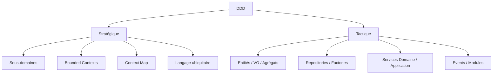

Règle pratique : **commencer toujours par le stratégique**. Un découpage en contextes mauvais ne se rattrape pas avec des patterns tactiques élégants.

[🔝 Retour en haut de page](#table-des-matières)

## Sous-domaines : core, supporting, generic

> **Définition — sous-domaine.** Un *sous-domaine* est une zone fonctionnelle du domaine identifiée à partir du métier. La typologie d'Eric Evans (reprise et systématisée par Vernon) distingue trois natures, qui dictent le **niveau d'investissement** technique attendu.

### Les trois natures, avec critères

| Type | Définition | Indices de reconnaissance | Stratégie d'investissement |
|------|------------|---------------------------|----------------------------|
| **Core domain** | Là où l'organisation se différencie de ses concurrents. C'est *la raison pour laquelle on construit le logiciel sur mesure*. | Le métier en parle longuement et avec des nuances ; les règles changent souvent ; un échec de modélisation a un impact stratégique direct. | Investir massivement : meilleurs développeurs, DDD tactique complet, tests intensifs, refactoring continu. |
| **Supporting subdomain** | Nécessaire au fonctionnement, propre au métier, mais sans avantage compétitif. | Spécifique à l'organisation mais peu d'innovation ; règles métier réelles mais stables. | Modéliser proprement, sans excès ; DDD tactique sélectif (au moins langage ubiquitaire et bounded contexts). |
| **Generic subdomain** | Problème déjà résolu par le marché, identique chez tous les acteurs. | Authentification, gestion de fichiers, facturation comptable standard, envoi d'emails. | **Acheter, intégrer, déléguer**. Si on doit le développer, le faire le plus simplement possible. |

### Critères de classification

Pour trancher la nature d'un sous-domaine, poser ces questions au métier :

1. *« Si un concurrent avait exactement la même chose, perdrions-nous un avantage ? »* — Si oui : **core**. Sinon : pas core.
2. *« Existe-t-il un produit du marché qui le résout sans personnalisation ? »* — Si oui : **generic**. Sinon : supporting ou core.
3. *« Combien de fois cette règle a-t-elle changé en deux ans ? »* — Beaucoup, et c'est sensible : **core**. Peu : supporting ou generic.
4. *« Qui sont les meilleurs experts internes ? »* — Si la connaissance est concentrée chez un ou deux experts internes : **core**.

### Anti-pattern : tout traiter comme core

Investir un effort *core domain* sur un sous-domaine *generic* (réécrire un système d'authentification, recoder un éditeur de PDF) est une dilapidation de ressources et un risque opérationnel. Symétriquement, traiter le *core* comme du *generic* (déléguer à un SaaS la règle qui *est* l'avantage compétitif) revient à offrir son business model à un fournisseur. La discipline DDD commence par cette **allocation d'effort différenciée**.

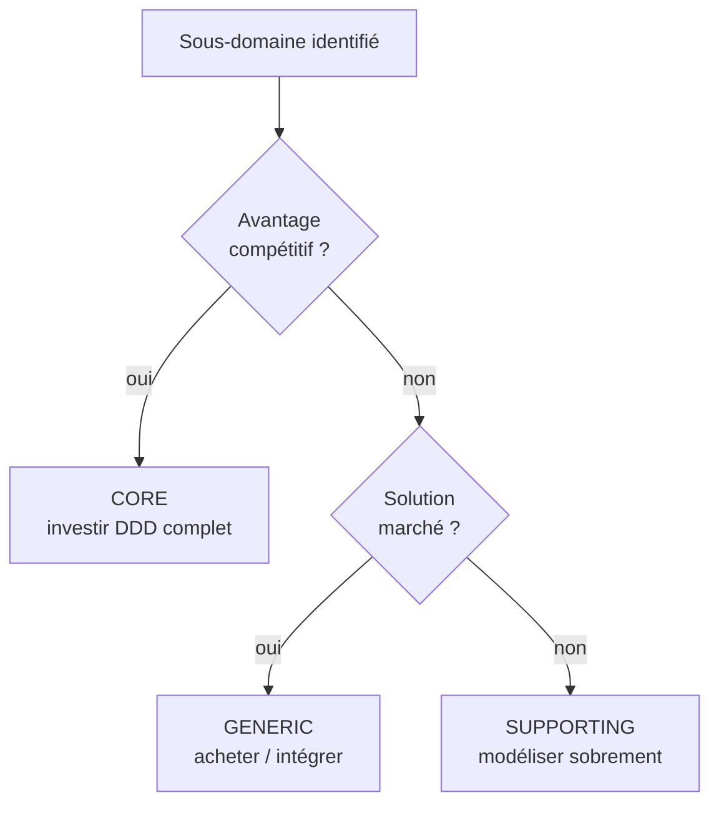

[🔝 Retour en haut de page](#table-des-matières)

## Modélisation du domaine

Modéliser un domaine, c'est extraire les concepts essentiels d'un métier et les organiser en un modèle compréhensible et exécutable. Le modèle n'est pas la réalité : c'est une simplification utile, négociée avec les experts métier.

> **Avertissement — modéliser n'est pas dessiner toutes les classes à l'avance.** La tentation classique consiste à dérouler une séquence en cascade : « j'écoute le métier, je dessine un diagramme UML avec tous les attributs, je choisis une notation, puis je code ». C'est du **Big Design Up Front**, et c'est l'anti-thèse du **TDD** comme du DDD moderne. Dans la pratique, le modèle **émerge** au fur et à mesure des tests d'acceptation et des conversations avec le métier ; le diagramme n'est qu'une trace fugace de la conversation, pas un livrable contractuel à graver.

### Une démarche itérative et test-driven

DDD et TDD se renforcent : le langage ubiquitaire alimente le nom des tests ; les tests font émerger les invariants du domaine. La démarche réelle ressemble à ceci, en boucle, sur chaque tranche fonctionnelle :

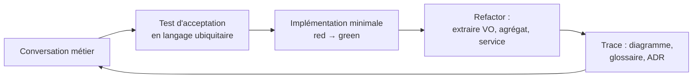

Chaque tour produit un **petit incrément** : un test qui passe, un VO ou une méthode d'agrégat qui apparaît, une note ajoutée au glossaire. **Aucun diagramme n'est posé "définitif" avant le code.** Le diagramme sert à se faire comprendre dans la salle, pas à dicter l'implémentation.

#### Étape 1 — Imprégnation du domaine

Avant le premier test, on s'imprègne. Les techniques utiles :

- entretiens individuels avec les experts métier ;
- lecture des spécifications, contrats, manuels existants ;
- observation directe des utilisateurs (*shadowing*) ;
- ateliers d'**Event Storming** (Alberto Brandolini, voir <https://www.eventstorming.com/>) pour cartographier collectivement les événements *passés au sens grammatical* (`Compte ouvert`, `Versement effectué`, `Découvert autorisé`).

Le rendu d'un Event Storming, ce sont des post-it oranges (événements) sur un mur, pas une UML. C'est volontaire : le format empêche la tentation de figer un schéma de données prématurément.

#### Étape 2 — Premier test d'acceptation

On choisit **un** scénario simple, formulé en langage ubiquitaire, et on l'écrit en test **avant** d'avoir tranché les types et attributs. Exemple :

```php
public function test_un_versement_credite_le_compte_destinataire(): void
{
    // Given
    $compte = Compte::ouvrir(Iban::de('FR76...'));
    // When
    $compte->verser(Money::eur(100));
    // Then
    $this->assertEquals(Money::eur(100), $compte->solde());
}
```

À ce stade, ni `Iban`, ni `Money`, ni `Compte::verser()` n'existent. C'est l'écriture du test qui force leur apparition. Aucune liste exhaustive d'attributs n'a été décidée.

#### Étape 3 — Implémentation minimale (red → green)

On code le strict nécessaire pour que le test passe : `Compte` avec une méthode `verser`, `Money` immuable, `Iban` value-object qui valide. Pas plus. Le test est vert.

#### Étape 4 — Refactor sous filet de tests

On extrait, on renomme, on regroupe. C'est ici que les **patterns tactiques DDD** apparaissent organiquement : « ces deux primitives forment un VO `IntervaleDeDates` », « `Compte` doit empêcher un solde négatif sans autorisation : c'est l'invariant racine de l'agrégat, on le défend dans la méthode `verser()` ».

#### Étape 5 — Trace écrite

À la fin du tour, on capture **uniquement ce qui est utile pour la conversation suivante** :

- une ligne ajoutée au **glossaire** du langage ubiquitaire (`Versement : transfert positif vers un compte. Voir aussi : Découvert autorisé`).
- éventuellement un diagramme rapide (Mermaid, post-it photographié) à valider avec le métier.
- un **ADR** (*Architecture Decision Record*) si une décision structurante vient d'être prise (« on choisit l'agrégat `Compte` plutôt que `Client` comme racine pour les versements »).

> **Pourquoi cet ordre est crucial.** Si l'on commençait par dessiner un diagramme de classes complet de `Client`/`Compte`/`Transaction` avec tous leurs attributs (`nom`, `prenom`, `dateNaissance`, `numero`, `solde`, `montant`, `date`...) on figerait une représentation **anémique** : des sacs de données, sans comportement, sans invariants. C'est l'origine du *modèle anémique* listé plus loin dans les pièges. Le modèle riche se construit *par* le test, pas avant.

### Quand utiliser un diagramme — et lequel

Un diagramme reste utile pour **communiquer**, jamais pour **prescrire**. Choisir l'outil selon l'audience :

| Besoin                                    | Outil approprié                       | Quand l'utiliser                                          |
| ----------------------------------------- | ------------------------------------- | --------------------------------------------------------- |
| Découvrir le domaine avec le métier       | Event Storming, post-it muraux        | Atelier de cadrage, premier contact                       |
| Visualiser un flux d'événements         | Mermaid `sequenceDiagram`             | Discussion sur une saga / process manager               |
| Tracer une décision structurante         | ADR (texte) + petit schéma Mermaid    | Choix de bounded context, choix d'agrégat racine        |
| Communiquer une *photo* du modèle actuel | Diagramme de classes UML (Mermaid)    | Onboarding, revue de code, *jamais* avant de coder       |
| Cartographier les Bounded Contexts       | **Context Map** (DDD Crew template)   | Conception stratégique, discussion entre équipes        |

Outils libres usuels : [PlantUML](https://plantuml.com/), [Mermaid](https://mermaid.js.org/), [draw.io](https://app.diagrams.net/), [Miro](https://miro.com/) pour l'Event Storming distant.

> **Note sur l'UML.** Présent dans le livre d'Evans (2003), il a été détrôné dans la pratique par des notations plus légères. Vaughn Vernon et Eric Evans lui-même recommandent aujourd'hui des diagrammes de séquence (pour les flux) plutôt que des diagrammes de classes (qui invitent au modèle anémique). Le diagramme de classes ci-dessous est volontairement minimal et placé **après** la conversation et les tests, pas avant.

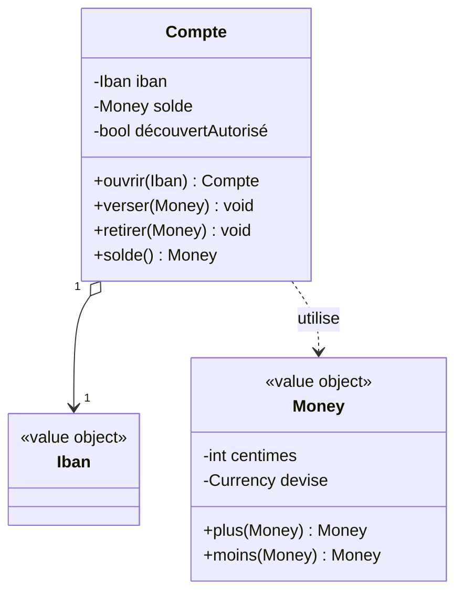

Notez : on expose des **comportements** (`verser`, `retirer`), pas des champs publics. C'est la différence entre un *modèle anémique* (sac de getters/setters) et un *modèle riche* (qui défend ses invariants).

### Itérer avec les experts métier

La conception émerge d'aller-retours soutenus avec le métier. Quelques règles non négociables :

- **Ateliers réguliers** plutôt que validations ponctuelles : préférer un atelier d'1 h par semaine à une revue de spec mensuelle.
- **Vocabulaire ubiquitaire** appliqué partout — diagrammes, tests, code. Si le métier dit *« contrat cadre »*, ni le code ni les tests ne doivent jamais utiliser un autre mot (cf. section *Langage ubiquitaire*).
- **Démos plutôt que diagrammes** : montrer un test vert ou une commande exécutable convainc plus vite qu'un schéma en grand format. Le diagramme reste un appui ponctuel.
- **Modéliser ce qui change ensemble** : la frontière d'un agrégat se trouve à la lecture des invariants, pas en dessinant des cardinalités.
- **Refuser le modèle figé** : tout modèle vit. Un modèle qui ne change plus au bout de six mois est probablement déjà mort, ou il décrit un sous-domaine *generic* qui ne valait pas qu'on y mette autant d'effort.

[🔝 Retour en haut de page](#table-des-matières)

## Langage ubiquitaire

Le *langage ubiquitaire* (Eric Evans, 2003) est un vocabulaire **unique** partagé par toute l'équipe — métier, développeurs, testeurs, support. Les mêmes mots désignent les mêmes concepts dans les conversations, les documents, les diagrammes et le code.

### Pourquoi

Une traduction silencieuse entre vocabulaire métier et vocabulaire technique est une source permanente de bugs. Si l'expert dit *« contrat cadre »*, le développeur écrit `MasterAgreement`, et le testeur valide *« accord principal »*, les trois croient parler de la même chose jusqu'au premier malentendu coûteux.

### Mise en pratique

- **Glossaire vivant** : un fichier (wiki, `GLOSSARY.md`) listant les termes et leurs définitions, mis à jour à chaque changement.
- **Discipline du code** : noms de classes, méthodes, événements et tables collés au vocabulaire métier.
- **Pas de jargon technique inutile** : éviter `UserDtoManagerImpl` quand le métier parle de `Adhérent`.
- **Cohérence au sein d'un Bounded Context** : un même mot peut signifier deux choses dans deux contextes ; le langage ubiquitaire est local à un contexte.

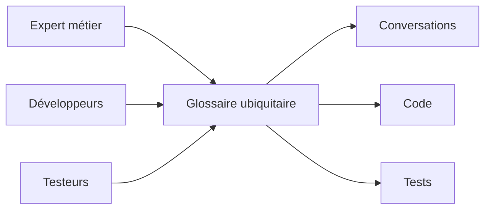

[🔝 Retour en haut de page](#table-des-matières)

## Bounded Contexts

Un *Bounded Context* (contexte délimité) est une **frontière explicite** à l'intérieur de laquelle un modèle et un langage sont cohérents. Au-delà de la frontière, les mêmes mots peuvent désigner des choses différentes : un `Client` du contexte *Vente* (prospect, panier) n'est pas le `Client` du contexte *Comptabilité* (numéro de SIRET, encours).

### Pourquoi

Vouloir un seul modèle universel pour tout le système amène inévitablement à des compromis qui ne servent personne. Découper en contextes laisse chaque équipe optimiser le sien sans gêner les autres.

### Identifier les contextes

Indices d'une frontière de contexte :

- changement d'équipe ou de service responsable ;
- vocabulaire qui se met à diverger ;
- règles métier qui s'appliquent ici mais pas là ;
- changement de granularité ou de cycle de vie.

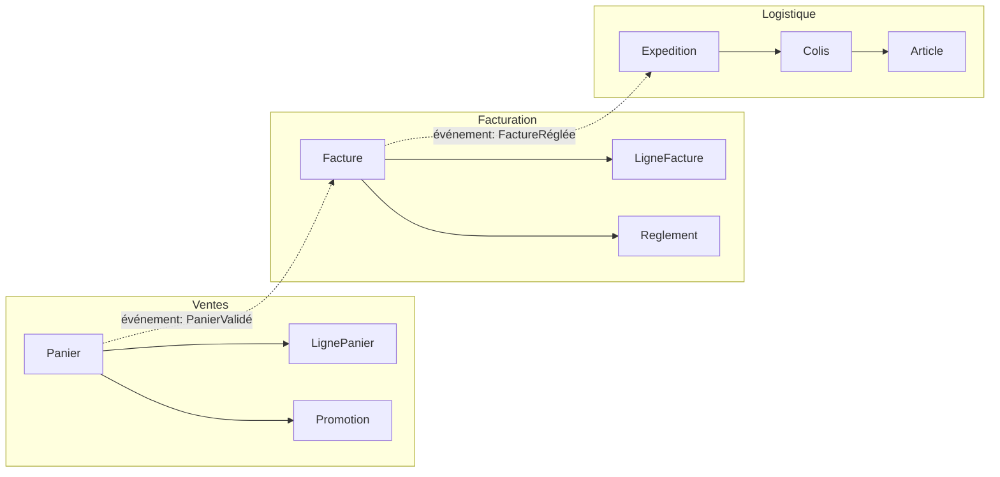

### Cartographier les relations entre contextes

Eric Evans définit plusieurs patterns pour décrire les relations inter-contextes : *Shared Kernel*, *Customer/Supplier*, *Conformist*, *Anti-Corruption Layer*, *Open Host Service*, *Published Language*, *Partnership*, *Separate Ways*, *Big Ball of Mud*. Le choix dépend du rapport de pouvoir et de la confiance entre équipes. Ils sont détaillés dans la section suivante.

[🔝 Retour en haut de page](#table-des-matières)

## Bounded Context Canvas

> **Définition — Bounded Context Canvas.** Outil moderne de conception stratégique formalisé par **Nick Tune** et le [DDD Crew](https://github.com/ddd-crew/bounded-context-canvas) (2019), inspiré du *Business Model Canvas*. Il sert à **caractériser un Bounded Context sur une seule page** lors d'un atelier de cadrage, avant de figer son contour ou ses dépendances.

### À quoi il répond

Un Context Map montre *les relations entre* contextes ; le Bounded Context Canvas montre *l'identité d'un* contexte. Les deux sont complémentaires : on remplit un Canvas par contexte, puis on les relie sur la Map.

### Les cases du Canvas

| Case | Question à laquelle elle répond |
|------|---------------------------------|
| **Nom** | Comment le métier appelle-t-il ce contexte ? |
| **Description** | En une phrase, que fait-il ? |
| **Classification stratégique** | Core, supporting ou generic ? Pourquoi ? |
| **Domain Roles** | Spécification, exécution, audit, analytique, gateway... |
| **Inbound Communications** | Qui appelle ce contexte, sous quel contrat (synchrone/asynchrone, push/pull) ? |
| **Outbound Communications** | Qui ce contexte appelle-t-il, sous quel contrat ? |
| **Ubiquitous Language** | Liste des termes métier propres à ce contexte. |
| **Business Decisions** | Quelles décisions métier ce contexte prend-il *seul* ? |
| **Assumptions** | Hypothèses fortes (utilisateurs concurrents, volumétrie, SLA). |
| **Verification Metrics** | Comment vérifie-t-on que le contexte fait son travail ? |
| **Open Questions** | Sujets non tranchés à reprendre au prochain atelier. |

### Pourquoi cet outil prend de l'importance

- Il **rend explicite** ce qui était implicite dans la documentation classique : rôles, hypothèses, métriques.
- Il accélère l'**onboarding** : un Canvas par contexte donne au nouvel arrivant la boussole macro en une heure.
- Il prépare la conversation **inter-équipes** : montrer son Canvas à l'équipe voisine fait apparaître les contradictions plus vite qu'une review d'API.
- Il s'intègre avec d'autres outils du **DDD Crew** : *Core Domain Chart*, *EventStorming*, *Aggregate Design Canvas*.

> **Bonne pratique.** Remplir le Canvas en atelier (45 min à 1 h), à l'oral, en équipe mixte métier/tech. Le Canvas n'est pas un livrable contractuel : c'est une trace de la conversation, à réviser à chaque évolution majeure.

[🔝 Retour en haut de page](#table-des-matières)

## Context Map : les patterns de relation

La *Context Map* documente honnêtement comment les Bounded Contexts s'articulent — équipes, dépendances, contrats, rapports de force. Sa valeur tient à sa fidélité au réel : une carte qui décrit la situation idéale n'est qu'un vœu pieux.

### Patterns inter-contextes

| Pattern | Ce que c'est | Quand l'utiliser |
|---------|--------------|------------------|
| **Partnership** | Deux équipes liées par un succès ou un échec commun, coordination forte. | Lorsque deux contextes ne peuvent pas livrer indépendamment ; coût relationnel élevé. |
| **Shared Kernel** | Petit modèle partagé entre deux contextes, modifié de manière concertée. | Si la duplication coûterait plus cher que la coordination ; rare et exigeant. |
| **Customer / Supplier** | Le contexte amont (*upstream*) sert le contexte aval (*downstream*) ; l'aval a un poids client reconnu. | Équipes alignées, ressources allouées, planification possible côté amont. |
| **Conformist** | L'aval se conforme au modèle de l'amont, sans pouvoir de négociation. | Quand l'amont est imposé (legacy, fournisseur externe, équipe puissante). |
| **Anti-Corruption Layer (ACL)** | L'aval traduit le modèle de l'amont via une couche de protection. | Modèle amont incompatible ou instable ; on protège le modèle local. |
| **Open Host Service (OHS)** | L'amont publie un protocole stable utilisable par plusieurs aval. | Lorsqu'un contexte sert de plateforme à plusieurs consommateurs. |
| **Published Language** | Langage d'échange documenté et versionné (souvent couplé à OHS). | Contrats inter-équipes ou inter-organisations stables. |
| **Separate Ways** | Aucune intégration ; chacun mène sa route. | Quand l'intégration coûte plus que sa valeur. |
| **Big Ball of Mud** | Zone sans frontière claire, modèle entremêlé. | À reconnaître pour l'isoler ; jamais à choisir volontairement. |

### Représenter la carte

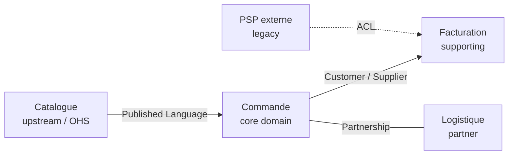

### Choisir un pattern

Le choix dépend de deux axes : **rapport de pouvoir** entre équipes (qui peut imposer un changement à qui ?) et **stabilité du modèle amont**. Une équipe aval avec peu de poids face à un amont instable a tout intérêt à intercaler une *Anti-Corruption Layer*. À l'inverse, deux équipes proches avec des objectifs alignés peuvent vivre en *Partnership*.

[🔝 Retour en haut de page](#table-des-matières)

## Entités, objets-valeurs et agrégats

Trois briques de modélisation tactique du DDD.

### Entité

Une entité a une **identité stable** dans le temps. Deux instances avec les mêmes attributs ne sont pas la même entité ; deux références au même identifiant le sont.

```php
final class Client {
    public function __construct(
        public readonly ClientId $id,   // identité
        public string $nom,             // attributs mutables
        public string $email,
    ) {}
}
```

### Objet-valeur (*Value Object*)

Un objet-valeur est défini **uniquement par ses attributs**. Il est immuable : modifier revient à en créer un nouveau. Égalité = égalité de valeurs.

```php
final class Money {
    public function __construct(
        public readonly int $centimes,
        public readonly Devise $devise,
    ) {}

    public function plus(Money $autre): Money {
        if ($autre->devise !== $this->devise) { throw new DomainException('devise'); }
        return new Money($this->centimes + $autre->centimes, $this->devise);
    }
}
```

Bons candidats : `Adresse`, `Money`, `IntervalleDeDates`, `Couleur`. Mauvais candidats : ce qui a un cycle de vie ou une histoire.

### Agrégat

Un agrégat est un **groupe d'entités et d'objets-valeurs traités comme un tout cohérent**, accédé exclusivement via une *racine d'agrégat* (entité). La racine garantit les invariants du groupe et est la seule à être référencée de l'extérieur.

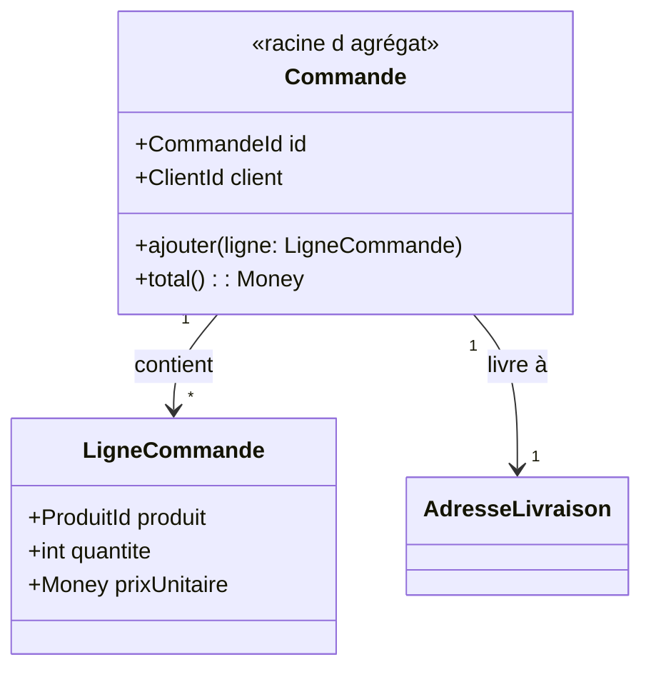

Règles d'agrégat :

- une transaction = un agrégat modifié (sinon scinder en deux agrégats) ;
- les références entre agrégats se font par **identifiant**, pas par référence d'objet ;
- petits agrégats : plus c'est gros, plus la concurrence et la persistance deviennent douloureuses.

[🔝 Retour en haut de page](#table-des-matières)

## Règles de conception des agrégats (Vernon)

Vaughn Vernon, dans *Implementing Domain-Driven Design* (2013), formule **quatre règles** pour éviter les agrégats obèses qui paralysent la persistance et la concurrence.

### 1. Modéliser de vraies *consistency boundaries*

Un agrégat existe pour qu'**un ensemble d'invariants** soit toujours vrai après chaque transaction. Ce qui ne participe pas à un invariant n'a rien à faire dans l'agrégat. Question piège à se poser : *« Si cet attribut était sur un autre agrégat, quelle règle métier serait violée ? »* Si la réponse est *« aucune »*, c'est qu'il faut sortir l'attribut.

### 2. Concevoir de petits agrégats

Un agrégat doit être **chargeable et persistable d'un bloc** sans douleur. Les agrégats massifs (une `Commande` qui contient toutes ses lignes, ses paiements, ses retours, ses messages) provoquent :

- des verrous concurrents pénibles ;
- des chargements coûteux (toute la grappe est lue alors qu'on n'en utilise qu'une partie) ;
- des conflits d'écriture sur des champs sans rapport entre eux.

Heuristique : si plusieurs cas d'usage modifient des sous-parties indépendantes de la même grappe, scinder.

### 3. Référencer les autres agrégats par identifiant

Aucune référence d'objet directe entre agrégats. Une `Commande` ne tient pas un `Client` mais un `ClientId`. Cela :

- évite de charger des grappes entières par effet domino ;
- clarifie les frontières transactionnelles ;
- permet de stocker les agrégats dans des bases différentes (utile en microservices) ;
- réduit le couplage entre modules.

```php
final class Commande {
    private ClientId $client;     // pas Client $client
    private CatalogueProduitId $catalogue;
}
```

### 4. Mettre à jour les autres agrégats en cohérence à terme

Une transaction ne touche **qu'un seul agrégat**. Les autres agrégats à mettre à jour le sont **par événements** dans une transaction ultérieure (*eventual consistency*).

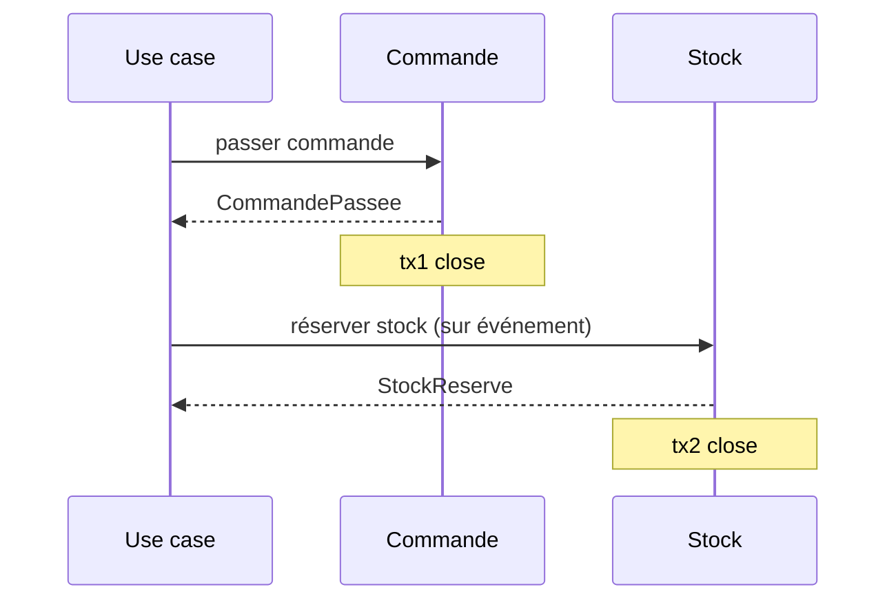

Quand exiger la cohérence forte (deux agrégats dans la même transaction) ? Réponse de Vernon : **presque jamais**. Si on en a vraiment besoin, c'est probablement que le découpage est faux — ou que la règle métier elle-même tolère une asynchronie qu'on n'a pas vue.

[🔝 Retour en haut de page](#table-des-matières)

## Frontières d'agrégats : un choix de conception, pas une vérité

> **Définition — frontière d'agrégat.** La frontière d'un agrégat est une **décision de conception** sur où passe la limite de cohérence transactionnelle. Elle n'est *pas* une propriété intrinsèque du domaine qu'il suffirait de découvrir — deux équipes compétentes peuvent légitimement aboutir à des découpages différents, en fonction du contexte d'usage, de la volumétrie, du modèle de concurrence et des cas d'usage prioritaires.

### Pourquoi c'est important de l'admettre

La littérature DDD débutante laisse parfois entendre qu'il existe **un** « bon » agrégat à trouver, comme on chercherait une vérité cachée dans le métier. C'est faux et démobilisant :

- les invariants métier réels ne dictent souvent qu'une **partie** de la frontière ; le reste est un arbitrage technique (verrouillage, latence, granularité de cache, structure des messages) ;
- une nouvelle exigence (un cas d'usage à très haute fréquence, un changement de SLA) peut justifier de **revoir** une frontière, sans que le domaine lui-même ait changé ;
- présenter l'agrégat comme « découvrable » alimente le mythe de l'analyste DDD oraculaire et empêche les équipes de **discuter** ouvertement leurs choix.

### Trois exemples de découpage légitimement différent

| Scénario | Choix possible A | Choix possible B | Critère qui tranche |
|----------|------------------|------------------|---------------------|
| Commande e-commerce avec lignes | `Commande` agrège ses `LigneCommande` | `Commande` et `LigneCommande` sont deux agrégats reliés par identifiant | Volume de lignes par commande, fréquence d'ajout/retrait après création |
| Bilan comptable | `ExerciceComptable` agrège tous les comptes et écritures | `ExerciceComptable`, `Compte`, `Ecriture` séparés, reliés par ID | Concurrence d'écriture, taille du bilan, audit ligne à ligne ou global |
| Dossier patient | `Patient` agrège son historique médical | `Patient` distinct de `DossierMedical` (un par épisode) | Confidentialité par épisode, durée de conservation, autorisations |

### Critères pour trancher

- **Invariants** : quelle règle métier doit être vraie *immédiatement après* chaque transaction ? Tout ce qu'elle touche est dans le même agrégat.
- **Concurrence** : si deux utilisateurs modifient des sous-parties indépendantes simultanément, doit-on absolument les sérialiser ? Si non, scinder.
- **Cycle de vie** : si deux entités naissent et meurent à des moments différents, c'est probablement deux agrégats.
- **Volumétrie** : un agrégat ne doit pas dépasser ce qu'on charge raisonnablement en mémoire (Vernon parle de « petits agrégats »).
- **Cas d'usage de lecture** : si toutes les lectures portent sur la grappe complète, agréger est tentant ; si la plupart portent sur un sous-ensemble, scinder.

> **Honnêteté de conception.** Documenter dans un **ADR** (*Architecture Decision Record*) le choix de frontière et les alternatives écartées, c'est se donner les moyens de **re-discuter** la décision plus tard, sans dogmatisme. Le texte doit dire : *« étant donné ces invariants, ce volume, ce SLA, nous choisissons cette frontière ; nous la révisons si X change »*.

[🔝 Retour en haut de page](#table-des-matières)

## Factories et Modules

### Factory

Une *Factory* est responsable de la **construction cohérente** d'un agrégat ou d'un objet-valeur lorsque la création n'est pas triviale : invariants à vérifier, choix de sous-classe, dépendances externes nécessaires. Elle évite de polluer le constructeur ou d'éparpiller la logique d'instanciation dans les Application Services.

```php
final class FactureFactory {
    public function __construct(
        private NumerotationFactures $numerotation,
        private GrilleTVA $tva,
    ) {}

    public function depuisCommande(Commande $commande, DateTimeImmutable $emiseLe): Facture {
        $numero = $this->numerotation->prochainNumero($emiseLe);
        $taux = $this->tva->tauxApplicable($commande->paysLivraison(), $emiseLe);
        return Facture::nouvelle($numero, $commande, $taux, $emiseLe);
    }
}
```

Quand utiliser une Factory ?

- la création requiert plusieurs étapes ou plusieurs sources ;
- on doit choisir entre plusieurs implémentations selon le contexte ;
- on veut empêcher la création d'un agrégat dans un état invalide.

Quand s'en passer : un constructeur statique nommé sur la racine (`Commande::nouvelle(...)`) suffit pour les cas simples et reste dans le langage ubiquitaire.

### Module

Un *Module* (ou *Package*) est un regroupement nommé d'éléments du modèle. Le nom du module **fait partie du langage ubiquitaire** : il dit quelque chose du métier, pas de la technique. Préférer `App\Domain\Commande` à `App\Domain\Entities`.

Lignes directrices :

- un module = un concept cohérent du domaine ;
- couplage faible entre modules, fort à l'intérieur ;
- aligner les modules sur les chapitres du langage ubiquitaire, pas sur les couches techniques.

```text
src/
  Catalogue/        # bounded context
    Domain/
      Produit/      # module
      Categorie/
    Application/
    Infrastructure/
  Commande/
    Domain/
      Commande/
      Panier/
    Application/
    Infrastructure/
```

[🔝 Retour en haut de page](#table-des-matières)

## Repositories et Domain Services

### Repository

Un *Repository* offre l'illusion d'une collection en mémoire de tous les agrégats d'un type. Il cache la persistance (ORM, fichier, API) derrière une interface définie par le domaine.

```php
namespace App\Domain\Commande;

interface CommandeRepository {
    public function find(CommandeId $id): ?Commande;
    public function add(Commande $commande): void;
    public function remove(Commande $commande): void;
}
```

L'implémentation vit dans la couche infrastructure :

```php
namespace App\Infrastructure\Doctrine\Commande;

use App\Domain\Commande\{Commande, CommandeId, CommandeRepository};
use Doctrine\ORM\EntityManagerInterface;

final class DoctrineCommandeRepository implements CommandeRepository {
    public function __construct(private EntityManagerInterface $em) {}

    public function find(CommandeId $id): ?Commande {
        return $this->em->find(Commande::class, $id);
    }

    public function add(Commande $commande): void {
        $this->em->persist($commande);
    }

    public function remove(Commande $commande): void {
        $this->em->remove($commande);
    }
}
```

Notes :

- un Repository **par racine d'agrégat**, pas par table ;
- `flush()` n'est pas la responsabilité du Repository ; il est piloté par l'Application Service ou un middleware transactionnel.

### Domain Service

Un *Domain Service* abrite la logique métier qui n'appartient naturellement à aucune entité ou objet-valeur (souvent parce qu'elle implique plusieurs agrégats). Il reste dans la couche domaine et reste agnostique de l'infrastructure.

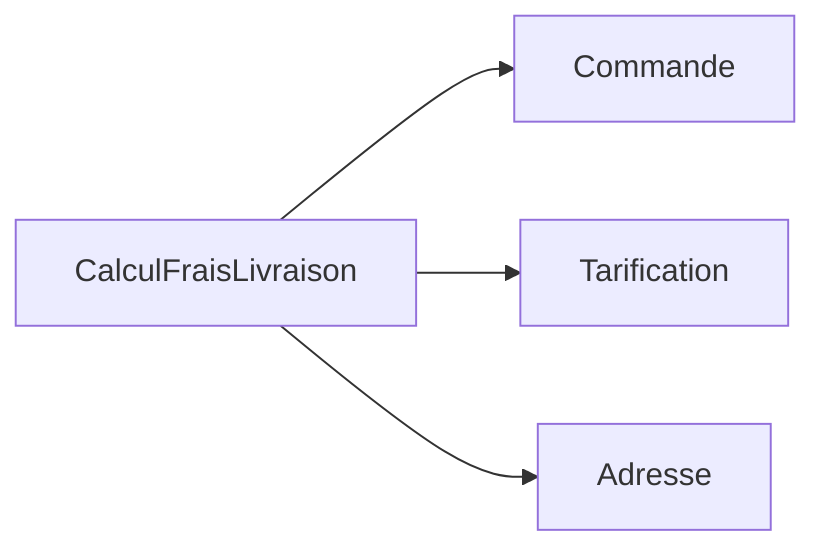

Exemple : un calcul de frais de livraison qui combine la commande, la grille tarifaire du transporteur et l'adresse — aucune de ces données n'est plus naturellement chez l'autre.

[🔝 Retour en haut de page](#table-des-matières)

## Application Services et CQRS

### Application Services

Les *Application Services* sont la porte d'entrée du domaine pour la couche présentation. Ils orchestrent : ils ouvrent une transaction, chargent les agrégats nécessaires, appellent leurs méthodes métier, persistent, émettent les événements, ferment la transaction.

```php
final class PasserCommande {
    public function __construct(
        private CommandeRepository $commandes,
        private CatalogueProduits $catalogue,
        private EventDispatcher $events,
    ) {}

    public function __invoke(PasserCommandeInput $input): CommandeId {
        $commande = Commande::nouvelle($input->client);
        foreach ($input->lignes as $l) {
            $produit = $this->catalogue->trouver($l->produitId)
                ?? throw new ProduitInconnu($l->produitId);
            $commande->ajouter(new LigneCommande($produit->id, $l->quantite, $produit->prix));
        }
        $this->commandes->add($commande);
        $this->events->dispatch(new CommandePassee($commande->id));
        return $commande->id;
    }
}
```

Règle : **un Application Service ne contient pas de logique métier** ; il ne fait qu'orchestrer.

### CQRS

CQRS (*Command Query Responsibility Segregation*, [Greg Young, 2010](https://martinfowler.com/bliki/CQRS.html)) sépare le modèle d'écriture du modèle de lecture :

| Côté | Rôle | Optimisé pour |
|------|------|---------------|
| **Commands** | Modifient l'état (réservations, paiements). | Cohérence, invariants, agrégats. |
| **Queries** | Lisent l'état (listes, vues, dashboards). | Performance, projections dénormalisées. |

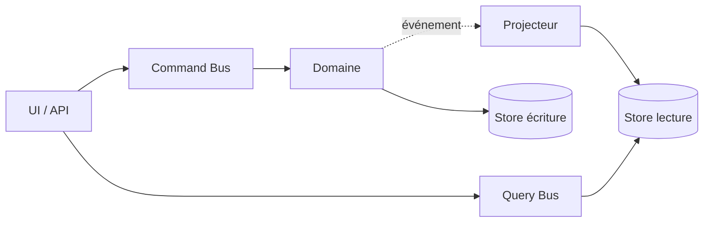

CQRS ne se justifie que là où lecture et écriture ont des modèles ou des charges divergents ; dans le doute, **commencer sans**.

[🔝 Retour en haut de page](#table-des-matières)

## CQRS et Event Sourcing : indépendants

> **Définition — indépendance CQRS / ES.** *CQRS* (séparation lecture/écriture) et *Event Sourcing* (persistance par événements) sont **deux décisions orthogonales**. La littérature les présente parfois comme un package indissociable, c'est trompeur. On peut adopter l'un sans l'autre, et chaque combinaison a son sens.

### Les quatre combinaisons possibles

| | **Sans CQRS** | **Avec CQRS** |
|---|---------------|---------------|
| **Sans ES** | Architecture classique : un modèle, une base, lecture et écriture par les mêmes objets. **Cas par défaut**, suffisant pour la majorité des applications. | Modèles de lecture dédiés (vues SQL dénormalisées, projections), persistance d'état classique. **Très utile** quand les requêtes divergent fortement des invariants d'écriture. |
| **Avec ES** | Event Sourcing « pur » : le store est l'historique, l'état courant est reconstruit à la lecture. Possible mais **inhabituel** : on bascule rarement en ES sans CQRS, car les requêtes deviennent rapidement coûteuses. | Combinaison classique présentée par Greg Young : commands → events → projections → reads. **Puissante mais coûteuse**, à réserver aux domaines où la traçabilité est exigée. |

### Quand CQRS sans ES

- on a un **modèle d'écriture riche** (agrégats DDD, invariants), mais les lectures dominantes sont des listes/dashboards/recherches qui n'ont pas besoin de l'objet métier ;
- on veut introduire **plusieurs vues** optimisées (par client, par fournisseur, par exercice) sans tordre les agrégats ;
- on cible la **performance** (cache, projections matérialisées) sans complexité opérationnelle d'un event store.

C'est la combinaison la plus fréquente dans les SI métier à fort volume de lecture.

### Quand ES sans CQRS

- très rare en pratique ; envisageable si la **lecture est intrinsèquement faible** (back-office d'audit où l'on consulte rarement, mais on doit tout reconstituer) ;
- l'effort de projection apparaît néanmoins dès qu'une UI a besoin d'une liste : on bascule de fait vers CQRS.

### Adopter incrémentalement

Une trajectoire prudente, observée en pratique :

1. **Étape 0** — modèle riche DDD, persistance d'état, lectures via le même modèle. Suffit longtemps.
2. **Étape 1** — quand les lectures deviennent un goulot ou que les vues divergent, introduire **CQRS** (projections de lecture, sans toucher l'écriture).
3. **Étape 2** — quand un sous-domaine *core* exige audit, traçabilité ou rejouabilité (finance, santé, supply-chain régulée), introduire l'**Event Sourcing** sur ce sous-domaine seulement.

> **Garde-fou.** Ne pas adopter CQRS+ES pour leur réputation. Chaque pattern porte un **coût opérationnel** (outillage, formation, débogage) qui se paie en cycles ingénieurs. Le bon ordre est : DDD tactique → CQRS si nécessaire → ES si vraiment nécessaire, **jamais l'inverse**.

[🔝 Retour en haut de page](#table-des-matières)

## Événements de domaine et Event Sourcing

### Événement de domaine

Un *Domain Event* est un fait métier passé, immuable, exprimé au passé : `CommandePassee`, `PaiementRefuse`, `ColisLivre`. Il découple les producteurs des consommateurs : la commande ne sait pas qui s'intéresse à sa validation.

Caractéristiques :

- **immuable** ; un événement ne se modifie pas, il se compense par un autre événement ;
- **complet** ; il porte l'information dont les abonnés auront besoin (éviter le retour à la base) ;
- **émis par un agrégat** lorsqu'un changement d'état significatif a lieu.

### Event Sourcing

L'*Event Sourcing* persiste un agrégat **sous la forme de la séquence d'événements qui l'ont fait advenir**, plutôt que de son état courant. L'état est reconstruit en rejouant les événements.

| Bénéfice | Coût |
|----------|------|
| Historique complet, audit gratuit | Requêtes complexes à projeter |
| Reconstruction d'états passés | Versionnage des événements obligatoire |
| Synergie naturelle avec CQRS | Outillage et expertise spécifiques |
| Détection rétroactive de bugs | Impossibilité de modifier le passé |

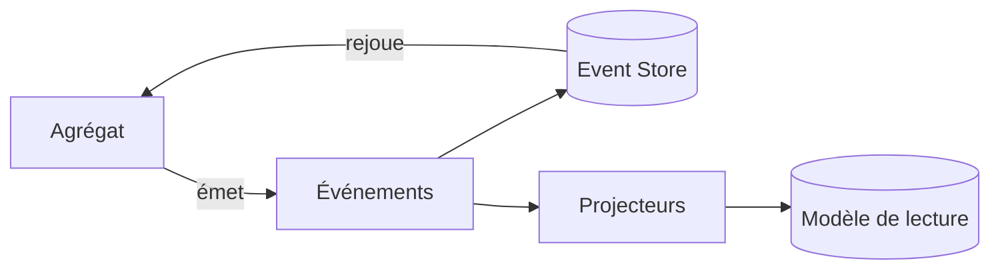

L'Event Sourcing reste un choix lourd : à n'envisager que sur les domaines où la traçabilité a une valeur métier (finance, santé, audit réglementaire).

### Stratégie de snapshots et de rejeu

Quand l'historique grandit, rejouer tous les événements à chaque chargement devient coûteux. Le palliatif est le **snapshot** : un instantané périodique de l'état d'un agrégat, à partir duquel on rejoue uniquement les événements postérieurs.

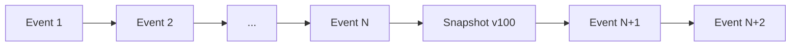

Heuristique : *snapshoter* tous les *N* événements (50, 100…), garder l'historique brut pour l'audit, et accepter que le snapshot soit une simple optimisation, jamais une source de vérité.

### Versionnage des événements

Un événement persisté ne peut plus changer. Quand le métier évolue (ajout d'un champ, renommage), trois techniques coexistent et se combinent :

- **Upcaster** : fonction pure appliquée à la **lecture** qui transforme un événement de version `v1` vers `v2`. Pattern classique : une chaîne d'upcasters (`v1 → v2 → v3`) tenue à jour. Avantage : pas de migration. Inconvénient : la chaîne s'allonge, et on porte le poids historique à chaque rejeu.
- **Multiple émissions** (*double-write*) : produire pendant une période de transition à la fois `EvtV1` et `EvtV2` afin que les anciens consommateurs continuent à fonctionner. Coûteux en stockage, simple opérationnellement.
- **Copy-and-replace** (*stream rewrite*) : créer un **nouveau flux** d'événements `vN+1` à partir de l'ancien, en transformant à la copie. Lourd (downtime ou bascule), mais nettoie la dette de format. Réservé aux refontes profondes.
- **Tolérance à la lecture** (*tolerant reader*) : exiger des consommateurs qu'ils ignorent les champs inconnus et acceptent les défauts. Indispensable, complémentaire des trois autres.

### Pièges récurrents (souvent sous-estimés)

- **Schema evolution** : un événement publié il y a trois ans est toujours dans le store. Sans politique d'upcasters claire et **testée à l'intégration**, le moindre rename casse silencieusement les rejeux. Tester chaque upcaster contre des **fixtures historiques figées**.
- **Reconstruction de read models** : les projections doivent pouvoir être **reconstruites de zéro** à tout moment (changement de modèle de lecture, bug de projecteur, ajout d'un nouvel index). Cela suppose une infrastructure de *replay* idempotente, des projections **purement déterministes** (pas d'appel à *now()* ou à un service externe en plein milieu).
- **Volumétrie de l'event store** : sur un domaine très actif, le store grossit sans plafond. Anticiper l'archivage à froid, le partitionnement par flux, le coût de stockage long terme.
- **Débogage en production** : aucun outil SQL ne dit *« quel est l'état actuel d'un agrégat ? »* ; il faut systématiquement rejouer. Investir dans un **viewer** d'event store et des outils de rejeu localisé est non négociable.
- **Effets de bord interdits dans les agrégats** : un `apply(Event)` doit être **strictement déterministe**. Tout appel à un service, à `now()`, à un random, à un compteur de séquence externe pendant la reconstruction casse le rejeu.
- **Évolution des invariants** : si une règle métier change, les anciens événements peuvent ne plus être *valides* selon la règle actuelle. Choisir : on respecte le passé tel qu'il a été (préférable, audit), ou on refuse les rejeux qui violent la règle (alors prévoir une compensation).
- **Onboarding long** : un développeur senior met plusieurs semaines à devenir productif sur un système ES non trivial. Compter ce coût dans la décision d'adoption.

### Inconvénients à connaître

- complexité opérationnelle (event store dédié, projections à reconstruire) ;
- requêtes ad-hoc impossibles sans projection préalable ;
- débogage moins direct (l'état actuel est dérivé) ;
- onboarding plus long pour les équipes.

[🔝 Retour en haut de page](#table-des-matières)

## Outbox Pattern : publication fiable des événements

> **Définition — Outbox Pattern.** Pattern d'intégration popularisé par Chris Richardson et largement documenté chez Microsoft et Confluent : **persister l'événement à publier dans la même transaction que le changement d'état métier**, dans une table `outbox` dédiée, puis laisser un *relais* asynchrone le publier sur le bus. Indispensable dès qu'on dispose d'une base relationnelle et d'un broker distincts.

### Le problème : la double écriture

Sans Outbox, un Application Service classique fait deux écritures sur deux systèmes :

1. `INSERT` ou `UPDATE` dans la base (via le Repository).
2. `publish()` sur le broker (Kafka, RabbitMQ, SQS).

Les deux ne sont pas dans la même transaction. Trois pannes possibles :

| Scénario | Conséquence |
|----------|-------------|
| BDD écrite, broker indisponible | Etat changé, événement perdu — incohérence inter-services. |
| BDD échoue, broker écrit | Etat non changé, événement publié à tort — consommateurs travaillent sur du faux. |
| Crash entre les deux | Indéterminé ; selon l'ordre, l'un des deux cas précédents. |

### Le pattern : une seule transaction locale

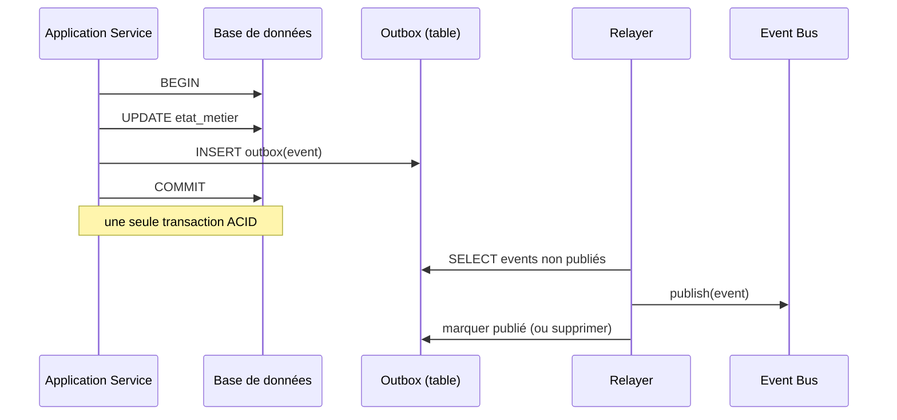

L'agrégat et la ligne d'outbox sont écrits **atomiquement**. Le *relayer* garantit la publication *au moins une fois* ; aux consommateurs d'être idempotents.

### Variantes

- **Polling outbox** : le relayer interroge la table `outbox` à intervalle régulier. Simple, pas de configuration spéciale ; latence proportionnelle à la fréquence de polling.
- **Transactional log tailing** (*CDC*, *Change Data Capture*) : on lit le journal de transaction de la base (par exemple via Debezium côté PostgreSQL/MySQL). Latence faible, mais opérationnellement plus exigeant.
- **Listen/notify** (PostgreSQL) : la base notifie elle-même les nouveaux événements ; bonne latence, simple à mettre en œuvre.

### Pourquoi c'est non-négociable en système distribué

Sans Outbox, l'eventual consistency repose sur la chance. Avec Outbox, on a une **garantie d'au moins une publication** dès que la transaction métier réussit. C'est la fondation pratique de toute architecture événementielle sérieuse.

[🔝 Retour en haut de page](#table-des-matières)

## Sagas et Process Managers

### Pourquoi un coordinateur ?

Quand un cas d'usage métier traverse **plusieurs agrégats** (potentiellement plusieurs Bounded Contexts), aucun agrégat n'est légitime pour porter la transaction. Une *saga* ou un *process manager* coordonne le workflow, gère les états intermédiaires, et déclenche des **compensations** quand une étape échoue.

> **Saga vs Process Manager** : la littérature les confond souvent. Convention courante : la *saga* est chorégraphiée (les événements eux-mêmes déclenchent la suite, pas de chef d'orchestre) ; le *process manager* est orchestré (un composant central pilote les étapes). En pratique, on choisit selon le couplage acceptable.

### Exemple : passage d'une commande

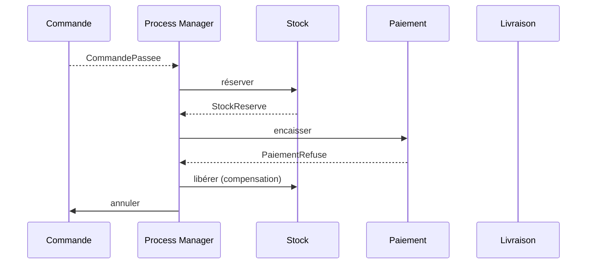

### Compensations, pas rollbacks

Aucune transaction distribuée à deux phases : chaque étape est locale et atomique. Si une étape échoue, les étapes précédemment validées sont compensées par des actions métier de sens contraire (rembourser, libérer le stock, annuler la commande). La compensation appartient au métier et porte un nom du langage ubiquitaire.

### Squelette d'un Process Manager

```php
final class PassageCommandeProcessManager {
    public function quand(CommandePassee $e): void {
        $this->commandes->reserverStock($e->commandeId);
    }
    public function quand(StockReserve $e): void {
        $this->paiements->encaisser($e->commandeId);
    }
    public function quand(PaiementRefuse $e): void {
        $this->stock->liberer($e->commandeId);
        $this->commandes->annuler($e->commandeId, motif: 'paiement refusé');
    }
}
```

### Saga vs Process Manager : terminologie ambiguë

> **Avertissement.** La littérature **n'est pas unanime** sur la frontière saga / process manager. Trois acceptions coexistent et il faut choisir explicitement la sienne dans l'équipe.

| Auteur / source | Position |
|-----------------|----------|
| **Hector Garcia-Molina & Kenneth Salem (1987)** | *Saga* désigne historiquement un long-running transaction décomposé en transactions locales avec compensations. Aucune mention d'orchestration vs chorégraphie. |
| **Vaughn Vernon (*IDDD*, 2013)** | Préfère *Process Manager* pour l'orchestration centralisée (un objet avec un état, qui consomme des événements et émet des commandes). Réserve *Saga* aux chorégraphies décentralisées. |
| **Microsoft Patterns & Practices (CQRS Journey, 2012)** | Utilise *Saga* comme synonyme de *Process Manager*, indistinctement, pour l'orchestration. |
| **Chris Richardson (*Microservices Patterns*, 2018)** | Utilise *Saga* comme terme parapluie, distingue *orchestration-based saga* et *choreography-based saga*. |
| **Greg Young** | Tend à parler simplement de *Process Manager* pour l'objet de coordination, et d'*événements* pour la chorégraphie. |

### Convention pratique

Pour éviter les malentendus en équipe, formuler la convention en début de projet et l'inscrire dans le glossaire ubiquitaire :

- soit on adopte **Vernon** : *Saga* = chorégraphie pure (pas de coordinateur), *Process Manager* = orchestrateur stateful ;
- soit on adopte **Richardson** : *Saga* = terme parapluie, suffixé `-orchestrated` ou `-choreographed` selon le cas ;
- soit on adopte **Microsoft** : les deux mots désignent indifféremment un coordinateur de workflow long.

Aucun choix n'est plus juste qu'un autre — le pire est de les **mélanger** dans le code sans s'en rendre compte. Dans ce mémo, on retient la convention Vernon : *Saga* chorégraphiée, *Process Manager* orchestré.

[🔝 Retour en haut de page](#table-des-matières)

## Cohérence à terme : compensations et garanties

> **Définition — eventual consistency.** Modèle de cohérence où plusieurs agrégats convergent vers un état cohérent **après un délai** (millisecondes à minutes), au lieu d'être tous mis à jour dans une transaction unique. Vernon en fait la norme inter-agrégats. Mais elle se paie : sans compensations soignées et garanties opérationnelles, on construit du **chaos asynchrone**.

### Les trois familles de garanties à choisir explicitement

| Garantie | Signification | Coût |
|----------|---------------|------|
| **At-most-once** | Le message est livré 0 ou 1 fois ; jamais dupliqué, mais peut se perdre. | Risque métier : ordres oubliés, événements perdus. À éviter sauf cas extrêmes. |
| **At-least-once** | Le message est livré 1 ou plusieurs fois ; jamais perdu, mais peut être dupliqué. | Force les consommateurs à être **idempotents**. Standard de fait avec Outbox. |
| **Exactly-once** | Promesse marketing courante, **rarement vraie de bout en bout** sans verrous distribués. | Très coûteuse ; remplaçable par at-least-once + idempotence (résultat équivalent, plus robuste). |

### Idempotence : non négociable côté consommateur

Tout consommateur d'Integration Event doit être **idempotent** : recevoir deux fois le même événement ne doit pas produire deux effets. Techniques :

- **Identifiant de message stable** (`messageId` UUID) stocké dans une table `processed_messages` ; on ignore tout `messageId` déjà vu.
- **Opérations naturellement idempotentes** : `setStatut(Confirmé)` plutôt qu'`incrémenter compteur`.
- **Versionnage optimiste** : chaque agrégat porte un numéro de version ; toute commande référence la version attendue.

### Compensations : les écrire avant d'en avoir besoin

Une compensation est une **action métier** de sens contraire à une action déjà validée — pas un rollback technique. Règles :

- **nommée dans le langage ubiquitaire** : `rembourserClient`, `libérerStock`, `annulerRéservation` (jamais `undoSomething`) ;
- **idempotente** : si on rembourse deux fois la même demande, on rembourse une seule fois ;
- **traçable** : chaque compensation laisse une trace (événement `RemboursementEffectue`) pour l'audit ;
- **prévue à la conception** : pour chaque étape d'une saga, on écrit explicitement la compensation associée *avant* de mettre en production.

### Pannes typiques et stratégies

| Panne | Stratégie de récupération |
|-------|---------------------------|
| Étape échoue de manière transitoire (timeout broker) | *Retry* avec *backoff* exponentiel ; idempotence requise. |
| Étape échoue durablement (paiement refusé) | Compensation des étapes précédentes ; notification métier. |
| Compensation elle-même échoue | *Dead letter queue* + intervention humaine ; alerter, ne pas masquer. |
| Message hors d'ordre (commande après confirmation) | Versionnage optimiste sur l'agrégat ; rejet ou réordonnancement. |
| Boucle infinie de compensations mutuelles | Plafond du nombre de tentatives ; *circuit breaker* ; bascule manuelle. |

### Visibilité opérationnelle

Une architecture eventually consistent **sans observabilité** est ingérable en production. Investir dans :

- **traçage distribué** (OpenTelemetry) : un même `traceId` traverse tous les services et événements ;
- **dashboards par saga** : combien sont en cours, combien ont compensé, combien sont en *dead letter* ;
- **alertes sur le delta de cohérence** : si plus de N minutes entre `CommandePassee` et `FactureEmise`, alerter.

> **Garde-fou.** L'eventual consistency n'est pas *« on s'en occupera plus tard »*. C'est un **engagement métier** : on a accepté qu'à un instant `t`, deux contextes voient l'état différemment. Cela doit être **explicitement validé** avec le métier (par exemple : *« le client peut voir une commande passée avant que la facture soit émise, c'est OK »*). Si le métier dit non, c'est qu'il faut soit fusionner les agrégats, soit accepter une transaction distribuée — pas hand-waver.

[🔝 Retour en haut de page](#table-des-matières)

## Domain Events vs Integration Events

Distinction essentielle, souvent floue.

| Aspect | Domain Event | Integration Event |
|--------|--------------|-------------------|
| Portée | Interne au Bounded Context. | Inter-contextes ou inter-services. |
| Couplage | Couplé au modèle local. | Découplé, stable, versionné. |
| Émetteur | Un agrégat. | Un *publisher* dédié, après la transaction. |
| Forme | Structure riche, alignée sur le langage ubiquitaire interne. | Contrat documenté (souvent JSON Schema, Avro, Protobuf). |
| Cohérence | Synchrone à la transaction émettrice. | Asynchrone, *eventual consistency*. |
| Exemple | `LignePanierAjoutee` (interne au Panier). | `CommandePassee` publiée vers Facturation et Livraison. |

### Anti-pattern : exposer ses Domain Events

Publier directement les Domain Events sur le bus inter-services lie tous les consommateurs au modèle interne du producteur : tout renommage de champ devient une migration distribuée. **Toujours traduire** un Domain Event en Integration Event au moment de la publication externe — c'est encore une forme d'Anti-Corruption Layer, sortante.

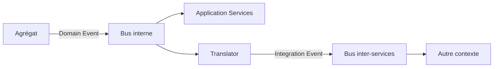

[🔝 Retour en haut de page](#table-des-matières)

## Anti-Corruption Layer

Une *Anti-Corruption Layer* (ACL) est une couche de traduction placée entre deux Bounded Contexts pour empêcher les concepts de l'un de polluer l'autre. Elle convertit les modèles dans les deux sens et absorbe les dialectes étrangers.

### Pourquoi

Quand un système doit s'intégrer à un legacy, à un SaaS, ou à un contexte voisin avec un modèle différent, importer ses concepts directement contamine le modèle local. Une ACL préserve l'intégrité du modèle, au prix d'un mapping explicite.

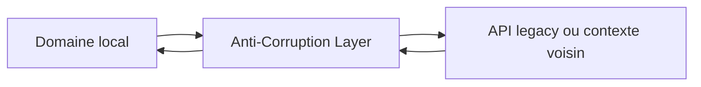

L'ACL est typiquement composée d'adaptateurs (côté infrastructure) et de traducteurs (DTOs vers objets de domaine).

[🔝 Retour en haut de page](#table-des-matières)

## Specification Pattern

Le *Specification Pattern* ([Eric Evans & Martin Fowler, 2002](https://www.martinfowler.com/apsupp/spec.pdf)) encapsule une règle métier booléenne dans un objet réutilisable, composable par opérateurs logiques (`et`, `ou`, `non`).

### Exemple

```php
interface Specification {
    public function isSatisfiedBy(object $candidat): bool;
}

final class CommandeAuDessusDe implements Specification {
    public function __construct(private Money $seuil) {}
    public function isSatisfiedBy(object $c): bool {
        return $c instanceof Commande && $c->total()->ge($this->seuil);
    }
}

final class ClientPremium implements Specification {
    public function isSatisfiedBy(object $c): bool {
        return $c instanceof Commande && $c->client()->estPremium();
    }
}

// Composition
$eligibleLivraisonGratuite =
    (new CommandeAuDessusDe(new Money(5000, Devise::EUR)))
    ->ou(new ClientPremium());
```

### Bénéfices

- règle métier nommée, testable isolément ;
- réutilisable en validation *et* en filtrage de Repository ;
- composable sans toucher aux implémentations existantes (OCP).

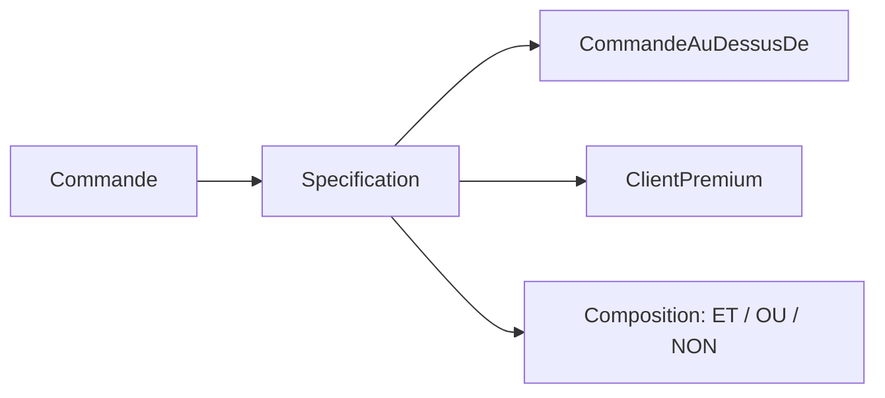

[🔝 Retour en haut de page](#table-des-matières)

## DDD fonctionnel : modéliser sans objets

> **Définition — DDD fonctionnel.** Le DDD est un ensemble de **principes de modélisation**, pas un style de programmation. Les concepts (langage ubiquitaire, bounded contexts, agrégats comme frontières de cohérence, événements de domaine) se transposent **naturellement en programmation fonctionnelle** (F#, OCaml, Haskell, Elixir, Scala, Clojure). Scott Wlaschin formalise cette approche dans *Domain Modeling Made Functional* (Pragmatic Bookshelf, 2018).

### Pourquoi ça marche aussi bien (et parfois mieux)

- **Immutabilité native** : un objet-valeur est un *record* immuable par défaut. Pas besoin d'imposer la discipline en review, le langage la garantit.
- **Types-sommes** (*sum types*, *discriminated unions*) : un `StatutCommande` qui peut être `Brouillon | Passée | Annulée(motif)` se modélise en une déclaration ; le compilateur force le traitement de chaque cas. En OO, cela demande une hiérarchie ou un `enum` sans état.
- **Validation par le type** : `Email`, `Iban`, `Money` sont des types parsés (*parse, don't validate*, Alexis King) ; un `Email` non valide ne **peut pas** exister dans le programme. Aucune assertion défensive nécessaire.
- **Workflow comme fonction** : un cas d'usage est une fonction `(input) -> Result<output, error>` ; les Application Services deviennent des compositions de fonctions, sans état caché.
- **Événements comme sortie** : un agrégat fonctionnel renvoie `(état', événements)` au lieu de muter en place. Plus simple à tester, à auditer, à event-sourcer.

### Exemple en F# (esquisse)

```fsharp
// Objets-valeurs : types parsés
type ClientId = ClientId of System.Guid
type Money = { Centimes: int; Devise: Devise }
type StatutCommande =
    | Brouillon
    | Passee
    | Annulee of motif: string

// Agrégat : record immuable
type Commande = {
    Id: CommandeId
    Client: ClientId
    Lignes: LigneCommande list
    Statut: StatutCommande
}

// Cas d'usage : fonction pure
type PasserCommande = Commande -> Result<Commande * CommandePasseeEvent, ErreurMetier>

let passer (cmd: Commande) : Result<Commande * CommandePasseeEvent, ErreurMetier> =
    match cmd.Statut, cmd.Lignes with
    | Brouillon, [] -> Error CommandeVide
    | Brouillon, _  -> Ok ({ cmd with Statut = Passee }, CommandePasseeEvent cmd.Id)
    | _ -> Error CommandeDejaPassee
```

### Tableau de correspondance OO ↔ fonctionnel

| Concept DDD | OO classique | Fonctionnel |
|-------------|--------------|-------------|
| Entité | Classe avec identité, attributs mutables | *Record* immuable, transformé par `evolve : State -> Cmd -> State * Event list` |
| Objet-valeur | Classe finale immuable | *Record* ou *type alias* avec smart constructor |
| Agrégat | Classe racine + entités internes encapsulées | Fonction `decide : State -> Cmd -> Result<Event list, Error>` |
| Domain Service | Classe sans état | Fonction de plusieurs paramètres |
| Repository | Interface définie par le domaine | *Type abstrait* `Save : State -> Async<Unit>` |
| Application Service | Classe orchestratrice | Composition de fonctions ; effets isolés en bordure |
| Event Sourcing | Liste mutable d'événements appliqués | `fold (apply: State -> Event -> State) initial events` |

### Quand ça vaut le détour

- équipe à l'aise avec un langage fonctionnel ou prête à investir ;
- domaine **riche en états et transitions** (workflows, machines à états, calculs financiers) ;
- exigence forte de **vérification par le compilateur** (sécurité, finance, santé) ;
- intérêt pour l'**Event Sourcing** : la combinaison fonctionnel + ES est particulièrement naturelle.

> **Note.** Ne pas confondre *langage fonctionnel* et *style fonctionnel en OO*. Kotlin, TypeScript, Python permettent largement le style record + sum-type + fonction pure ; Java (depuis 21, *records* + *sealed types*) aussi. Les principes du DDD fonctionnel s'appliquent dès qu'on dispose de ces briques, indépendamment du langage choisi.

[🔝 Retour en haut de page](#table-des-matières)

## Exemple intégré : e-commerce multi-contextes

Mise en situation complète d'un e-commerce, simplifié mais cohérent. Trois Bounded Contexts collaborent via événements : **Catalogue**, **Commande**, **Facturation**.

### Vue d'ensemble

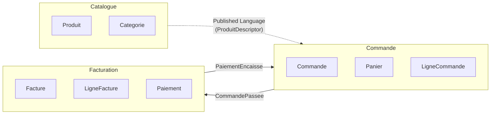

### Bounded Context *Commande*

#### Objet-valeur

```php
namespace App\Commande\Domain;

final class Money {
    public function __construct(
        public readonly int $centimes,
        public readonly Devise $devise,
    ) {
        if ($centimes < 0) { throw new DomainException('Montant négatif interdit'); }
    }
    public function plus(Money $autre): Money {
        $this->memeDevise($autre);
        return new Money($this->centimes + $autre->centimes, $this->devise);
    }
    public function fois(int $quantite): Money {
        return new Money($this->centimes * $quantite, $this->devise);
    }
    private function memeDevise(Money $autre): void {
        if ($autre->devise !== $this->devise) {
            throw new DomainException('Devises différentes');
        }
    }
}
```

#### Entité interne à l'agrégat

```php
final class LigneCommande {
    public function __construct(
        public readonly ProduitId $produit,
        public readonly int $quantite,
        public readonly Money $prixUnitaire,
    ) {
        if ($quantite <= 0) { throw new DomainException('Quantité invalide'); }
    }
    public function sousTotal(): Money {
        return $this->prixUnitaire->fois($this->quantite);
    }
}
```

#### Racine d'agrégat

```php
final class Commande {
    /** @var list<LigneCommande> */
    private array $lignes = [];
    private StatutCommande $statut;
    /** @var list<object> */
    private array $eventsEnAttente = [];

    private function __construct(
        public readonly CommandeId $id,
        public readonly ClientId $client,
    ) {
        $this->statut = StatutCommande::Brouillon;
    }

    public static function nouvelle(ClientId $client): self {
        return new self(CommandeId::generer(), $client);
    }

    public function ajouter(ProduitId $produit, int $quantite, Money $prix): void {
        if ($this->statut !== StatutCommande::Brouillon) {
            throw new DomainException('Commande déjà passée');
        }
        $this->lignes[] = new LigneCommande($produit, $quantite, $prix);
    }

    public function passer(): void {
        if ($this->lignes === []) {
            throw new DomainException('Commande vide');
        }
        $this->statut = StatutCommande::Passee;
        $this->eventsEnAttente[] = new CommandePassee($this->id, $this->client, $this->total());
    }

    public function total(): Money {
        return array_reduce(
            $this->lignes,
            fn (Money $acc, LigneCommande $l) => $acc->plus($l->sousTotal()),
            new Money(0, Devise::EUR),
        );
    }

    /** @return list<object> */
    public function purgerEvents(): array {
        $e = $this->eventsEnAttente; $this->eventsEnAttente = []; return $e;
    }
}
```

#### Repository

```php
interface CommandeRepository {
    public function find(CommandeId $id): ?Commande;
    public function add(Commande $commande): void;
}
```

#### Application Service

```php
final class PasserCommande {
    public function __construct(
        private CommandeRepository $commandes,
        private CatalogueProduits $catalogue,   // ACL vers Catalogue
        private EventDispatcher $events,
        private UnitOfWork $uow,
    ) {}

    public function __invoke(PasserCommandeInput $in): CommandeId {
        return $this->uow->run(function () use ($in) {
            $commande = Commande::nouvelle($in->client);
            foreach ($in->lignes as $l) {
                $produit = $this->catalogue->descripteur($l->produitId)
                    ?? throw new ProduitInconnu($l->produitId);
                $commande->ajouter($produit->id, $l->quantite, $produit->prix);
            }
            $commande->passer();
            $this->commandes->add($commande);
            foreach ($commande->purgerEvents() as $e) {
                $this->events->dispatch($e);
            }
            return $commande->id;
        });
    }
}
```

#### Domain Service (ici sortie : ACL Catalogue)

`CatalogueProduits` est une interface du domaine *Commande* qui décrit ce dont la commande a besoin du Catalogue (un descripteur produit immuable). L'implémentation infrastructure traduit la réponse HTTP du Catalogue en `ProduitDescripteur` du contexte Commande — c'est l'**Anti-Corruption Layer**.

```php
namespace App\Commande\Domain;

interface CatalogueProduits {
    public function descripteur(ProduitId $id): ?ProduitDescripteur;
}

final class ProduitDescripteur {
    public function __construct(
        public readonly ProduitId $id,
        public readonly string $libelle,
        public readonly Money $prix,
    ) {}
}
```

```php
namespace App\Commande\Infrastructure\Catalogue;

final class HttpCatalogueProduits implements CatalogueProduits {
    public function __construct(private HttpClient $http) {}

    public function descripteur(ProduitId $id): ?ProduitDescripteur {
        $payload = $this->http->get("/api/products/{$id}");
        if ($payload === null) { return null; }
        // Traduction explicite : on n'accepte aucun champ inconnu en aval
        return new ProduitDescripteur(
            id: new ProduitId($payload['sku']),
            libelle: $payload['name'],
            prix: new Money((int) ($payload['price_cents']), Devise::from($payload['currency'])),
        );
    }
}
```

### Communication inter-contextes

Quand `Commande::passer()` est appelé, l'agrégat émet un Domain Event `CommandePassee`. Un *publisher* dédié, après la transaction, traduit cet événement en Integration Event `commerce.commande.passee.v1` publié sur le bus, que **Facturation** consomme pour créer une `Facture`.

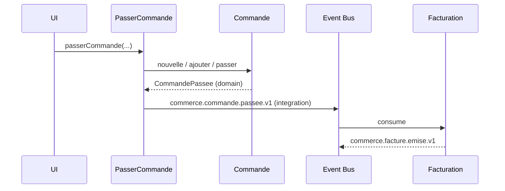

[🔝 Retour en haut de page](#table-des-matières)

## Pièges classiques

Liste des erreurs récurrentes en projet DDD, vues plus d'une fois.

### Modèle anémique (*Anemic Domain Model*)

Symptôme : des entités réduites à des sacs de getters/setters, toute la logique vit dans des « services ». L'objet métier ne *fait* rien. Conséquence : les invariants sont éparpillés, dupliqués, oubliés. Remède : pousser le comportement dans les agrégats, jusqu'à ne plus exposer de setters.

### Obsession des primitifs (*Primitive Obsession*)

Tout est `string`, `int`, `array`. Aucun typage métier, aucune validation au plus tôt. Remède : créer des objets-valeurs (`ClientId`, `Email`, `Money`, `Numero`) et les imposer dans les signatures.

### Agrégats poreux (*Leaky Aggregates*)

L'agrégat expose ses entités internes, qui sont mutées de l'extérieur. Les invariants ne sont plus garantis. Remède : retours en lecture seule (collections immuables), méthodes métier sur la racine, pas d'accesseur direct aux internals.

### Repositories qui retournent des DTOs

Un Repository qui ne renvoie pas un agrégat mais un objet plat est un *Query* déguisé. Cela mélange écriture et lecture, mine l'utilité du modèle riche. Remède : Repository pour les agrégats (côté write), *Query Service* pour les vues (côté read).

### Application Services qui font de la métier

Symptôme : l'orchestration calcule, décide, applique des règles. Le domaine est vidé de son sens. Remède : déplacer la logique dans les agrégats ou dans un Domain Service ; l'Application Service redevient un orchestrateur fin.

### Un Bounded Context = un microservice (forcément)

Faux. Un microservice est un choix de déploiement ; un Bounded Context est un choix de modélisation. On peut avoir plusieurs contextes dans un même service au début, et les extraire seulement quand le besoin émerge.

### Modèle universel partagé entre contextes

Vouloir une classe `Client` qui sert tout le système. Cela aboutit à un objet ingérable que personne ne contrôle. Remède : un `Client` par contexte, traduits aux frontières.

### CQRS / Event Sourcing par défaut

Adoptés pour leur réputation, sans besoin métier ni équipe formée. Coût opérationnel élevé pour bénéfice nul. Remède : commencer simple, n'introduire CQRS qu'en cas de divergence write/read avérée, n'introduire l'Event Sourcing que si l'historique a une valeur métier (audit, traçabilité réglementaire).

[🔝 Retour en haut de page](#table-des-matières)

## Le côté obscur : DDD comme jeu de vocabulaire

> **Avertissement.** Le risque le plus subtil avec le DDD n'est pas l'erreur technique : c'est le **mimétisme superficiel** où l'on renomme tout en *« domain »* sans rien changer à la pensée. Cette dérive est fréquente après une formation rapide ou la lecture distraite d'un livre.

### Les symptômes du DDD-théâtre

- `OrderService` est rebaptisé `OrderApplicationService` — le code reste un *transaction script* anémique. Aucun gain.
- Tout dossier porte un suffixe `Domain`, `Infrastructure`, `Application`, mais les classes circulent allègrement entre eux. La séparation est cosmétique.
- Le glossaire métier compte 200 termes — copiés depuis Wikipédia. Aucun expert métier ne le relit, aucun nouveau terme n'y entre.
- Les entités sont décorées en `@Entity` ORM avec des getters/setters publics, doublées d'un `Service` qui contient toute la logique. **Modèle anémique sous vernis DDD**.
- Les *Domain Events* sont en réalité des hooks ORM (`@PostPersist`) qui exposent l'état brut, sans intention métier.
- L'équipe parle de *« nos agrégats »* mais aucun n'est défendu (pas d'invariant testé, pas de méthode métier, pas d'encapsulation).

### Les questions diagnostiques

Pour mesurer si le DDD est *réel* ou *théâtral* dans une base de code, poser :

1. *« Combien de méthodes métier sur les agrégats ? Combien de getters/setters publics ? »* — Si le second domine, c'est anémique.
2. *« Le métier reconnaît-il les noms du code ? »* — Si non, le langage ubiquitaire est un slogan.
3. *« Qui a écrit le glossaire et quand a-t-il été modifié pour la dernière fois ? »* — Si la réponse est *« un dev, il y a six mois »*, le glossaire est mort.
4. *« Quelle règle métier non triviale est testée au niveau de l'agrégat ? »* — Si la réponse est *« aucune »*, le modèle est décoratif.
5. *« Que se passe-t-il quand on essaie de mettre l'agrégat dans un état invalide ? »* — Si le code l'autorise, ce n'est pas un agrégat.

### Le cargo-cult de l'arborescence

Une arborescence `Domain/`, `Application/`, `Infrastructure/` parfaite **ne dit rien** sur la qualité du modèle. Inversement, du **bon DDD** peut vivre dans une arborescence plate si les principes (modèle riche, langage ubiquitaire, frontières d'agrégats) sont respectés. La structure des dossiers est un **indice secondaire**, pas un critère.

### Sortir du théâtre

- mesurer la **densité métier** par classe (nombre de méthodes qui décident, vs nombre qui exposent) ;
- imposer en review : *« quel invariant cette méthode défend-elle ? »* — si la réponse est *« aucun »*, ce n'est pas une méthode d'agrégat ;
- réviser le **glossaire** avec un expert métier toutes les N semaines, supprimer les termes morts ;
- proscrire les **getters publics** sur les entités sauf justification explicite (sortie pour la persistance, lecture côté query) ;
- relier chaque classe aux **invariants** qu'elle protège, en commentaire ou ADR. Si on ne sait pas, c'est probablement à supprimer ou refondre.

> **Bilan.** Renommer ne suffit pas. Le DDD est un **changement de focale** (le métier au centre), pas une convention de nommage. Une équipe qui a *vraiment* adopté le DDD parle un dialecte commun avec son métier, défend ses invariants, et discute ses frontières — pas seulement ses suffixes de classe.

[🔝 Retour en haut de page](#table-des-matières)

## DDD et architectures voisines

Le DDD n'impose **pas** d'architecture technique. Il en suggère une famille — celles qui isolent le domaine — et se marie bien avec plusieurs courants.

### Architecture hexagonale (Ports & Adapters)

Alistair Cockburn (2005). Le domaine est au centre ; tout ce qui est externe (UI, base de données, message broker) passe par des *ports* (interfaces définies par le domaine) implémentés par des *adapters* (côté infrastructure). Le DDD définit *quoi* mettre dans le domaine ; l'hexagonal définit *comment* l'isoler. Combinaison naturelle. Voir le [dépôt dédié à la Clean Architecture / Hexagonale](https://github.com/Tan-Software/clean-architecture-hexagonale).

```mermaid
graph LR
    subgraph Hexagone
      D[Domaine + Application Services]
    end
    UI --> P1[Port entrant] --> D
    D --> P2[Port sortant : Repository] --> DB[(BDD)]
    D --> P3[Port sortant : Bus] --> MQ[(Broker)]
```

### Microservices

Un microservice mature respecte généralement la frontière d'un Bounded Context. Le DDD répond à la question *« quels services dois-je créer ? »* mieux que toute heuristique technique. Inversement, **tout Bounded Context n'a pas vocation à devenir un service** : commencer en monolithe modulaire est souvent prudent.

### Architectures *event-driven*

Les Domain Events fournissent une fondation native aux architectures pilotées par événements. CQRS, Event Sourcing, Sagas s'y greffent. Attention : un système *event-driven* mal conçu n'est qu'un *Big Ball of Mud* asynchrone. Le découpage stratégique reste prioritaire.

### Clean Architecture, Onion Architecture

Mêmes intentions que l'hexagonal : isoler le domaine. Le DDD vit aussi bien dans une Onion Architecture (Jeffrey Palermo) ou la Clean Architecture (Robert C. Martin). Le DDD apporte la matière du domaine ; ces architectures apportent l'organisation des dépendances.

### Ce que le DDD n'est pas

- une méthode de gestion de projet ;
- une suite de patterns à appliquer mécaniquement ;
- une architecture technique ;
- une garantie de succès si le langage ubiquitaire est superficiel.

[🔝 Retour en haut de page](#table-des-matières)

## Monolithe modulaire vs microservices

> **Définition — monolithe modulaire.** Application **déployée en une seule unité** mais structurée en **modules internes étanches**, chacun aligné sur un Bounded Context, communiquant exclusivement via des contrats explicites (interfaces publiques, événements internes, jamais d'accès direct aux internes des autres modules). Concept popularisé par Simon Brown (*Modular Monoliths*) et systématisé par DHH, Shopify, Stack Overflow.

### DDD ne dit pas microservices

Le livre d'Eric Evans (2003) **précède** la vague microservices (≈ 2014). Le DDD vit aussi bien — souvent **mieux** — dans un monolithe modulaire. Le couplage culturel *« DDD ⇒ microservices »* est récent et trompeur.

### Comparatif honnête

| Dimension | Monolithe modulaire | Microservices |
|-----------|---------------------|---------------|
| Bounded Contexts | Un module = un contexte. Frontière logique. | Un service = un contexte. Frontière physique. |
| Cohérence inter-contextes | Possible en transaction locale (avec discipline). | Eventual consistency obligatoire. |
| Refactoring inter-contextes | Aisé : `move-class` IDE entre modules. | Coûteux : versions d'API, double déploiement. |
| Déploiement | Une unité, une release. | Indépendant par service ; pipelines plus complexes. |
| Scalabilité | Verticale ; ou horizontalement par instance complète. | Horizontale par service ; granulaire. |
| Observabilité | Logs locaux, debug pas-à-pas. | Tracing distribué obligatoire. |
| Coût d'entrée | Faible : un repo, un build. | Élevé : orchestration, broker, observability stack. |
| Coût d'évolution | Croît avec la taille du repo. | Croît avec le nombre de services et leurs contrats. |

### Quand chaque choix se justifie

**Monolithe modulaire** :

- équipe < 30 développeurs ;
- besoin de cohérence forte fréquente entre contextes ;
- pas de pression de scalabilité hétérogène ;
- DDD encore en cours d'apprentissage (commencer logique avant physique).

**Microservices** :

- équipes nombreuses qui doivent livrer en **parallèle** sans synchronisation ;
- contextes avec **profils de charge** très différents (un service à 10 RPS, un autre à 10 000 RPS) ;
- besoin d'**isolation** technique (langages, bases, équipes) ;
- maturité opérationnelle confirmée (CI/CD, observabilité, chaos engineering).

### Trajectoire prudente

Une équipe qui adopte le DDD aujourd'hui gagne presque toujours à :

1. **commencer en monolithe modulaire** : un repo, un build, des modules clairement séparés ;
2. **respecter les Bounded Contexts dès le code** : pas d'import croisé, pas d'accès direct aux entités des autres modules ;
3. **publier des Domain Events / Integration Events en interne** comme si les modules étaient déjà distants ;
4. **n'extraire un microservice que sur signal explicite** : besoin d'autonomie de déploiement, profil de charge divergent, équipe dédiée justifiant la séparation.

> **Garde-fou.** Un monolithe modulaire bien fait se découpe en microservices *quand on en a besoin* ; un mauvais monolithe ne se découpe jamais proprement. Inversement, des microservices construits sans avoir d'abord pratiqué le découpage logique aboutissent au *distributed monolith* — le pire des deux mondes : couplage de monolithe, complexité de microservices. **L'ordre compte** : modélisation stratégique d'abord, choix de distribution ensuite.

```mermaid
graph LR
    A[Modélisation<br/>stratégique<br/>Bounded Contexts] --> B[Monolithe<br/>modulaire]
    B --> C{Signal<br/>d'extraction ?}
    C -- non --> B
    C -- oui --> D[Microservices<br/>par contexte]
```

[🔝 Retour en haut de page](#table-des-matières)

## Pour aller plus loin

- *Domain-Driven Design: Tackling Complexity in the Heart of Software* — Eric Evans (le « livre rouge », 2003)
- *Implementing Domain-Driven Design* — Vaughn Vernon (le « livre jaune », 2013)
- *Domain-Driven Design Distilled* — Vaughn Vernon (2016) — synthèse courte et accessible
- *Domain Modeling Made Functional* — Scott Wlaschin (2018) — DDD en F#, *parse don't validate*, types-sommes
- *Patterns, Principles, and Practices of Domain-Driven Design* — Scott Millett, Nick Tune (2015)
- *Learning Domain-Driven Design* — Vlad Khononov (O'Reilly, 2021) — moderne, pragmatique
- *Microservices Patterns* — Chris Richardson (Manning, 2018) — *Saga*, *Outbox*, *CDC*
- *CQRS Documents by Greg Young* — synthèse historique de CQRS / Event Sourcing
- *Building Event-Driven Microservices* — Adam Bellemare (O'Reilly, 2020)
- *Designing Data-Intensive Applications* — Martin Kleppmann (O'Reilly, 2017) — fondations event-driven, cohérence, replication
- [DDD Reference (PDF)](https://www.domainlanguage.com/wp-content/uploads/2016/05/DDD_Reference_2015-03.pdf) — synthèse officielle d'Eric Evans
- [DDD Crew](https://github.com/ddd-crew) — outils, *Bounded Context Canvas* (Nick Tune), *Aggregate Design Canvas*, *Core Domain Chart*
- [Bounded Context Canvas (template)](https://github.com/ddd-crew/bounded-context-canvas) — Nick Tune
- [EventStorming](https://www.eventstorming.com/) — méthode collaborative d'Alberto Brandolini
- [Modular Monolith Primer](https://martinfowler.com/articles/2024-evaluate-architecture.html) — Martin Fowler & co.
- [Microsoft — CQRS Journey](https://learn.microsoft.com/en-us/previous-versions/msp-n-p/jj554200(v=pandp.10)) — retour d'expérience long sur CQRS+ES

## Licence

Distribué sous licence [MIT](LICENSE).

## Auteur

**Tansoftware - Tanguy Chénier** · [LinkedIn](https://www.linkedin.com/in/tanguy-chenier) · [Tan-Software](https://github.com/Tan-Software) · [Compte personnel (derniers outils)](https://github.com/tanguychenier) · [tansoftware.com](https://www.tansoftware.com)
