# [Tansoftware](https://www.tansoftware.com) - Domain Driven Design [](README.md)

[](LICENSE) [](#) [](#) [](https://www.markdownguide.org/)

## Table des matières

- [Introduction](#introduction)
- [Glossaire express](#glossaire-express)
- [DDD stratégique vs DDD tactique](#ddd-stratégique-vs-ddd-tactique)
- [Modélisation du domaine](#modélisation-du-domaine)
- [Langage ubiquitaire](#langage-ubiquitaire)
- [Bounded Contexts](#bounded-contexts)
- [Context Map : les patterns de relation](#context-map--les-patterns-de-relation)
- [Entités, objets-valeurs et agrégats](#entités-objets-valeurs-et-agrégats)
- [Règles de conception des agrégats (Vernon)](#règles-de-conception-des-agrégats-vernon)
- [Factories et Modules](#factories-et-modules)
- [Repositories et Domain Services](#repositories-et-domain-services)
- [Application Services et CQRS](#application-services-et-cqrs)
- [Événements de domaine et Event Sourcing](#événements-de-domaine-et-event-sourcing)
- [Sagas et Process Managers](#sagas-et-process-managers)
- [Domain Events vs Integration Events](#domain-events-vs-integration-events)
- [Anti-Corruption Layer](#anti-corruption-layer)
- [Specification Pattern](#specification-pattern)
- [Exemple intégré : e-commerce multi-contextes](#exemple-intégré--e-commerce-multi-contextes)
- [Pièges classiques](#pièges-classiques)
- [DDD et architectures voisines](#ddd-et-architectures-voisines)
- [Pour aller plus loin](#pour-aller-plus-loin)

---
- [Prochaine étape : Clean Architecture](https://github.com/Tan-Software/clean-architecture-hexagonale)

## Introduction

Le *Domain-Driven Design* (DDD), formalisé par Eric Evans dans [*Domain-Driven Design: Tackling Complexity in the Heart of Software*](https://www.amazon.fr/Domain-Driven-Design-Tackling-Complexity/dp/0321125215) (2003), propose de placer la **complexité métier** au centre de la conception logicielle. Plutôt que de partir d'une base de données ou d'un framework, on modélise les concepts, les règles et les processus du métier ; le code en découle.

Cette approche prend tout son intérêt dès qu'un projet dépasse le simple CRUD : règles métier nombreuses, plusieurs équipes, plusieurs sous-domaines. Elle apporte trois bénéfices principaux : un vocabulaire partagé entre métier et technique, une frontière claire entre sous-domaines, et un découplage du domaine vis-à-vis de l'infrastructure.

### Domaine, sous-domaines, *core domain*

- **Domaine** : le secteur d'activité que le logiciel sert (assurance, e-commerce, santé).
- **Sous-domaine** : une zone fonctionnelle du domaine. Trois natures :
  - *Core domain* — l'avantage compétitif, là où l'on doit investir.
  - *Supporting subdomain* — nécessaire mais non différenciant ; on peut le développer simplement.
  - *Generic subdomain* — résolu par n'importe quel acteur du marché (authentification, facturation standard) ; à acheter ou intégrer.
- **Espace problème vs espace solution** : les sous-domaines décrivent le *problème* à résoudre ; les bounded contexts décrivent la *solution* logicielle. Le mapping n'est pas forcément 1-1.

[🔝 Retour en haut de page](#table-des-matières)

## Glossaire express

Référentiel court des termes employés dans ce mémo. Chaque concept est détaillé plus bas.

| Terme | Définition |
|-------|------------|
| **Domaine** | Le secteur d'activité métier servi par le logiciel. |
| **Sous-domaine** | Une zone fonctionnelle du domaine (core, supporting, generic). |
| **Bounded Context** | Frontière explicite dans laquelle un modèle et un langage sont cohérents. |
| **Langage ubiquitaire** | Vocabulaire unique partagé par métier et technique au sein d'un contexte. |
| **Entité** | Objet défini par une **identité stable** dans le temps, indépendamment de ses attributs. |
| **Objet-valeur** (*Value Object*) | Objet **immuable** défini uniquement par ses attributs, sans identité propre. |
| **Agrégat** | Cluster d'entités et d'objets-valeurs traité comme une **unité de cohérence transactionnelle**. |
| **Racine d'agrégat** (*Aggregate Root*) | Entité unique servant de point d'entrée à l'agrégat, garante de ses invariants. |
| **Repository** | Abstraction de persistance offrant l'illusion d'une collection en mémoire d'agrégats. |
| **Factory** | Composant chargé de la **construction cohérente** d'un agrégat ou d'un objet-valeur complexe. |
| **Domain Service** | Logique métier sans foyer naturel dans une entité ou un objet-valeur ; vit dans la couche domaine. |
| **Application Service** | Orchestrateur de cas d'usage ; ouvre une transaction, appelle le domaine, persiste, publie. **Sans logique métier**. |
| **Module** | Regroupement nommé d'éléments du modèle, équivalent d'un *package* aligné sur le langage ubiquitaire. |
| **Context Map** | Cartographie explicite des relations entre Bounded Contexts. |
| **Anti-Corruption Layer** | Couche de traduction entre deux contextes, protégeant le modèle local. |
| **CQRS** | *Command Query Responsibility Segregation* : modèles distincts pour l'écriture et la lecture. |
| **Event Sourcing** | Persistance d'un agrégat sous forme de la **séquence d'événements** qui l'ont fait advenir. |
| **Eventual Consistency** | Cohérence asynchrone entre agrégats ou contextes ; toléré pour gagner en disponibilité. |
| **Saga / Process Manager** | Coordinateur d'un workflow métier long traversant plusieurs agrégats. |
| **Domain Event** | Fait métier passé, immuable, émis à l'intérieur d'un contexte. |
| **Integration Event** | Événement publié vers d'autres contextes ou services, sous contrat stable. |
| **Projection** | Logique qui consomme des événements pour construire un *read model*. |
| **Read Model** | Vue dénormalisée optimisée pour la lecture (côté queries). |
| **Write Model** | Modèle riche optimisé pour la cohérence et l'application des invariants (côté commands). |

[🔝 Retour en haut de page](#table-des-matières)

## DDD stratégique vs DDD tactique

Eric Evans organise le DDD en deux niveaux complémentaires. La plupart des échecs viennent d'équipes qui sautent directement au tactique sans poser le stratégique.

### DDD stratégique — découper et relier

Concerne la **structure macro** du système. Les questions stratégiques :

- Quels sont les sous-domaines ? Lesquels sont *core*, *supporting*, *generic* ?
- Où passent les Bounded Contexts ?
- Comment ces contextes communiquent-ils ?
- Quel langage ubiquitaire dans chacun ?

Outils stratégiques : **sous-domaines**, **Bounded Contexts**, **Context Map**, **langage ubiquitaire**, **distillation du *core domain***.

### DDD tactique — modéliser à l'intérieur d'un contexte

Concerne la **modélisation fine** dans un Bounded Context donné. Les patterns tactiques :

- **Entités**, **objets-valeurs**, **agrégats** ;
- **Repositories**, **Factories**, **Domain Services** ;
- **Application Services**, **Modules** ;
- **Domain Events**.

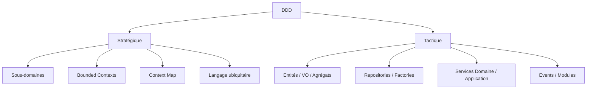

Règle pratique : **commencer toujours par le stratégique**. Un découpage en contextes mauvais ne se rattrape pas avec des patterns tactiques élégants.

[🔝 Retour en haut de page](#table-des-matières)

## Modélisation du domaine

Modéliser un domaine, c'est extraire les concepts essentiels d'un métier et les organiser en un modèle compréhensible et exécutable. Le modèle n'est pas la réalité : c'est une simplification utile, négociée avec les experts métier.

### Démarche en quatre temps

1. [Comprendre les concepts métier](#1-comprendre-les-concepts-métier)
2. [Identifier entités, attributs et relations](#2-identifier-entités-attributs-et-relations)
3. [Choisir une notation adaptée](#3-choisir-une-notation-adaptée)
4. [Itérer avec les experts métier](#4-itérer-avec-les-experts-métier)

### 1. Comprendre les concepts métier

Avant tout code, on s'imprègne du domaine. Les techniques utiles :

- entretiens individuels avec les experts métier ;
- lecture des spécifications, contrats, manuels existants ;
- observation directe des utilisateurs (*shadowing*) ;
- ateliers d'[Event Storming](https://www.eventstorming.com/) (Alberto Brandolini) pour cartographier collectivement les événements clés.

Exemple, sur un domaine bancaire, des concepts qui émergent :

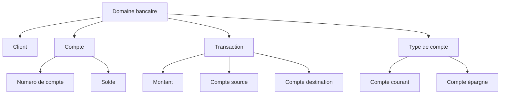

### 2. Identifier entités, attributs et relations

Une fois les concepts dégagés, on les classe :

- **Entités** : objets identifiés (un `Client` reste le même client même si son nom change).
- **Attributs** : propriétés caractérisant une entité ou un objet-valeur.
- **Relations** : liens entre entités, avec leur cardinalité (`1-1`, `1-n`, `n-m`).

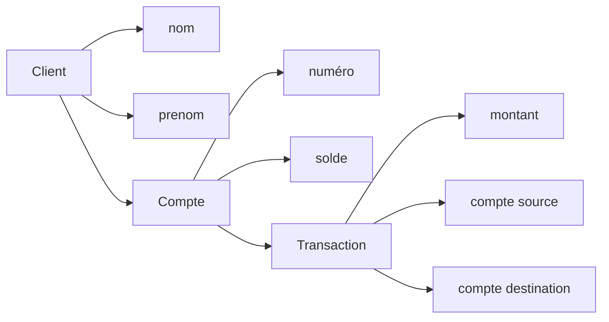

### 3. Choisir une notation adaptée

| Notation | Forces | Limites |
|----------|--------|---------|
| Diagrammes de classe UML | Précis, normalisés | Verbeux, peuvent intimider le métier |
| Diagrammes de flux / BPMN | Adaptés aux processus | Moins adaptés à la structure |
| Mind maps | Rapides, collaboratifs | Pas de sémantique stricte |
| Event Storming (post-it) | Excellents en atelier métier | Volatil, à transcrire |

Outils libres usuels : [PlantUML](https://plantuml.com/), [Mermaid](https://mermaid.js.org/), [draw.io](https://app.diagrams.net/).

Exemple de diagramme de classes pour le domaine bancaire :

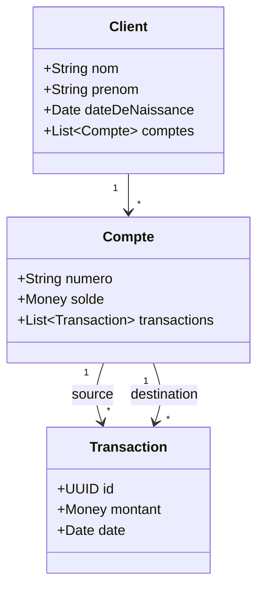

### 4. Itérer avec les experts métier

Le modèle naît d'aller-retours. Conseils :

- **Ateliers réguliers** plutôt que validations ponctuelles.
- **Vocabulaire ubiquitaire** : utiliser dans les diagrammes les mots exacts du métier.
- **Représentation visuelle** : un diagramme corrige plus vite qu'un texte.
- **Itérer** : un modèle figé devient inexact au premier changement métier.

[🔝 Retour en haut de page](#table-des-matières)

## Langage ubiquitaire

Le *langage ubiquitaire* (Eric Evans, 2003) est un vocabulaire **unique** partagé par toute l'équipe — métier, développeurs, testeurs, support. Les mêmes mots désignent les mêmes concepts dans les conversations, les documents, les diagrammes et le code.

### Pourquoi

Une traduction silencieuse entre vocabulaire métier et vocabulaire technique est une source permanente de bugs. Si l'expert dit *« contrat cadre »*, le développeur écrit `MasterAgreement`, et le testeur valide *« accord principal »*, les trois croient parler de la même chose jusqu'au premier malentendu coûteux.

### Mise en pratique

- **Glossaire vivant** : un fichier (wiki, `GLOSSARY.md`) listant les termes et leurs définitions, mis à jour à chaque changement.
- **Discipline du code** : noms de classes, méthodes, événements et tables collés au vocabulaire métier.
- **Pas de jargon technique inutile** : éviter `UserDtoManagerImpl` quand le métier parle de `Adhérent`.
- **Cohérence au sein d'un Bounded Context** : un même mot peut signifier deux choses dans deux contextes ; le langage ubiquitaire est local à un contexte.

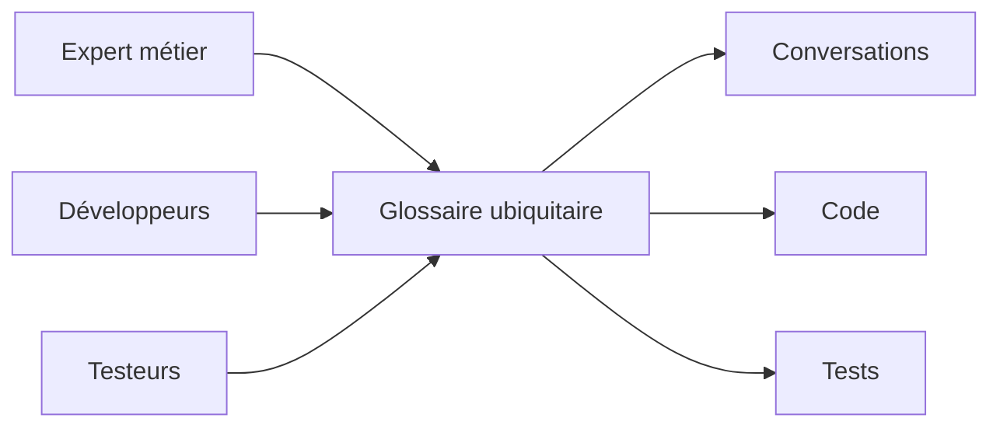

[🔝 Retour en haut de page](#table-des-matières)

## Bounded Contexts

Un *Bounded Context* (contexte délimité) est une **frontière explicite** à l'intérieur de laquelle un modèle et un langage sont cohérents. Au-delà de la frontière, les mêmes mots peuvent désigner des choses différentes : un `Client` du contexte *Vente* (prospect, panier) n'est pas le `Client` du contexte *Comptabilité* (numéro de SIRET, encours).

### Pourquoi

Vouloir un seul modèle universel pour tout le système amène inévitablement à des compromis qui ne servent personne. Découper en contextes laisse chaque équipe optimiser le sien sans gêner les autres.

### Identifier les contextes

Indices d'une frontière de contexte :

- changement d'équipe ou de service responsable ;
- vocabulaire qui se met à diverger ;
- règles métier qui s'appliquent ici mais pas là ;
- changement de granularité ou de cycle de vie.

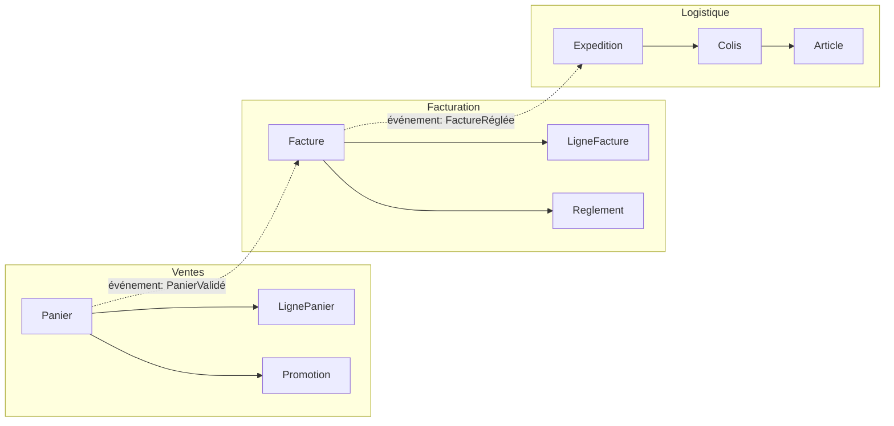

### Cartographier les relations entre contextes

Eric Evans définit plusieurs patterns pour décrire les relations inter-contextes : *Shared Kernel*, *Customer/Supplier*, *Conformist*, *Anti-Corruption Layer*, *Open Host Service*, *Published Language*, *Partnership*, *Separate Ways*, *Big Ball of Mud*. Le choix dépend du rapport de pouvoir et de la confiance entre équipes. Ils sont détaillés dans la section suivante.

[🔝 Retour en haut de page](#table-des-matières)

## Context Map : les patterns de relation

La *Context Map* documente honnêtement comment les Bounded Contexts s'articulent — équipes, dépendances, contrats, rapports de force. Sa valeur tient à sa fidélité au réel : une carte qui décrit la situation idéale n'est qu'un vœu pieux.

### Patterns inter-contextes

| Pattern | Ce que c'est | Quand l'utiliser |
|---------|--------------|------------------|
| **Partnership** | Deux équipes liées par un succès ou un échec commun, coordination forte. | Lorsque deux contextes ne peuvent pas livrer indépendamment ; coût relationnel élevé. |
| **Shared Kernel** | Petit modèle partagé entre deux contextes, modifié de manière concertée. | Si la duplication coûterait plus cher que la coordination ; rare et exigeant. |
| **Customer / Supplier** | Le contexte amont (*upstream*) sert le contexte aval (*downstream*) ; l'aval a un poids client reconnu. | Équipes alignées, ressources allouées, planification possible côté amont. |
| **Conformist** | L'aval se conforme au modèle de l'amont, sans pouvoir de négociation. | Quand l'amont est imposé (legacy, fournisseur externe, équipe puissante). |
| **Anti-Corruption Layer (ACL)** | L'aval traduit le modèle de l'amont via une couche de protection. | Modèle amont incompatible ou instable ; on protège le modèle local. |
| **Open Host Service (OHS)** | L'amont publie un protocole stable utilisable par plusieurs aval. | Lorsqu'un contexte sert de plateforme à plusieurs consommateurs. |
| **Published Language** | Langage d'échange documenté et versionné (souvent couplé à OHS). | Contrats inter-équipes ou inter-organisations stables. |
| **Separate Ways** | Aucune intégration ; chacun mène sa route. | Quand l'intégration coûte plus que sa valeur. |
| **Big Ball of Mud** | Zone sans frontière claire, modèle entremêlé. | À reconnaître pour l'isoler ; jamais à choisir volontairement. |

### Représenter la carte

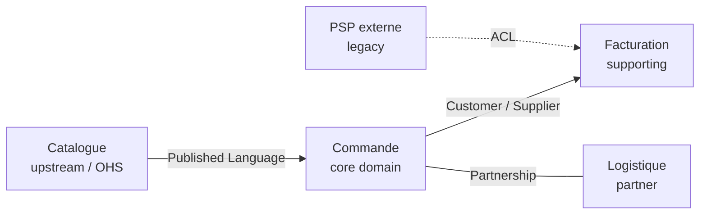

### Choisir un pattern

Le choix dépend de deux axes : **rapport de pouvoir** entre équipes (qui peut imposer un changement à qui ?) et **stabilité du modèle amont**. Une équipe aval avec peu de poids face à un amont instable a tout intérêt à intercaler une *Anti-Corruption Layer*. À l'inverse, deux équipes proches avec des objectifs alignés peuvent vivre en *Partnership*.

[🔝 Retour en haut de page](#table-des-matières)

## Entités, objets-valeurs et agrégats

Trois briques de modélisation tactique du DDD.

### Entité

Une entité a une **identité stable** dans le temps. Deux instances avec les mêmes attributs ne sont pas la même entité ; deux références au même identifiant le sont.

```php
final class Client {
    public function __construct(
        public readonly ClientId $id,   // identité
        public string $nom,             // attributs mutables
        public string $email,
    ) {}
}
```

### Objet-valeur (*Value Object*)

Un objet-valeur est défini **uniquement par ses attributs**. Il est immuable : modifier revient à en créer un nouveau. Égalité = égalité de valeurs.

```php
final class Money {
    public function __construct(
        public readonly int $centimes,
        public readonly Devise $devise,
    ) {}

    public function plus(Money $autre): Money {
        if ($autre->devise !== $this->devise) { throw new DomainException('devise'); }
        return new Money($this->centimes + $autre->centimes, $this->devise);
    }
}
```

Bons candidats : `Adresse`, `Money`, `IntervalleDeDates`, `Couleur`. Mauvais candidats : ce qui a un cycle de vie ou une histoire.

### Agrégat

Un agrégat est un **groupe d'entités et d'objets-valeurs traités comme un tout cohérent**, accédé exclusivement via une *racine d'agrégat* (entité). La racine garantit les invariants du groupe et est la seule à être référencée de l'extérieur.

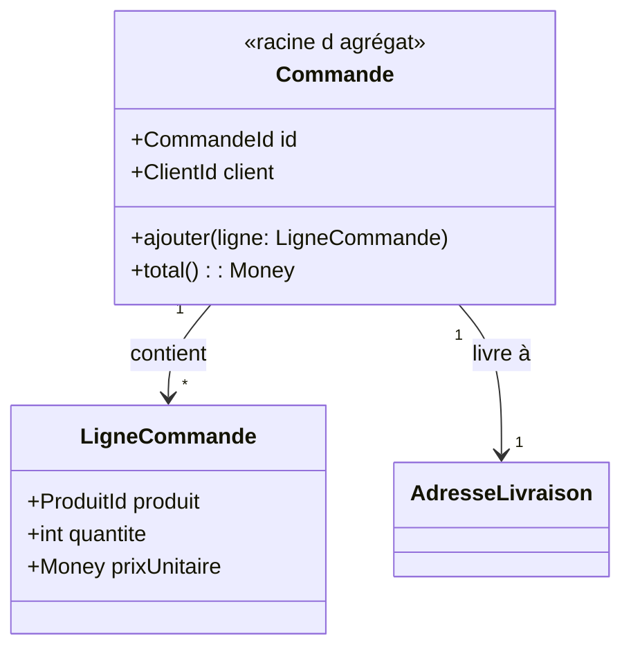

Règles d'agrégat :

- une transaction = un agrégat modifié (sinon scinder en deux agrégats) ;
- les références entre agrégats se font par **identifiant**, pas par référence d'objet ;
- petits agrégats : plus c'est gros, plus la concurrence et la persistance deviennent douloureuses.

[🔝 Retour en haut de page](#table-des-matières)

## Règles de conception des agrégats (Vernon)

Vaughn Vernon, dans *Implementing Domain-Driven Design* (2013), formule **quatre règles** pour éviter les agrégats obèses qui paralysent la persistance et la concurrence.

### 1. Modéliser de vraies *consistency boundaries*

Un agrégat existe pour qu'**un ensemble d'invariants** soit toujours vrai après chaque transaction. Ce qui ne participe pas à un invariant n'a rien à faire dans l'agrégat. Question piège à se poser : *« Si cet attribut était sur un autre agrégat, quelle règle métier serait violée ? »* Si la réponse est *« aucune »*, c'est qu'il faut sortir l'attribut.

### 2. Concevoir de petits agrégats

Un agrégat doit être **chargeable et persistable d'un bloc** sans douleur. Les agrégats massifs (une `Commande` qui contient toutes ses lignes, ses paiements, ses retours, ses messages) provoquent :

- des verrous concurrents pénibles ;
- des chargements coûteux (toute la grappe est lue alors qu'on n'en utilise qu'une partie) ;
- des conflits d'écriture sur des champs sans rapport entre eux.

Heuristique : si plusieurs cas d'usage modifient des sous-parties indépendantes de la même grappe, scinder.

### 3. Référencer les autres agrégats par identifiant

Aucune référence d'objet directe entre agrégats. Une `Commande` ne tient pas un `Client` mais un `ClientId`. Cela :

- évite de charger des grappes entières par effet domino ;
- clarifie les frontières transactionnelles ;
- permet de stocker les agrégats dans des bases différentes (utile en microservices) ;
- réduit le couplage entre modules.

```php
final class Commande {
    private ClientId $client;     // pas Client $client
    private CatalogueProduitId $catalogue;
}
```

### 4. Mettre à jour les autres agrégats en cohérence à terme

Une transaction ne touche **qu'un seul agrégat**. Les autres agrégats à mettre à jour le sont **par événements** dans une transaction ultérieure (*eventual consistency*).

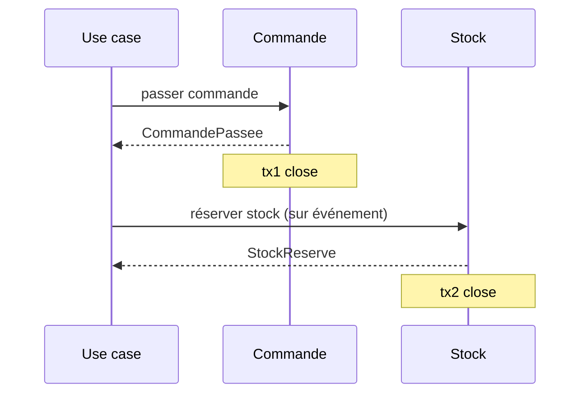

Quand exiger la cohérence forte (deux agrégats dans la même transaction) ? Réponse de Vernon : **presque jamais**. Si on en a vraiment besoin, c'est probablement que le découpage est faux — ou que la règle métier elle-même tolère une asynchronie qu'on n'a pas vue.

[🔝 Retour en haut de page](#table-des-matières)

## Factories et Modules

### Factory

Une *Factory* est responsable de la **construction cohérente** d'un agrégat ou d'un objet-valeur lorsque la création n'est pas triviale : invariants à vérifier, choix de sous-classe, dépendances externes nécessaires. Elle évite de polluer le constructeur ou d'éparpiller la logique d'instanciation dans les Application Services.

```php
final class FactureFactory {
    public function __construct(
        private NumerotationFactures $numerotation,
        private GrilleTVA $tva,
    ) {}

    public function depuisCommande(Commande $commande, DateTimeImmutable $emiseLe): Facture {
        $numero = $this->numerotation->prochainNumero($emiseLe);
        $taux = $this->tva->tauxApplicable($commande->paysLivraison(), $emiseLe);
        return Facture::nouvelle($numero, $commande, $taux, $emiseLe);
    }
}
```

Quand utiliser une Factory ?

- la création requiert plusieurs étapes ou plusieurs sources ;
- on doit choisir entre plusieurs implémentations selon le contexte ;
- on veut empêcher la création d'un agrégat dans un état invalide.

Quand s'en passer : un constructeur statique nommé sur la racine (`Commande::nouvelle(...)`) suffit pour les cas simples et reste dans le langage ubiquitaire.

### Module

Un *Module* (ou *Package*) est un regroupement nommé d'éléments du modèle. Le nom du module **fait partie du langage ubiquitaire** : il dit quelque chose du métier, pas de la technique. Préférer `App\Domain\Commande` à `App\Domain\Entities`.

Lignes directrices :

- un module = un concept cohérent du domaine ;
- couplage faible entre modules, fort à l'intérieur ;
- aligner les modules sur les chapitres du langage ubiquitaire, pas sur les couches techniques.

```text
src/
  Catalogue/        # bounded context
    Domain/
      Produit/      # module
      Categorie/
    Application/
    Infrastructure/
  Commande/
    Domain/
      Commande/
      Panier/
    Application/
    Infrastructure/
```

[🔝 Retour en haut de page](#table-des-matières)

## Repositories et Domain Services

### Repository

Un *Repository* offre l'illusion d'une collection en mémoire de tous les agrégats d'un type. Il cache la persistance (ORM, fichier, API) derrière une interface définie par le domaine.

```php
namespace App\Domain\Commande;

interface CommandeRepository {
    public function find(CommandeId $id): ?Commande;
    public function add(Commande $commande): void;
    public function remove(Commande $commande): void;
}
```

L'implémentation vit dans la couche infrastructure :

```php
namespace App\Infrastructure\Doctrine\Commande;

use App\Domain\Commande\{Commande, CommandeId, CommandeRepository};
use Doctrine\ORM\EntityManagerInterface;

final class DoctrineCommandeRepository implements CommandeRepository {
    public function __construct(private EntityManagerInterface $em) {}

    public function find(CommandeId $id): ?Commande {
        return $this->em->find(Commande::class, $id);
    }

    public function add(Commande $commande): void {
        $this->em->persist($commande);
    }

    public function remove(Commande $commande): void {
        $this->em->remove($commande);
    }
}
```

Notes :

- un Repository **par racine d'agrégat**, pas par table ;
- `flush()` n'est pas la responsabilité du Repository ; il est piloté par l'Application Service ou un middleware transactionnel.

### Domain Service

Un *Domain Service* abrite la logique métier qui n'appartient naturellement à aucune entité ou objet-valeur (souvent parce qu'elle implique plusieurs agrégats). Il reste dans la couche domaine et reste agnostique de l'infrastructure.

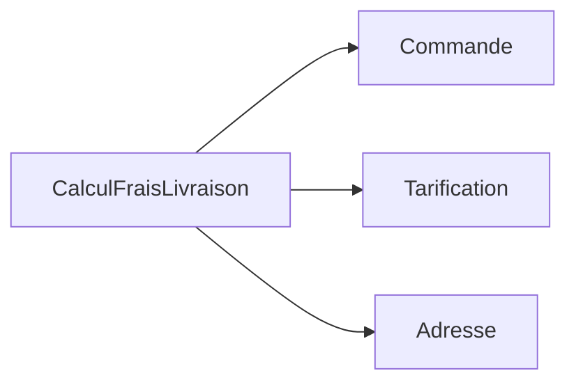

Exemple : un calcul de frais de livraison qui combine la commande, la grille tarifaire du transporteur et l'adresse — aucune de ces données n'est plus naturellement chez l'autre.

[🔝 Retour en haut de page](#table-des-matières)

## Application Services et CQRS

### Application Services

Les *Application Services* sont la porte d'entrée du domaine pour la couche présentation. Ils orchestrent : ils ouvrent une transaction, chargent les agrégats nécessaires, appellent leurs méthodes métier, persistent, émettent les événements, ferment la transaction.

```php
final class PasserCommande {
    public function __construct(
        private CommandeRepository $commandes,
        private CatalogueProduits $catalogue,
        private EventDispatcher $events,
    ) {}

    public function __invoke(PasserCommandeInput $input): CommandeId {
        $commande = Commande::nouvelle($input->client);
        foreach ($input->lignes as $l) {
            $produit = $this->catalogue->trouver($l->produitId)
                ?? throw new ProduitInconnu($l->produitId);
            $commande->ajouter(new LigneCommande($produit->id, $l->quantite, $produit->prix));
        }
        $this->commandes->add($commande);
        $this->events->dispatch(new CommandePassee($commande->id));
        return $commande->id;
    }
}
```

Règle : **un Application Service ne contient pas de logique métier** ; il ne fait qu'orchestrer.

### CQRS

CQRS (*Command Query Responsibility Segregation*, [Greg Young, 2010](https://martinfowler.com/bliki/CQRS.html)) sépare le modèle d'écriture du modèle de lecture :

| Côté | Rôle | Optimisé pour |
|------|------|---------------|
| **Commands** | Modifient l'état (réservations, paiements). | Cohérence, invariants, agrégats. |
| **Queries** | Lisent l'état (listes, vues, dashboards). | Performance, projections dénormalisées. |

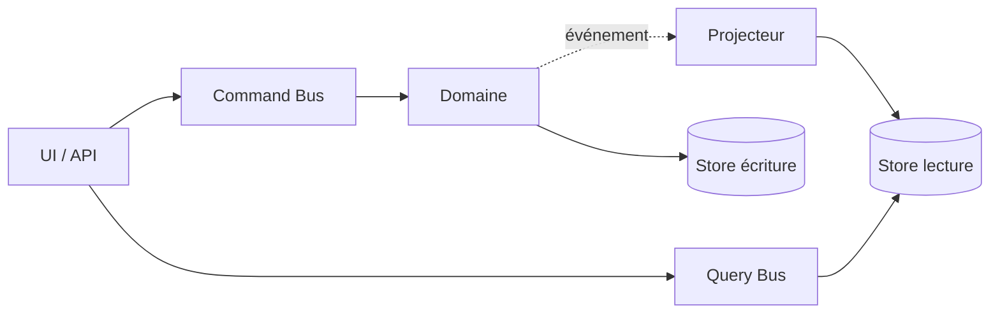

CQRS ne se justifie que là où lecture et écriture ont des modèles ou des charges divergents ; dans le doute, **commencer sans**.

[🔝 Retour en haut de page](#table-des-matières)

## Événements de domaine et Event Sourcing

### Événement de domaine

Un *Domain Event* est un fait métier passé, immuable, exprimé au passé : `CommandePassee`, `PaiementRefuse`, `ColisLivre`. Il découple les producteurs des consommateurs : la commande ne sait pas qui s'intéresse à sa validation.

Caractéristiques :

- **immuable** ; un événement ne se modifie pas, il se compense par un autre événement ;
- **complet** ; il porte l'information dont les abonnés auront besoin (éviter le retour à la base) ;
- **émis par un agrégat** lorsqu'un changement d'état significatif a lieu.

### Event Sourcing

L'*Event Sourcing* persiste un agrégat **sous la forme de la séquence d'événements qui l'ont fait advenir**, plutôt que de son état courant. L'état est reconstruit en rejouant les événements.

| Bénéfice | Coût |
|----------|------|
| Historique complet, audit gratuit | Requêtes complexes à projeter |
| Reconstruction d'états passés | Versionnage des événements obligatoire |
| Synergie naturelle avec CQRS | Outillage et expertise spécifiques |
| Détection rétroactive de bugs | Impossibilité de modifier le passé |

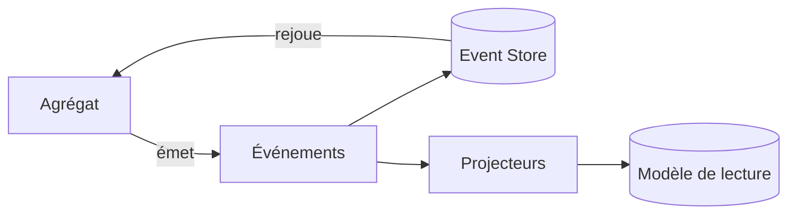

L'Event Sourcing reste un choix lourd : à n'envisager que sur les domaines où la traçabilité a une valeur métier (finance, santé, audit réglementaire).

### Stratégie de snapshots et de rejeu

Quand l'historique grandit, rejouer tous les événements à chaque chargement devient coûteux. Le palliatif est le **snapshot** : un instantané périodique de l'état d'un agrégat, à partir duquel on rejoue uniquement les événements postérieurs.

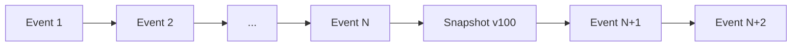

Heuristique : *snapshoter* tous les *N* événements (50, 100…), garder l'historique brut pour l'audit, et accepter que le snapshot soit une simple optimisation, jamais une source de vérité.

### Versionnage des événements

Un événement persisté ne peut plus changer. Quand le métier évolue (ajout d'un champ, renommage), trois techniques coexistent :

- **Upcaster** : transformation à la lecture qui adapte les anciens événements à la dernière version.
- **Multiple émissions** : produire l'ancienne et la nouvelle version pendant une période de transition.
- **Copy-and-replace** : reconstruire un nouveau flux à partir de l'ancien (lourd mais propre).

### Inconvénients à connaître

- complexité opérationnelle (event store dédié, projections à reconstruire) ;
- requêtes ad-hoc impossibles sans projection préalable ;
- débogage moins direct (l'état actuel est dérivé) ;
- onboarding plus long pour les équipes.

[🔝 Retour en haut de page](#table-des-matières)

## Sagas et Process Managers

### Pourquoi un coordinateur ?

Quand un cas d'usage métier traverse **plusieurs agrégats** (potentiellement plusieurs Bounded Contexts), aucun agrégat n'est légitime pour porter la transaction. Une *saga* ou un *process manager* coordonne le workflow, gère les états intermédiaires, et déclenche des **compensations** quand une étape échoue.

> **Saga vs Process Manager** : la littérature les confond souvent. Convention courante : la *saga* est chorégraphiée (les événements eux-mêmes déclenchent la suite, pas de chef d'orchestre) ; le *process manager* est orchestré (un composant central pilote les étapes). En pratique, on choisit selon le couplage acceptable.

### Exemple : passage d'une commande

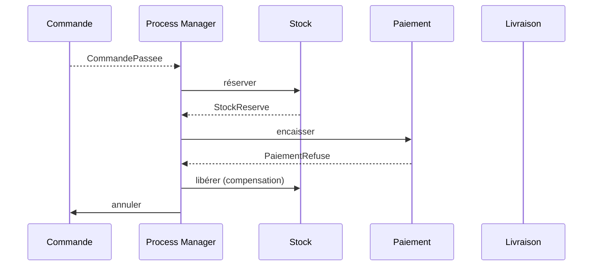

### Compensations, pas rollbacks

Aucune transaction distribuée à deux phases : chaque étape est locale et atomique. Si une étape échoue, les étapes précédemment validées sont compensées par des actions métier de sens contraire (rembourser, libérer le stock, annuler la commande). La compensation appartient au métier et porte un nom du langage ubiquitaire.

### Squelette d'un Process Manager

```php
final class PassageCommandeProcessManager {
    public function quand(CommandePassee $e): void {
        $this->commandes->reserverStock($e->commandeId);
    }
    public function quand(StockReserve $e): void {
        $this->paiements->encaisser($e->commandeId);
    }
    public function quand(PaiementRefuse $e): void {
        $this->stock->liberer($e->commandeId);
        $this->commandes->annuler($e->commandeId, motif: 'paiement refusé');
    }
}
```

[🔝 Retour en haut de page](#table-des-matières)

## Domain Events vs Integration Events

Distinction essentielle, souvent floue.

| Aspect | Domain Event | Integration Event |
|--------|--------------|-------------------|
| Portée | Interne au Bounded Context. | Inter-contextes ou inter-services. |
| Couplage | Couplé au modèle local. | Découplé, stable, versionné. |
| Émetteur | Un agrégat. | Un *publisher* dédié, après la transaction. |
| Forme | Structure riche, alignée sur le langage ubiquitaire interne. | Contrat documenté (souvent JSON Schema, Avro, Protobuf). |
| Cohérence | Synchrone à la transaction émettrice. | Asynchrone, *eventual consistency*. |
| Exemple | `LignePanierAjoutee` (interne au Panier). | `CommandePassee` publiée vers Facturation et Livraison. |

### Anti-pattern : exposer ses Domain Events

Publier directement les Domain Events sur le bus inter-services lie tous les consommateurs au modèle interne du producteur : tout renommage de champ devient une migration distribuée. **Toujours traduire** un Domain Event en Integration Event au moment de la publication externe — c'est encore une forme d'Anti-Corruption Layer, sortante.

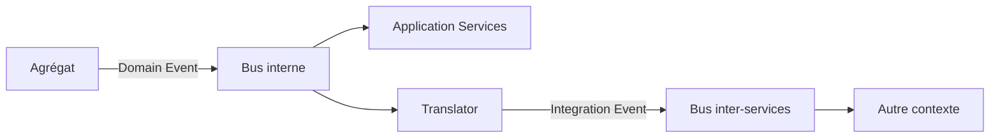

[🔝 Retour en haut de page](#table-des-matières)

## Anti-Corruption Layer

Une *Anti-Corruption Layer* (ACL) est une couche de traduction placée entre deux Bounded Contexts pour empêcher les concepts de l'un de polluer l'autre. Elle convertit les modèles dans les deux sens et absorbe les dialectes étrangers.

### Pourquoi

Quand un système doit s'intégrer à un legacy, à un SaaS, ou à un contexte voisin avec un modèle différent, importer ses concepts directement contamine le modèle local. Une ACL préserve l'intégrité du modèle, au prix d'un mapping explicite.

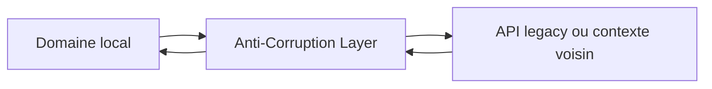

L'ACL est typiquement composée d'adaptateurs (côté infrastructure) et de traducteurs (DTOs vers objets de domaine).

[🔝 Retour en haut de page](#table-des-matières)

## Specification Pattern

Le *Specification Pattern* ([Eric Evans & Martin Fowler, 2002](https://www.martinfowler.com/apsupp/spec.pdf)) encapsule une règle métier booléenne dans un objet réutilisable, composable par opérateurs logiques (`et`, `ou`, `non`).

### Exemple

```php
interface Specification {
    public function isSatisfiedBy(object $candidat): bool;
}

final class CommandeAuDessusDe implements Specification {
    public function __construct(private Money $seuil) {}
    public function isSatisfiedBy(object $c): bool {
        return $c instanceof Commande && $c->total()->ge($this->seuil);
    }
}

final class ClientPremium implements Specification {
    public function isSatisfiedBy(object $c): bool {
        return $c instanceof Commande && $c->client()->estPremium();
    }
}

// Composition
$eligibleLivraisonGratuite =
    (new CommandeAuDessusDe(new Money(5000, Devise::EUR)))
    ->ou(new ClientPremium());
```

### Bénéfices

- règle métier nommée, testable isolément ;
- réutilisable en validation *et* en filtrage de Repository ;
- composable sans toucher aux implémentations existantes (OCP).

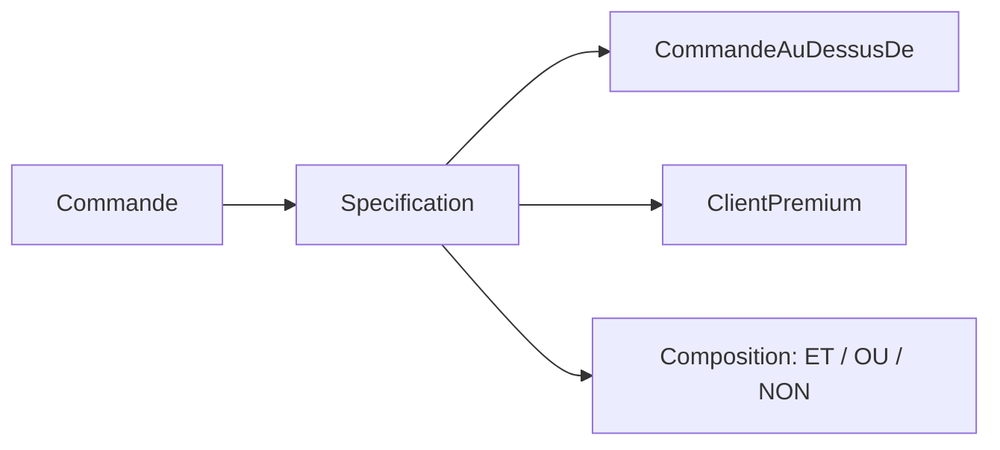

[🔝 Retour en haut de page](#table-des-matières)

## Exemple intégré : e-commerce multi-contextes

Mise en situation complète d'un e-commerce, simplifié mais cohérent. Trois Bounded Contexts collaborent via événements : **Catalogue**, **Commande**, **Facturation**.

### Vue d'ensemble

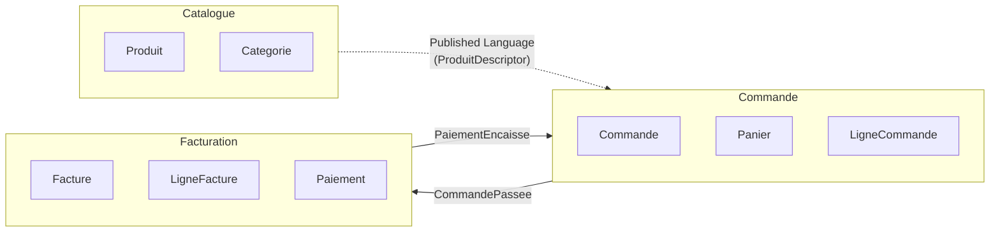

### Bounded Context *Commande*

#### Objet-valeur

```php
namespace App\Commande\Domain;

final class Money {
    public function __construct(
        public readonly int $centimes,
        public readonly Devise $devise,
    ) {
        if ($centimes < 0) { throw new DomainException('Montant négatif interdit'); }
    }
    public function plus(Money $autre): Money {
        $this->memeDevise($autre);
        return new Money($this->centimes + $autre->centimes, $this->devise);
    }
    public function fois(int $quantite): Money {
        return new Money($this->centimes * $quantite, $this->devise);
    }
    private function memeDevise(Money $autre): void {
        if ($autre->devise !== $this->devise) {
            throw new DomainException('Devises différentes');
        }
    }
}
```

#### Entité interne à l'agrégat

```php
final class LigneCommande {
    public function __construct(
        public readonly ProduitId $produit,
        public readonly int $quantite,
        public readonly Money $prixUnitaire,
    ) {
        if ($quantite <= 0) { throw new DomainException('Quantité invalide'); }
    }
    public function sousTotal(): Money {
        return $this->prixUnitaire->fois($this->quantite);
    }
}
```

#### Racine d'agrégat

```php
final class Commande {
    /** @var list<LigneCommande> */
    private array $lignes = [];
    private StatutCommande $statut;
    /** @var list<object> */
    private array $eventsEnAttente = [];

    private function __construct(
        public readonly CommandeId $id,
        public readonly ClientId $client,
    ) {
        $this->statut = StatutCommande::Brouillon;
    }

    public static function nouvelle(ClientId $client): self {
        return new self(CommandeId::generer(), $client);
    }

    public function ajouter(ProduitId $produit, int $quantite, Money $prix): void {
        if ($this->statut !== StatutCommande::Brouillon) {
            throw new DomainException('Commande déjà passée');
        }
        $this->lignes[] = new LigneCommande($produit, $quantite, $prix);
    }

    public function passer(): void {
        if ($this->lignes === []) {
            throw new DomainException('Commande vide');
        }
        $this->statut = StatutCommande::Passee;
        $this->eventsEnAttente[] = new CommandePassee($this->id, $this->client, $this->total());
    }

    public function total(): Money {
        return array_reduce(
            $this->lignes,
            fn (Money $acc, LigneCommande $l) => $acc->plus($l->sousTotal()),
            new Money(0, Devise::EUR),
        );
    }

    /** @return list<object> */
    public function purgerEvents(): array {
        $e = $this->eventsEnAttente; $this->eventsEnAttente = []; return $e;
    }
}
```

#### Repository

```php
interface CommandeRepository {
    public function find(CommandeId $id): ?Commande;
    public function add(Commande $commande): void;
}
```

#### Application Service

```php
final class PasserCommande {
    public function __construct(
        private CommandeRepository $commandes,
        private CatalogueProduits $catalogue,   // ACL vers Catalogue
        private EventDispatcher $events,
        private UnitOfWork $uow,
    ) {}

    public function __invoke(PasserCommandeInput $in): CommandeId {
        return $this->uow->run(function () use ($in) {
            $commande = Commande::nouvelle($in->client);
            foreach ($in->lignes as $l) {
                $produit = $this->catalogue->descripteur($l->produitId)
                    ?? throw new ProduitInconnu($l->produitId);
                $commande->ajouter($produit->id, $l->quantite, $produit->prix);
            }
            $commande->passer();
            $this->commandes->add($commande);
            foreach ($commande->purgerEvents() as $e) {
                $this->events->dispatch($e);
            }
            return $commande->id;
        });
    }
}
```

#### Domain Service (ici sortie : ACL Catalogue)

`CatalogueProduits` est une interface du domaine *Commande* qui décrit ce dont la commande a besoin du Catalogue (un descripteur produit immuable). L'implémentation infrastructure traduit la réponse HTTP du Catalogue en `ProduitDescripteur` du contexte Commande — c'est l'**Anti-Corruption Layer**.

```php
namespace App\Commande\Domain;

interface CatalogueProduits {
    public function descripteur(ProduitId $id): ?ProduitDescripteur;
}

final class ProduitDescripteur {
    public function __construct(
        public readonly ProduitId $id,
        public readonly string $libelle,
        public readonly Money $prix,
    ) {}
}
```

```php
namespace App\Commande\Infrastructure\Catalogue;

final class HttpCatalogueProduits implements CatalogueProduits {
    public function __construct(private HttpClient $http) {}

    public function descripteur(ProduitId $id): ?ProduitDescripteur {
        $payload = $this->http->get("/api/products/{$id}");
        if ($payload === null) { return null; }
        // Traduction explicite : on n'accepte aucun champ inconnu en aval
        return new ProduitDescripteur(
            id: new ProduitId($payload['sku']),
            libelle: $payload['name'],
            prix: new Money((int) ($payload['price_cents']), Devise::from($payload['currency'])),
        );
    }
}
```

### Communication inter-contextes

Quand `Commande::passer()` est appelé, l'agrégat émet un Domain Event `CommandePassee`. Un *publisher* dédié, après la transaction, traduit cet événement en Integration Event `commerce.commande.passee.v1` publié sur le bus, que **Facturation** consomme pour créer une `Facture`.

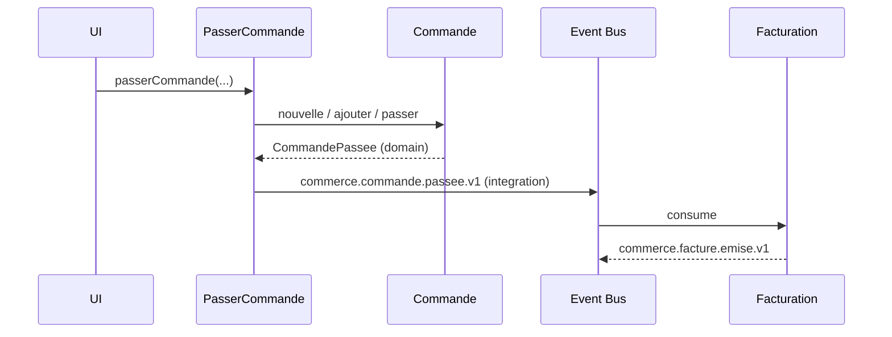

[🔝 Retour en haut de page](#table-des-matières)

## Pièges classiques

Liste des erreurs récurrentes en projet DDD, vues plus d'une fois.

### Modèle anémique (*Anemic Domain Model*)

Symptôme : des entités réduites à des sacs de getters/setters, toute la logique vit dans des « services ». L'objet métier ne *fait* rien. Conséquence : les invariants sont éparpillés, dupliqués, oubliés. Remède : pousser le comportement dans les agrégats, jusqu'à ne plus exposer de setters.

### Obsession des primitifs (*Primitive Obsession*)

Tout est `string`, `int`, `array`. Aucun typage métier, aucune validation au plus tôt. Remède : créer des objets-valeurs (`ClientId`, `Email`, `Money`, `Numero`) et les imposer dans les signatures.

### Agrégats poreux (*Leaky Aggregates*)

L'agrégat expose ses entités internes, qui sont mutées de l'extérieur. Les invariants ne sont plus garantis. Remède : retours en lecture seule (collections immuables), méthodes métier sur la racine, pas d'accesseur direct aux internals.

### Repositories qui retournent des DTOs

Un Repository qui ne renvoie pas un agrégat mais un objet plat est un *Query* déguisé. Cela mélange écriture et lecture, mine l'utilité du modèle riche. Remède : Repository pour les agrégats (côté write), *Query Service* pour les vues (côté read).

### Application Services qui font de la métier

Symptôme : l'orchestration calcule, décide, applique des règles. Le domaine est vidé de son sens. Remède : déplacer la logique dans les agrégats ou dans un Domain Service ; l'Application Service redevient un orchestrateur fin.

### Un Bounded Context = un microservice (forcément)

Faux. Un microservice est un choix de déploiement ; un Bounded Context est un choix de modélisation. On peut avoir plusieurs contextes dans un même service au début, et les extraire seulement quand le besoin émerge.

### Modèle universel partagé entre contextes

Vouloir une classe `Client` qui sert tout le système. Cela aboutit à un objet ingérable que personne ne contrôle. Remède : un `Client` par contexte, traduits aux frontières.

### CQRS / Event Sourcing par défaut

Adoptés pour leur réputation, sans besoin métier ni équipe formée. Coût opérationnel élevé pour bénéfice nul. Remède : commencer simple, n'introduire CQRS qu'en cas de divergence write/read avérée, n'introduire l'Event Sourcing que si l'historique a une valeur métier (audit, traçabilité réglementaire).

[🔝 Retour en haut de page](#table-des-matières)

## DDD et architectures voisines

Le DDD n'impose **pas** d'architecture technique. Il en suggère une famille — celles qui isolent le domaine — et se marie bien avec plusieurs courants.

### Architecture hexagonale (Ports & Adapters)

Alistair Cockburn (2005). Le domaine est au centre ; tout ce qui est externe (UI, base de données, message broker) passe par des *ports* (interfaces définies par le domaine) implémentés par des *adapters* (côté infrastructure). Le DDD définit *quoi* mettre dans le domaine ; l'hexagonal définit *comment* l'isoler. Combinaison naturelle. Voir le [dépôt dédié à la Clean Architecture / Hexagonale](https://github.com/Tan-Software/clean-architecture-hexagonale).

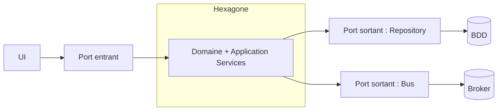

### Microservices

Un microservice mature respecte généralement la frontière d'un Bounded Context. Le DDD répond à la question *« quels services dois-je créer ? »* mieux que toute heuristique technique. Inversement, **tout Bounded Context n'a pas vocation à devenir un service** : commencer en monolithe modulaire est souvent prudent.

### Architectures *event-driven*

Les Domain Events fournissent une fondation native aux architectures pilotées par événements. CQRS, Event Sourcing, Sagas s'y greffent. Attention : un système *event-driven* mal conçu n'est qu'un *Big Ball of Mud* asynchrone. Le découpage stratégique reste prioritaire.

### Clean Architecture, Onion Architecture

Mêmes intentions que l'hexagonal : isoler le domaine. Le DDD vit aussi bien dans une Onion Architecture (Jeffrey Palermo) ou la Clean Architecture (Robert C. Martin). Le DDD apporte la matière du domaine ; ces architectures apportent l'organisation des dépendances.

### Ce que le DDD n'est pas

- une méthode de gestion de projet ;
- une suite de patterns à appliquer mécaniquement ;
- une architecture technique ;
- une garantie de succès si le langage ubiquitaire est superficiel.

[🔝 Retour en haut de page](#table-des-matières)

## Pour aller plus loin

- *Domain-Driven Design: Tackling Complexity in the Heart of Software* — Eric Evans (le « livre rouge »)
- *Implementing Domain-Driven Design* — Vaughn Vernon (le « livre jaune »)
- *Patterns, Principles, and Practices of Domain-Driven Design* — Scott Millett, Nick Tune
- [DDD Reference (PDF)](https://www.domainlanguage.com/wp-content/uploads/2016/05/DDD_Reference_2015-03.pdf) — synthèse officielle d'Eric Evans
- [DDD Crew](https://github.com/ddd-crew) — outils, *Bounded Context Canvas*, *Event Storming*
- [EventStorming](https://www.eventstorming.com/) — méthode collaborative d'Alberto Brandolini

## Licence

Distribué sous licence [MIT](LICENSE).

## Auteur

**Tansoftware - Tanguy Chénier** · [LinkedIn](https://www.linkedin.com/in/tanguy-chenier) · [Tan-Software](https://github.com/Tan-Software) · [Compte personnel (derniers outils)](https://github.com/tanguychenier) · [tansoftware.com](https://www.tansoftware.com)
