# [Tansoftware](https://www.tansoftware.com) - Domain Driven Design [](README.md)

[](LICENSE) [](#) [](#) [](https://www.markdownguide.org/)

## Table des matières

- [Introduction](#introduction)
- [Modélisation du domaine](#modélisation-du-domaine)
- [Langage ubiquitaire](#langage-ubiquitaire)
- [Bounded Contexts](#bounded-contexts)
- [Entités, objets-valeurs et agrégats](#entités-objets-valeurs-et-agrégats)
- [Repositories et Domain Services](#repositories-et-domain-services)
- [Application Services et CQRS](#application-services-et-cqrs)
- [Événements de domaine et Event Sourcing](#événements-de-domaine-et-event-sourcing)
- [Anti-Corruption Layer](#anti-corruption-layer)
- [Specification Pattern](#specification-pattern)
- [Pour aller plus loin](#pour-aller-plus-loin)

---
- [Prochaine étape : Clean Architecture](https://github.com/Tan-Software/clean-architecture-hexagonale)

## Introduction

Le *Domain-Driven Design* (DDD), formalisé par Eric Evans dans [*Domain-Driven Design: Tackling Complexity in the Heart of Software*](https://www.amazon.fr/Domain-Driven-Design-Tackling-Complexity/dp/0321125215) (2003), propose de placer la **complexité métier** au centre de la conception logicielle. Plutôt que de partir d'une base de données ou d'un framework, on modélise les concepts, les règles et les processus du métier ; le code en découle.

Cette approche prend tout son intérêt dès qu'un projet dépasse le simple CRUD : règles métier nombreuses, plusieurs équipes, plusieurs sous-domaines. Elle apporte trois bénéfices principaux : un vocabulaire partagé entre métier et technique, une frontière claire entre sous-domaines, et un découplage du domaine vis-à-vis de l'infrastructure.

[🔝 Retour en haut de page](#table-des-matières)

## Modélisation du domaine

Modéliser un domaine, c'est extraire les concepts essentiels d'un métier et les organiser en un modèle compréhensible et exécutable. Le modèle n'est pas la réalité : c'est une simplification utile, négociée avec les experts métier.

### Démarche en quatre temps

1. [Comprendre les concepts métier](#1-comprendre-les-concepts-métier)
2. [Identifier entités, attributs et relations](#2-identifier-entités-attributs-et-relations)
3. [Choisir une notation adaptée](#3-choisir-une-notation-adaptée)
4. [Itérer avec les experts métier](#4-itérer-avec-les-experts-métier)

### 1. Comprendre les concepts métier

Avant tout code, on s'imprègne du domaine. Les techniques utiles :

- entretiens individuels avec les experts métier ;
- lecture des spécifications, contrats, manuels existants ;
- observation directe des utilisateurs (*shadowing*) ;
- ateliers d'[Event Storming](https://www.eventstorming.com/) (Alberto Brandolini) pour cartographier collectivement les événements clés.

Exemple, sur un domaine bancaire, des concepts qui émergent :

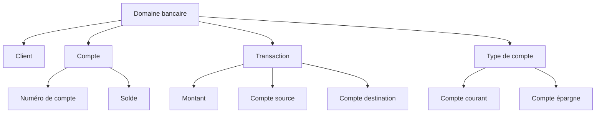

### 2. Identifier entités, attributs et relations

Une fois les concepts dégagés, on les classe :

- **Entités** : objets identifiés (un `Client` reste le même client même si son nom change).
- **Attributs** : propriétés caractérisant une entité ou un objet-valeur.
- **Relations** : liens entre entités, avec leur cardinalité (`1-1`, `1-n`, `n-m`).

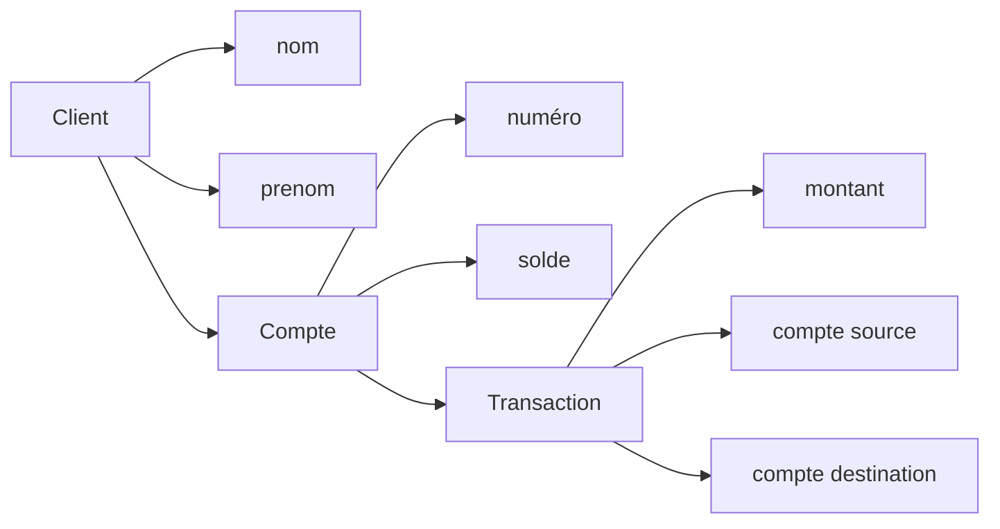

### 3. Choisir une notation adaptée

| Notation | Forces | Limites |
|----------|--------|---------|
| Diagrammes de classe UML | Précis, normalisés | Verbeux, peuvent intimider le métier |
| Diagrammes de flux / BPMN | Adaptés aux processus | Moins adaptés à la structure |
| Mind maps | Rapides, collaboratifs | Pas de sémantique stricte |
| Event Storming (post-it) | Excellents en atelier métier | Volatil, à transcrire |

Outils libres usuels : [PlantUML](https://plantuml.com/), [Mermaid](https://mermaid.js.org/), [draw.io](https://app.diagrams.net/).

Exemple de diagramme de classes pour le domaine bancaire :

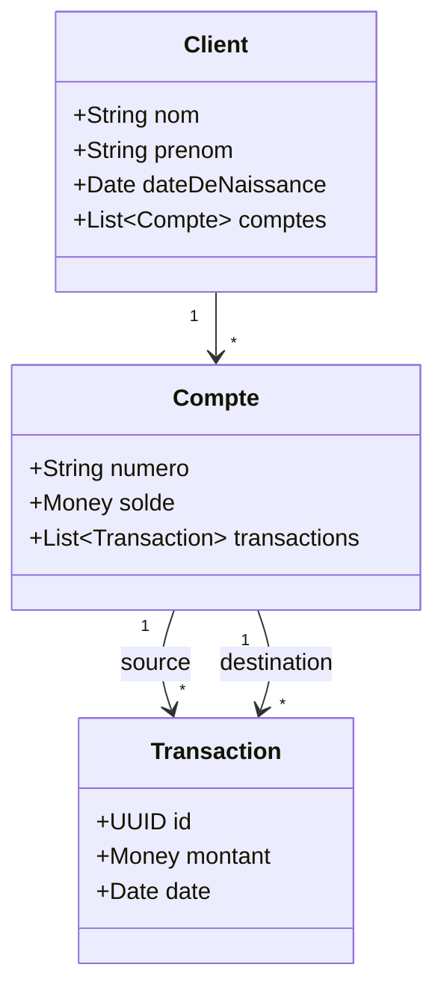

### 4. Itérer avec les experts métier

Le modèle naît d'aller-retours. Conseils :

- **Ateliers réguliers** plutôt que validations ponctuelles.
- **Vocabulaire ubiquitaire** : utiliser dans les diagrammes les mots exacts du métier.
- **Représentation visuelle** : un diagramme corrige plus vite qu'un texte.
- **Itérer** : un modèle figé devient inexact au premier changement métier.

[🔝 Retour en haut de page](#table-des-matières)

## Langage ubiquitaire

Le *langage ubiquitaire* (Eric Evans, 2003) est un vocabulaire **unique** partagé par toute l'équipe — métier, développeurs, testeurs, support. Les mêmes mots désignent les mêmes concepts dans les conversations, les documents, les diagrammes et le code.

### Pourquoi

Une traduction silencieuse entre vocabulaire métier et vocabulaire technique est une source permanente de bugs. Si l'expert dit *« contrat cadre »*, le développeur écrit `MasterAgreement`, et le testeur valide *« accord principal »*, les trois croient parler de la même chose jusqu'au premier malentendu coûteux.

### Mise en pratique

- **Glossaire vivant** : un fichier (wiki, `GLOSSARY.md`) listant les termes et leurs définitions, mis à jour à chaque changement.
- **Discipline du code** : noms de classes, méthodes, événements et tables collés au vocabulaire métier.
- **Pas de jargon technique inutile** : éviter `UserDtoManagerImpl` quand le métier parle de `Adhérent`.
- **Cohérence au sein d'un Bounded Context** : un même mot peut signifier deux choses dans deux contextes ; le langage ubiquitaire est local à un contexte.

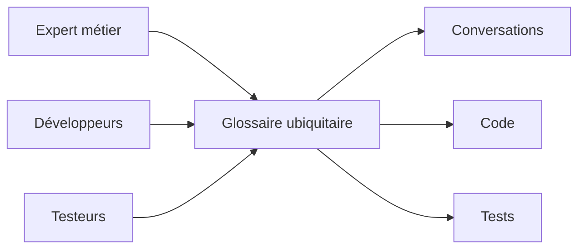

[🔝 Retour en haut de page](#table-des-matières)

## Bounded Contexts

Un *Bounded Context* (contexte délimité) est une **frontière explicite** à l'intérieur de laquelle un modèle et un langage sont cohérents. Au-delà de la frontière, les mêmes mots peuvent désigner des choses différentes : un `Client` du contexte *Vente* (prospect, panier) n'est pas le `Client` du contexte *Comptabilité* (numéro de SIRET, encours).

### Pourquoi

Vouloir un seul modèle universel pour tout le système amène inévitablement à des compromis qui ne servent personne. Découper en contextes laisse chaque équipe optimiser le sien sans gêner les autres.

### Identifier les contextes

Indices d'une frontière de contexte :

- changement d'équipe ou de service responsable ;
- vocabulaire qui se met à diverger ;
- règles métier qui s'appliquent ici mais pas là ;
- changement de granularité ou de cycle de vie.

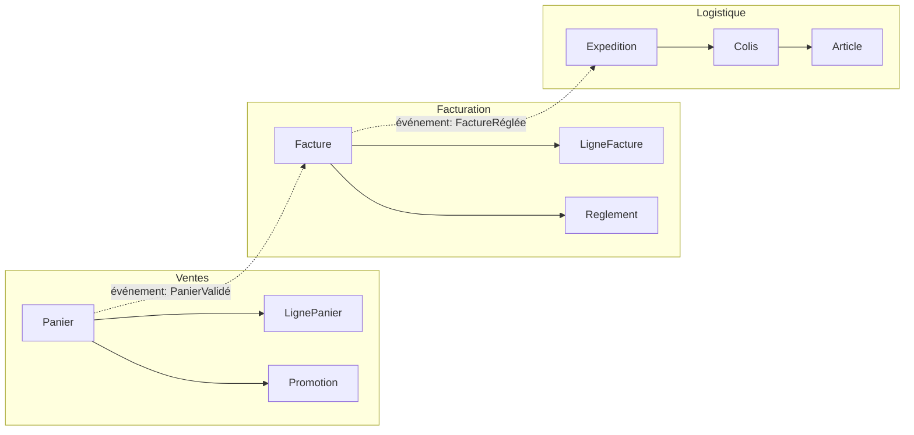

### Cartographier les relations entre contextes

Eric Evans définit plusieurs patterns pour décrire les relations inter-contextes : *Shared Kernel*, *Customer/Supplier*, *Conformist*, *Anti-Corruption Layer*, *Open Host Service*, *Published Language*. Le choix dépend du rapport de pouvoir et de la confiance entre équipes.

[🔝 Retour en haut de page](#table-des-matières)

## Entités, objets-valeurs et agrégats

Trois briques de modélisation tactique du DDD.

### Entité

Une entité a une **identité stable** dans le temps. Deux instances avec les mêmes attributs ne sont pas la même entité ; deux références au même identifiant le sont.

```php
final class Client {
    public function __construct(
        public readonly ClientId $id,   // identité
        public string $nom,             // attributs mutables
        public string $email,
    ) {}
}
```

### Objet-valeur (*Value Object*)

Un objet-valeur est défini **uniquement par ses attributs**. Il est immuable : modifier revient à en créer un nouveau. Égalité = égalité de valeurs.

```php
final class Money {
    public function __construct(
        public readonly int $centimes,
        public readonly Devise $devise,
    ) {}

    public function plus(Money $autre): Money {
        if ($autre->devise !== $this->devise) { throw new DomainException('devise'); }
        return new Money($this->centimes + $autre->centimes, $this->devise);
    }
}
```

Bons candidats : `Adresse`, `Money`, `IntervalleDeDates`, `Couleur`. Mauvais candidats : ce qui a un cycle de vie ou une histoire.

### Agrégat

Un agrégat est un **groupe d'entités et d'objets-valeurs traités comme un tout cohérent**, accédé exclusivement via une *racine d'agrégat* (entité). La racine garantit les invariants du groupe et est la seule à être référencée de l'extérieur.

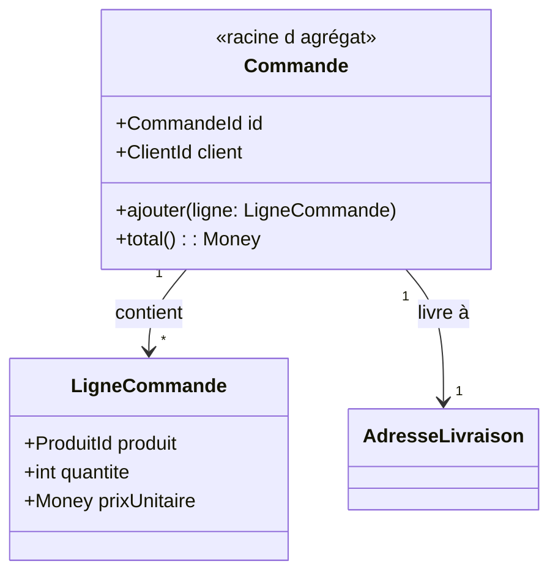

Règles d'agrégat :

- une transaction = un agrégat modifié (sinon scinder en deux agrégats) ;
- les références entre agrégats se font par **identifiant**, pas par référence d'objet ;
- petits agrégats : plus c'est gros, plus la concurrence et la persistance deviennent douloureuses.

[🔝 Retour en haut de page](#table-des-matières)

## Repositories et Domain Services

### Repository

Un *Repository* offre l'illusion d'une collection en mémoire de tous les agrégats d'un type. Il cache la persistance (ORM, fichier, API) derrière une interface définie par le domaine.

```php
namespace App\Domain\Commande;

interface CommandeRepository {
    public function find(CommandeId $id): ?Commande;
    public function add(Commande $commande): void;
    public function remove(Commande $commande): void;
}
```

L'implémentation vit dans la couche infrastructure :

```php
namespace App\Infrastructure\Doctrine\Commande;

use App\Domain\Commande\{Commande, CommandeId, CommandeRepository};
use Doctrine\ORM\EntityManagerInterface;

final class DoctrineCommandeRepository implements CommandeRepository {
    public function __construct(private EntityManagerInterface $em) {}

    public function find(CommandeId $id): ?Commande {
        return $this->em->find(Commande::class, $id);
    }

    public function add(Commande $commande): void {
        $this->em->persist($commande);
    }

    public function remove(Commande $commande): void {
        $this->em->remove($commande);
    }
}
```

Notes :

- un Repository **par racine d'agrégat**, pas par table ;
- `flush()` n'est pas la responsabilité du Repository ; il est piloté par l'Application Service ou un middleware transactionnel.

### Domain Service

Un *Domain Service* abrite la logique métier qui n'appartient naturellement à aucune entité ou objet-valeur (souvent parce qu'elle implique plusieurs agrégats). Il reste dans la couche domaine et reste agnostique de l'infrastructure.

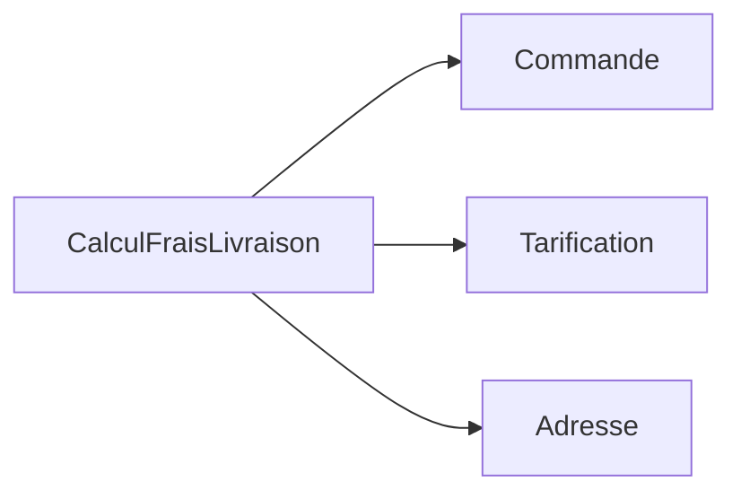

Exemple : un calcul de frais de livraison qui combine la commande, la grille tarifaire du transporteur et l'adresse — aucune de ces données n'est plus naturellement chez l'autre.

[🔝 Retour en haut de page](#table-des-matières)

## Application Services et CQRS

### Application Services

Les *Application Services* sont la porte d'entrée du domaine pour la couche présentation. Ils orchestrent : ils ouvrent une transaction, chargent les agrégats nécessaires, appellent leurs méthodes métier, persistent, émettent les événements, ferment la transaction.

```php
final class PasserCommande {
    public function __construct(
        private CommandeRepository $commandes,
        private CatalogueProduits $catalogue,
        private EventDispatcher $events,
    ) {}

    public function __invoke(PasserCommandeInput $input): CommandeId {
        $commande = Commande::nouvelle($input->client);
        foreach ($input->lignes as $l) {
            $produit = $this->catalogue->trouver($l->produitId)
                ?? throw new ProduitInconnu($l->produitId);
            $commande->ajouter(new LigneCommande($produit->id, $l->quantite, $produit->prix));
        }
        $this->commandes->add($commande);
        $this->events->dispatch(new CommandePassee($commande->id));
        return $commande->id;
    }
}
```

Règle : **un Application Service ne contient pas de logique métier** ; il ne fait qu'orchestrer.

### CQRS

CQRS (*Command Query Responsibility Segregation*, [Greg Young, 2010](https://martinfowler.com/bliki/CQRS.html)) sépare le modèle d'écriture du modèle de lecture :

| Côté | Rôle | Optimisé pour |
|------|------|---------------|
| **Commands** | Modifient l'état (réservations, paiements). | Cohérence, invariants, agrégats. |
| **Queries** | Lisent l'état (listes, vues, dashboards). | Performance, projections dénormalisées. |

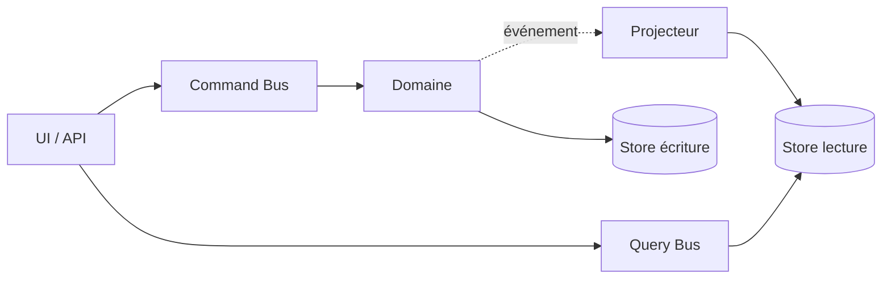

CQRS ne se justifie que là où lecture et écriture ont des modèles ou des charges divergents ; dans le doute, **commencer sans**.

[🔝 Retour en haut de page](#table-des-matières)

## Événements de domaine et Event Sourcing

### Événement de domaine

Un *Domain Event* est un fait métier passé, immuable, exprimé au passé : `CommandePassee`, `PaiementRefuse`, `ColisLivre`. Il découple les producteurs des consommateurs : la commande ne sait pas qui s'intéresse à sa validation.

Caractéristiques :

- **immuable** ; un événement ne se modifie pas, il se compense par un autre événement ;
- **complet** ; il porte l'information dont les abonnés auront besoin (éviter le retour à la base) ;
- **émis par un agrégat** lorsqu'un changement d'état significatif a lieu.

### Event Sourcing

L'*Event Sourcing* persiste un agrégat **sous la forme de la séquence d'événements qui l'ont fait advenir**, plutôt que de son état courant. L'état est reconstruit en rejouant les événements.

| Bénéfice | Coût |
|----------|------|
| Historique complet, audit gratuit | Requêtes complexes à projeter |
| Reconstruction d'états passés | Versionnage des événements obligatoire |
| Synergie naturelle avec CQRS | Outillage et expertise spécifiques |
| Détection rétroactive de bugs | Impossibilité de modifier le passé |

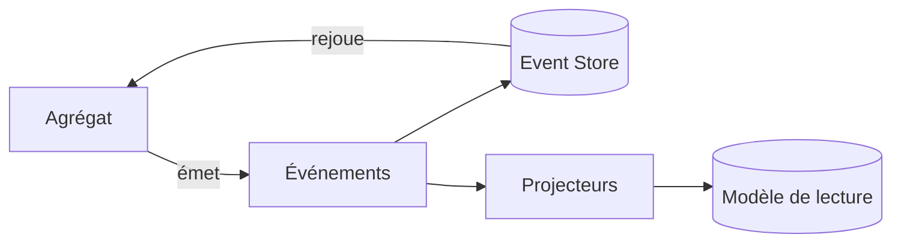

L'Event Sourcing reste un choix lourd : à n'envisager que sur les domaines où la traçabilité a une valeur métier (finance, santé, audit réglementaire).

[🔝 Retour en haut de page](#table-des-matières)

## Anti-Corruption Layer

Une *Anti-Corruption Layer* (ACL) est une couche de traduction placée entre deux Bounded Contexts pour empêcher les concepts de l'un de polluer l'autre. Elle convertit les modèles dans les deux sens et absorbe les dialectes étrangers.

### Pourquoi

Quand un système doit s'intégrer à un legacy, à un SaaS, ou à un contexte voisin avec un modèle différent, importer ses concepts directement contamine le modèle local. Une ACL préserve l'intégrité du modèle, au prix d'un mapping explicite.

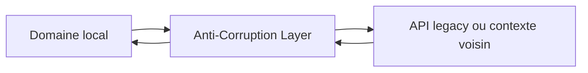

L'ACL est typiquement composée d'adaptateurs (côté infrastructure) et de traducteurs (DTOs vers objets de domaine).

[🔝 Retour en haut de page](#table-des-matières)

## Specification Pattern

Le *Specification Pattern* ([Eric Evans & Martin Fowler, 2002](https://www.martinfowler.com/apsupp/spec.pdf)) encapsule une règle métier booléenne dans un objet réutilisable, composable par opérateurs logiques (`et`, `ou`, `non`).

### Exemple

```php
interface Specification {
    public function isSatisfiedBy(object $candidat): bool;
}

final class CommandeAuDessusDe implements Specification {
    public function __construct(private Money $seuil) {}
    public function isSatisfiedBy(object $c): bool {
        return $c instanceof Commande && $c->total()->ge($this->seuil);
    }
}

final class ClientPremium implements Specification {
    public function isSatisfiedBy(object $c): bool {
        return $c instanceof Commande && $c->client()->estPremium();
    }
}

// Composition
$eligibleLivraisonGratuite =
    (new CommandeAuDessusDe(new Money(5000, Devise::EUR)))
    ->ou(new ClientPremium());
```

### Bénéfices

- règle métier nommée, testable isolément ;
- réutilisable en validation *et* en filtrage de Repository ;
- composable sans toucher aux implémentations existantes (OCP).

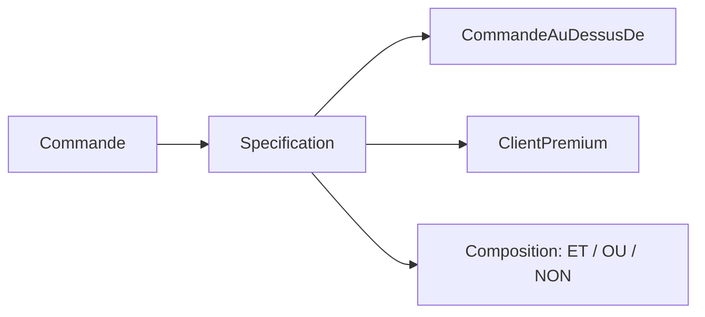

[🔝 Retour en haut de page](#table-des-matières)

## Pour aller plus loin

- *Domain-Driven Design: Tackling Complexity in the Heart of Software* — Eric Evans (le « livre rouge »)
- *Implementing Domain-Driven Design* — Vaughn Vernon (le « livre jaune »)
- *Patterns, Principles, and Practices of Domain-Driven Design* — Scott Millett, Nick Tune
- [DDD Reference (PDF)](https://www.domainlanguage.com/wp-content/uploads/2016/05/DDD_Reference_2015-03.pdf) — synthèse officielle d'Eric Evans
- [DDD Crew](https://github.com/ddd-crew) — outils, *Bounded Context Canvas*, *Event Storming*
- [EventStorming](https://www.eventstorming.com/) — méthode collaborative d'Alberto Brandolini

## Licence

Distribué sous licence [MIT](LICENSE).

## Auteur

**Tansoftware - Tanguy Chénier** · [LinkedIn](https://www.linkedin.com/in/tanguy-chenier) · [Tan-Software](https://github.com/Tan-Software) · [Compte personnel (derniers outils)](https://github.com/tanguychenier) · [tansoftware.com](https://www.tansoftware.com)
