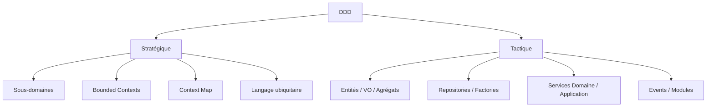
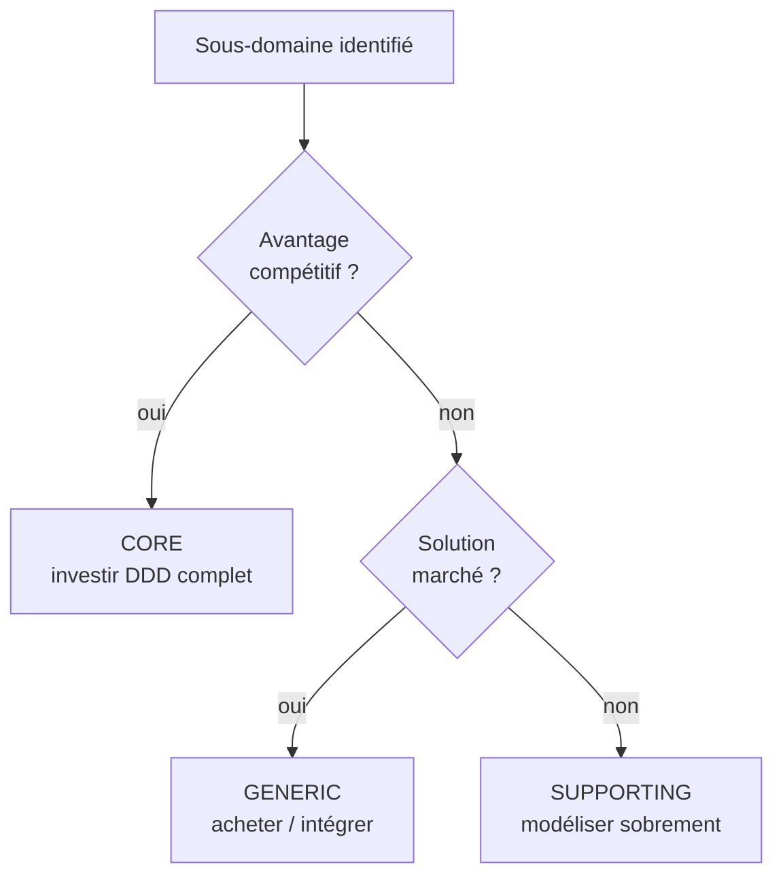

[← Fondations et cadrage](01-fondations-et-cadrage.md) · [↑ Sommaire](../README.md#table-des-matières) · [Modélisation et langage ubiquitaire →](03-modelisation-et-langage-ubiquitaire.md)

# 2. DDD stratégique : découper le domaine

## DDD stratégique vs DDD tactique

Eric Evans organise le DDD en deux niveaux complémentaires. La plupart des échecs viennent d'équipes qui sautent directement au tactique sans poser le stratégique.

> **Que veut dire « stratégique » et « tactique » ?** Empruntés au vocabulaire militaire : la *stratégie* concerne les grandes décisions d'ensemble (où placer les armées, quels objectifs viser), la *tactique* concerne l'exécution sur le terrain (comment mener un combat précis). En DDD, le stratégique organise le système dans son ensemble (où passent les frontières, comment les morceaux se parlent), le tactique détaille comment coder à l'intérieur d'un morceau.

### DDD stratégique : découper et relier

Concerne la **structure d'ensemble** du système. Les questions stratégiques :

- Quels sont les sous-domaines ? Lesquels sont *core*, *supporting*, *generic* ?
- Où passent les Bounded Contexts ?
- Comment ces contextes communiquent-ils ?
- Quel langage ubiquitaire dans chacun ?

Outils stratégiques : **sous-domaines**, **Bounded Contexts**, **Context Map**, **langage ubiquitaire**, **distillation du domaine cœur** (le fait d'isoler et de mettre en valeur ce qui compte le plus, comme on distille un alcool pour en garder l'essence).

### DDD tactique : modéliser à l'intérieur d'un contexte

Concerne la **modélisation fine** dans un Bounded Context donné. Les patterns tactiques :

- **Entités**, **objets-valeurs**, **agrégats** ;
- **Repositories**, **Factories**, **Domain Services** ;
- **Application Services**, **Modules** ;
- **Domain Events**.

Règle pratique : **commencer toujours par le stratégique**. Un découpage en contextes mauvais ne se rattrape pas avec des patterns tactiques élégants.

[🔝 Retour en haut de page](#table-des-matières)

## Sous-domaines : core, supporting, generic

> **Que veut dire « sous-domaine » ?** C'est une zone fonctionnelle bien identifiée à l'intérieur du métier. Si le domaine est « la vente en ligne », ses sous-domaines sont par exemple « le catalogue », « le paiement », « la livraison ». Comme les rayons d'un supermarché : chacun a sa logique propre, mais tous appartiennent au même magasin. La typologie d'Eric Evans (reprise et systématisée par Vaughn Vernon) distingue trois natures de sous-domaines, qui dictent le **niveau d'investissement** technique attendu.

### Les trois natures, avec critères

| Type | Définition | Indices de reconnaissance | Stratégie d'investissement |
|------|------------|---------------------------|----------------------------|
| **Core domain** | Là où l'organisation se différencie de ses concurrents. C'est *la raison pour laquelle on construit le logiciel sur mesure*. | Le métier en parle longuement et avec des nuances ; les règles changent souvent ; un échec de modélisation a un impact stratégique direct. | Investir massivement : meilleurs développeurs, DDD tactique complet, tests intensifs, refactoring continu. |
| **Supporting subdomain** | Nécessaire au fonctionnement, propre au métier, mais sans avantage compétitif. | Spécifique à l'organisation mais peu d'innovation ; règles métier réelles mais stables. | Modéliser proprement, sans excès ; DDD tactique sélectif (au moins langage ubiquitaire et bounded contexts). |
| **Generic subdomain** | Problème déjà résolu par le marché, identique chez tous les acteurs. | Authentification, gestion de fichiers, facturation comptable standard, envoi d'emails. | **Acheter, intégrer, déléguer**. Si on doit le développer, le faire le plus simplement possible. |

### Critères de classification

Pour trancher la nature d'un sous-domaine, poser ces questions au métier :

1. *« Si un concurrent avait exactement la même chose, perdrions-nous un avantage ? »* Si oui : **cœur**. Sinon : pas cœur.
2. *« Existe-t-il un produit du marché qui le résout sans personnalisation ? »* Si oui : **générique**. Sinon : soutien ou cœur.
3. *« Combien de fois cette règle a-t-elle changé en deux ans ? »* Beaucoup, et c'est sensible : **cœur**. Peu : soutien ou générique.
4. *« Qui sont les meilleurs experts internes ? »* Si la connaissance est concentrée chez un ou deux experts internes : **cœur**.

### Anti-modèle : tout traiter comme du cœur

> **Que veut dire « anti-pattern » (anti-modèle) ?** Un *anti-pattern* est une solution qui paraît bonne mais se révèle mauvaise et qu'on rencontre souvent. C'est la « fausse bonne idée » classique, le piège répété. On les nomme pour apprendre à les repérer et les éviter.

Investir un effort de niveau « domaine cœur » sur un sous-domaine générique (réécrire un système d'authentification, recoder un éditeur de PDF) gaspille les ressources et crée un risque d'exploitation. À l'inverse, traiter le cœur comme du générique (confier à un service externe la règle qui *est* l'avantage compétitif) revient à offrir son modèle économique à un fournisseur. La discipline DDD commence par cette **répartition différenciée de l'effort**.

> **Que veut dire « SaaS » ?** SaaS est l'acronyme de *Software as a Service*, en français « logiciel en tant que service » : un logiciel qu'on loue en ligne au lieu de l'installer chez soi (Gmail, Stripe, Dropbox en sont des exemples). On paie un abonnement et le fournisseur s'occupe de tout.

[🔝 Retour en haut de page](#table-des-matières)

---

[← Fondations et cadrage](01-fondations-et-cadrage.md) · [↑ Sommaire](../README.md#table-des-matières) · [Modélisation et langage ubiquitaire →](03-modelisation-et-langage-ubiquitaire.md)
