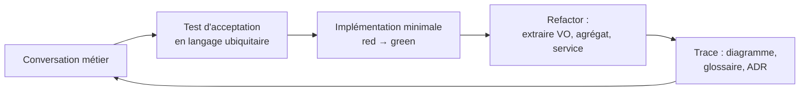
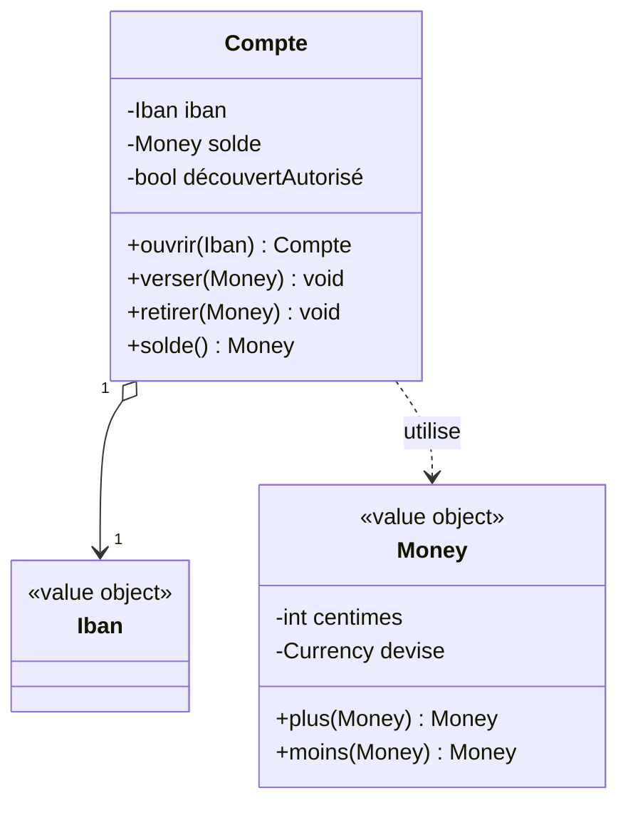
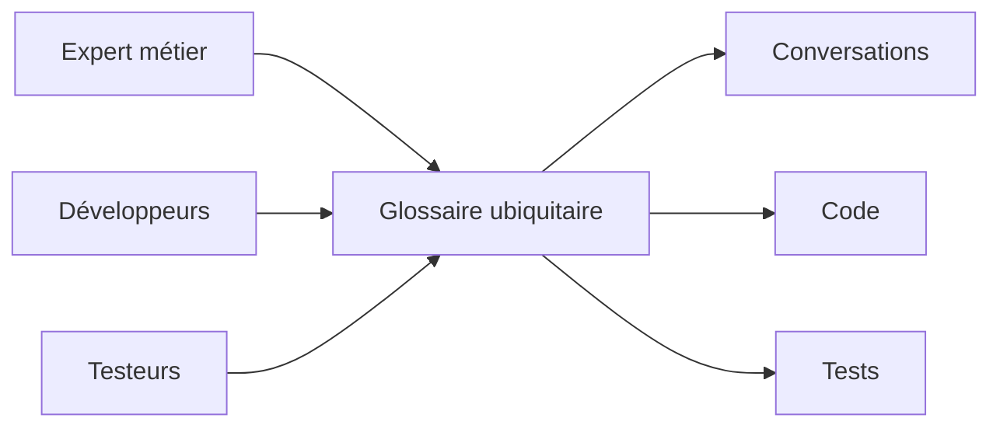

[← DDD stratégique : découper le domaine](02-ddd-strategique-decouper-le-domaine.md) · [↑ Sommaire](../README.md#table-des-matières) · [Contextes délimités et cartographie →](04-contextes-delimites-et-cartographie.md)

# 3. Modélisation et langage ubiquitaire

## Modélisation du domaine

Modéliser un domaine, c'est extraire les concepts essentiels d'un métier et les organiser en un modèle compréhensible et exécutable. Le modèle n'est pas la réalité : c'est une simplification utile, négociée avec les experts métier. Une carte routière n'est pas le territoire ; elle en garde juste ce qui sert à se déplacer. Un modèle de domaine fait pareil avec le métier.

> **Que veut dire « modéliser » et « modèle » ?** Modéliser, c'est fabriquer une représentation simplifiée d'une chose réelle pour pouvoir raisonner dessus. La maquette en carton d'un bâtiment est un modèle de bâtiment. En logiciel, le modèle est l'ensemble des concepts (Compte, Versement, Client) et des règles qu'on a choisi de représenter dans le code.

> **Attention : modéliser n'est pas dessiner toutes les classes à l'avance.** La tentation classique consiste à dérouler une séquence en cascade : « j'écoute le métier, je dessine un diagramme avec tous les attributs, je choisis une notation, puis je code ». C'est ce qu'on appelle le *Big Design Up Front* (tout concevoir d'avance, dans le détail, avant d'écrire la moindre ligne), et c'est le contraire du **TDD** comme du DDD moderne. Dans la pratique, le modèle **émerge** au fil des tests d'acceptation et des conversations avec le métier ; le diagramme n'est qu'une trace passagère de la conversation, pas un document contractuel à graver dans le marbre.

> **Que veut dire « classe » et « attribut » ?** En programmation orientée objet, une *classe* est un moule qui décrit un type d'objet (la classe « Voiture »), et chaque objet créé à partir d'elle est une *instance* (votre voiture précise). Un *attribut* est une donnée que porte l'objet (la couleur, la vitesse). Un diagramme de classes dessine ces moules et leurs liens.

> **Que veut dire « UML », « TDD » ?** *UML* (*Unified Modeling Language*, langage de modélisation unifié) est un ensemble de notations standard pour dessiner des diagrammes de logiciel. *TDD* (*Test-Driven Development*, développement piloté par les tests) est une méthode où l'on écrit d'abord un test qui décrit le comportement voulu, puis le code qui le fait passer. On définit l'objectif (le test) avant de viser (le code).

### Une démarche itérative et test-driven

DDD et TDD se renforcent : le langage ubiquitaire alimente le nom des tests ; les tests font émerger les invariants du domaine. La démarche réelle ressemble à ceci, en boucle, sur chaque tranche fonctionnelle :



Chaque tour produit un **petit incrément** : un test qui passe, un VO ou une méthode d'agrégat qui apparaît, une note ajoutée au glossaire. **Aucun diagramme n'est posé "définitif" avant le code.** Le diagramme sert à se faire comprendre dans la salle, pas à dicter l'implémentation.

#### Étape 1 : imprégnation du domaine

Avant le premier test, on s'imprègne. Les techniques utiles :

- entretiens individuels avec les experts métier ;
- lecture des spécifications, contrats, manuels existants ;
- observation directe des utilisateurs (*shadowing*) ;
- ateliers d'**Event Storming** (Alberto Brandolini, voir <https://www.eventstorming.com/>) pour cartographier collectivement les événements *passés au sens grammatical* (`Compte ouvert`, `Versement effectué`, `Découvert autorisé`).

> **Que veut dire « Event Storming » ?** Littéralement « tempête d'événements », par analogie au *brainstorming* (remue-méninges). C'est un atelier où métier et techniciens collent sur un mur, à coups de post-it, tous les événements qui surviennent dans le métier (« Commande passée », « Paiement refusé »). On voit ainsi le déroulé réel de l'activité avant d'écrire la moindre ligne de code.

Le rendu d'un Event Storming, ce sont des post-it oranges (les événements) sur un mur, pas un diagramme UML. C'est volontaire : ce format empêche la tentation de figer un schéma de données trop tôt.

#### Étape 2 : premier test d'acceptation

> **Que veut dire « test d'acceptation » ?** C'est un test écrit dans les mots du métier qui vérifie qu'un scénario complet se comporte comme attendu (« un versement crédite bien le compte »). Il sert de contrat : tant qu'il passe, le métier accepte le comportement. On l'oppose au test unitaire, plus technique, qui vérifie un petit rouage isolé.

On choisit **un** scénario simple, formulé en langage ubiquitaire, et on l'écrit sous forme de test **avant** d'avoir tranché les types et les attributs. Exemple :

```php
public function test_un_versement_credite_le_compte_destinataire(): void
{
    // Given
    $compte = Compte::ouvrir(Iban::de('FR76...'));
    // When
    $compte->verser(Money::eur(100));
    // Then
    $this->assertEquals(Money::eur(100), $compte->solde());
}
```

À ce stade, ni `Iban`, ni `Money`, ni `Compte::verser()` n'existent. C'est l'écriture du test qui force leur apparition. Aucune liste exhaustive d'attributs n'a été décidée.

#### Étape 3 : implémentation minimale (rouge puis vert)

> **Que veut dire « rouge puis vert » ?** C'est le rythme du TDD. On écrit un test : il échoue, l'outil l'affiche en *rouge*. On écrit alors juste assez de code pour qu'il réussisse : il passe au *vert*. Comme un feu de circulation : tant que c'est rouge, on n'a pas le droit d'avancer ; le vert autorise la suite.

On code le strict nécessaire pour que le test passe : `Compte` avec une méthode `verser`, `Money` immuable, `Iban` en objet-valeur qui valide son format. Pas plus. Le test est vert.

#### Étape 4 : remaniement sous filet de tests

> **Que veut dire « refactor » (remaniement) ?** C'est améliorer la structure interne du code (le ranger, le clarifier, le réorganiser) sans changer son comportement visible. Les tests servent de filet de sécurité : tant qu'ils restent verts, on sait qu'on n'a rien cassé. Comme réorganiser une cuisine sans changer les plats qu'on y prépare.

On extrait, on renomme, on regroupe. C'est ici que les **patterns tactiques DDD** apparaissent naturellement : « ces deux primitives forment un objet-valeur `IntervaleDeDates` », « `Compte` doit empêcher un solde négatif sans autorisation : c'est l'invariant de la racine d'agrégat, on le défend dans la méthode `verser()` ».

> **Que veut dire « pattern » et « primitive » ?** Un *pattern* (modèle de conception) est une solution éprouvée à un problème courant, comme une recette de cuisine réutilisable. Une *primitive* est un type de donnée de base fourni par le langage (un nombre entier, une chaîne de texte, un booléen vrai/faux), par opposition à un type métier qu'on crée soi-même (`Money`, `Email`).

#### Étape 5 : trace écrite

À la fin du tour, on capture **uniquement ce qui est utile pour la conversation suivante** :

- une ligne ajoutée au **glossaire** du langage ubiquitaire (`Versement : transfert positif vers un compte. Voir aussi : Découvert autorisé`).
- éventuellement un diagramme rapide (Mermaid, post-it photographié) à valider avec le métier.
- un **ADR** si une décision structurante vient d'être prise (« on choisit l'agrégat `Compte` plutôt que `Client` comme racine pour les versements »).

> **Que veut dire « ADR » ?** ADR est l'acronyme de *Architecture Decision Record*, en français « fiche de décision d'architecture ». C'est une note courte qui consigne une décision importante, le contexte qui l'a motivée et les options écartées. Comme le compte rendu d'une réunion : six mois plus tard, on se souvient *pourquoi* on a tranché ainsi, et on peut rediscuter en connaissance de cause.

> **Pourquoi cet ordre est crucial.** Si l'on commençait par dessiner un diagramme de classes complet de `Client`, `Compte` et `Transaction` avec tous leurs attributs (`nom`, `prenom`, `dateNaissance`, `numero`, `solde`, `montant`, `date`...), on figerait une représentation **anémique** : des sacs de données, sans comportement, sans invariants. C'est l'origine du *modèle anémique* listé plus loin dans les pièges. Le modèle riche se construit *par* le test, pas avant.

> **Que veut dire « modèle anémique » ?** Anémique se dit, en médecine, d'un sang pauvre, affaibli. Un *modèle anémique* est un modèle vidé de sa substance : des objets qui ne contiennent que des données, sans aucune règle ni comportement, toute la logique vivant ailleurs. C'est une carcasse sans muscles, l'un des grands pièges du DDD (détaillé plus loin).

### Quand utiliser un diagramme, et lequel

Un diagramme reste utile pour **communiquer**, jamais pour **prescrire** (imposer d'avance comment coder). On choisit l'outil selon le public visé :

| Besoin                                    | Outil approprié                       | Quand l'utiliser                                          |
| ----------------------------------------- | ------------------------------------- | --------------------------------------------------------- |
| Découvrir le domaine avec le métier       | Event Storming, post-it muraux        | Atelier de cadrage, premier contact                       |
| Visualiser un flux d'événements         | Mermaid `sequenceDiagram`             | Discussion sur une saga / process manager               |
| Tracer une décision structurante         | ADR (texte) + petit schéma Mermaid    | Choix de bounded context, choix d'agrégat racine        |
| Communiquer une *photo* du modèle actuel | Diagramme de classes UML (Mermaid)    | Onboarding, revue de code, *jamais* avant de coder       |
| Cartographier les Bounded Contexts       | **Context Map** (DDD Crew template)   | Conception stratégique, discussion entre équipes        |

Outils libres usuels : [PlantUML](https://plantuml.com/), [Mermaid](https://mermaid.js.org/), [draw.io](https://app.diagrams.net/), [Miro](https://miro.com/) pour l'Event Storming distant.

> **Note sur l'UML.** Présent dans le livre d'Evans (2003), il a été supplanté dans la pratique par des notations plus légères. Vaughn Vernon et Eric Evans lui-même recommandent aujourd'hui les diagrammes de séquence (pour montrer un enchaînement dans le temps) plutôt que les diagrammes de classes (qui invitent au modèle anémique). Le diagramme de classes ci-dessous est volontairement minimal et placé **après** la conversation et les tests, pas avant.

> **Que veut dire « diagramme de séquence » et « diagramme de classes » ?** Un *diagramme de séquence* montre qui parle à qui, dans quel ordre, au fil du temps (comme une bande dessinée de messages échangés). Un *diagramme de classes* montre les types d'objets et leurs liens, figés, sans notion de temps (comme un organigramme).



Remarquez : on expose des **comportements** (`verser`, `retirer`), pas des champs publics. C'est la différence entre un *modèle anémique* (un sac de *getters* et *setters*) et un *modèle riche* (qui défend ses invariants).

> **Que veut dire « getter » et « setter » ?** Un *getter* (accesseur) est une méthode qui rend la valeur d'un attribut (« donne-moi le solde »). Un *setter* (mutateur) en change la valeur sans aucune règle (« mets le solde à -500 »). Un objet truffé de setters publics laisse n'importe qui le mettre dans un état invalide ; un modèle riche remplace les setters par des actions métier qui vérifient les règles (`verser`, `retirer`).

### Itérer avec les experts métier

La conception émerge d'aller-retours soutenus avec le métier. Quelques règles non négociables :

- **Ateliers réguliers** plutôt que validations ponctuelles : préférer un atelier d'1 h par semaine à une revue de spec mensuelle.
- **Vocabulaire ubiquitaire** appliqué partout : diagrammes, tests, code. Si le métier dit *« contrat cadre »*, ni le code ni les tests ne doivent jamais utiliser un autre mot (voir la section *Langage ubiquitaire*).
- **Démos plutôt que diagrammes** : montrer un test vert ou une commande exécutable convainc plus vite qu'un schéma en grand format. Le diagramme reste un appui ponctuel.
- **Modéliser ce qui change ensemble** : la frontière d'un agrégat se trouve à la lecture des invariants, pas en dessinant des cardinalités.
- **Refuser le modèle figé** : tout modèle vit. Un modèle qui ne change plus au bout de six mois est probablement déjà mort, ou bien il décrit un sous-domaine générique qui ne valait pas qu'on y mette autant d'effort.

[🔝 Retour en haut de page](#table-des-matières)

## Langage ubiquitaire

> **Que veut dire « ubiquitaire » ?** *Ubiquitaire* vient du latin *ubique*, « partout ». Un langage ubiquitaire est un vocabulaire présent *partout* à la fois : dans les réunions, les documents, les tests et le code. Pas de traduction entre « le mot du métier » et « le mot du code » : c'est le même mot partout, comme une langue commune parlée par tout l'équipage d'un même navire.

Le *langage ubiquitaire* (Eric Evans, 2003) est un vocabulaire **unique** partagé par toute l'équipe : métier, développeurs, testeurs, support. Les mêmes mots désignent les mêmes concepts dans les conversations, les documents, les diagrammes et le code.

### Pourquoi

Une traduction silencieuse entre vocabulaire métier et vocabulaire technique est une source permanente de bugs. Si l'expert dit *« contrat cadre »*, le développeur écrit `MasterAgreement`, et le testeur valide *« accord principal »*, les trois croient parler de la même chose jusqu'au premier malentendu coûteux.

### Mise en pratique

- **Glossaire vivant** : un fichier (wiki, `GLOSSARY.md`) listant les termes et leurs définitions, mis à jour à chaque changement.
- **Discipline du code** : noms de classes, méthodes, événements et tables collés au vocabulaire métier.
- **Pas de jargon technique inutile** : éviter `UserDtoManagerImpl` quand le métier parle de `Adhérent`.
- **Cohérence au sein d'un Bounded Context** : un même mot peut signifier deux choses dans deux contextes ; le langage ubiquitaire est local à un contexte.



[🔝 Retour en haut de page](#table-des-matières)

---

[← DDD stratégique : découper le domaine](02-ddd-strategique-decouper-le-domaine.md) · [↑ Sommaire](../README.md#table-des-matières) · [Contextes délimités et cartographie →](04-contextes-delimites-et-cartographie.md)
