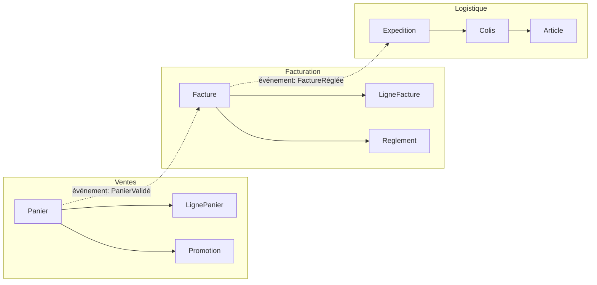
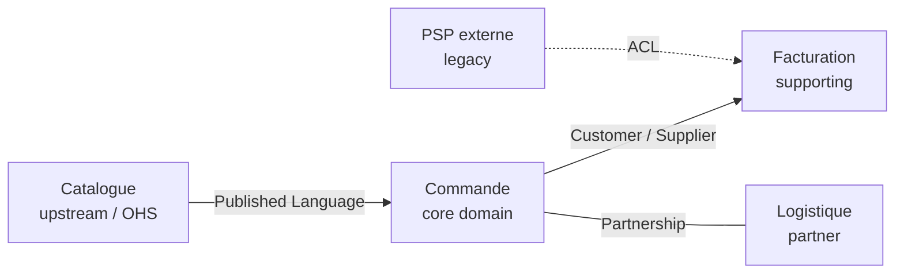

[← Modélisation et langage ubiquitaire](03-modelisation-et-langage-ubiquitaire.md) · [↑ Sommaire](../README.md#table-des-matières) · [Briques tactiques : agrégats et services →](05-briques-tactiques-agregats-et-services.md)

# 4. Contextes délimités et cartographie

## Bounded Contexts

> **Que veut dire « Bounded Context » ?** Traduit par « contexte délimité ». C'est une zone fermée à l'intérieur de laquelle un mot a un sens unique et précis. Le même mot peut signifier autre chose dans une autre zone. Pensez au mot « ticket » : à la SNCF c'est un titre de transport, au cinéma une entrée, au support informatique une demande d'aide. Chaque univers (chaque contexte) lui donne son propre sens, et c'est très bien ainsi tant que les frontières sont claires.

Un *Bounded Context* (contexte délimité) est une **frontière explicite** à l'intérieur de laquelle un modèle et un langage restent cohérents. Au-delà de la frontière, les mêmes mots peuvent désigner des choses différentes : un `Client` du contexte *Vente* (un prospect, un panier) n'est pas le `Client` du contexte *Comptabilité* (un numéro de SIRET, un encours).

> **Que veut dire « SIRET » et « encours » ?** Le *SIRET* est le numéro qui identifie officiellement un établissement d'entreprise en France. Un *encours* est le montant qu'un client doit encore mais n'a pas encore payé. Ces notions n'intéressent que la comptabilité, pas la vente : voilà pourquoi le `Client` n'a pas la même forme dans les deux contextes.

### Pourquoi

Vouloir un seul modèle universel pour tout le système amène inévitablement à des compromis qui ne servent personne. Découper en contextes laisse chaque équipe optimiser le sien sans gêner les autres.

### Identifier les contextes

Indices d'une frontière de contexte :

- changement d'équipe ou de service responsable ;
- vocabulaire qui se met à diverger ;
- règles métier qui s'appliquent ici mais pas là ;
- changement de granularité ou de cycle de vie.

### Cartographier les relations entre contextes

Eric Evans définit plusieurs patterns pour décrire les relations entre contextes : *Shared Kernel*, *Customer/Supplier*, *Conformist*, *Anti-Corruption Layer*, *Open Host Service*, *Published Language*, *Partnership*, *Separate Ways*, *Big Ball of Mud*. Le choix dépend du rapport de pouvoir et de la confiance entre les équipes. Chacun est détaillé dans la section suivante.

[🔝 Retour en haut de page](#table-des-matières)

## Bounded Context Canvas

> **Que veut dire « Canvas » ?** *Canvas* signifie « toile » ou « canevas » : ici une grande feuille à cases qu'on remplit en atelier pour décrire quelque chose sur une seule page. Le *Bounded Context Canvas* est cette feuille appliquée à un contexte délimité. Inspiré du *Business Model Canvas* (la toile en cases utilisée par les entrepreneurs pour résumer un modèle économique). Outil de conception stratégique formalisé par **Nick Tune** et le [DDD Crew](https://github.com/ddd-crew/bounded-context-canvas) (2019). Il sert à **décrire un Bounded Context sur une seule page** lors d'un atelier de cadrage, avant d'en figer le contour ou les dépendances.

### À quoi il répond

Un Context Map montre *les relations entre* contextes ; le Bounded Context Canvas montre *l'identité d'un* contexte. Les deux sont complémentaires : on remplit un Canvas par contexte, puis on les relie sur la Map.

### Les cases du Canvas

| Case | Question à laquelle elle répond |
|------|---------------------------------|
| **Nom** | Comment le métier appelle-t-il ce contexte ? |
| **Description** | En une phrase, que fait-il ? |
| **Classification stratégique** | Core, supporting ou generic ? Pourquoi ? |
| **Domain Roles** | Spécification, exécution, audit, analytique, gateway... |
| **Inbound Communications** | Qui appelle ce contexte, sous quel contrat (synchrone/asynchrone, push/pull) ? |
| **Outbound Communications** | Qui ce contexte appelle-t-il, sous quel contrat ? |
| **Ubiquitous Language** | Liste des termes métier propres à ce contexte. |
| **Business Decisions** | Quelles décisions métier ce contexte prend-il *seul* ? |
| **Assumptions** | Hypothèses fortes (utilisateurs simultanés, volumétrie, niveau de service garanti). |
| **Verification Metrics** | Comment vérifie-t-on que le contexte fait son travail ? |
| **Open Questions** | Sujets non tranchés à reprendre au prochain atelier. |

### Pourquoi cet outil prend de l'importance

- Il **rend explicite** ce qui était implicite dans la documentation classique : rôles, hypothèses, métriques.
- Il accélère l'**onboarding** : un Canvas par contexte donne au nouvel arrivant la boussole macro en une heure.
- Il prépare la conversation **inter-équipes** : montrer son Canvas à l'équipe voisine fait apparaître les contradictions plus vite qu'une review d'API.
- Il s'intègre avec d'autres outils du **DDD Crew** : *Core Domain Chart*, *EventStorming*, *Aggregate Design Canvas*.

> **Que veut dire « onboarding » ?** *Onboarding* (intégration) désigne la prise en main par une personne qui arrive sur le projet : le temps qu'il lui faut pour comprendre comment tout marche et devenir productive. Un bon Canvas raccourcit ce temps.

> **Bonne pratique.** Remplir le Canvas en atelier (45 min à 1 h), à l'oral, en équipe mixte métier et technique. Le Canvas n'est pas un document contractuel : c'est une trace de la conversation, à réviser à chaque évolution importante.

[🔝 Retour en haut de page](#table-des-matières)

## Context Map : les patterns de relation

> **Que veut dire « Context Map » ?** Littéralement « carte des contextes ». C'est le plan qui montre tous les Bounded Contexts du système et la façon dont ils se relient, comme une carte de métro montre les lignes et leurs correspondances. Elle dit qui dépend de qui et selon quel contrat.

La *Context Map* documente honnêtement comment les Bounded Contexts s'articulent : équipes, dépendances, contrats, rapports de force. Sa valeur tient à sa fidélité au réel : une carte qui décrit la situation idéale plutôt que la situation réelle n'est qu'un vœu pieux.

### Patterns de relation entre contextes

> **Que veut dire « amont » (*upstream*) et « aval » (*downstream*) ?** Image de la rivière : ce qui est *en amont* est en haut du courant, ce qui est *en aval* est plus bas et reçoit l'eau. En logiciel, le contexte amont fournit ses données ou ses services ; le contexte aval en dépend et les reçoit. Si l'amont change, l'aval subit, jamais l'inverse.

| Pattern | Ce que c'est | Quand l'utiliser |
|---------|--------------|------------------|
| **Partnership** | Deux équipes liées par un succès ou un échec commun, coordination forte. | Lorsque deux contextes ne peuvent pas livrer indépendamment ; coût relationnel élevé. |
| **Shared Kernel** | Petit modèle partagé entre deux contextes, modifié de manière concertée. | Si la duplication coûterait plus cher que la coordination ; rare et exigeant. |
| **Customer / Supplier** (client / fournisseur) | Le contexte amont sert le contexte aval ; l'aval a un poids de client reconnu. | Équipes alignées, ressources allouées, planification possible côté amont. |
| **Conformist** | L'aval se conforme au modèle de l'amont, sans pouvoir de négociation. | Quand l'amont est imposé (legacy, fournisseur externe, équipe puissante). |
| **Anti-Corruption Layer (ACL)** | L'aval traduit le modèle de l'amont via une couche de protection. | Modèle amont incompatible ou instable ; on protège le modèle local. |
| **Open Host Service (OHS)** | L'amont publie un protocole stable utilisable par plusieurs aval. | Lorsqu'un contexte sert de plateforme à plusieurs consommateurs. |
| **Published Language** | Langage d'échange documenté et versionné (souvent couplé à OHS). | Contrats inter-équipes ou inter-organisations stables. |
| **Separate Ways** | Aucune intégration ; chacun mène sa route. | Quand l'intégration coûte plus que sa valeur. |
| **Big Ball of Mud** (grosse boule de boue) | Zone sans frontière claire, modèle entremêlé. | À reconnaître pour l'isoler ; jamais à choisir volontairement. |

> **Lexique des patterns.** *Partnership* (partenariat) : deux équipes qui réussissent ou échouent ensemble. *Shared Kernel* (noyau partagé) : un petit bout de modèle commun aux deux, modifié d'un commun accord. *Conformist* (conformiste) : l'aval se plie au modèle de l'amont sans pouvoir négocier. *Open Host Service* (service hôte ouvert) : l'amont publie une interface stable pour plusieurs consommateurs. *Published Language* (langage publié) : un format d'échange documenté et versionné. *Separate Ways* (chemins séparés) : aucune intégration, chacun de son côté. *Big Ball of Mud* (grosse boule de boue) : le code spaghetti sans frontières, à éviter.

### Représenter la carte

### Choisir un pattern

Le choix dépend de deux axes : **rapport de pouvoir** entre équipes (qui peut imposer un changement à qui ?) et **stabilité du modèle amont**. Une équipe aval avec peu de poids face à un amont instable a tout intérêt à intercaler une *Anti-Corruption Layer*. À l'inverse, deux équipes proches avec des objectifs alignés peuvent vivre en *Partnership*.

[🔝 Retour en haut de page](#table-des-matières)

---

[← Modélisation et langage ubiquitaire](03-modelisation-et-langage-ubiquitaire.md) · [↑ Sommaire](../README.md#table-des-matières) · [Briques tactiques : agrégats et services →](05-briques-tactiques-agregats-et-services.md)
