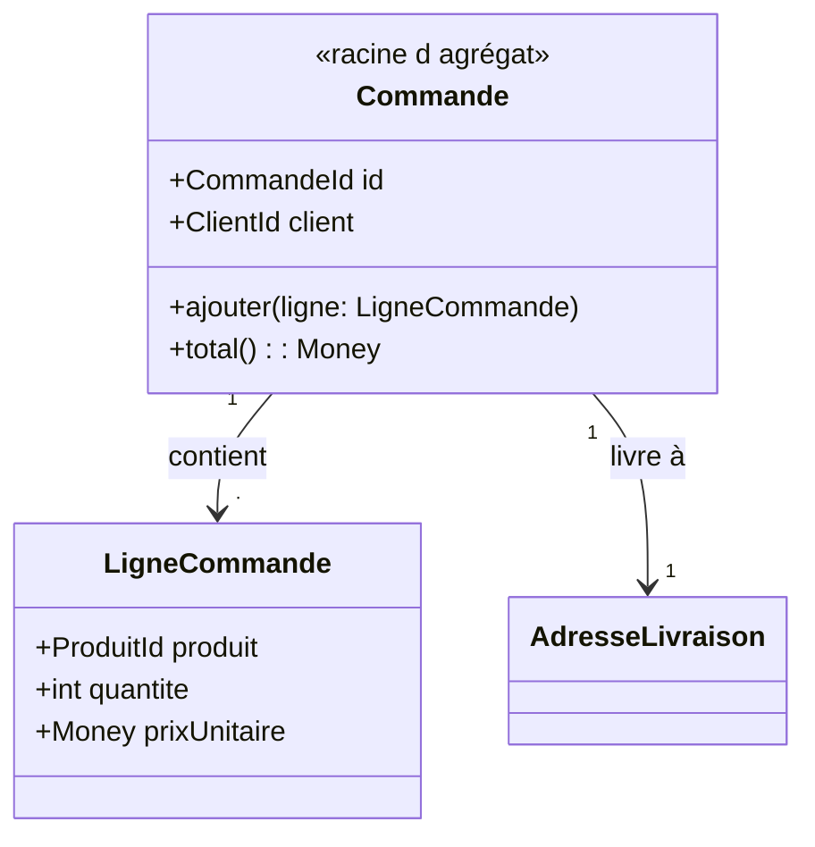
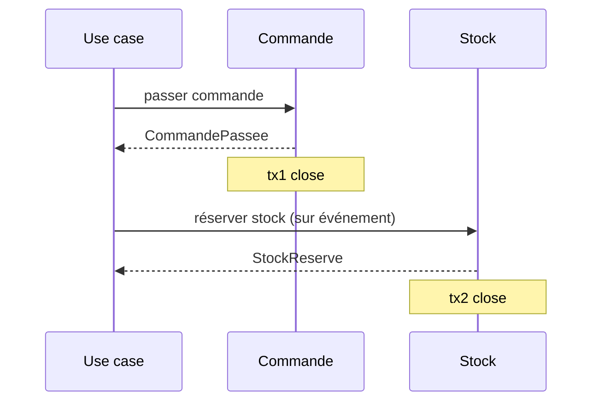
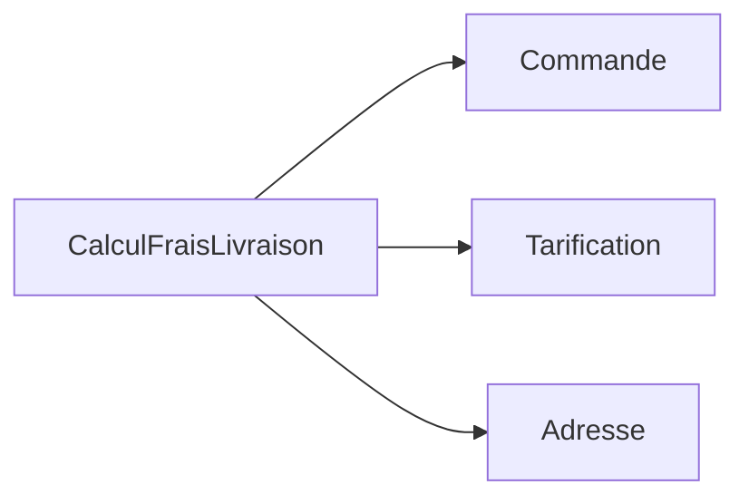

[← Contextes délimités et cartographie](04-contextes-delimites-et-cartographie.md) · [↑ Sommaire](../README.md#table-des-matières) · [CQRS, événements et fiabilité →](06-cqrs-evenements-et-fiabilite.md)

# 5. Briques tactiques : agrégats et services

## Entités, objets-valeurs et agrégats

Voici les trois briques de base de la modélisation tactique du DDD.

### Entité

> **Que veut dire « entité » ?** Une *entité* est un objet qu'on suit dans le temps grâce à son identité propre, même si ses attributs changent. Vous restez la même personne après avoir déménagé ou changé de nom : votre identité ne dépend pas de vos attributs. Deux personnes qui portent le même prénom et le même âge ne sont pas la même personne ; en revanche, deux fiches qui portent le même numéro d'identité, oui.

Une entité a une **identité stable** dans le temps. Deux instances avec les mêmes attributs ne sont pas la même entité ; deux références au même identifiant le sont.

```php
final class Client {
    public function __construct(
        public readonly ClientId $id,   // identité
        public string $nom,             // attributs mutables
        public string $email,
    ) {}
}
```

### Objet-valeur (*Value Object*)

> **Que veut dire « objet-valeur » et « immuable » ?** Un *objet-valeur* n'a pas d'identité : il vaut uniquement par son contenu. Un billet de 10 euros en vaut un autre : peu importe lequel, seule la valeur compte. *Immuable* signifie « qu'on ne peut pas modifier après création » : pour avoir 15 euros, on ne transforme pas le billet de 10, on prend d'autres billets. De même, pour « changer » un objet-valeur, on en crée un nouveau. Deux objets-valeurs sont égaux dès que leurs attributs le sont.

Un objet-valeur est défini **uniquement par ses attributs**. Il est immuable : le modifier revient à en créer un nouveau. Égalité signifie ici égalité des valeurs.

```php
final class Money {
    public function __construct(
        public readonly int $centimes,
        public readonly Devise $devise,
    ) {}

    public function plus(Money $autre): Money {
        if ($autre->devise !== $this->devise) { throw new DomainException('devise'); }
        return new Money($this->centimes + $autre->centimes, $this->devise);
    }
}
```

Bons candidats : `Adresse`, `Money`, `IntervalleDeDates`, `Couleur`. Mauvais candidats : ce qui a un cycle de vie ou une histoire.

### Agrégat

> **Que veut dire « agrégat » et « racine d'agrégat » ?** Un *agrégat* est un groupe d'objets qu'on traite comme un seul bloc cohérent. La *racine d'agrégat* est l'unique objet du groupe par lequel on a le droit d'entrer ; tout le reste se manipule à travers elle. Pensez à une commande de restaurant : la commande (la racine) regroupe ses lignes (un plat, une boisson) ; on n'ajoute pas un plat directement dans la cuisine, on le demande *via* la commande, qui vérifie que tout est cohérent. *Agréger*, c'est rassembler en un tout.

Un agrégat est un **groupe d'entités et d'objets-valeurs traités comme un tout cohérent**, accessible uniquement à travers une *racine d'agrégat* (qui est elle-même une entité). La racine garantit les invariants du groupe et reste la seule à être référencée depuis l'extérieur.



Règles d'agrégat :

- une transaction modifie un seul agrégat (sinon, scinder en deux agrégats) ;
- les références entre agrégats se font par **identifiant**, pas par référence directe d'objet ;
- garder de petits agrégats : plus ils grossissent, plus l'accès simultané et la sauvegarde deviennent pénibles.

> **Que veut dire « transaction », « concurrence », « persistance » ?** Une *transaction* est un ensemble d'opérations « tout ou rien » : soit elles réussissent toutes ensemble, soit aucune n'est appliquée (comme un virement bancaire qui débite et crédite, ou n'arrive pas du tout). La *concurrence* désigne le cas où plusieurs utilisateurs touchent les mêmes données en même temps, ce qui peut créer des conflits. La *persistance* est le fait d'enregistrer durablement les données pour les retrouver plus tard.

[🔝 Retour en haut de page](#table-des-matières)

## Règles de conception des agrégats (Vernon)

Vaughn Vernon, dans *Implementing Domain-Driven Design* (2013), formule **quatre règles** pour éviter les agrégats obèses qui paralysent la sauvegarde et l'accès simultané.

### 1. Modéliser de vraies frontières de cohérence

> **Que veut dire « frontière de cohérence » (*consistency boundary*) ?** C'est le périmètre à l'intérieur duquel les règles doivent rester vraies *immédiatement*, à chaque opération. Tout ce qui doit absolument rester cohérent ensemble vit dans le même agrégat ; le reste est dehors. C'est le tracé du « tout ou rien » : ce qu'on garde toujours d'aplomb d'un seul coup.

Un agrégat existe pour qu'**un ensemble d'invariants** soit toujours vrai après chaque transaction. Ce qui ne participe à aucun invariant n'a rien à faire dans l'agrégat. Question piège à se poser : *« Si cet attribut était sur un autre agrégat, quelle règle métier serait violée ? »* Si la réponse est *« aucune »*, c'est qu'il faut sortir l'attribut.

### 2. Concevoir de petits agrégats

Un agrégat doit être **chargeable et persistable d'un bloc** sans douleur. Les agrégats massifs (une `Commande` qui contient toutes ses lignes, ses paiements, ses retours, ses messages) provoquent :

- des verrous concurrents pénibles ;
- des chargements coûteux (toute la grappe est lue alors qu'on n'en utilise qu'une partie) ;
- des conflits d'écriture sur des champs sans rapport entre eux.

Heuristique : si plusieurs cas d'usage modifient des sous-parties indépendantes de la même grappe, scinder.

### 3. Référencer les autres agrégats par identifiant

Aucune référence d'objet directe entre agrégats. Une `Commande` ne tient pas un `Client` mais un `ClientId`. Cela :

- évite de charger des grappes entières par effet domino ;
- clarifie les frontières transactionnelles ;
- permet de stocker les agrégats dans des bases différentes (utile en microservices) ;
- réduit le couplage entre modules.

```php
final class Commande {
    private ClientId $client;     // pas Client $client
    private CatalogueProduitId $catalogue;
}
```

### 4. Mettre à jour les autres agrégats en cohérence à terme

> **Que veut dire « cohérence à terme » (*eventual consistency*) ?** C'est l'idée que tout sera cohérent *au bout d'un moment*, pas forcément à l'instant précis. Quand vous virez de l'argent un dimanche soir, votre compte est débité tout de suite mais le bénéficiaire n'est crédité que plus tard : le système n'est pas cohérent à la seconde près, il le devient « à terme ». On accepte ce léger décalage pour gagner en souplesse et en disponibilité.

Une transaction ne touche **qu'un seul agrégat**. Les autres agrégats à mettre à jour le sont **par événements**, dans une transaction ultérieure (*eventual consistency*, cohérence à terme).



Quand exiger la cohérence forte (deux agrégats dans la même transaction) ? Réponse de Vernon : **presque jamais**. Si on en a vraiment besoin, c'est sans doute que le découpage est faux, ou bien que la règle métier elle-même tolère un décalage dans le temps qu'on n'avait pas vu.

[🔝 Retour en haut de page](#table-des-matières)

## Frontières d'agrégats : un choix de conception, pas une vérité

> **La frontière d'agrégat est un choix.** La frontière d'un agrégat est une **décision de conception** : on choisit où passe la limite du « tout ou rien » transactionnel. Ce n'est *pas* une vérité cachée dans le domaine qu'il suffirait de découvrir. Deux équipes compétentes peuvent légitimement aboutir à des découpages différents, selon l'usage, la volumétrie, la manière dont plusieurs utilisateurs accèdent aux données et les cas prioritaires.

### Pourquoi c'est important de l'admettre

La littérature DDD débutante laisse parfois entendre qu'il existe **un** « bon » agrégat à trouver, comme on chercherait une vérité cachée dans le métier. C'est faux et démobilisant :

- les invariants métier réels ne dictent souvent qu'une **partie** de la frontière ; le reste est un arbitrage technique (verrouillage des données, temps de réponse, finesse du cache, forme des messages) ;
- une nouvelle exigence (un cas d'usage très fréquent, un changement de niveau de service garanti) peut justifier de **revoir** une frontière, sans que le domaine lui-même ait changé ;
- présenter l'agrégat comme « découvrable » entretient le mythe de l'analyste DDD devin et empêche les équipes de **discuter** ouvertement leurs choix.

> **Que veut dire « latence », « cache », « verrouillage » ?** La *latence* est le temps d'attente entre une demande et sa réponse (plus c'est court, mieux c'est). Un *cache* est une réserve de résultats déjà calculés, gardés sous la main pour répondre plus vite (comme une antisèche). Le *verrouillage* empêche deux personnes de modifier la même donnée en même temps, le temps qu'une opération se termine, comme la porte verrouillée d'une cabine d'essayage.

### Trois exemples de découpage légitimement différent

| Scénario | Choix possible A | Choix possible B | Critère qui tranche |
|----------|------------------|------------------|---------------------|
| Commande e-commerce avec lignes | `Commande` agrège ses `LigneCommande` | `Commande` et `LigneCommande` sont deux agrégats reliés par identifiant | Volume de lignes par commande, fréquence d'ajout/retrait après création |
| Bilan comptable | `ExerciceComptable` agrège tous les comptes et écritures | `ExerciceComptable`, `Compte`, `Ecriture` séparés, reliés par ID | Concurrence d'écriture, taille du bilan, audit ligne à ligne ou global |
| Dossier patient | `Patient` agrège son historique médical | `Patient` distinct de `DossierMedical` (un par épisode) | Confidentialité par épisode, durée de conservation, autorisations |

### Critères pour trancher

- **Invariants** : quelle règle métier doit être vraie *immédiatement après* chaque transaction ? Tout ce qu'elle touche est dans le même agrégat.
- **Concurrence** : si deux utilisateurs modifient des sous-parties indépendantes simultanément, doit-on absolument les sérialiser ? Si non, scinder.
- **Cycle de vie** : si deux entités naissent et meurent à des moments différents, c'est probablement deux agrégats.
- **Volumétrie** : un agrégat ne doit pas dépasser ce qu'on charge raisonnablement en mémoire (Vernon parle de « petits agrégats »).
- **Cas d'usage de lecture** : si toutes les lectures portent sur la grappe complète, agréger est tentant ; si la plupart portent sur un sous-ensemble, mieux vaut scinder.

> **Que veut dire « SLA » ?** SLA est l'acronyme de *Service Level Agreement*, en français « accord de niveau de service » : la promesse chiffrée qu'on tient à ses utilisateurs (par exemple « le service répond en moins de 200 millisecondes 99 % du temps »). C'est le contrat de qualité, comme le délai garanti d'un livreur.

> **Honnêteté de conception.** Consigner dans un **ADR** (fiche de décision d'architecture) le choix de frontière et les options écartées, c'est se donner les moyens de **rediscuter** la décision plus tard, sans dogmatisme. Le texte doit dire : *« étant donné ces invariants, ce volume, ce niveau de service, nous choisissons cette frontière ; nous la révisons si X change »*.

[🔝 Retour en haut de page](#table-des-matières)

## Factories et Modules

### Factory

> **Que veut dire « Factory » ?** *Factory* signifie « usine » ou « fabrique ». C'est un composant dont le seul rôle est de fabriquer correctement un objet compliqué, en s'assurant qu'il naît déjà valide. Comme une usine de montage qui livre une voiture prête à rouler plutôt qu'un carton de pièces détachées : on ne risque pas d'oublier une étape. On l'oppose au *constructeur*, la fonction de base qui crée un objet mais reste limitée pour les cas complexes.

Une *Factory* est responsable de la **construction cohérente** d'un agrégat ou d'un objet-valeur lorsque la création n'est pas triviale : invariants à vérifier, choix d'un sous-type, dépendances externes nécessaires. Elle évite d'encombrer le constructeur ou d'éparpiller la logique de création dans les Application Services.

```php
final class FactureFactory {
    public function __construct(
        private NumerotationFactures $numerotation,
        private GrilleTVA $tva,
    ) {}

    public function depuisCommande(Commande $commande, DateTimeImmutable $emiseLe): Facture {
        $numero = $this->numerotation->prochainNumero($emiseLe);
        $taux = $this->tva->tauxApplicable($commande->paysLivraison(), $emiseLe);
        return Facture::nouvelle($numero, $commande, $taux, $emiseLe);
    }
}
```

Quand utiliser une Factory ?

- la création requiert plusieurs étapes ou plusieurs sources ;
- on doit choisir entre plusieurs implémentations selon le contexte ;
- on veut empêcher la création d'un agrégat dans un état invalide.

Quand s'en passer : un constructeur statique nommé sur la racine (`Commande::nouvelle(...)`) suffit pour les cas simples et reste dans le langage ubiquitaire.

### Module

> **Que veut dire « module » (ou « package ») ?** Un *module* est un dossier nommé qui regroupe des éléments de code qui vont ensemble, comme un classeur étiqueté qui range des documents d'un même sujet. *Package* (paquet) est un synonyme courant. En DDD, on nomme les modules d'après le métier (`Commande`, `Facturation`), pas d'après la technique (`Entities`, `Services`).

Un *Module* (ou *Package*) est un regroupement nommé d'éléments du modèle. Le nom du module **fait partie du langage ubiquitaire** : il dit quelque chose du métier, pas de la technique. Préférer `App\Domain\Commande` à `App\Domain\Entities`.

Lignes directrices :

- un module = un concept cohérent du domaine ;
- couplage faible entre modules, fort à l'intérieur ;
- aligner les modules sur les chapitres du langage ubiquitaire, pas sur les couches techniques.

```text
src/
  Catalogue/        # bounded context
    Domain/
      Produit/      # module
      Categorie/
    Application/
    Infrastructure/
  Commande/
    Domain/
      Commande/
      Panier/
    Application/
    Infrastructure/
```

[🔝 Retour en haut de page](#table-des-matières)

## Repositories et Domain Services

### Repository

> **Que veut dire « Repository » ?** *Repository* signifie « dépôt » ou « entrepôt ». C'est un composant qui donne l'illusion que tous les objets d'un type sont rangés dans une grande collection à portée de main, alors qu'en réalité ils sont stockés en base de données. On lui demande « rends-moi la commande numéro 42 » ou « range cette commande », sans savoir où ni comment c'est gardé. Comme un bibliothécaire : vous demandez un livre par son titre, lui sait dans quel rayon le chercher.

> **Que veut dire « interface », « ORM », « API » ?** Une *interface* est un contrat : la liste des actions disponibles, sans dire comment elles sont réalisées (une prise électrique définit la forme, pas la centrale qui produit le courant). Un *ORM* (*Object-Relational Mapping*, correspondance objet-relationnel) est un outil qui traduit automatiquement entre les objets du code et les tables de la base. Une *API* (*Application Programming Interface*, interface de programmation) est la porte d'entrée par laquelle un programme en appelle un autre.

Un *Repository* offre l'illusion d'une collection en mémoire contenant tous les agrégats d'un type. Il cache la persistance (ORM, fichier, API) derrière une interface définie par le domaine.

```php
namespace App\Domain\Commande;

interface CommandeRepository {
    public function find(CommandeId $id): ?Commande;
    public function add(Commande $commande): void;
    public function remove(Commande $commande): void;
}
```

L'implémentation vit dans la couche infrastructure :

```php
namespace App\Infrastructure\Doctrine\Commande;

use App\Domain\Commande\{Commande, CommandeId, CommandeRepository};
use Doctrine\ORM\EntityManagerInterface;

final class DoctrineCommandeRepository implements CommandeRepository {
    public function __construct(private EntityManagerInterface $em) {}

    public function find(CommandeId $id): ?Commande {
        return $this->em->find(Commande::class, $id);
    }

    public function add(Commande $commande): void {
        $this->em->persist($commande);
    }

    public function remove(Commande $commande): void {
        $this->em->remove($commande);
    }
}
```

Notes :

- un Repository **par racine d'agrégat**, pas par table ;
- l'écriture définitive en base (`flush()`) n'est pas la responsabilité du Repository ; elle est pilotée par l'Application Service ou par une couche transactionnelle (*middleware*).

> **Que veut dire « middleware » ?** Un *middleware* (intergiciel) est un morceau de code qui s'intercale automatiquement avant ou après une opération pour y ajouter un comportement transversal (ouvrir et fermer une transaction, écrire un journal, vérifier les droits). Comme le portique de sécurité d'un aéroport : tout le monde y passe, sans que chaque voyageur ait à le demander.

### Domain Service

> **Que veut dire « Domain Service » et « couche » ?** Un *Domain Service* (service de domaine) abrite une règle métier qui n'a sa place dans aucune entité ni aucun objet-valeur précis, le plus souvent parce qu'elle fait intervenir plusieurs agrégats à la fois. Une *couche* est un étage du code aux responsabilités bien définies : la couche *domaine* contient les règles métier pures, la couche *infrastructure* contient les détails techniques (base de données, réseau). Comme les étages d'un immeuble : chacun a sa fonction et on ne mélange pas la chaudière avec le salon.

Un *Domain Service* abrite la logique métier qui n'appartient naturellement à aucune entité ni objet-valeur (souvent parce qu'elle implique plusieurs agrégats). Il vit dans la couche domaine et reste indépendant de l'infrastructure.



Exemple : un calcul de frais de livraison qui combine la commande, la grille tarifaire du transporteur et l'adresse. Aucune de ces trois données n'a plus de légitimité que les autres à porter le calcul, donc on le place dans un service dédié.

[🔝 Retour en haut de page](#table-des-matières)

---

[← Contextes délimités et cartographie](04-contextes-delimites-et-cartographie.md) · [↑ Sommaire](../README.md#table-des-matières) · [CQRS, événements et fiabilité →](06-cqrs-evenements-et-fiabilite.md)
