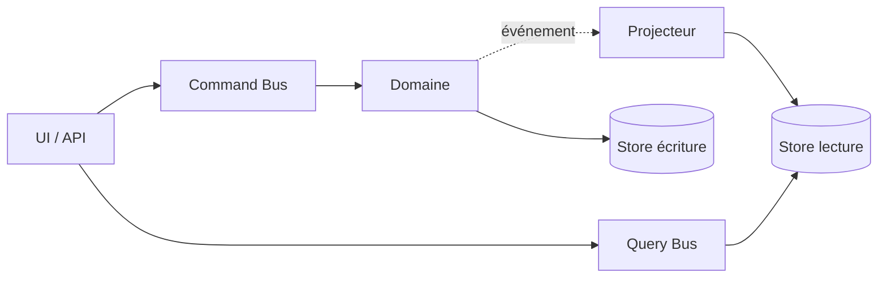
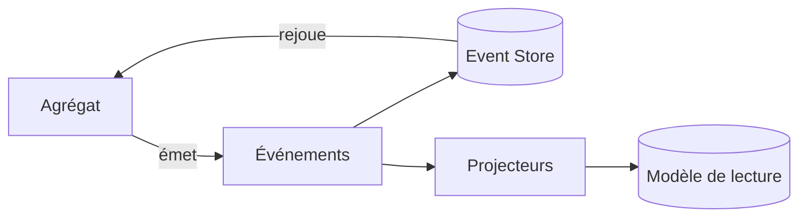
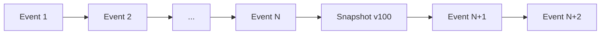
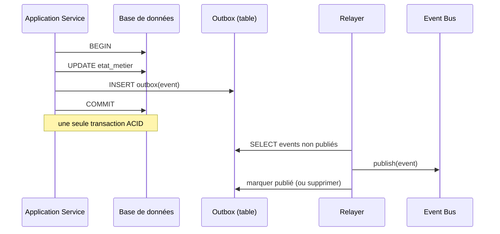
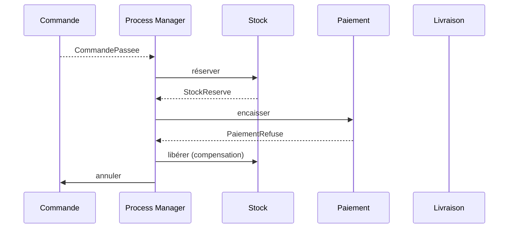
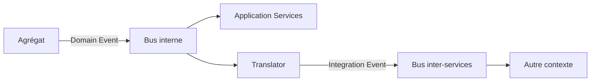

[← Briques tactiques : agrégats et services](05-briques-tactiques-agregats-et-services.md) · [↑ Sommaire](../README.md#table-des-matières) · [Patterns d'intégration et approche fonctionnelle →](07-patterns-dintegration-et-approche-fonctionnelle.md)

# 6. CQRS, événements et fiabilité

## Application Services et CQRS

### Application Services

> **Que veut dire « Application Service » et « orchestrer » ?** Un *Application Service* (service applicatif) est la porte d'entrée vers le domaine pour le monde extérieur (l'interface utilisateur, une API). Son rôle est d'*orchestrer*, c'est-à-dire de coordonner les étapes d'un cas d'usage sans contenir lui-même de règle métier, exactement comme un chef d'orchestre fait jouer les musiciens dans le bon ordre mais ne joue d'aucun instrument. La *couche présentation* est la partie du logiciel qui dialogue avec l'utilisateur (écrans, boutons, réponses d'API).

Les *Application Services* sont la porte d'entrée du domaine pour la couche présentation. Ils orchestrent : ils ouvrent une transaction, chargent les agrégats nécessaires, appellent leurs méthodes métier, sauvegardent, émettent les événements, puis ferment la transaction.

```php
final class PasserCommande {
    public function __construct(
        private CommandeRepository $commandes,
        private CatalogueProduits $catalogue,
        private EventDispatcher $events,
    ) {}

    public function __invoke(PasserCommandeInput $input): CommandeId {
        $commande = Commande::nouvelle($input->client);
        foreach ($input->lignes as $l) {
            $produit = $this->catalogue->trouver($l->produitId)
                ?? throw new ProduitInconnu($l->produitId);
            $commande->ajouter(new LigneCommande($produit->id, $l->quantite, $produit->prix));
        }
        $this->commandes->add($commande);
        $this->events->dispatch(new CommandePassee($commande->id));
        return $commande->id;
    }
}
```

Règle : **un Application Service ne contient pas de logique métier** ; il ne fait qu'orchestrer.

### CQRS

> **Que veut dire « CQRS » ?** CQRS est l'acronyme de *Command Query Responsibility Segregation*, en français « séparation des responsabilités entre commandes et requêtes ». Une *commande* modifie l'état (passer une commande, payer) ; une *requête* lit l'état sans le changer (afficher une liste). L'idée : utiliser un modèle différent pour écrire et pour lire. Dans un restaurant, la cuisine (qui prépare, l'écriture) et la salle (qui sert, la lecture) sont organisées différemment, chacune optimisée pour son rôle.

CQRS (*Command Query Responsibility Segregation*, [Greg Young, 2010](https://martinfowler.com/bliki/CQRS.html)) sépare le modèle d'écriture du modèle de lecture :

| Côté | Rôle | Optimisé pour |
|------|------|---------------|
| **Commands** | Modifient l'état (réservations, paiements). | Cohérence, invariants, agrégats. |
| **Queries** | Lisent l'état (listes, vues, tableaux de bord). | Performance, projections dénormalisées. |



> **Que veut dire « projection » et « dénormalisé » ?** Une *projection* est une vue de lecture construite à partir des données d'écriture, taillée pour être lue vite (comme un résumé préparé d'avance). *Dénormalisé* veut dire qu'on accepte de dupliquer ou de pré-assembler des informations pour éviter des recalculs coûteux à la lecture, à l'inverse d'une base « normalisée » qui range chaque donnée à un seul endroit.

CQRS ne se justifie que là où la lecture et l'écriture ont des modèles ou des charges très différents. Dans le doute, **commencer sans**.

[🔝 Retour en haut de page](#table-des-matières)

## CQRS et Event Sourcing : indépendants

> **CQRS et ES sont indépendants.** *CQRS* (séparation lecture/écriture) et *Event Sourcing* (sauvegarde sous forme d'événements) sont **deux décisions indépendantes**. On les présente parfois comme un duo inséparable, c'est trompeur. On peut adopter l'un sans l'autre, et chaque combinaison a son sens.

> **Que veut dire « ES » et « orthogonal » ?** *ES* est l'abréviation d'*Event Sourcing*, en français « stockage par événements » (détaillé dans la section suivante) : au lieu de garder l'état final, on garde la liste de tout ce qui s'est passé. *Orthogonal* est un mot de géométrie (deux droites à angle droit) utilisé ici au sens figuré : deux choix qui n'ont rien à voir l'un avec l'autre et qu'on décide séparément, comme choisir la couleur d'une voiture n'a rien à voir avec le choix du moteur.

### Les quatre combinaisons possibles

| | **Sans CQRS** | **Avec CQRS** |
|---|---------------|---------------|
| **Sans ES** | Architecture classique : un modèle, une base, lecture et écriture par les mêmes objets. **Cas par défaut**, suffisant pour la majorité des applications. | Modèles de lecture dédiés (vues SQL dénormalisées, projections), persistance d'état classique. **Très utile** quand les requêtes divergent fortement des invariants d'écriture. |
| **Avec ES** | Event Sourcing « pur » : le store est l'historique, l'état courant est reconstruit à la lecture. Possible mais **inhabituel** : on bascule rarement en ES sans CQRS, car les requêtes deviennent rapidement coûteuses. | Combinaison classique présentée par Greg Young : commands → events → projections → reads. **Puissante mais coûteuse**, à réserver aux domaines où la traçabilité est exigée. |

### Quand CQRS sans ES

- on a un **modèle d'écriture riche** (agrégats DDD, invariants), mais les lectures dominantes sont des listes/dashboards/recherches qui n'ont pas besoin de l'objet métier ;
- on veut introduire **plusieurs vues** optimisées (par client, par fournisseur, par exercice) sans tordre les agrégats ;
- on cible la **performance** (cache, projections matérialisées) sans complexité opérationnelle d'un event store.

C'est la combinaison la plus fréquente dans les SI métier à fort volume de lecture.

### Quand ES sans CQRS

- très rare en pratique ; envisageable si la **lecture est intrinsèquement faible** (back-office d'audit où l'on consulte rarement, mais on doit tout reconstituer) ;
- l'effort de projection apparaît néanmoins dès qu'une UI a besoin d'une liste : on bascule de fait vers CQRS.

### Adopter progressivement

Une trajectoire prudente, observée en pratique :

1. **Étape 0** : modèle riche DDD, sauvegarde de l'état, lectures via le même modèle. Cela suffit longtemps.
2. **Étape 1** : quand les lectures deviennent un goulot d'étranglement ou que les vues divergent, introduire **CQRS** (projections de lecture, sans toucher à l'écriture).
3. **Étape 2** : quand un sous-domaine cœur exige un audit, une traçabilité ou la possibilité de rejouer l'histoire (finance, santé, chaîne logistique réglementée), introduire l'**Event Sourcing** sur ce seul sous-domaine.

> **Que veut dire « audit » et « chaîne logistique » ?** Un *audit* est une vérification a posteriori : pouvoir reconstituer exactement qui a fait quoi et quand, comme un relevé de compte qui justifie chaque opération. La *chaîne logistique* (*supply chain*) est tout le parcours d'un produit, du fournisseur jusqu'au client final.

> **Garde-fou.** Ne pas adopter CQRS et ES pour leur réputation. Chaque pattern porte un **coût d'exploitation** (outillage, formation, débogage) qui se paie en temps d'ingénieurs. Le bon ordre est : DDD tactique, puis CQRS si nécessaire, puis ES si vraiment nécessaire, **jamais l'inverse**.

[🔝 Retour en haut de page](#table-des-matières)

## Événements de domaine et Event Sourcing

### Événement de domaine

> **Que veut dire « Domain Event » et « découpler » ?** Un *Domain Event* (événement de domaine) est l'annonce d'un fait métier qui *vient de se produire*, toujours formulé au passé (`CommandePassee`, `PaiementRefuse`). C'est une nouvelle qu'on publie : « ceci a eu lieu ». *Découpler* signifie réduire la dépendance entre deux parties pour qu'elles n'aient pas à se connaître. Comme un journal : celui qui annonce une nouvelle n'a pas besoin de savoir qui la lira ni ce que chacun en fera.

Un *Domain Event* est un fait métier passé, immuable, exprimé au passé : `CommandePassee`, `PaiementRefuse`, `ColisLivre`. Il découple les producteurs des consommateurs : la commande ne sait pas qui s'intéresse à sa validation.

> **Que veut dire « producteur » et « consommateur » ?** Le *producteur* est celui qui émet l'événement (l'agrégat où le fait s'est produit). Le *consommateur* est celui qui le reçoit et réagit (envoyer un courriel, mettre à jour le stock). Comme une boîte aux lettres : le facteur dépose (producteur), le destinataire relève et agit (consommateur), sans que l'un dicte le travail de l'autre.

Caractéristiques :

- **immuable** ; un événement ne se modifie pas, il se compense par un autre événement ;
- **complet** ; il porte l'information dont les abonnés auront besoin (éviter le retour à la base) ;
- **émis par un agrégat** lorsqu'un changement d'état significatif a lieu.

### Event Sourcing

> **Que veut dire « Event Sourcing » ?** Traduisible par « stockage par événements ». Au lieu d'enregistrer seulement la photo de l'état actuel, on enregistre la *suite complète des événements* qui ont mené à cet état, et on reconstitue l'état en les rejouant. Comparez un compte en banque : la banque ne garde pas juste « solde : 320 € », elle garde tous les mouvements (dépôt de 500, retrait de 180...), et le solde se recalcule en additionnant l'historique. C'est exactement l'idée.

L'*Event Sourcing* enregistre un agrégat **sous la forme de la suite des événements qui l'ont fait advenir**, plutôt que sous celle de son état courant. L'état est reconstruit en rejouant les événements.

| Bénéfice | Coût |
|----------|------|
| Historique complet, audit gratuit | Requêtes complexes à projeter |
| Reconstruction d'états passés | Versionnage des événements obligatoire |
| Synergie naturelle avec CQRS | Outillage et expertise spécifiques |
| Détection rétroactive de bugs | Impossibilité de modifier le passé |



> **Que veut dire « Event Store » ?** L'*Event Store* (magasin d'événements) est la base de données spécialisée qui conserve, dans l'ordre, tous les événements. C'est le grand registre où rien ne s'efface : on ajoute toujours à la fin, jamais on ne modifie le passé.

L'Event Sourcing reste un choix lourd : à n'envisager que sur les domaines où la traçabilité a une valeur métier (finance, santé, audit réglementaire).

### Stratégie de snapshots et de rejeu

> **Que veut dire « snapshot » et « rejeu » ?** Un *snapshot* (instantané) est une photo de l'état d'un agrégat à un moment donné, qu'on garde pour ne pas avoir à tout recalculer depuis le début. Le *rejeu* consiste à reparcourir les événements dans l'ordre pour reconstruire l'état. Comme un film : au lieu de le regarder en entier à chaque fois, on saute à un chapitre enregistré (le snapshot) puis on ne visionne que la suite.

Quand l'historique grandit, rejouer tous les événements à chaque chargement devient coûteux. La parade est le **snapshot** : une photo périodique de l'état d'un agrégat, à partir de laquelle on ne rejoue que les événements survenus ensuite.



> **Que veut dire « heuristique » ?** Une *heuristique* est une règle pratique « au doigt mouillé », pas une loi exacte : elle marche bien en général et aide à décider vite, sans prétendre être parfaite. « Prendre un parapluie si le ciel est gris » est une heuristique.

Heuristique : faire un snapshot tous les *N* événements (50, 100...), garder l'historique brut pour l'audit, et accepter que le snapshot ne soit qu'une optimisation, jamais une source de vérité.

### Versionnage des événements

> **Que veut dire « versionnage » ?** *Versionner*, c'est marquer chaque variante d'une chose d'un numéro (`v1`, `v2`) pour suivre son évolution dans le temps. Comme les éditions successives d'un livre : on sait laquelle on lit. Ici, un événement enregistré ne peut plus jamais changer ; quand son format évolue, on crée une nouvelle version et il faut savoir gérer les anciennes.

Un événement enregistré ne peut plus changer. Quand le métier évolue (ajout d'un champ, renommage), trois techniques coexistent et se combinent :

- **Upcaster** : fonction pure appliquée à la **lecture** qui transforme un événement de version `v1` vers `v2`. Pattern classique : une chaîne d'upcasters (`v1` vers `v2` vers `v3`) tenue à jour. Avantage : aucune modification du stockage existant. Inconvénient : la chaîne s'allonge, et on traîne le poids de l'histoire à chaque rejeu.

> **Que veut dire « upcaster » et « fonction pure » ?** Un *upcaster* (du verbe anglais *to upcast*, « convertir vers le haut ») est une petite fonction qui met à niveau un vieil événement vers son format récent au moment où on le relit, sans toucher à ce qui est stocké. Une *fonction pure* est une fonction qui, pour une même entrée, rend toujours la même sortie et ne provoque aucun effet de bord (elle ne modifie rien ailleurs, n'écrit rien, n'appelle l'heure ni le hasard). Comme une calculatrice : 2 + 3 donne toujours 5, sans rien changer d'autre.

- **Émissions multiples** (*double-write*, double écriture) : produire pendant une période de transition à la fois `EvtV1` et `EvtV2`, afin que les anciens consommateurs continuent de fonctionner. Coûteux en stockage, simple à exploiter.
- **Copier-remplacer** (*stream rewrite*, réécriture du flux) : créer un **nouveau flux** d'événements `vN+1` à partir de l'ancien, en transformant à la copie. Lourd (interruption ou bascule), mais cela nettoie la dette de format. Réservé aux refontes profondes.

> **Que veut dire « downtime » et « flux » ?** Le *downtime* (temps d'arrêt) est la période pendant laquelle le service est indisponible, par exemple le temps d'une grosse opération de maintenance. Un *flux* (*stream*) est une suite d'événements qui s'écoule dans le temps, comme l'eau d'un cours d'eau ; ici, la longue file ordonnée des événements d'un agrégat.

- **Lecteur tolérant** (*tolerant reader*) : exiger des consommateurs qu'ils ignorent les champs inconnus et acceptent les valeurs par défaut. Indispensable, et complémentaire des trois autres techniques.

### Pièges récurrents (souvent sous-estimés)

- **Évolution du format** (*schema evolution*) : un événement publié il y a trois ans est toujours dans le magasin. Sans politique d'upcasters claire et **testée à l'intégration**, le moindre renommage casse silencieusement les rejeux. Tester chaque upcaster contre des **jeux de données historiques figés** (*fixtures*).

> **Que veut dire « test d'intégration » et « fixture » ?** Un *test d'intégration* vérifie que plusieurs morceaux fonctionnent bien ensemble (par opposition au test unitaire qui isole un seul morceau). Une *fixture* est un jeu de données de test préparé et figé, qui sert de référence stable pour comparer les résultats.

- **Reconstruction des modèles de lecture** : les projections doivent pouvoir être **reconstruites de zéro** à tout moment (changement de modèle de lecture, bug d'un projecteur, ajout d'un index). Cela suppose une mécanique de rejeu *idempotente* et des projections **purement déterministes** (sans appel à l'heure courante ni à un service externe en plein milieu).

> **Que veut dire « idempotent » et « déterministe » ?** *Idempotent* qualifie une opération qu'on peut répéter sans changer le résultat au-delà de la première fois : appuyer dix fois sur le bouton « éteindre » d'un appareil déjà éteint ne fait rien de plus. *Déterministe* qualifie un calcul qui donne toujours le même résultat pour les mêmes entrées, sans part de hasard. Ces deux propriétés rendent le rejeu sûr et reproductible.

- **Volumétrie du magasin d'événements** : sur un domaine très actif, le magasin grossit sans plafond. Anticiper l'archivage à froid (mettre de côté les vieux événements), le découpage par flux, le coût de stockage à long terme.
- **Débogage en production** : aucune requête SQL classique ne répond directement à *« quel est l'état actuel d'un agrégat ? »* ; il faut systématiquement rejouer. Investir dans un **visualiseur** de magasin d'événements et des outils de rejeu ciblé n'est pas négociable.

> **Que veut dire « SQL » ?** SQL (*Structured Query Language*, langage de requêtes structuré) est le langage standard pour interroger une base de données classique (« donne-moi tous les clients de Lyon »). En Event Sourcing, l'état n'est pas stocké tel quel, donc une simple requête SQL ne suffit plus à le lire.

- **Effets de bord interdits dans les agrégats** : la méthode qui applique un événement (`apply(Event)`) doit être **strictement déterministe**. Tout appel à un service, à l'heure courante, au hasard ou à un compteur externe pendant la reconstruction casse le rejeu.

> **Que veut dire « effet de bord » ?** Un *effet de bord* est tout ce qu'une fonction modifie en dehors de son simple calcul : écrire dans un fichier, envoyer un message, lire l'heure, tirer un nombre au hasard. Pendant un rejeu, ces effets fausseraient la reconstruction, car ils ne donneraient pas le même résultat qu'à l'origine.

- **Évolution des invariants** : si une règle métier change, d'anciens événements peuvent ne plus être *valides* au regard de la règle d'aujourd'hui. Il faut choisir : soit on respecte le passé tel qu'il a été (préférable pour l'audit), soit on refuse les rejeux qui violent la règle (et il faut alors prévoir une compensation).
- **Intégration longue des nouveaux** : un développeur expérimenté met plusieurs semaines à devenir productif sur un système Event Sourcing non trivial. Compter ce coût dans la décision d'adoption.

### Inconvénients à connaître

- complexité d'exploitation (magasin d'événements dédié, projections à reconstruire) ;
- requêtes ponctuelles impossibles sans projection préalable ;
- débogage moins direct (l'état actuel est recalculé, pas stocké) ;
- intégration plus longue des nouveaux membres de l'équipe.

[🔝 Retour en haut de page](#table-des-matières)

## Outbox Pattern : publication fiable des événements

> **Que veut dire « Outbox » ?** *Outbox* signifie « boîte d'envoi » (comme dans une messagerie). Le principe : au lieu d'essayer d'envoyer un message tout de suite (au risque de le perdre si l'envoi échoue), on l'écrit d'abord dans une boîte d'envoi en base de données, *en même temps* que le changement métier, puis un facteur passe plus tard vider la boîte et envoyer pour de bon. Pattern popularisé par Chris Richardson, largement documenté chez Microsoft et Confluent. Indispensable dès qu'on a une base de données d'un côté et un système de messagerie de l'autre.

### Le problème : la double écriture

> **Que veut dire « bus », « broker », « asynchrone » ?** Un *bus* (ou *broker*, courtier de messages) est le système qui transporte les messages d'un service à un autre (Kafka, RabbitMQ, SQS en sont des exemples), comme un service postal entre applications. *Asynchrone* veut dire « en différé » : on ne reste pas à attendre la réponse, le traitement se fait plus tard, à son rythme, par opposition à *synchrone* (« sur le moment, on attend »).

Sans Outbox, un Application Service classique fait deux écritures sur deux systèmes :

1. un `INSERT` ou un `UPDATE` dans la base de données (via le Repository).
2. un `publish()` sur le bus de messages (Kafka, RabbitMQ, SQS).

> **Que veut dire « INSERT », « UPDATE », « publish » ?** `INSERT` et `UPDATE` sont des commandes SQL : la première ajoute une ligne en base, la seconde en modifie une existante. `publish()` (« publier ») envoie un message sur le bus à destination des autres services.

Les deux ne sont pas dans la même transaction. Trois pannes sont alors possibles :

| Scénario | Conséquence |
|----------|-------------|
| Base écrite, bus indisponible | État changé, événement perdu : incohérence entre services. |
| Base en échec, bus écrit | État non changé, événement publié à tort : les consommateurs travaillent sur une fausse information. |
| Panne entre les deux | Résultat indéterminé ; selon l'ordre, l'un des deux cas précédents. |

### Le pattern : une seule transaction locale



L'agrégat et la ligne d'outbox sont écrits **de façon atomique** (« tout ou rien » dans la même transaction). Le *relayer* (le relais qui vide la boîte) garantit la publication *au moins une fois* ; charge aux consommateurs d'être idempotents.

> **Que veut dire « atomique » et « ACID » ?** *Atomique* (du grec *atomos*, « insécable ») se dit d'une opération qu'on ne peut pas couper en deux : elle se fait entièrement ou pas du tout. *ACID* est un acronyme qui résume les garanties d'une bonne transaction : *Atomicity* (atomicité), *Consistency* (cohérence), *Isolation* (isolation entre transactions simultanées), *Durability* (durabilité, ce qui est validé survit aux pannes). C'est le label de fiabilité des bases de données classiques.

### Variantes

- **Outbox par sondage** (*polling*) : le relayer interroge la table `outbox` à intervalle régulier. Simple, sans configuration particulière ; le délai dépend de la fréquence d'interrogation.
- **Lecture du journal de transactions** (*CDC*, *Change Data Capture*, capture des changements de données) : on lit le journal interne de la base (par exemple via Debezium pour PostgreSQL ou MySQL). Délai très court, mais plus exigeant à exploiter.
- **Listen/notify** (PostgreSQL) : la base prévient elle-même quand un nouvel événement arrive ; bon délai, simple à mettre en œuvre.

> **Que veut dire « polling » et « CDC » ?** Le *polling* (sondage) consiste à reposer la même question à intervalles réguliers (« du nouveau ? du nouveau ? »), comme on regarde sa montre toutes les minutes. Le *CDC* (capture des changements de données) fait l'inverse : on s'abonne au journal interne de la base, qui signale chaque modification dès qu'elle a lieu, sans avoir à redemander.

### Pourquoi c'est incontournable en système distribué

> **Que veut dire « système distribué » ?** C'est un système composé de plusieurs programmes qui tournent sur des machines différentes et coopèrent par le réseau (par opposition à un seul programme sur une seule machine). Le réseau pouvant tomber ou ralentir, on doit prévoir les pannes partielles : c'est tout l'enjeu de l'Outbox.

Sans Outbox, la cohérence à terme repose sur la chance. Avec Outbox, on obtient une **garantie de publication au moins une fois** dès que la transaction métier réussit. C'est la fondation pratique de toute architecture événementielle sérieuse.

[🔝 Retour en haut de page](#table-des-matières)

## Sagas et Process Managers

### Pourquoi un coordinateur ?

> **Que veut dire « saga », « process manager », « workflow » ?** Un *workflow* (flux de travail) est l'enchaînement des étapes d'un processus métier (passer commande, réserver le stock, encaisser, expédier). Une *saga* et un *process manager* sont deux façons de piloter un tel enchaînement qui s'étale dans le temps et traverse plusieurs agrégats. Image de l'organisation d'un mariage : le *process manager* est le wedding planner qui appelle chaque prestataire dans l'ordre (orchestration centralisée) ; la *saga* est le cas où chaque prestataire prévient le suivant dès qu'il a fini, sans chef (chorégraphie).

Quand un cas d'usage métier traverse **plusieurs agrégats** (et parfois plusieurs Bounded Contexts), aucun agrégat n'est légitime pour porter la transaction. Une *saga* ou un *process manager* coordonne le workflow, gère les états intermédiaires, et déclenche des **compensations** quand une étape échoue.

> **Que veut dire « compensation » ?** Une *compensation* est une action métier qui annule l'effet d'une étape déjà validée, en faisant le geste inverse : rembourser après un paiement, libérer un stock après l'avoir réservé. On ne peut pas « revenir en arrière » comme par magie dans un système réparti, alors on défait proprement, par une action de sens contraire.

> **Saga vs Process Manager** : la littérature les confond souvent. Convention courante : la *saga* est chorégraphiée (les événements eux-mêmes déclenchent la suite, sans chef d'orchestre) ; le *process manager* est orchestré (un composant central pilote les étapes). En pratique, on choisit selon le niveau de couplage acceptable.

> **Que veut dire « orchestration » et « chorégraphie » ?** En *orchestration*, un chef central dit à chacun quoi faire et quand (comme un chef d'orchestre). En *chorégraphie*, il n'y a pas de chef : chaque participant connaît son rôle et réagit aux autres (comme des danseurs qui s'enchaînent au signal du précédent). L'orchestration est plus lisible mais plus couplée ; la chorégraphie est plus découplée mais plus difficile à suivre.

### Exemple : passage d'une commande



### Compensations, pas annulations techniques

> **Que veut dire « rollback » et « transaction distribuée à deux phases » ?** Un *rollback* (retour arrière) est l'annulation automatique d'une transaction par la base de données, qui remet tout comme avant. Une *transaction distribuée à deux phases* (*two-phase commit*) tente d'étendre ce « tout ou rien » à plusieurs systèmes à la fois ; c'est lent, fragile et mal adapté aux systèmes répartis modernes. D'où le choix des compensations : on ne revient pas en arrière techniquement, on défait par une action métier.

Aucune transaction distribuée à deux phases : chaque étape est locale et atomique. Si une étape échoue, les étapes déjà validées sont compensées par des actions métier de sens contraire (rembourser, libérer le stock, annuler la commande). La compensation appartient au métier et porte un nom issu du langage ubiquitaire.

### Squelette d'un Process Manager

```php
final class PassageCommandeProcessManager {
    public function quand(CommandePassee $e): void {
        $this->commandes->reserverStock($e->commandeId);
    }
    public function quand(StockReserve $e): void {
        $this->paiements->encaisser($e->commandeId);
    }
    public function quand(PaiementRefuse $e): void {
        $this->stock->liberer($e->commandeId);
        $this->commandes->annuler($e->commandeId, motif: 'paiement refusé');
    }
}
```

### Saga vs Process Manager : terminologie ambiguë

> **Avertissement.** La littérature **n'est pas unanime** sur la frontière saga / process manager. Trois acceptions coexistent et il faut choisir explicitement la sienne dans l'équipe.

| Auteur / source | Position |
|-----------------|----------|
| **Hector Garcia-Molina & Kenneth Salem (1987)** | *Saga* désigne historiquement une transaction de longue durée découpée en transactions locales avec compensations. Aucune mention d'orchestration ou de chorégraphie. |
| **Vaughn Vernon (*IDDD*, 2013)** | Préfère *Process Manager* pour l'orchestration centralisée (un objet avec un état, qui consomme des événements et émet des commandes). Réserve *Saga* aux chorégraphies décentralisées. |
| **Microsoft Patterns & Practices (CQRS Journey, 2012)** | Utilise *Saga* comme synonyme de *Process Manager*, sans distinction, pour l'orchestration. |
| **Chris Richardson (*Microservices Patterns*, 2018)** | Utilise *Saga* comme terme générique, et distingue *orchestration-based saga* (saga orchestrée) et *choreography-based saga* (saga chorégraphiée). |
| **Greg Young** | Tend à parler simplement de *Process Manager* pour l'objet de coordination, et d'*événements* pour la chorégraphie. |

### Convention pratique

Pour éviter les malentendus en équipe, formuler la convention en début de projet et l'inscrire dans le glossaire ubiquitaire :

- soit on adopte **Vernon** : *Saga* = chorégraphie pure (pas de coordinateur), *Process Manager* = orchestrateur à état ;
- soit on adopte **Richardson** : *Saga* = terme générique, suffixé `-orchestrated` (orchestrée) ou `-choreographed` (chorégraphiée) selon le cas ;
- soit on adopte **Microsoft** : les deux mots désignent indifféremment un coordinateur de workflow long.

> **Que veut dire « stateful » (à état) ?** Un composant *stateful* garde en mémoire où il en est entre deux appels (« j'ai déjà réservé le stock, j'attends le paiement »). Son contraire, *stateless* (sans état), oublie tout d'un appel à l'autre. Le process manager est stateful : il suit l'avancement du workflow.

Aucun choix n'est plus juste qu'un autre ; le pire est de les **mélanger** dans le code sans s'en rendre compte. Ici, on retient la convention Vernon : *Saga* chorégraphiée, *Process Manager* orchestré.

[🔝 Retour en haut de page](#table-des-matières)

## Cohérence à terme : compensations et garanties

> **Rappel : la cohérence à terme.** C'est le modèle où plusieurs agrégats finissent par s'accorder sur un état cohérent **après un délai** (de quelques millisecondes à quelques minutes), au lieu d'être tous mis à jour dans une transaction unique. Vernon en fait la norme entre agrégats. Mais elle se paie : sans compensations soignées et garanties d'exploitation, on construit un **chaos asynchrone**.

### Les trois familles de garanties à choisir explicitement

> **Que veut dire « garantie de livraison » ?** Quand un message voyage sur le réseau, il peut se perdre ou arriver en double. Une *garantie de livraison* précise ce que le système promet : ne jamais dupliquer ? ne jamais perdre ? les deux ? Chaque promesse a un prix. Comme un envoi postal : lettre simple (peut se perdre), recommandé (sûr d'arriver), avec accusé de réception (on sait qu'il est arrivé).

| Garantie | Signification | Coût |
|----------|---------------|------|
| **At-most-once** (au plus une fois) | Le message est livré 0 ou 1 fois ; jamais dupliqué, mais il peut se perdre. | Risque métier : ordres oubliés, événements perdus. À éviter sauf cas extrêmes. |
| **At-least-once** (au moins une fois) | Le message est livré 1 fois ou plus ; jamais perdu, mais il peut arriver en double. | Oblige les consommateurs à être **idempotents**. Standard de fait avec Outbox. |
| **Exactly-once** (exactement une fois) | Promesse commerciale courante, **rarement vraie de bout en bout** sans verrous distribués. | Très coûteuse ; remplaçable par « au moins une fois » plus idempotence (résultat équivalent, plus robuste). |

### Idempotence : non négociable côté consommateur

Tout consommateur d'Integration Event doit être **idempotent** : recevoir deux fois le même événement ne doit pas produire deux effets. Techniques :

- **Identifiant de message stable** (`messageId` UUID) stocké dans une table `processed_messages` ; on ignore tout `messageId` déjà vu.
- **Opérations naturellement idempotentes** : `setStatut(Confirmé)` plutôt qu'`incrémenter compteur`.
- **Versionnage optimiste** : chaque agrégat porte un numéro de version ; toute commande référence la version attendue.

### Compensations : les écrire avant d'en avoir besoin

Une compensation est une **action métier** de sens contraire à une action déjà validée, et non une annulation technique. Règles :

- **nommée dans le langage ubiquitaire** : `rembourserClient`, `libérerStock`, `annulerRéservation` (jamais `undoSomething`) ;
- **idempotente** : si on rembourse deux fois la même demande, on ne rembourse qu'une seule fois ;
- **traçable** : chaque compensation laisse une trace (un événement `RemboursementEffectue`) pour l'audit ;
- **prévue dès la conception** : pour chaque étape d'une saga, on écrit explicitement la compensation associée *avant* la mise en production.

### Pannes typiques et stratégies

| Panne | Stratégie de récupération |
|-------|---------------------------|
| Étape qui échoue de façon passagère (délai dépassé côté bus) | *Retry* (réessai) avec *backoff* exponentiel ; idempotence requise. |
| Étape qui échoue durablement (paiement refusé) | Compensation des étapes précédentes ; notification au métier. |
| Compensation qui échoue à son tour | *Dead letter queue* plus intervention humaine ; alerter, ne pas masquer. |
| Message reçu dans le désordre (commande après confirmation) | Versionnage optimiste sur l'agrégat ; rejet ou remise en ordre. |
| Boucle infinie de compensations mutuelles | Plafonner le nombre de tentatives ; *circuit breaker* ; bascule manuelle. |

### Visibilité en exploitation

> **Que veut dire « retry », « backoff », « dead letter queue », « circuit breaker », « optimiste » ?** Un *retry* est un nouvel essai après un échec. Le *backoff exponentiel* espace ces essais de plus en plus (1 s, 2 s, 4 s, 8 s...) pour ne pas marteler un service en difficulté. Une *dead letter queue* (file des lettres mortes) est la corbeille où atterrissent les messages impossibles à traiter, pour examen humain. Un *circuit breaker* (disjoncteur) coupe automatiquement les appels vers un service en panne pour éviter l'effet domino, comme un fusible électrique. Le *verrouillage optimiste* parie qu'il n'y aura pas de conflit et le vérifie au dernier moment grâce à un numéro de version, plutôt que de bloquer la donnée d'avance.

> **Que veut dire « observabilité » et « traçage distribué » ?** L'*observabilité* est la capacité à comprendre ce qui se passe à l'intérieur d'un système rien qu'en regardant ce qu'il émet (journaux, mesures, traces). Le *traçage distribué* suit une même demande à travers tous les services qu'elle traverse, grâce à un identifiant unique (`traceId`), comme le numéro de suivi d'un colis qui permet de le pister d'entrepôt en entrepôt.

Une architecture en cohérence à terme **sans observabilité** est ingérable en production. Investir dans :

- **traçage distribué** (OpenTelemetry) : un même `traceId` traverse tous les services et tous les événements ;
- **tableaux de bord par saga** : combien sont en cours, combien ont compensé, combien sont en *dead letter* ;
- **alertes sur l'écart de cohérence** : si plus de N minutes s'écoulent entre `CommandePassee` et `FactureEmise`, alerter.

> **Garde-fou.** La cohérence à terme n'est pas un *« on s'en occupera plus tard »*. C'est un **engagement métier** : on a accepté qu'à un instant donné, deux contextes voient l'état différemment. Cela doit être **validé explicitement** avec le métier (par exemple : *« le client peut voir une commande passée avant que la facture soit émise, c'est acceptable »*). Si le métier refuse, c'est qu'il faut soit fusionner les agrégats, soit accepter une transaction distribuée. Pas de réponse évasive.

[🔝 Retour en haut de page](#table-des-matières)

## Domain Events vs Integration Events

Voici une distinction essentielle, souvent mal comprise.

> **Que veut dire « Integration Event » ?** Un *Integration Event* (événement d'intégration) est un événement destiné à *sortir* du contexte pour informer d'autres services ou contextes. Il a un format stable et documenté, conçu pour durer. Le *Domain Event*, lui, reste *à l'intérieur* du contexte et colle au modèle interne. Image de l'entreprise : la note de service interne (Domain Event, dans le jargon maison) et le communiqué de presse officiel (Integration Event, soigné et stable pour l'extérieur).

| Aspect | Domain Event | Integration Event |
|--------|--------------|-------------------|
| Portée | Interne au Bounded Context. | Inter-contextes ou inter-services. |
| Couplage | Couplé au modèle local. | Découplé, stable, versionné. |
| Émetteur | Un agrégat. | Un *publisher* dédié, après la transaction. |
| Forme | Structure riche, alignée sur le langage ubiquitaire interne. | Contrat documenté (souvent décrit en JSON Schema, Avro ou Protobuf). |
| Cohérence | Synchrone à la transaction émettrice. | Asynchrone, *eventual consistency*. |
| Exemple | `LignePanierAjoutee` (interne au Panier). | `CommandePassee` publiée vers Facturation et Livraison. |

### Anti-modèle : exposer ses Domain Events

> **Que veut dire « JSON Schema, Avro, Protobuf » ?** Ce sont trois formats pour décrire de façon stricte la structure d'un message échangé entre services (quels champs, quels types). Ils servent de contrat : l'émetteur et le récepteur s'accordent dessus. *JSON Schema* décrit du JSON (texte lisible), *Avro* et *Protobuf* (de Google) sont des formats compacts et performants pour de gros volumes.

Publier directement ses Domain Events sur le bus entre services lie tous les consommateurs au modèle interne du producteur : tout renommage de champ devient une migration répartie sur l'ensemble des services. **Toujours traduire** un Domain Event en Integration Event au moment de la publication externe. C'est encore une forme d'Anti-Corruption Layer, mais dans le sens sortant.



[🔝 Retour en haut de page](#table-des-matières)

---

[← Briques tactiques : agrégats et services](05-briques-tactiques-agregats-et-services.md) · [↑ Sommaire](../README.md#table-des-matières) · [Patterns d'intégration et approche fonctionnelle →](07-patterns-dintegration-et-approche-fonctionnelle.md)
