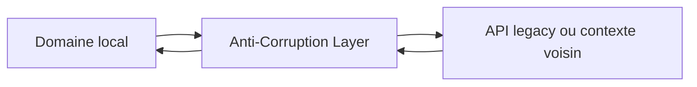
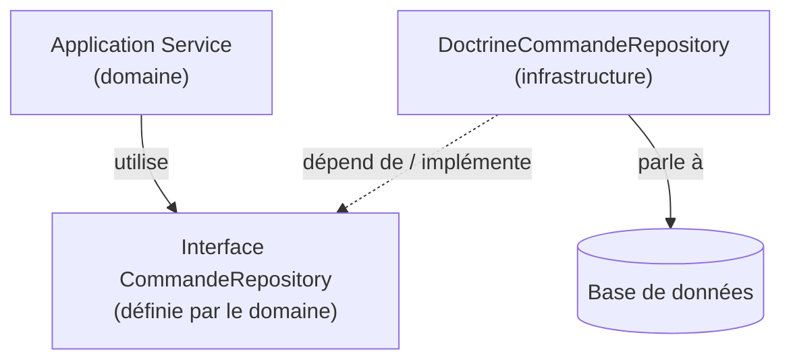
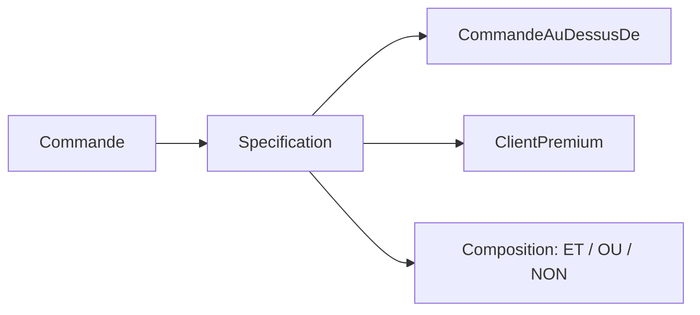

[← CQRS, événements et fiabilité](06-cqrs-evenements-et-fiabilite.md) · [↑ Sommaire](../README.md#table-des-matières) · [Mise en pratique et mises en garde →](08-mise-en-pratique-et-mises-en-garde.md)

# 7. Patterns d'intégration et approche fonctionnelle

## Anti-Corruption Layer

> **Que veut dire « Anti-Corruption Layer » ?** Traduit par « couche anti-corruption ». C'est un traducteur placé entre votre système et un système voisin (un vieux logiciel, un service externe), pour empêcher le vocabulaire et les défauts de l'autre de contaminer votre modèle propre. Comme un interprète diplomatique : il traduit dans les deux sens et filtre les maladresses, pour que chaque partie garde sa langue et ses usages intacts.

Une *Anti-Corruption Layer* (ACL) est une couche de traduction placée entre deux Bounded Contexts pour empêcher les concepts de l'un de polluer l'autre. Elle convertit les modèles dans les deux sens et absorbe les dialectes étrangers.

### Pourquoi

Quand un système doit s'intégrer à un *legacy* (un ancien logiciel encore en service), à un service loué en ligne ou à un contexte voisin doté d'un modèle différent, importer ses concepts tels quels contamine le modèle local. Une ACL préserve l'intégrité du modèle, au prix d'une traduction explicite.

> **Que veut dire « legacy » et « mapping » ?** Un système *legacy* (« hérité ») est un vieux logiciel toujours utilisé, souvent difficile à modifier, dont on a hérité du passé. Le *mapping* (correspondance) est la mise en relation, champ par champ, entre deux représentations : on dit que tel champ de l'un correspond à tel champ de l'autre, comme un dictionnaire de traduction.



L'ACL se compose généralement d'adaptateurs (côté infrastructure) et de traducteurs (qui convertissent les DTOs en objets de domaine).

> **Que veut dire « adaptateur » et « DTO » ?** Un *adaptateur* est un morceau de code qui fait dialoguer deux choses incompatibles, comme un adaptateur de prise électrique entre deux pays. Un *DTO* (*Data Transfer Object*, objet de transfert de données) est un simple paquet de données sans comportement, servant à transporter de l'information d'un endroit à un autre (par exemple, la réponse brute d'une API avant qu'on la traduise en objet métier).

[🔝 Retour en haut de page](#table-des-matières)

## Specification Pattern

> **Que veut dire « Specification Pattern » et « booléen » ?** *Specification* signifie « spécification », ici au sens de critère. Ce pattern emballe une règle qui répond par oui ou par non dans un petit objet réutilisable. Un *booléen* est une valeur qui ne peut être que vraie ou fausse (du nom du mathématicien George Boole). Image : un tampon de contrôle qualité qui répond « conforme » ou « non conforme », et qu'on peut combiner avec d'autres tampons.

Le *Specification Pattern* ([Eric Evans & Martin Fowler, 2002](https://www.martinfowler.com/apsupp/spec.pdf)) emballe une règle métier booléenne dans un objet réutilisable, qu'on peut combiner avec des opérateurs logiques (`et`, `ou`, `non`).

### Exemple

```php
interface Specification {
    public function isSatisfiedBy(object $candidat): bool;
}

final class CommandeAuDessusDe implements Specification {
    public function __construct(private Money $seuil) {}
    public function isSatisfiedBy(object $c): bool {
        return $c instanceof Commande && $c->total()->ge($this->seuil);
    }
}

final class ClientPremium implements Specification {
    public function isSatisfiedBy(object $c): bool {
        return $c instanceof Commande && $c->client()->estPremium();
    }
}

// Composition
$eligibleLivraisonGratuite =
    (new CommandeAuDessusDe(new Money(5000, Devise::EUR)))
    ->ou(new ClientPremium());
```

### Bénéfices

- règle métier nommée, testable isolément ;
- réutilisable à la fois pour la validation *et* pour le filtrage dans un Repository ;
- combinable sans toucher au code existant (respect du principe OCP).

> **Que veut dire « OCP » ?** OCP est l'acronyme de *Open/Closed Principle*, le « principe ouvert/fermé » : un des cinq principes SOLID. Il dit qu'un module doit être *ouvert à l'extension* (on peut ajouter du comportement) mais *fermé à la modification* (sans réécrire l'existant). Comme une multiprise : on branche un nouvel appareil sans recâbler le mur. Le Specification Pattern l'illustre, car on crée de nouvelles règles en les combinant, sans modifier les anciennes.

> **Que veut dire « SOLID » ?** SOLID est un moyen mnémotechnique regroupant cinq principes de conception orientée objet popularisés par Robert C. Martin : *Single Responsibility* (responsabilité unique : une classe ne fait qu'une chose), *Open/Closed* (ouvert/fermé, voir ci-dessus), *Liskov Substitution* (un sous-type doit pouvoir remplacer son type parent sans surprise), *Interface Segregation* (des interfaces petites et ciblées plutôt qu'une grosse fourre-tout), *Dependency Inversion* (dépendre d'abstractions, pas de détails concrets). Ce sont cinq règles d'hygiène pour un code souple et durable.

> **Que veut dire « inversion de dépendance » ?** C'est le D de SOLID. Normalement, le code métier appellerait directement le code technique (la base de données), donc en dépendrait. On *inverse* cette dépendance : le métier définit une interface (un contrat, par exemple `CommandeRepository`), et c'est le code technique qui s'y plie. Résultat : le métier ne dépend plus de la technique, c'est l'inverse. Comme un patron qui décrit le poste (l'interface) et laisse l'employé (l'implémentation) s'y conformer, sans connaître son nom à l'avance.

Le schéma ci-dessous montre ce renversement : la flèche « dépend de » pointe du code technique vers l'interface du domaine, jamais l'inverse.





[🔝 Retour en haut de page](#table-des-matières)

## DDD fonctionnel : modéliser sans objets

> **Que veut dire « programmation fonctionnelle » ?** C'est un style de programmation qui construit le logiciel à partir de *fonctions* (des transformations qui prennent une entrée et rendent une sortie) plutôt qu'à partir d'objets qui changent d'état. On y privilégie les données immuables et les fonctions pures (sans effet de bord). C'est l'esprit d'une recette de cuisine : à partir des mêmes ingrédients, on obtient toujours le même plat, sans modifier le garde-manger. F#, OCaml, Haskell, Elixir, Scala et Clojure sont des langages de ce style.

> **Le DDD ne dépend pas d'un style de programmation.** Le DDD est un ensemble de **principes de modélisation**, pas un style de code. Ses concepts (langage ubiquitaire, bounded contexts, agrégats comme frontières de cohérence, événements de domaine) se transposent **naturellement en programmation fonctionnelle**. Scott Wlaschin formalise cette approche dans *Domain Modeling Made Functional* (Pragmatic Bookshelf, 2018).

### Pourquoi ça marche aussi bien (et parfois mieux)

- **Immutabilité native** : un objet-valeur est un *record* (enregistrement) immuable par défaut. Inutile d'imposer la discipline en relecture, le langage la garantit.
- **Types-sommes** (*sum types* ou *discriminated unions*, unions discriminées) : un `StatutCommande` qui peut valoir `Brouillon | Passée | Annulée(motif)` se déclare en une ligne, et le compilateur oblige à traiter chaque cas. En programmation orientée objet (OO), cela demande une hiérarchie de classes ou une énumération sans état.

> **Que veut dire « type-somme » et « compilateur » ?** Un *type-somme* est un type qui peut prendre l'une parmi plusieurs formes possibles, et une seule à la fois (un feu est rouge *ou* orange *ou* vert). Le *compilateur* est le programme qui traduit votre code en instructions exécutables ; chemin faisant, il vérifie sa cohérence et signale les erreurs avant l'exécution, comme un correcteur qui relit avant l'impression.

- **Validation par le type** : `Email`, `Iban`, `Money` sont des types *parsés* selon le principe *« parse, don't validate »* (« analyser, plutôt que valider », Alexis King) ; un `Email` non valide ne **peut pas** exister dans le programme. Aucune vérification défensive répétée n'est nécessaire.

> **Que veut dire « parser » (analyser) ?** *Parser*, c'est lire une donnée brute (un texte) et la transformer en une valeur structurée et garantie correcte, ou bien refuser. « Analyser plutôt que valider » signifie : au lieu de vérifier partout qu'un texte ressemble à un courriel, on le convertit une seule fois en un type `Email` ; ensuite, partout où ce type apparaît, on a la certitude qu'il est valide. Comme le contrôle à l'entrée d'une zone sécurisée : une fois passé, plus besoin de re-vérifier le badge à chaque porte.

- **Workflow comme fonction** : un cas d'usage est une fonction `(input) -> Result<output, error>` ; les Application Services deviennent des assemblages de fonctions, sans état caché.
- **Événements comme sortie** : un agrégat fonctionnel renvoie un couple `(nouvel état, événements)` au lieu de se modifier sur place. Plus simple à tester, à auditer et à stocker par événements.

### Exemple en F# (esquisse)

```fsharp
// Objets-valeurs : types parsés
type ClientId = ClientId of System.Guid
type Money = { Centimes: int; Devise: Devise }
type StatutCommande =
    | Brouillon
    | Passee
    | Annulee of motif: string

// Agrégat : record immuable
type Commande = {
    Id: CommandeId
    Client: ClientId
    Lignes: LigneCommande list
    Statut: StatutCommande
}

// Cas d'usage : fonction pure
type PasserCommande = Commande -> Result<Commande * CommandePasseeEvent, ErreurMetier>

let passer (cmd: Commande) : Result<Commande * CommandePasseeEvent, ErreurMetier> =
    match cmd.Statut, cmd.Lignes with
    | Brouillon, [] -> Error CommandeVide
    | Brouillon, _  -> Ok ({ cmd with Statut = Passee }, CommandePasseeEvent cmd.Id)
    | _ -> Error CommandeDejaPassee
```

### Tableau de correspondance OO et fonctionnel

| Concept DDD | OO classique | Fonctionnel |
|-------------|--------------|-------------|
| Entité | Classe avec identité, attributs modifiables | *Record* immuable, transformé par `evolve : State -> Cmd -> State * Event list` |
| Objet-valeur | Classe finale immuable | *Record* ou alias de type avec constructeur intelligent (*smart constructor*) |
| Agrégat | Classe racine + entités internes encapsulées | Fonction `decide : State -> Cmd -> Result<Event list, Error>` |
| Domain Service | Classe sans état | Fonction de plusieurs paramètres |
| Repository | Interface définie par le domaine | *Type abstrait* `Save : State -> Async<Unit>` |
| Application Service | Classe orchestratrice | Composition de fonctions ; effets isolés en bordure |
| Event Sourcing | Liste mutable d'événements appliqués | `fold (apply: State -> Event -> State) initial events` |

### Quand ça vaut le détour

- équipe à l'aise avec un langage fonctionnel ou prête à investir pour l'apprendre ;
- domaine **riche en états et en transitions** (workflows, machines à états, calculs financiers) ;
- exigence forte de **vérification par le compilateur** (sécurité, finance, santé) ;
- intérêt pour l'**Event Sourcing** : le mariage du fonctionnel et de l'ES est particulièrement naturel.

> **Que veut dire « machine à états » ?** Une *machine à états* est un objet qui ne peut se trouver que dans un nombre fini d'états et passe de l'un à l'autre selon des règles précises. Un feu tricolore en est l'exemple parfait : rouge, orange, vert, avec des transitions autorisées seulement dans un certain ordre. Beaucoup de processus métier (une commande qui passe de brouillon à passée puis expédiée) sont des machines à états.

> **Note.** Ne pas confondre *langage fonctionnel* et *style fonctionnel dans un langage objet*. Kotlin, TypeScript et Python permettent largement le style « enregistrement immuable, type-somme, fonction pure » ; Java aussi (depuis sa version 21, avec les *records* et les *sealed types*). Les principes du DDD fonctionnel s'appliquent dès qu'on dispose de ces briques, quel que soit le langage choisi.

[🔝 Retour en haut de page](#table-des-matières)

---

[← CQRS, événements et fiabilité](06-cqrs-evenements-et-fiabilite.md) · [↑ Sommaire](../README.md#table-des-matières) · [Mise en pratique et mises en garde →](08-mise-en-pratique-et-mises-en-garde.md)
