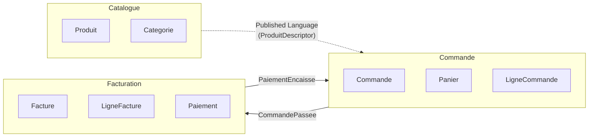
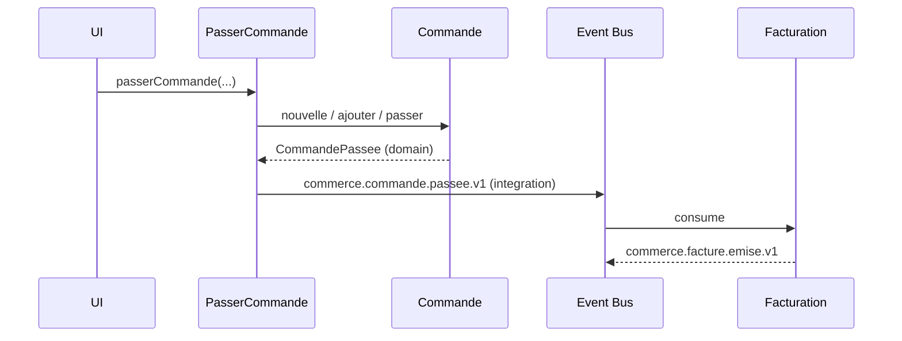
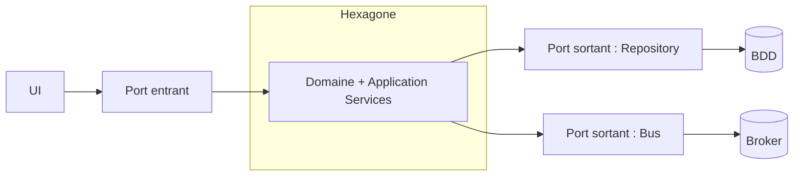
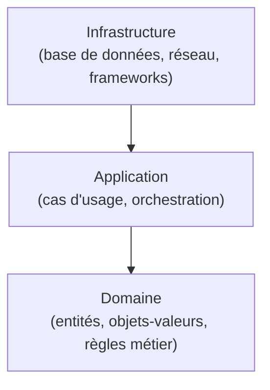
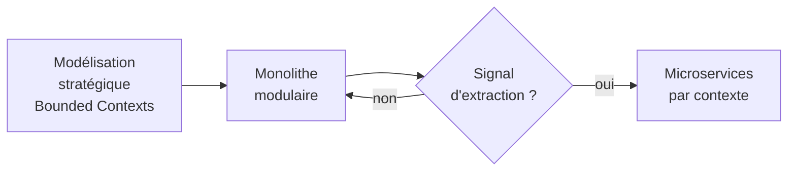

[← Patterns d'intégration et approche fonctionnelle](07-patterns-dintegration-et-approche-fonctionnelle.md) · [↑ Sommaire](../README.md#table-des-matières)

# 8. Mise en pratique et mises en garde

## Exemple intégré : e-commerce multi-contextes

Voici une mise en situation complète d'un commerce en ligne, simplifiée mais cohérente. Trois Bounded Contexts collaborent par événements : **Catalogue**, **Commande**, **Facturation**.

### Vue d'ensemble



### Bounded Context *Commande*

#### Objet-valeur

```php
namespace App\Commande\Domain;

final class Money {
    public function __construct(
        public readonly int $centimes,
        public readonly Devise $devise,
    ) {
        if ($centimes < 0) { throw new DomainException('Montant négatif interdit'); }
    }
    public function plus(Money $autre): Money {
        $this->memeDevise($autre);
        return new Money($this->centimes + $autre->centimes, $this->devise);
    }
    public function fois(int $quantite): Money {
        return new Money($this->centimes * $quantite, $this->devise);
    }
    private function memeDevise(Money $autre): void {
        if ($autre->devise !== $this->devise) {
            throw new DomainException('Devises différentes');
        }
    }
}
```

#### Entité interne à l'agrégat

```php
final class LigneCommande {
    public function __construct(
        public readonly ProduitId $produit,
        public readonly int $quantite,
        public readonly Money $prixUnitaire,
    ) {
        if ($quantite <= 0) { throw new DomainException('Quantité invalide'); }
    }
    public function sousTotal(): Money {
        return $this->prixUnitaire->fois($this->quantite);
    }
}
```

#### Racine d'agrégat

```php
final class Commande {
    /** @var list<LigneCommande> */
    private array $lignes = [];
    private StatutCommande $statut;
    /** @var list<object> */
    private array $eventsEnAttente = [];

    private function __construct(
        public readonly CommandeId $id,
        public readonly ClientId $client,
    ) {
        $this->statut = StatutCommande::Brouillon;
    }

    public static function nouvelle(ClientId $client): self {
        return new self(CommandeId::generer(), $client);
    }

    public function ajouter(ProduitId $produit, int $quantite, Money $prix): void {
        if ($this->statut !== StatutCommande::Brouillon) {
            throw new DomainException('Commande déjà passée');
        }
        $this->lignes[] = new LigneCommande($produit, $quantite, $prix);
    }

    public function passer(): void {
        if ($this->lignes === []) {
            throw new DomainException('Commande vide');
        }
        $this->statut = StatutCommande::Passee;
        $this->eventsEnAttente[] = new CommandePassee($this->id, $this->client, $this->total());
    }

    public function total(): Money {
        return array_reduce(
            $this->lignes,
            fn (Money $acc, LigneCommande $l) => $acc->plus($l->sousTotal()),
            new Money(0, Devise::EUR),
        );
    }

    /** @return list<object> */
    public function purgerEvents(): array {
        $e = $this->eventsEnAttente; $this->eventsEnAttente = []; return $e;
    }
}
```

#### Repository

```php
interface CommandeRepository {
    public function find(CommandeId $id): ?Commande;
    public function add(Commande $commande): void;
}
```

#### Application Service

```php
final class PasserCommande {
    public function __construct(
        private CommandeRepository $commandes,
        private CatalogueProduits $catalogue,   // ACL vers Catalogue
        private EventDispatcher $events,
        private UnitOfWork $uow,
    ) {}

    public function __invoke(PasserCommandeInput $in): CommandeId {
        return $this->uow->run(function () use ($in) {
            $commande = Commande::nouvelle($in->client);
            foreach ($in->lignes as $l) {
                $produit = $this->catalogue->descripteur($l->produitId)
                    ?? throw new ProduitInconnu($l->produitId);
                $commande->ajouter($produit->id, $l->quantite, $produit->prix);
            }
            $commande->passer();
            $this->commandes->add($commande);
            foreach ($commande->purgerEvents() as $e) {
                $this->events->dispatch($e);
            }
            return $commande->id;
        });
    }
}
```

#### Domain Service (ici sortie : ACL Catalogue)

`CatalogueProduits` est une interface du domaine *Commande* qui décrit ce dont la commande a besoin du Catalogue (un descripteur de produit immuable). L'implémentation côté infrastructure traduit la réponse HTTP du Catalogue en `ProduitDescripteur` du contexte Commande : c'est l'**Anti-Corruption Layer**.

> **Que veut dire « HTTP » ?** HTTP (*HyperText Transfer Protocol*, protocole de transfert hypertexte) est la langue commune que parlent les navigateurs et les serveurs sur le web. Quand un service en appelle un autre par le réseau, il envoie le plus souvent une requête HTTP et reçoit une réponse HTTP, comme un échange standardisé de courriers entre deux administrations.

```php
namespace App\Commande\Domain;

interface CatalogueProduits {
    public function descripteur(ProduitId $id): ?ProduitDescripteur;
}

final class ProduitDescripteur {
    public function __construct(
        public readonly ProduitId $id,
        public readonly string $libelle,
        public readonly Money $prix,
    ) {}
}
```

```php
namespace App\Commande\Infrastructure\Catalogue;

final class HttpCatalogueProduits implements CatalogueProduits {
    public function __construct(private HttpClient $http) {}

    public function descripteur(ProduitId $id): ?ProduitDescripteur {
        $payload = $this->http->get("/api/products/{$id}");
        if ($payload === null) { return null; }
        // Traduction explicite : on n'accepte aucun champ inconnu en aval
        return new ProduitDescripteur(
            id: new ProduitId($payload['sku']),
            libelle: $payload['name'],
            prix: new Money((int) ($payload['price_cents']), Devise::from($payload['currency'])),
        );
    }
}
```

### Communication inter-contextes

Quand `Commande::passer()` est appelé, l'agrégat émet un Domain Event `CommandePassee`. Après la transaction, un *publisher* dédié (un composant chargé de publier) traduit cet événement en Integration Event `commerce.commande.passee.v1`, publié sur le bus, que **Facturation** consomme pour créer une `Facture`.



[🔝 Retour en haut de page](#table-des-matières)

## Pièges classiques

Voici les erreurs les plus fréquentes en projet DDD, rencontrées maintes fois.

### Modèle anémique (*Anemic Domain Model*)

Symptôme : des entités réduites à des sacs de *getters* et *setters*, toute la logique vivant dans des « services ». L'objet métier ne *fait* rien. Conséquence : les invariants sont éparpillés, dupliqués, oubliés. Remède : pousser le comportement dans les agrégats, jusqu'à ne plus exposer de setters.

### Obsession des primitifs (*Primitive Obsession*)

Tout est `string` (chaîne de texte), `int` (nombre entier) ou `array` (tableau). Aucun type métier, aucune validation au plus tôt. Remède : créer des objets-valeurs (`ClientId`, `Email`, `Money`, `Numero`) et les imposer dans les signatures de fonctions.

> **Que veut dire « signature » d'une fonction ?** La *signature* est la carte d'identité d'une fonction : son nom, les types de ses paramètres d'entrée et le type de ce qu'elle renvoie. Imposer un type `Email` plutôt qu'une `string` dans la signature, c'est rendre impossible de lui passer n'importe quel texte par erreur.

### Agrégats poreux (*Leaky Aggregates*)

L'agrégat expose ses entités internes, qui se font alors modifier de l'extérieur. Les invariants ne sont plus garantis. Remède : renvoyer des vues en lecture seule (collections immuables), placer les méthodes métier sur la racine, ne pas donner d'accès direct aux éléments internes.

### Repositories qui retournent des DTOs

Un Repository qui ne renvoie pas un agrégat mais un objet plat est un *Query* déguisé. Cela mélange écriture et lecture, mine l'utilité du modèle riche. Remède : Repository pour les agrégats (côté write), *Query Service* pour les vues (côté read).

### Application Services qui font de la métier

Symptôme : l'orchestration calcule, décide, applique des règles. Le domaine est vidé de son sens. Remède : déplacer la logique dans les agrégats ou dans un Domain Service ; l'Application Service redevient un orchestrateur fin.

### Un Bounded Context = un microservice (forcément)

Faux. Un microservice est un choix de déploiement ; un Bounded Context est un choix de modélisation. On peut avoir plusieurs contextes dans un même service au début, et les extraire seulement quand le besoin émerge.

### Modèle universel partagé entre contextes

Vouloir une classe `Client` qui sert tout le système. Cela aboutit à un objet ingérable que personne ne contrôle. Remède : un `Client` par contexte, traduits aux frontières.

### CQRS / Event Sourcing par défaut

Adoptés pour leur réputation, sans besoin métier ni équipe formée. Coût d'exploitation élevé pour un bénéfice nul. Remède : commencer simple, n'introduire CQRS qu'en cas de divergence avérée entre écriture et lecture, n'introduire l'Event Sourcing que si l'historique a une valeur métier (audit, traçabilité réglementaire).

[🔝 Retour en haut de page](#table-des-matières)

## Le côté obscur : DDD comme jeu de vocabulaire

> **Avertissement.** Le risque le plus subtil avec le DDD n'est pas l'erreur technique : c'est le **mimétisme superficiel** où l'on renomme tout en *« domain »* sans rien changer à la pensée. Cette dérive est fréquente après une formation rapide ou la lecture distraite d'un livre.

### Les symptômes du DDD-théâtre

- `OrderService` est rebaptisé `OrderApplicationService`, mais le code reste un *transaction script* anémique. Aucun gain.

> **Que veut dire « transaction script » ?** C'est un style où chaque cas d'usage est une suite d'instructions linéaires (« fais ceci, puis cela ») écrite d'un bloc, sans véritable modèle métier. Comme une longue recette à plat, sans ingrédients réutilisables. C'est efficace pour le simple, mais cela vide les objets de leur logique : renommer un tel script en « Application Service » ne le transforme pas en DDD.
- Tout dossier porte un suffixe `Domain`, `Infrastructure`, `Application`, mais les classes circulent allègrement entre eux. La séparation est cosmétique.
- Le glossaire métier compte 200 termes, copiés depuis Wikipédia. Aucun expert métier ne le relit, aucun nouveau terme n'y entre.
- Les entités sont décorées en `@Entity` ORM avec des getters/setters publics, doublées d'un `Service` qui contient toute la logique. **Modèle anémique sous vernis DDD**.
- Les *Domain Events* sont en réalité des hooks ORM (`@PostPersist`) qui exposent l'état brut, sans intention métier.
- L'équipe parle de *« nos agrégats »* mais aucun n'est défendu (pas d'invariant testé, pas de méthode métier, pas d'encapsulation).

### Les questions diagnostiques

Pour mesurer si le DDD est *réel* ou *théâtral* dans une base de code, poser :

1. *« Combien de méthodes métier sur les agrégats ? Combien de getters et setters publics ? »* Si le second nombre domine, c'est anémique.
2. *« Le métier reconnaît-il les noms du code ? »* Si non, le langage ubiquitaire n'est qu'un slogan.
3. *« Qui a écrit le glossaire et quand a-t-il été modifié pour la dernière fois ? »* Si la réponse est *« un développeur, il y a six mois »*, le glossaire est mort.
4. *« Quelle règle métier non triviale est testée au niveau de l'agrégat ? »* Si la réponse est *« aucune »*, le modèle est décoratif.
5. *« Que se passe-t-il quand on essaie de mettre l'agrégat dans un état invalide ? »* Si le code l'autorise, ce n'est pas un agrégat.

### Le culte du cargo de l'arborescence

> **Que veut dire « culte du cargo » (*cargo-cult*) ?** L'expression vient d'îles du Pacifique où, après le départ des armées, des habitants reproduisaient les gestes des soldats (faux aérodromes, faux casques) en espérant voir revenir les avions chargés de marchandises (le « cargo »). En informatique, c'est imiter la *forme* d'une pratique sans en comprendre le *fond*, en croyant que les bénéfices viendront tout seuls. Copier l'arborescence de dossiers du DDD sans en appliquer les principes en est l'exemple parfait.

Une arborescence `Domain/`, `Application/`, `Infrastructure/` parfaite **ne dit rien** sur la qualité du modèle. Inversement, du **bon DDD** peut vivre dans une arborescence plate si les principes (modèle riche, langage ubiquitaire, frontières d'agrégats) sont respectés. La structure des dossiers est un **indice secondaire**, pas un critère.

### Sortir du théâtre

- mesurer la **densité métier** par classe (nombre de méthodes qui décident, vs nombre qui exposent) ;
- imposer en relecture de code la question : *« quel invariant cette méthode défend-elle ? »* Si la réponse est *« aucun »*, ce n'est pas une méthode d'agrégat ;
- réviser le **glossaire** avec un expert métier toutes les N semaines, supprimer les termes morts ;
- proscrire les **getters publics** sur les entités sauf justification explicite (sortie pour la persistance, lecture côté query) ;
- relier chaque classe aux **invariants** qu'elle protège, en commentaire ou ADR. Si on ne sait pas, c'est probablement à supprimer ou refondre.

> **Bilan.** Renommer ne suffit pas. Le DDD est un **changement de point de vue** (le métier au centre), pas une convention de nommage. Une équipe qui a *vraiment* adopté le DDD parle un langage commun avec son métier, défend ses invariants et discute ses frontières ; elle ne se contente pas de soigner les suffixes de ses classes.

[🔝 Retour en haut de page](#table-des-matières)

## DDD et architectures voisines

Le DDD n'impose **pas** d'architecture technique. Il en suggère une famille (celles qui isolent le domaine) et se marie bien avec plusieurs courants.

> **Que veut dire « architecture » d'un logiciel ?** L'*architecture* d'un logiciel est l'organisation de ses grandes parties et de leurs relations : qui dépend de qui, où vivent les règles, où vivent les détails techniques. C'est le plan d'ensemble du bâtiment, par opposition au choix des matériaux de chaque pièce.

### Architecture hexagonale (Ports & Adapters)

> **Que veut dire « architecture hexagonale » et « port / adaptateur » ?** Proposée par Alistair Cockburn (2005), elle place le domaine au centre, comme le noyau d'un fruit. Tout ce qui est extérieur (écrans, base de données, messagerie) communique avec lui uniquement à travers des *ports* (des prises standardisées, c'est-à-dire des interfaces définies par le domaine) branchés par des *adaptateurs* (le câble qui relie le monde extérieur à la prise). Ainsi le cœur ne dépend jamais des détails techniques. Le terme « hexagonal » vient du dessin habituel, un hexagone, mais le nombre de côtés n'a aucune importance.

Le domaine est au centre ; tout ce qui est externe (interface utilisateur, base de données, bus de messages) passe par des *ports* (interfaces définies par le domaine) mis en œuvre par des *adaptateurs* (côté infrastructure). Le DDD définit *quoi* mettre dans le domaine ; l'hexagonal définit *comment* l'isoler. La combinaison est naturelle. Voir le [dépôt dédié à la Clean Architecture et à l'hexagonale](https://github.com/Tan-Software/clean-architecture-hexagonale).



### Microservices

> **Que veut dire « microservice » ?** Un *microservice* est un petit programme autonome, déployable seul, qui ne gère qu'une responsabilité du système et dialogue avec les autres par le réseau. À l'opposé du *monolithe*, un seul gros programme qui fait tout. Comparez une équipe de spécialistes indépendants (microservices) à un employé polyvalent qui s'occupe de tout (monolithe).

Un microservice bien conçu respecte généralement la frontière d'un Bounded Context. Le DDD répond à la question *« quels services dois-je créer ? »* mieux que n'importe quelle règle purement technique. Inversement, **tout Bounded Context n'a pas vocation à devenir un service** : commencer en monolithe modulaire est souvent prudent.

### Architectures pilotées par les événements (*event-driven*)

Les Domain Events fournissent une fondation toute prête aux architectures pilotées par les événements (où les composants réagissent à des événements plutôt que de s'appeler directement). CQRS, Event Sourcing et Sagas s'y greffent. Attention : un système événementiel mal conçu n'est qu'une *Big Ball of Mud* asynchrone. Le découpage stratégique reste prioritaire.

### Clean Architecture, Onion Architecture

Mêmes intentions que l'hexagonale : isoler le domaine. Le DDD vit aussi bien dans une Onion Architecture (architecture en oignon, Jeffrey Palermo) que dans la Clean Architecture (architecture propre, Robert C. Martin). Le DDD apporte la matière du domaine ; ces architectures apportent l'organisation des dépendances.

> **Que veut dire « Clean / Onion Architecture » ?** Ce sont deux variantes de la même idée que l'hexagonale : ranger le code en couches concentriques, le domaine au centre, les détails techniques à l'extérieur, avec une règle stricte : les dépendances pointent toujours de l'extérieur vers l'intérieur, jamais l'inverse. L'« oignon » évoque ses pelures successives autour du cœur. Le métier ignore tout du monde technique qui l'entoure.



Lecture du schéma : chaque couche extérieure dépend de la couche plus interne, jamais l'inverse. Le domaine, au centre, ne dépend de rien.

### Ce que le DDD n'est pas

- une méthode de gestion de projet ;
- une suite de patterns à appliquer mécaniquement ;
- une architecture technique ;
- une garantie de succès si le langage ubiquitaire est superficiel.

[🔝 Retour en haut de page](#table-des-matières)

## Monolithe modulaire vs microservices

> **Que veut dire « monolithe modulaire » ?** C'est une application **déployée d'un seul tenant** (un seul programme à lancer) mais découpée à l'intérieur en **modules étanches**, chacun aligné sur un Bounded Context, qui ne se parlent qu'à travers des contrats explicites (interfaces publiques, événements internes), jamais en fouillant dans les entrailles des autres. Image : une grande maison (un seul bâtiment, le monolithe) bien cloisonnée en appartements indépendants (les modules), avec des portes contrôlées entre eux. Concept popularisé par Simon Brown (*Modular Monoliths*) et appliqué à grande échelle par DHH, Shopify, Stack Overflow.

### Le DDD n'impose pas les microservices

Le livre d'Eric Evans (2003) **précède** la vague des microservices (vers 2014). Le DDD vit aussi bien, et souvent **mieux**, dans un monolithe modulaire. L'association culturelle *« DDD donc microservices »* est récente et trompeuse.

### Comparatif honnête

> **Que veut dire « mise à l'échelle verticale / horizontale », « repo », « build » ?** *Mettre à l'échelle*, c'est augmenter la capacité d'un système pour encaisser plus de charge. À la *verticale* : prendre une machine plus puissante (un camion plus gros). À l'*horizontale* : ajouter plusieurs machines en parallèle (plusieurs camions). Un *repo* (dépôt de code) est l'endroit où vit tout le code source d'un projet. Un *build* est l'opération qui transforme ce code en programme exécutable.

| Dimension | Monolithe modulaire | Microservices |
|-----------|---------------------|---------------|
| Bounded Contexts | Un module = un contexte. Frontière logique. | Un service = un contexte. Frontière physique. |
| Cohérence inter-contextes | Possible en transaction locale (avec discipline). | Eventual consistency obligatoire. |
| Remaniement entre contextes | Aisé : déplacer une classe d'un module à l'autre via l'éditeur. | Coûteux : versions d'API, double déploiement. |
| Déploiement | Une unité, une livraison. | Indépendant par service ; chaînes de livraison plus complexes. |
| Mise à l'échelle | Verticale, ou horizontale en dupliquant l'instance entière. | Horizontale par service, au plus juste. |
| Observabilité | Journaux locaux, débogage pas à pas. | Traçage distribué obligatoire. |
| Coût d'entrée | Faible : un dépôt, un build. | Élevé : orchestration, bus de messages, outillage d'observabilité. |
| Coût d'évolution | Croît avec la taille du repo. | Croît avec le nombre de services et leurs contrats. |

### Quand chaque choix se justifie

**Monolithe modulaire** :

- équipe < 30 développeurs ;
- besoin de cohérence forte fréquente entre contextes ;
- pas de pression de scalabilité hétérogène ;
- DDD encore en cours d'apprentissage (commencer logique avant physique).

**Microservices** :

- équipes nombreuses qui doivent livrer en **parallèle** sans se coordonner sans cesse ;
- contextes aux **profils de charge** très différents (un service à 10 requêtes par seconde, un autre à 10 000) ;
- besoin d'**isolation** technique (langages, bases de données, équipes distincts) ;
- maturité d'exploitation confirmée (CI/CD, observabilité, *chaos engineering*).

> **Que veut dire « RPS », « CI/CD », « chaos engineering » ?** *RPS* (*Requests Per Second*) est le nombre de requêtes traitées par seconde : une mesure de charge. *CI/CD* (*Continuous Integration / Continuous Delivery*, intégration et livraison continues) désigne l'automatisation qui teste et met en production le code à chaque modification, comme une chaîne d'usine qui valide chaque pièce. Le *chaos engineering* (ingénierie du chaos) consiste à provoquer volontairement des pannes en production pour vérifier que le système y résiste, comme un exercice incendie pour les serveurs.

### Trajectoire prudente

Une équipe qui adopte le DDD aujourd'hui gagne presque toujours à :

1. **commencer en monolithe modulaire** : un repo, un build, des modules clairement séparés ;
2. **respecter les Bounded Contexts dès le code** : pas d'import croisé, pas d'accès direct aux entités des autres modules ;
3. **publier des Domain Events / Integration Events en interne** comme si les modules étaient déjà distants ;
4. **n'extraire un microservice que sur signal explicite** : besoin d'autonomie de déploiement, profil de charge divergent, équipe dédiée justifiant la séparation.

> **Garde-fou.** Un monolithe modulaire bien fait se découpe en microservices *quand on en a besoin* ; un mauvais monolithe ne se découpe jamais proprement. À l'inverse, des microservices construits sans avoir d'abord pratiqué le découpage logique aboutissent au *distributed monolith* (monolithe distribué), le pire des deux mondes : le couplage d'un monolithe *et* la complexité des microservices. **L'ordre compte** : d'abord la modélisation stratégique, ensuite le choix de la distribution.

> **Que veut dire « monolithe distribué » ?** C'est un système éclaté en plusieurs services qui, en réalité, restent tellement dépendants les uns des autres qu'on ne peut en modifier ni en déployer aucun sans toucher aux autres. On a payé le prix des microservices (réseau, complexité) sans en récolter le bénéfice (l'indépendance). C'est l'écueil à éviter absolument.



[🔝 Retour en haut de page](#table-des-matières)

---

[← Patterns d'intégration et approche fonctionnelle](07-patterns-dintegration-et-approche-fonctionnelle.md) · [↑ Sommaire](../README.md#table-des-matières)
